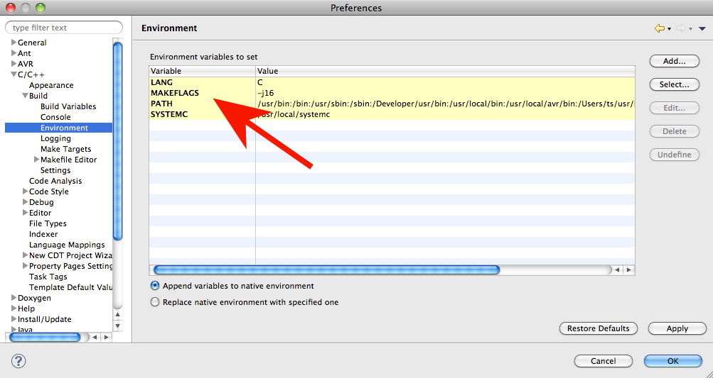
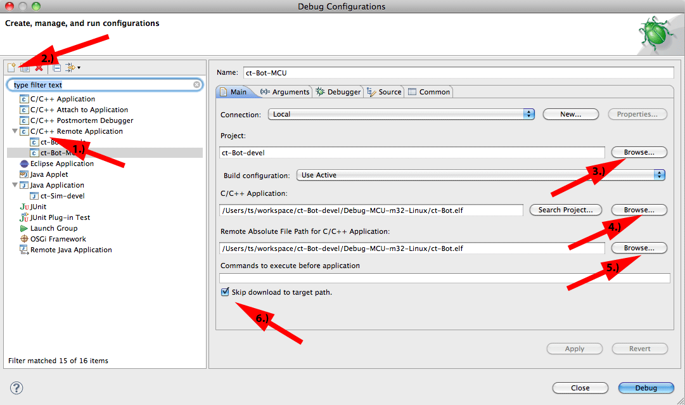
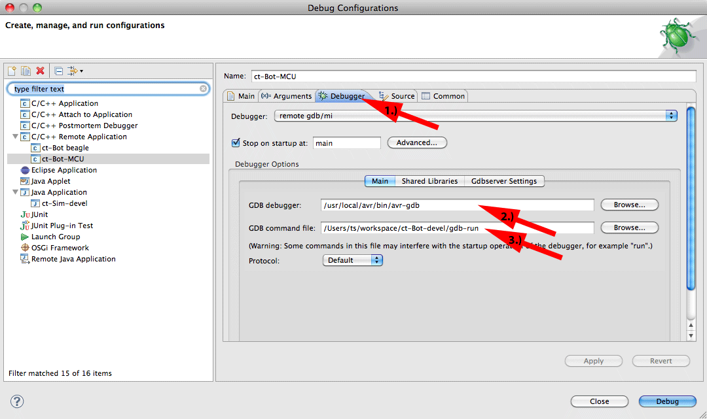
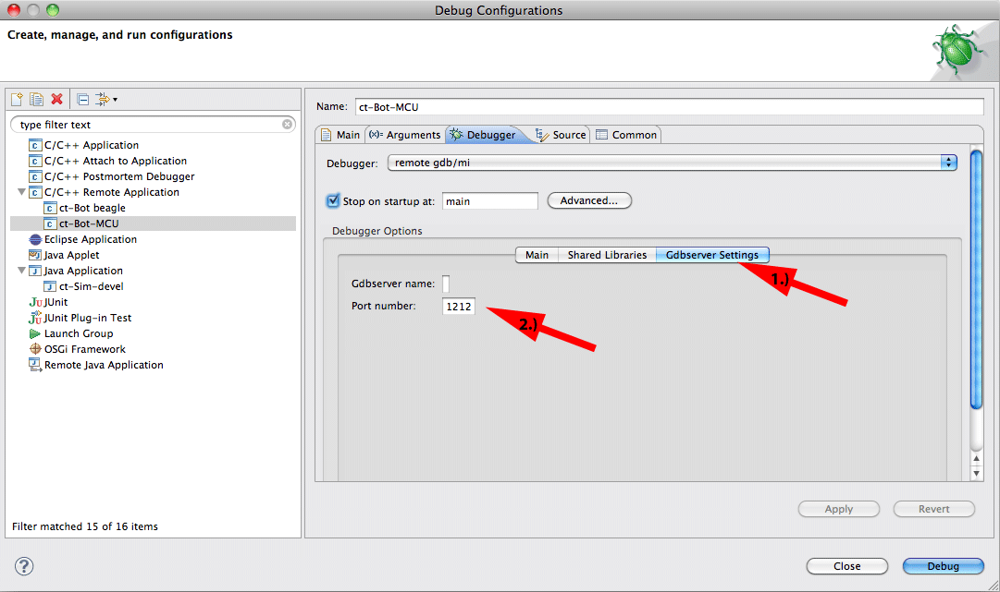

# Installation der AVR-Toolchain

>> **Trac-2-Markdown Konvertierung:** *unchecked*

Die folgende Anleitung beschreibt die Installation aller nötigen Tools, um Code für den *realen* Bot zu übersetzen und auf den Bot zu übertragen.

## Fertige Pakete verwenden (empfohlen)

### Linux

*Offizielle Toolchain:*

**AVR Toolchain for Linux** [herunterladen](http://www.atmel.com/tools/ATMELAVRTOOLCHAINFORLINUX.aspx) (**8-bit** Version) und entpacken. Getestete Version: **3.5.1**. Anschließend sollte man noch das bin-Verzeichnis der AVR Toolchain zu `$PATH` hinzufügen oder die [$PATH-Einstellung in Eclipse](#$PATH-Einstellung-in-Eclipse) vornehmen.

*Alternative:*

Die meisten Linux-Distributionen liefern bereits mehr oder weniger aktuelle AVR-Compiler über ihre Paketverwaltung mit. Allerdings sollte man auf die Version des Compilers (der c't-Bot-Code benötigt avr-gcc Version *4.2.2 oder neuer*) und der avr-libc Bibliothek (*1.6.7 oder neuer*) achten. Außerdem sind nach derzeitigem Stand Patches erforderlich, die Binutils und Compiler um Funktionalität erweitern, Fehler korrigieren und Unterstützung für neuere Prozessoren nachrüsten.
Die zu installierenden Pakete lauten z.B. unter Debian oder Ubuntu: *binutils-avr*, *gcc-avr*, *avr-libc*, *avrdude*; unter Fedora *avr-binutils*, *avr-gcc*, *avr-libc*, *avrdude*.

Bietet die eigene Linux Distribution keine kompatible Version an, lässt sich die AVR-Toolchain auch leicht selbst bauen, siehe Abschnitt [Toolchain selber bauen](#Toolchain-selber-bauen).

### Mac OS X

*Offizielle Toolchain:*

**AVR Toolchain for Mac OS X** [herunterladen](http://distribute.atmel.no/tools/opensource/Atmel-AVR-GNU-Toolchain/3.5.1/) (derzeit *avr8-gnu-toolchain-osx-3.5.1.435-darwin.any.x86_64.tar.gz*) und entpacken nach `/usr/local/`.
Anschließend muss man nur noch die [$PATH-Einstellung in Eclipse](#$PATH-Einstellung-in-Eclipse) vornehmen.

*Alternative:*

Die AVR-Toolchain lässt sich auch leicht selbst bauen, siehe Abschnitt [Toolchain selber bauen](#Toolchain-selber-bauen).

### Windows

*Offizielle Toolchain:*

**AVR Toolchain for Windows** [herunterladen](http://www.atmel.com/tools/ATMELAVRTOOLCHAINFORWINDOWS.aspx) und installieren. Das Installationsprogramm sollte man dabei explizit als Administrator ausführen (via Kontextmenü), sonst schlägt der Installer einen komischen Installationsort vor anstatt höhere Rechte anzufordern. Getestete Version: **3.5.1**.

## Toolchain selber bauen

### Linux und Mac OS X

Getestet unter *Debian Lenny*, *Ubuntu Maverick (10.10)*, *Ubuntu Natty (11.04)*, *Mac OS X Leopard (10.5)*, *Mac OS X Snow Leopard (10.6)*, *Mac OS X Lion (10.7)* und *Mac OS X Mountain Lion (10.8)*, die Schritte sollten sich aber auch leicht auf andere Systeme übertragen lassen.
Wir installieren sämtliche Programme nach `/usr/local/avr/`.

Zunächst müssen die Pakete *patch* und *texinfo* über die Paketverwaltung der Distribution installiert werden, falls sie noch nicht installiert sind (unter Debian / Ubuntu z.B.: `sudo apt-get install patch texinfo`).

#### Herunterladen der Quellen

Alle Dateien können in ein beliebiges Verzeichnis heruntergeladen werden, diese Anleitung verwendet *~/avrtoolchain*.

1. [Patches](http://www.heise.de/ct/projekte/machmit/ctbot/browser/ziped-releases/patches-gcc-4.5.1.tbz2)
1. [binutils 2.20.1](/ftp_//ftp.gnu.org/gnu/binutils/binutils-2.20.1.tar.bz2)
1. [gcc 4.5.1](/ftp_//ftp.gnu.org/gnu/gcc/gcc-4.5.1/gcc-4.5.1.tar.bz2)
1. [gmp 5.0.2](/ftp_//ftp.gnu.org/gnu/gmp/gmp-5.0.2.tar.bz2)
1. [mpfr 2.4.2](http://www.mpfr.org/mpfr-2.4.2/mpfr-2.4.2.tar.bz2)
1. [avr-libc 1.8.0](http://download.savannah.gnu.org/releases/avr-libc/avr-libc-1.8.0.tar.bz2)
1. [avrdude 5.10](http://download.savannah.gnu.org/releases/avrdude/avrdude-5.10.tar.gz)
1. [libusb 0.1.12](http://sourceforge.net/projects/libusb/files/libusb-0.1%20%28LEGACY%29/0.1.12/libusb-0.1.12.tar.gz/download) (wird nur benötigt, falls ein **USB**-Programmer mit *avrdude* eingesetzt werden soll)
1. [gdb-7.0.1](http://ftp.gnu.org/gnu/gdb/gdb-7.0.1.tar.bz2) (wird nur benötigt, falls low-level-Debugging gewünscht ist)
1. [simulavr-1.2.5](http://mirrors.zerg.biz/nongnu/simulavr/simulavr-0.1.2.5.tar.gz) (Version 1.2.6 funktioniert nicht für ATmegas; wird nur benötigt, falls low-level-Debugging gewünscht ist)

#### Patches entpacken

Ab hier geht diese Anleitung davon aus, dass das aktuelle Arbeitsverzeichnis *–/avrtoolchain* ist, in das die o.g. Archive heruntergeladen wurden.
Auf Mehrprozessorsystemen bietet es sich an, anstatt `make` jeweils `make -j N` zu verwenden, wobei `N` auf 2 bis 4 pro (logischem) Prozessor gesetzt werden sollte.

1. `tar xvjf patches-gcc-4.5.1.tbz2`

#### avr-binutils

1. `tar xvjf binutils-2.20.1.tar.bz2`
1. `cd binutils-2.20.1`
1. `for file in $(find ../patches/binutils/ -type f -name "*.patch" | sort); do patch -p0 -i $file; done`
1. `cd ..`
1. `mkdir build-binutils`
1. `cd build-binutils`
1. `../binutils-2.20.1/configure --prefix=/usr/local/avr --target=avr --program-prefix=avr- --enable-install-libbfd --with-dwarf2 --enable-languages=c,c++ --disable-werror --disable-nls`
1. `make`
1. `sudo make install`
1. `cd ..`
1. `rm -rf build-binutils`
1. `rm -rf binutils-2.20.1`
1. `export PATH=$PATH:/usr/local/avr/bin` (für nicht-bash-Shells evtl. anpassen)
1. Es bietet sich an, die Pfadanpassung dauerhaft zu machen, indem man sie ins Login- oder Bash-Script des Systems einträgt (in ~/.profile bzw. ~/.bashrc usw. je nach System)

#### avr-gcc

1. `tar xvjf gcc-4.5.1.tar.bz2`
1. `tar xvjf gmp-5.0.2.tar.bz2`
1. `mv gmp-5.0.2 gcc-4.5.1/gmp`
1. `tar xvjf mpfr-2.4.2.tar.bz2`
1. `mv mpfr-2.4.2 gcc-4.5.1/mpfr`
1. `tar xvzf mpc-0.9.tar.gz`
1. `mv mpc-0.9 gcc-4.5.1/mpc`
1. `cd gcc-4.5.1`
1. `for file in $(find ../patches/gcc/ -type f -name "*.patch" | sort); do patch -p0 -i $file; done`
1. `cd ..`
1. `mkdir build-gcc`
1. `cd build-gcc`
1. `../gcc-4.5.1/configure --prefix=/usr/local/avr --target=avr --program-prefix=avr- --enable-languages=c,c++ --with-dwarf2 --enable-doc --disable-shared --disable-libada --disable-libssp --disable-nls --enable-fixed-point`
1. `make`
1. `sudo make install`
1. `cd ..`
1. `rm -rf build-gcc`
1. `rm -rf gcc-4.5.1`

#### avr-libc

1. `unset CC`
1. `tar xvjf avr-libc-1.8.0.tar.bz2`
1. `cd avr-libc-1.8.0`
1. `for file in $(find ../patches/avr-libc/ -type f -name "*.patch" | sort); do patch -p0 -i $file; done`
1. `./bootstrap`
1. `cd ..`
1. `mkdir build-libc`
1. `cd build-libc`
1. ``../avr-libc-1.8.0/configure --prefix=/usr/local/avr --build=`../avr-libc-1.8.0/config.guess` --host=avr``
1. `make`
1. `sudo su`
1. `export PATH=$PATH:/usr/local/avr/bin`
1. `make install`
1. `exit`
1. `cd ..`
1. `rm -rf build-libc`
1. `rm -rf avr-libc-1.8.0`

#### libusb

*libusb* wird nur benötigt, falls ein **USB**-Programmer mit *avrdude* benutzt werden soll und es noch nicht installiert ist (wie z.B. unter Mac OS X). Das betrifft *Atmel mkII* und *AVR Dragon* (siehe auch [Übertragen von Firmware in den AVR-Mikrocontroller](../Flash/Flash.md)).

1. `tar xvzf libusb-0.1.12.tar.gz`
1. `cd libusb-0.1.12`
1. `patch -p0 -i ../patches/libusb/werror.patch`
1. `cd ..`
1. `mkdir build-libusb`
1. `cd build-libusb`
1. `../libusb-0.1.12/configure --prefix=/usr/local/avr`
1. `make`
1. `sudo make install`
1. `cd ..`
1. `rm -rf build-libusb`
1. `rm -rf libusb-0.1.12`

#### avrdude

1. `tar xvzf avrdude-5.10.tar.gz`
1. `mkdir build-avrdude`
1. `cd build-avrdude`
1. `CFLAGS=-I/usr/local/avr/include LDFLAGS=-L/usr/local/avr/lib ../avrdude-5.10/configure --prefix=/usr/local/avr`
1. `make`
1. `sudo make install`
1. `cd ..`
1. `rm -rf build-avrdude`
1. `rm -rf avrdude-5.10`

#### avr-gdb (optional)

*avr-gdb* wird nur benötigt, wenn low-level-Debugging gewünscht ist. Debuggen auf dieser Ebene ist nur in seltenen Spezialfällen erforderlich.

Der C-Code, der insgesamt c't-Bot genannt wird, hat drei Komponenten:

* High-Level-Anteile (inkl. von Lesern entwickeltem Bot-Steuercode), die z. B. Sensorwerte zugestellt bekommen und auf sie reagieren. Derselbe High-Level-Code läuft sowohl auf dem PC um einen virtuellen Bot in einer vom c't Sim simulierten Welt zu steuern, als auch auf der AVR um einen in Hardware realisierten Bot zu steuern.
* PC-Low-Level-Teile, die auf dem PC ausgeführt werden und z.B. (simulierte) Sensorwerte per TCP vom c't-Sim lesen und an den High-Level-Code weiterreichen
* AVR-Low-Level-Teile, die vom Mikrocontroller des in Hardware realisierten Bot ausgeführt werden und z.B. Sensorwerte von den Hardware-Sensoren lesen und an den High-Level-Code weiterreichen.

Der *AVR-gdb* dient nun dazu, diesen letzteren Teil des C-Codes debuggen zu können – und zwar in einer auf dem PC laufenden, vom *Simulavr-Paket* bitgenau emulierten Umgebung. Das ist hilfreich in den (wenigen, speziellen) Fällen, wo es nicht möglich oder zu unbequem ist, Debuginformationen auf dem Display des Roboters auszugeben. Bisher haben wir das nur unter Linux ausprobiert; unter Windows sollte es jedoch analog funktionieren.

1. `tar xvjf gdb-7.0.1.tar.bz2`
1. `mkdir build-gdb`
1. `cd build-gdb`
1. `../gdb-7.0.1/configure --prefix=/usr/local/avr --target=avr --enable-languages=c,c++ --disable-werror`
1. `make`
1. `sudo make install`
1. `cd ..`
1. `rm -rf build-gdb`
1. `rm -rf gdb-7.0.1`

#### simulavr (optional)

*simulavr* wird nur benötigt, wenn low-level-Debugging gewünscht ist, siehe [avr-gdb](#avr-gdb-optional).

1. `tar xvzf simulavr-0.1.2.5.tar.gz`
1. `cd simulavr-0.1.2.5`
1. `patch -p0 -i ../patches/simulavr/simulavr.patch`
1. `CFLAGS="-g -O2 -Wall -fomit-frame-pointer -finline-functions -mtune=native" ./configure --prefix=/usr/local/avr`
1. `make`
1. `sudo make install`
1. `cd ..`
1. `rm -rf simulavr-0.1.2.5`

#### Aufräumen

1. Alle heruntergeladenen Archive und die entpackten Patches können nun gelöscht werden.

## Nützliche Tools für AVR

*Hier soll eine kleine Übersicht enstehen, welche Tools und Tricks die Entwicklung von Software für AVR-µController erleichtern.*

* Mit `avr-nm --size-sort --print-size ct-Bot.elf` erhält man eine sortierte Liste, welche Funktionen und Variablen wieviel Platz in Flash und RAM belegen. In der ersten Spalte steht die Adresse, in der Zweiten die Größe (hexadezimal). T: Globale Funktionen, t: Statische Funktionen und D oder d: Globale bzw. statische Daten. All diese liegen im Flash. B und b hingegen belegen nur Platz im RAM, da sie beim Start mit 0 initialisiert werden.

* Float-Ausgaben mit printf für Display und Log: In den Linkereinstellungen (Miscellaneous) folgende Linker-Flags ergänzen: `-Wl,-u,vfprintf -lprintf_flt`

* Vom Compiler generierten Assembler-Code als .s-Dateien erhalten: In den Compilereinstellungen (Miscellaneous) folgendes unter Other Flags ergänzen: `-save-temps -fverbose-asm -dA`

* Assembler-Listing des gesamten Codes generieren: `avr-objdump -h -S ct-Bot.elf > ct-Bot.s`

* Erzeugtes Binary zu Debug-Zwecken disassemblieren: `avr-objdump -d -m avr5 ct-Bot.elf`

* Automatisch alle nicht verwendeten Funktionen aus dem Binary entfernen:
  1. Dem Compiler mit `-ffunction-sections -fdata-sections` sagen, dass er jede Funktion in eine eigene Section stecken soll.
  1. Den Linker mit `-Wl,--gc-sections` anweisen, nicht verwendete Sections zu verwerfen (*gc* für *Garbage Collection*) - damit werden dann allerdings auch alle zurzeit nicht benutzten EEPROM-Daten entfernt.

## Eclipse-Konfiguration

### $PATH-Einstellung in Eclipse

Dies ist nur nötig, falls avr-gcc nicht im systemweiten `$PATH` liegt.
Um `$PATH` für alle Projekte in Eclipse zentral einzustellen, trägt man die Änderungen am besten in den globalen Einstellungen von Eclipse ein:

* Dazu wählt man zunächst "*PATH*" unter "*Select...*" aus und hängt mit "*Edit...*" anschließend die folgende Zeichenkette an den bestehenden Eintrag an:
  * AVR Toolchain for Linux: `Pfad zum bin-Verzeichnis der Installationsorts`
  * CrossPack for AVR (unter Mac OS X): `:/usr/local/CrossPack-AVR/bin`
  * selbstgebaute Toolchain: `:/usr/local/avr/bin`

  

### Makeflags-Einstellung in Eclipse

Um den Build-Prozess auf Mehrkernsystemen zu beschleunigen, bietet es sich an, per Makeflags global den *-j N* Parameter für Make einzustellen. *N* stellt man dabei üblicherweise auf das Doppelte der Kernanzahl ein.

* Dazu wählt man zunächst "*Add*" aus und trägt unter "*Name:*" ein: `MAKEFLAGS`
* Unter *Value:* trägt man `-jN` ein, wobei N die Anzahl der gleichzeitig zu startenden Jobs ist (s.o.).

  

### avr-gdb in Eclipse einbinden (optional)

* In Eclipse unter *Run* -> *Debug Configurations...* ein neues Debug-Target für den Mikrocontroller anlegen. Es sollte folgende Eigenschaften haben:

  1. 
  1. 
  1. 

* Emulator starten: Damit nun der avr-gdb, der von Eclipse aufgerufen wird, den Code in der AVR-Umgebung ausführen kann, muss *simulavr* im Hintergrund laufen. In einer Shell startet man deshalb:
 `simulavr -g -p 1212 -d atmega32 -c 16000000`

