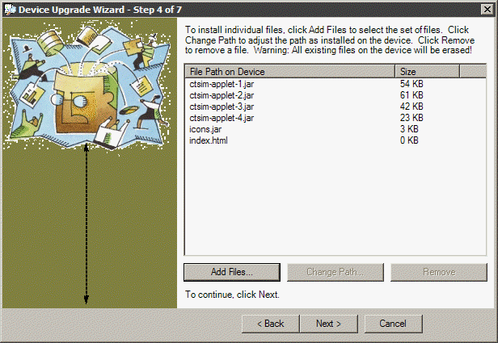
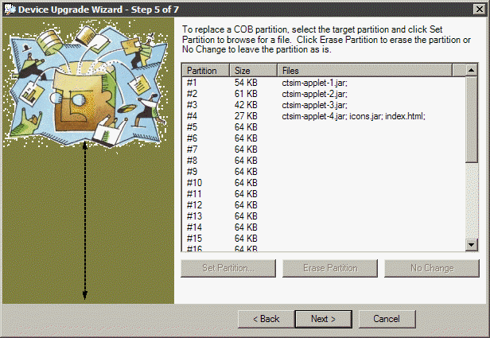
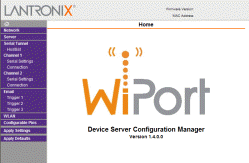
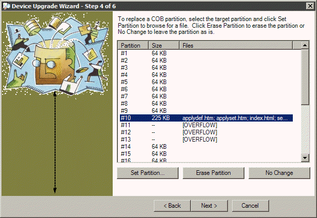

# c't-Bot-Applet installieren

## Was ist das?

Das c't-Bot-Applet kann man auf einen WLAN-fähigen c't-Bot laden. Wenn man ihn dann im Browser anspricht, sendet er das Applet, das laufend seinen Status anzeigt:

  

## Wie das Applet auf den Bot kommt

Das Applet wird mit dem Ant-Script **make-applet.xml** automatisch erzeugt und auf Wunsch direkt auf den c't-Bot geladen. -- *Ant ist für Java, was make für C ist. make-applet.xml ist ein "Makefile"*

1. c't-Sim-Code auschecken ([Wie geht das?](../GITUndEclipse/GITUndEclipse.md))

## Automatische Variante

Seit c't-Sim Version 2.4 kann das fertige Applet von Ant automatisch auf den WiPort des Bots geladen werden. Wer das lieber per Hand tun möchte, folgt den Schritten im nächsten Abschnitt *manuelle Variante*.

Für die automatische Variante muss Perl installiert sein. Unter Linux und Mac OS X ist das standardmäßig bereits der Fall, unter Windows lässt sich hierzu beispielsweise *!ActivePerl* verwenden.

2. Im ct-Sim-Projekt die Datei **make-applet.xml** öffnen und folgende Einstellungen am Anfang der Datei anpassen:

 __Upload aktivieren:__

```xml
<!--
<property name="upload" value="1" />
-->
```

Hier **entfernt** man die Kommentarzeichen `<!--` und `-->`, so dass die Variable *upload* auf den Wert *1* gesetzt wird:

```xml
<property name="upload" value="1" />
```

 __IP-Adresse des WiPorts einstellen:__

```xml
<property name="botaddress" value="192.168.1.22" />
```

In dieser Zeile trägt man die IP-Adresse seines WiPorts ein.

3. Bot an
1. Rechtsklick auf **make-applet.xml** -> Run As -> Ant Build
1. Konsolenausgabe auf Fehler prüfen
1. fertig

## Manuelle Variante

2. Rechtsklick auf **make-applet.xml** -> Run As -> Ant Build
1. Warten, bis Ant gelaufen ist -- *Details: Ant legt für den Java-Code (.class-Dateien) mehrere .jar-Dateien an, ein Jar mit den Icons, und die index.html, die einfach die rüberkopierte applet.html aus dem Projekt-Hauptverzeichnis ist*
1. Die Dateien im Verzeichnis **applet-build** auf den Bot hochladen. Unter Windows geschieht das mit dem "DeviceInstaller"-Tool. Unter Linux mit dem Trivial File Transfer Protocol (TFTP).

### Windows (manuelle Variante)

1. [DeviceInstaller (Win) herunterladen](http://ltxfaq.custhelp.com/cgi-bin/ltxfaq.cfg/php/enduser/std_adp.php?p_faqid=644)
1. Bot an
1. Im DeviceInstaller **Search** klicken, warten
1. Den erschienenen Listeneintrag wählen und **Upgrade**
1. "Create a custom installation by specifying ...", Next, nochmal Next
1. "Install files individually", Next
1. "Add Files", alles aus applet-build wählen, Next
    
1. Im folgenden Schritt kann man nochmal alles auf Vollständigkeit kontrollieren: Weil das WiPort-Modul nur 64 KB große Dateien kann (s.u.), werden größere Dateien vom DeviceInstaller ignoriert. Das kann man daran erkennen, dass sie in dieser Liste nicht mehr angezeigt werden. Es macht nichts, wenn der DeviceInstaller mehrere Dateien in eine Partition legt (wie im Bild bei !#4).
    
1. Achtung: Beim Hochladen wird **alles gelöscht**, was bisher auf dem WiPort-Webserver war, auch das **ab Werk vorhandene Webinterface**
1. Next, Next, und warten bis alles hochgeladen ist
1. Im Browser die IP (oder Hostname) des Bot eingeben. Es sollte eine index.html geladen werden, in der das Applet wohnt

### Linux (manuelle Variante)

(getestet auf Kubuntu Linux 7.04 Feisty Fawn)

1. Man benötigt das Programm "tftp". Den meisten Distributionen liegt dieses Programm nicht in der Standardinstallation bei, kann aber meist über das Paketsystem (apt-get, yast, urpmi ...) nachinstalliert werden. Da man anscheinend (bei mir gings nicht anders...) über tftp nur .cob Files in die WEBs laden kann braucht man zusätzlich das Programm "wine" und "web2cob". Wine kann man meist über das Paketsystem nachinstallieren. Web2cob bekommt man hier: [web2cob FAQ Eintrag](http://ltxfaq.custhelp.com/cgi-bin/ltxfaq.cfg/php/enduser/std_adp.php?p_sid=nq4Ctech&p_lva=&p_faqid=943&p_created=1075227796&p_sp=cF9zcmNoPSZwX2dyaWRzb3J0PSZwX3Jvd19jbnQ9NzgxJnBfcGFnZT01&p_li=)
1. Das Programm web2cob ist in eine Zip-File verpackt. Diese enthält die Dateien mimetype.ini, web2cob.exe und webMBO.doc. Da in der Datei mimetype.ini kein Eintrag für .jar Files enthalten ist müssen wir diesen nun hinzufügen:

    ```shell
    jar application/java-archive
    ```

1. Das Erstellen der .cob Files für unseren Bot ist nicht schwer. Man erstellt sich im Programmverzeichnis von web2cob einen Ordner, bsp: "web", in diesen kopiert man einzeln die von Ant erzeugten Dateien und lässt jeweils web2cob eine Datei erstellen mit dem Befehl

    ```shell
    wine web2cob.exe /d web /o WEB{n}.cob
    ```

    Dabei ist {n} durch eine Zahl zu ersetzen. Wie das aussehen kann:

    ```shell
    werner@kiwi:~/web2cob$ cp applet-build/index.html web
    werner@kiwi:~/web2cob$ wine web2cob.exe /d web /o WEB1.cob
    Lantronix Web2CoB V1.40 (Jan 24 2005).
    Convert web directory to CoBox web file.
    Processing directory web
    1 files written to WEB1.cob (674 bytes).
    werner@kiwi:~/web2cob$ rm web/*
    werner@kiwi:~/web2cob$ cp applet-build/icons.jar web
    werner@kiwi:~/web2cob$ wine web2cob.exe /d web /o WEB2.cob
    Lantronix Web2CoB V1.40 (Jan 24 2005).
    Convert web directory to CoBox web file.
    Processing directory web
    1 files written to WEB2.cob (3601 bytes).
    werner@kiwi:~/web2cob$ rm web/*
    werner@kiwi:~/web2cob$ cp applet-build/ctsim-applet-1.jar web
    werner@kiwi:~/web2cob$ wine web2cob.exe /d web /o WEB3.cob
    Lantronix Web2CoB V1.40 (Jan 24 2005).
    Convert web directory to CoBox web file.
    Processing directory web
    1 files written to WEB3.cob (60050 bytes).
    werner@kiwi:~/web2cob$ rm web/*
    werner@kiwi:~/web2cob$ cp applet-build/ctsim-applet-2.jar web
    werner@kiwi:~/web2cob$ wine web2cob.exe /d web /o WEB4.cob
    Lantronix Web2CoB V1.40 (Jan 24 2005).
    Convert web directory to CoBox web file.
    Processing directory web
    1 files written to WEB4.cob (28105 bytes).
    werner@kiwi:~/web2cob$ rm web/*
    werner@kiwi:~/web2cob$ cp applet-build/ctsim-applet-3.jar web
    werner@kiwi:~/web2cob$ wine web2cob.exe /d web /o WEB5.cob
    Lantronix Web2CoB V1.40 (Jan 24 2005).
    Convert web directory to CoBox web file.
    Processing directory web
    1 files written to WEB5.cob (48117 bytes).
    werner@kiwi:~/web2cob$ rm web/*
    werner@kiwi:~/web2cob$ cp applet-build/ctsim-applet-4.jar web
    werner@kiwi:~/web2cob$ wine web2cob.exe /d web /o WEB6.cob
    Lantronix Web2CoB V1.40 (Jan 24 2005).
    Convert web directory to CoBox web file.
    Processing directory web
    1 files written to WEB6.cob (24789 bytes).
    werner@kiwi:~/web2cob$ rm web/*
    werner@kiwi:~/web2cob$ cp applet-build/ctsim-applet-5.jar web
    werner@kiwi:~/web2cob$ wine web2cob.exe /d web /o WEB7.cob
    Lantronix Web2CoB V1.40 (Jan 24 2005).
    Convert web directory to CoBox web file.
    Processing directory web
    1 files written to WEB7.cob (39204 bytes).
    werner@kiwi:~/web2cob$ rm web/*
    ```

    > Anmerkung: Man kann natürlich auch mehrere Dateien in ein .cob Paket schnüren, dazu kopiert man einfach mehrere in das web Verzeichnis. Allerdings sollte man die 64-kB Grenze im Auge behalten. Aufgrund der Übersichtlichkeit habe ich oben darauf verzichtet.

1. Jetzt sind alle Vorbereitungen abgeschlossen, laden wir die WEB{n}.cob hoch. Dazu startet man das Programm tftp mit der IP-Adresse des Bots (der Bot muss natürlich eingeschaltet sein, und im Netzwerk verbunden sein):

    ```shell
    werner@kiwi:~/web2cob$ tftp 192.168.0.19
    ```

1. Dann stellt man die Übertragungsmethode auf binär um:

    ```shell
    tftp> binary
    ```

1. Jetzt kann man die WEB{n}.cob in die dafür vorgesehenen Partitionen laden:

    ```shell
    tftp> put WEB1.cob WEB1
    Sent 674 bytes in 0.8 seconds
    tftp> put WEB2.cob WEB2
    Sent 3601 bytes in 0.8 seconds
    tftp> put WEB3.cob WEB3
    Sent 60050 bytes in 1.0 seconds
    tftp> put WEB4.cob WEB4
    Sent 28105 bytes in 0.9 seconds
    tftp> put WEB5.cob WEB5
    Sent 48117 bytes in 1.0 seconds
    tftp> put WEB6.cob WEB6
    Sent 24789 bytes in 1.0 seconds
    tftp> put WEB7.cob WEB7
    Sent 39204 bytes in 0.9 seconds
    tftp> q
    werner@kiwi:~/web2cob$
    ```

1. Hat man alles richtig gemacht ist unter der IP-Adresse des Bots nun die selbst erstellte index.html zu erreichen und das Applet erscheint. Dabei geht jedoch das Web-Interface des WiPort verloren. Dieses kann man aber einfach wiederherstellen. (siehe unten).

## Troubleshooting: Das WiPort-Setup ist weg

  

Der abgebildete "WebManager" ist das Webinterface des WiPort, das man zum Einstellen verschiedener Sachen verwenden kann (z.B. TCP-Port, auf dem der WiPort lauscht). Es ist ab Werk auf dem WiPort vorhanden, ging bei uns aber verschütt, als wir des Applet hochgeladen haben. Wir vermuten, der WebManager liegt ab Werk in den ersten Partitionen auf dem WiPort, wo das Applet ja hingeschrieben wird. Man kann den WebManager so wiederbeleben:

### Windows (Troubleshooting)

1. [WebManager-Archiv (.cob) herunterladen](http://ltxfaq.custhelp.com/cgi-bin/ltxfaq.cfg/php/enduser/std_adp.php?p_faqid=1213)
1. Installation:
    1. Mit dem DeviceInstaller unter Windows die .cob-Datei auf den WiPort laden. Dazu:
    1. Schritte 1-5 wie oben, dann:
    1. "Install files contained in COB partitions"
    1. Eine Partition weit hinten wählen, z.B !#10
    1. "Set Partition" und die .cob-Datei mit dem WebManager wählen, Größenfrage mit "Ja" beantworten
        
    1. Next, Next

### Linux / Mac OS X (Troubleshooting)

1. In das Download-Verzeichnis des WebManager-Archiv (.cob) wechseln
1. tftp-Verbindung zum Bot herstellen:

    ```shell
    werner@kiwi:~/web2cob$ tftp 192.168.0.19
    ```

1. Übertragungsart auf binär umstellen:

    ```shell
    tftp> binary
    ```

1. Die .cob Datei nach WEB10 hochladen und fertig:

    ```shell
    tftp> put wpt_webm_1400.cob WEB10
    Sent 230980 bytes in 4.4 seconds
    tftp> q
    werner@kiwi:~/web2cob$
    ```

1. Jetzt sollte der WebManager wieder da sein. Weil er in Partition 10ff. liegt, das Applet aber nur die ersten Partitionen belegt, sollte er auch künftiges Applet-Hochladen überleben. Er ist erreichbar über den Link unter dem Applet oder über `http://<Bot-Adresse>/secure/ltx_conf.htm`.

## Troubleshooting: Firefox lädt das Applet nicht

Siehe [Forumspost](https://www.ctbot.de/viewtopic.php?f=3&t=583&p=4633&hilit=applet+im+wiport#p4633).

## Detail: Die 64-KB-Grenze

Der Webserver des c't-Bot-WLAN-Moduls (WiPort-Moduls) kann nur Dateien kleiner als 64 KB speichern. Normalerweise würde man alle Java-.class-Dateien des Applet in eine .jar-Datei packen, aber aufgrund der Einschränkung müssen wir sie auf mehrere Dateien verteilen. Die Ant-Datei make-applet.xml kopiert alles im Package ctSim.util.* in ein Jar, alles in ctSim.view.* in ein zweites Jar usw. Das ist unkompliziert, aber hat eine Schwäche: make-applet.xml könnte zu große Dateien erzeugen, wenn nach und nach z.B. ctSim.util immer weiter vergrößert wird (Dateien wachsen, neue Dateien kommen hinzu). In diesem Fall muss man in make-applet.xml die Aufteilung anpassen:

* In den `<antcall>`-Tags den `exclude`-Parameter benutzen, um Dateien anzugeben, die das Applet nicht braucht und die weggelassen werden können
* Oder ein weiteres Jar einführen, indem man einen zusätzlichen `<antcall>`-Tag einführt. Nicht vergessen: In der applet.html muss man das neue Jar im `archive`-Parameter eintragen, sonst wird es vom Browser später nicht gefunden.

[](https://creativecommons.org/licenses/by-sa/4.0/)
