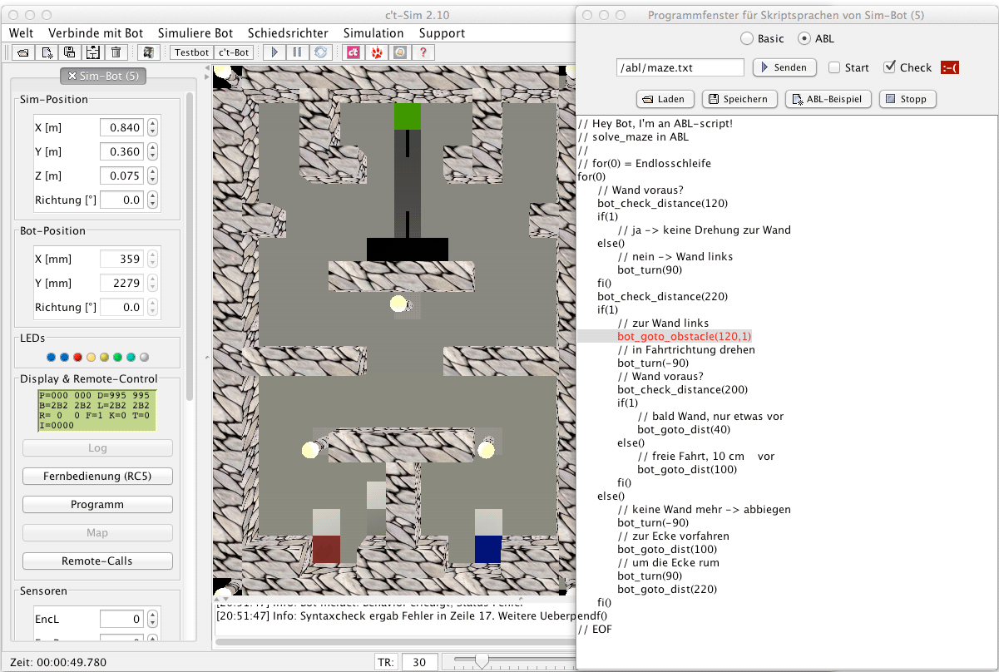
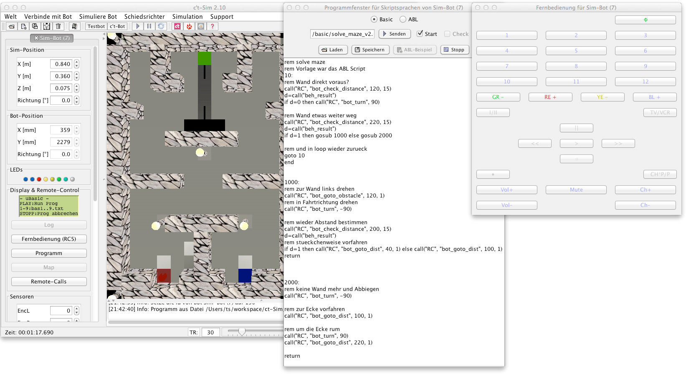

# Programmierung des c't-Bots in weiteren Programmiersprachen

Stand: Release 26

## Einleitung

Wer seinen c't-Bot nicht in C programmieren möchte, kann dies auch mit Hilfe einer zur Laufzeit interpretierten Sprache tun. Damit lassen sich Programme schreiben, die nicht compiliert und in den Flash-Speicher des Mikrocontrollers geladen werden müssen, sondern von der SD-Karte oder aus dem EEPROM ausgeführt werden. Die Programme können dabei auf die Basisfunktionalitäten des c't-Bot-Frameworks zugreifen, um den Bot zu steuern und Sensoren auszulesen. Übertragen werden solche Programme vom c't-Sim aus über eine USB- oder (W)LAN-Verbindung, über die sie auch gestartet und beendet werden können. Alternativ lassen sie sich auch am PC auf die SD-Karte schreiben.

Das c't-Bot Framework enthält zwei verschiedene Interpreter für unterschiedliche, interpretierte Programmiersprachen:

* Der [ABL-Interpreter](#ABL) ist besonders darauf ausgelegt, wenig Programmspeicher des Prozessors zu belegen und bietet daher nur grundlegende Funktionen, um Bot-Verhalten skriptgesteuert auszuführen.
* Deutlich umfangreicher ist der von Uwe Berger implementierte [Basic-Interpreter](#uBasic), mit dem sich Basic-Programme zur Steuerung des c't-Bots einsetzen lassen. Frank Menzel hat diesen Interpreter als c't-Bot-Verhalten in das Framework integriert, wodurch sich von Basic-Programmen aus nicht nur alle in C implementierten Bot-Verhalten starten lassen, sondern es auch möglich ist, die Sensordaten des Bots direkt auszulesen und die Aktuatoren anzusteuern.

Die folgende Tabelle fasst die wesentlichen Features und Unterschiede der Integration beider Interpreter ins c't-Bot-Framework zusammen:

| **Feature** \* | **[ABL](#ABL)** | **[uBasic](#uBasic)** |
|---|---|---|
| Ausführen von c't-Bot Verhalten | ja | ja |
| Zugriff auf globale Variablen des C-Frameworks | nein | ja |
| Kontrollstrukturen wie Schleifen und bedingte Ausführung | ja | ja |
| Benutzerdefinierte Variablen | nein | ja |
| Stack zur Datenspeicherung | ja | nein |
| SD-Karte erforderlich | nein | ja |
| EEPROM-Speicher zur Programmablage | ja | nein |
| Starten von verschiedenen Programmen per Fernbedienung möglich | ja | ja |
| Vollständige Programmiersprache (Turing-Vollständigkeit) | nein | ja |
| Ausführen von weiteren (Unter-) Programmen | nein | ja |
| Syntaxcheck des Programms vom c't-Sim aus | ja | nein |

\* *Es handelt sich hierbei um die im c't-Bot-Framework implementierten und unterstützten Features.*

Insgesamt ergibt sich, dass der Basic-Interpreter wesentlich mächtiger und umfangreicher ist, allerdings auch deutlich mehr Ressourcen benötigt. Letzteres spielt jedoch nur eine untergeordnete Rolle, falls ein großer Mikrocontroller (ATmega644P oder ATmega1284P) im Bot steckt.

## ABL

Der ABL (*Abstract Bot Language*) Interpreter führt Skript-Programme aus, die auf der SD-Karte oder (wenn sie klein genug sind -- ATmega32: max. 512 Byte, ATmega644(P): max. 1536 Byte, ATmega1284P: max. 3584 Byte) im EEPROM gespeichert sein können. Die Skripte starten dabei im Wesentlichen andere Bot-Verhalten über den RemoteCall-Mechanismus. Außerdem gibt es Kontrollstrukturen (if und for), Sprünge und einen Stack. Auf dem Stack wird auch das Ergebnis jedes ausgeführten Verhaltens gespeichert, so dass das Skript darauf reagieren kann. Die Funktionsweise des Interpreters orientiert sich in Teilen an der Programmiersprache Forth.

Es handelt sich jedoch nicht um eine vollständige Programmiersprache, so gibt es z.B. keine mathematischen Befehle oder Variablen. Wer das braucht, sollte stattdessen das [uBasic-Verhalten](#uBasic) verwenden, das da deutlich mehr kann.

Ein Beispiel-Programm befindet ist im Bot-Verzeichnis unter [bot-logic/abl](https://github.com/tsandmann/ct-bot/tree/master/bot-logic/abl) zu finden und der Sim-Editor kann auf Knopfdruck ein Mini-Beispiel erzeugen. Am Anfang der [Verhaltensdatei](https://github.com/tsandmann/ct-bot/blob/master/bot-logic/behaviour_abl.c) ist außerdem eine Definition der Syntax angegeben. Wer weitere Fragen zum ABL-Interpreter hat, bemüht am besten einfach die bekannten [Support-Kanäle](../FirstSteps/FirstSteps.md#Support).

Das Sim-Fenster bietet außerdem die Möglichkeit, ein geladenes oder eingegebenes Programm syntaktisch zu überprüfen, der erste Fehler wird dann rot hervorgehoben. Zusätzlich zur Syntax wird dabei auch überprüft, ob ein (per RemoteCall) zu startendes Verhalten auf dem Bot überhaupt vorhanden ist, wie das folgende Bild beispielhaft zeigt:

  

Hier fehlt dem Bot das Verhalten *bot_goto_obstacle()*.

## uBasic

Der Basic-Interpreter *uBasic* für Mikrocontroller von Uwe Berger umfasst im Wesentlichen den Sprachumfang von *!TinyBasic* und ist vollständig ins c't-Bot-Framework integriert, so dass einerseits bereits vorhandene Verhalten verwendet werden können und andererseits auch ein direkter Zugriff auf alle Sensordaten und Aktuatoren des Bots besteht.

Eine ausführliche Dokumentation des Basic-Interpreters befindet sich im Unterverzeichnis *Documentation/avrbasic/* des Bot-Codes. Weitere Informationen sind außerdem auf der zugehörigen [Projektseite](https://www.mikrocontroller.net/articles/AVR_BASIC) zu finden.

Verschiedene Beispielprogramme sind im Bot-Verzeichnis unter [bot-logic/basic](https://github.com/tsandmann/ct-bot/tree/master/bot-logic/basic) abgelegt, darunter auch derselbe Algorithmus zum Lösen eines Labyrinths, der ebenfalls als ABL-Skript existiert (s.o.).

Zum Laden, Speichern, Übertragen und Starten von Basic-Programmen dient dasselbe Sim-Fenster wie für ABL-Skripte. Außerdem existiert botseitig ein Displayscreen, über den sich Basic-Programme mit numerischen Namen (`[1-9].txt`) über die entsprechenden Tasten laden lassen.  Mit Hilfe der Play- bzw. Stopp-Taste der Fernbedienung kann das derzeit geladene Programm gestartet bzw. abgebrochen werden:

  

Display-Anzeige des uBasic-Interpreters (links) und Programm-Fenster mit Editor und Management-Funktionen.
