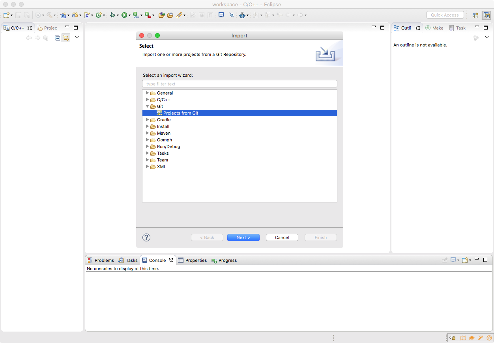
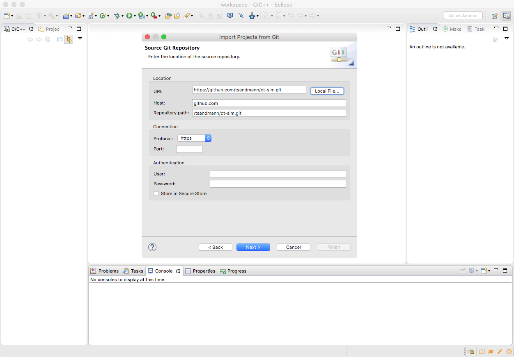
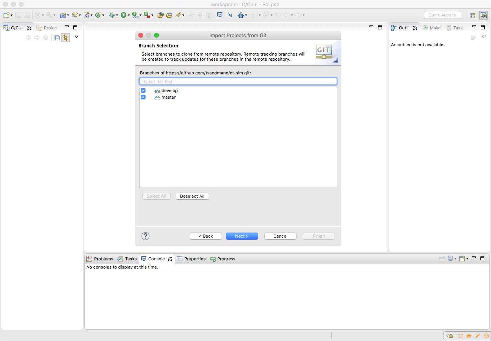
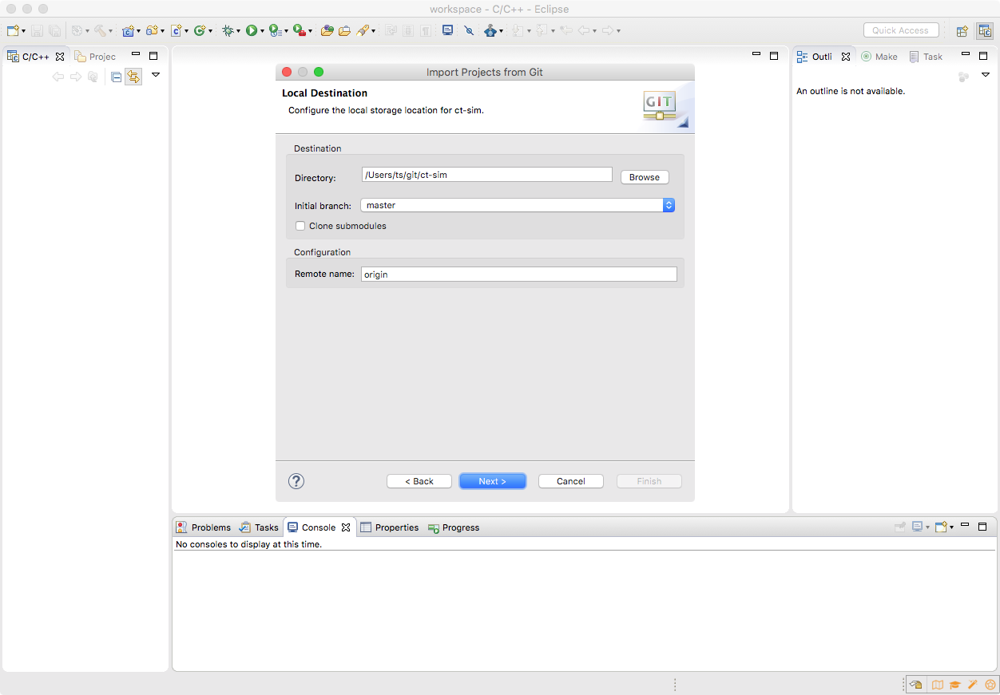
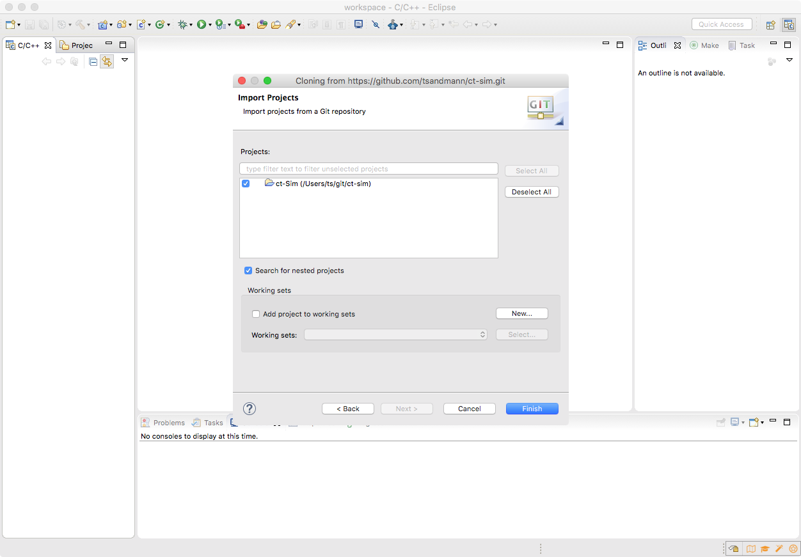

# Zugriff auf die GIT-Repositories mit Eclipse

## Import des Codes

Die Quelltexte von c't-Bot und c't-Sim sind auf [github.com](https://github.com) verfügbar. Dort gibt es für ct-Bot und ct-Sim jeweils zwei wesentliche *Zweige* (Branches): Falls eigener Bot-Steuercode entwickelt werden soll, ist der stabilere Code aus dem Branch `master` richtig. Falls Weiterentwicklungen geschrieben werden sollen, empfiehlt sich der aktuellere Enwicklerbranch `develop`.

Der gewünschte Branch kann beim Importieren des Codes in Eclipse angegeben werden (siehe unten); falls man zu einem späteren Zeitpunkt wechseln möchte, kann man in Eclipse nach Rechtsklick auf das Projekt den Menüpunkt *Replace With* -> *Branch, Tag, or Reference...* wählen, dort finden sich unter *Remote Tracking* alle verfügbaren Branches. Natürlich können falls gewünscht in Eclipse zwei Projekte angelegt werden, um das eine mit dem Branch master und das andere mit dem Branch develop herunterzuladen, hierzu muss man den Projekten lediglich unterschiedliche Projektnamen beim Import geben (Hinweis: Leerzeichen im Projektnamen sollten vermieden werden).

1. Internetverbindung herstellen
1. Menüpunkt *File* -> *Import*
1. Option *Git* -> *Projects from Git*:
  
1. *Clone URI*
1. Unter *URI:* für den ct-Bot Code `https://github.com/tsandmann/ct-bot.git` oder für den ct-Sim Code `https://github.com/tsandmann/ct-sim.git` eintragen:
  
1. Alle Branches markiert lassen:
  
1. Das lokale Zielverzeichnis für den Code und den gewünschten Branch (z.B. *master*) auswählen:
  
1. *Import existing Eclipse projects* wählen -> Next -> das im vorherigen Schritt gewählte lokale Verzeichnis aktivieren (sollte bereits vorausgewählt sein):
  

* Die Schritte jeweils für ct-Bot und ct-Sim ausführen.

* Beim Auschecken von c't-Bot müssen ggf. noch die korrekten Pfade zu Hilfswerkzeugen eingestellt werden:
  * Das Projekt mit „Project/Clean...“ für den Simulator compilieren und prüfen, ob dann im Projektverzeichnis die Datei `Debug-Linux_Mac/ct-Bot` (Linux / macOS) bzw. `ct-Bot.exe` (Windows) erstellt wurde
    * Falls ja, funktionieren die Standard-Einstellungen
    * Falls nein, gibt das Teilfenster „Console“ in Eclipse manchmal Hinweise, was fehlt. Folgende Maßnahmen sollten helfen:
      * Es muss sichergestellt sein, dass über die Path-Variable des Systems mindestens gcc und make (Linux) bzw. gcc und mingw32-make (Windows) gefunden werden können. – Alternative: unter „Project/Properties/C C++ Build“ die Pfade zu Compiler („Tool Settings/GCC C Compiler“), Linker („Tool Settings/GCC C Linker“) und make („Build settings/Build command“) manuell eintragen.
      * Unter Windows müssen eventuell unter „Project/Properties/C C++ Build“ vier Pfade angepasst werden, wenn man in der Installation der Unix-Umgebung untypische Installationsorte gewählt hat. Unter „GCC C Compiler/Directories“ den Pfad zum MinGW\include-Verzeichnis prüfen, sowie unter „GCC C Linker/Libraries“ den Pfad zum MinGW\lib-Verzeichnis.
      * Vorsicht unter Windows: Wenn im System bereits ein anderes C-Compiler-Paket installiert ist – etwa von Borland – kann es sein, dass dessen Compiler und make-Äquivalent gemäß Reihenfolge im Path bevorzugt werden. Das c't-Bot-Projekt geht davon aus, mit mingw32-make.exe und dem gcc kompiliert zu werden.

Zum Testen im Simulator siehe [c't-Sim inkl. virtueller Bots starten](../InstallationsanleitungR23/InstallationsanleitungR23.md#ct-Sim-und-virtuelle-Bots-starten).

Per Rechtsklick auf das Projekt und das Auswählen von *Team* -> *Pull...* kann der Quelltext jederzeit wieder vom GIT-Repository heruntergeladen und auf den neuesten Stand gebracht werden.

## Aufbau der Repositories

1. Branch [master](https://github.com/tsandmann/ct-bot/tree/master): Hier liegt lauffähiger Code, der aber vielleicht nicht das Cutting Edge der Entwicklung enthält.
1. Branch [develop](https://github.com/tsandmann/ct-bot/tree/develop): Cutting-edge Code. Keine Garantie für gar nix. Eventuell gibt es hier auch mal Änderungen, die ungetestet sind oder bald wieder verschwinden.

## Ältere Code-Versionen

Möchte man auf eine ältere Version des Codes aus dem GIT-Repository wechseln, so kann man das wie folgt tun:

1. Rechtsklick auf das Projekt -> *Replace With* -> *Branch, Tag, or Reference...* -> unter *Tags* findet man alte Release-Versionen.
1. Alternativ kann man über *Replace With* -> *Commits...* einzelne Commits rückgängig machen.
1. Nun wähl man die gewünschte Version aus und bestätigt mit OK. Vorhandene Änderungen gehen dabei verloren.

Die Funktion *Compare With* lässt sich analog benutzen um Änderungen nachzuverfolgen.

## Eigene Beiträge: Forks und Pull-Requests

ToDo
