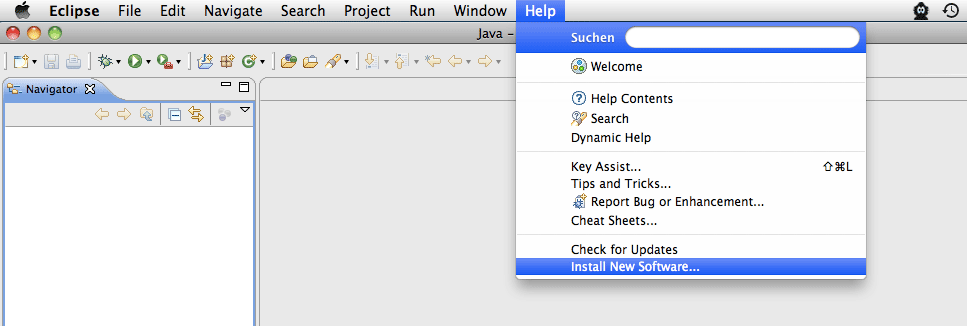
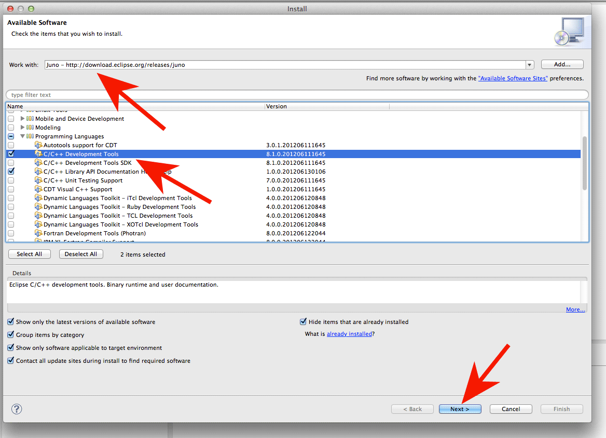
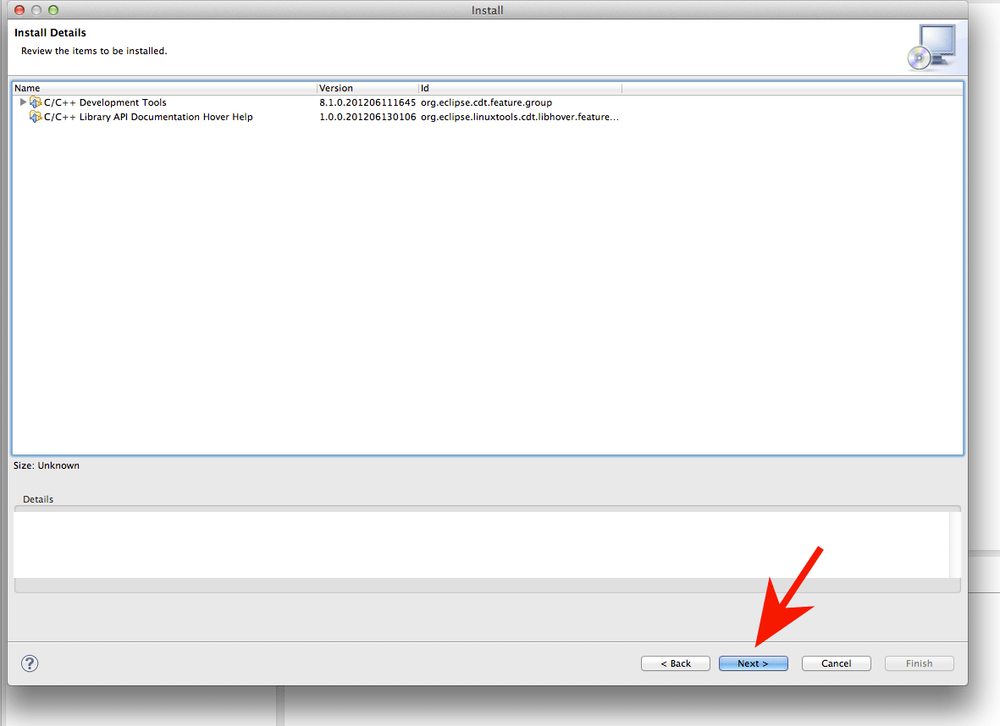
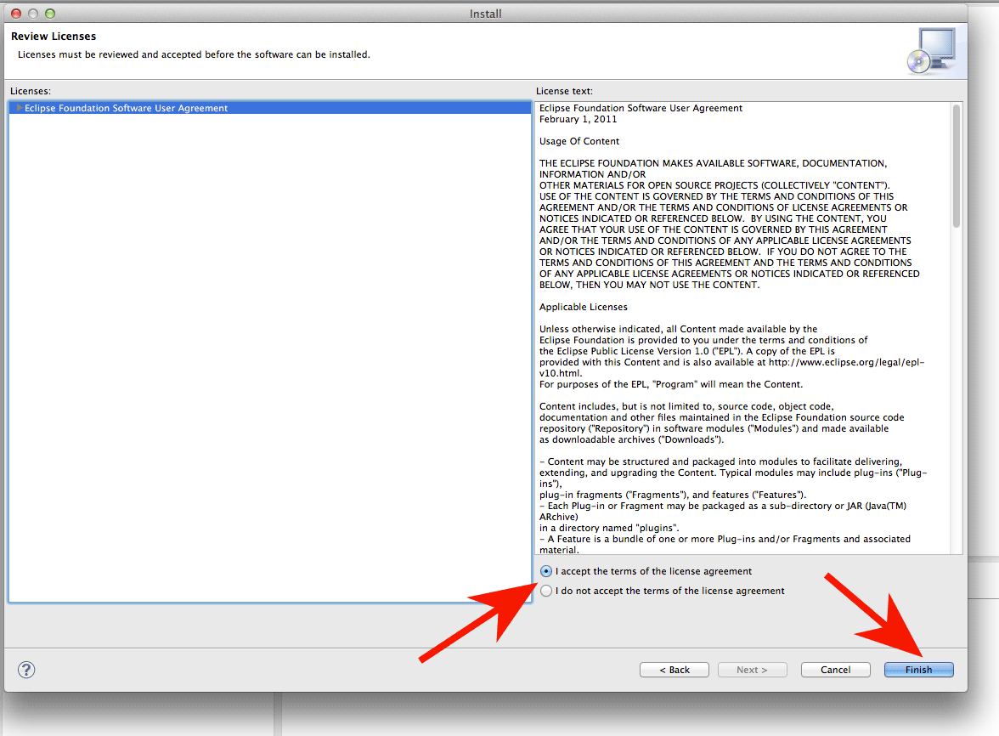

# Eclipse-Installation

Die folgende Anleitung beschreibt die Installation von **Eclipse 2019‑09 (4.13)** inkl. aller nötigen **Plugins**.

**Bitte beachten**: Eclipse 2019‑09 (4.13) ist die aktuell empfohlene Version, ältere Versionen (4.x zurück bis Luna 4.4, 3.x bis Galileo 3.5) funktionieren grunsätzlich auch noch, eine noch ältere Version funktioniert hingegen nicht mehr einwandfrei.
Insbesondere zum Entwickeln des Bot-Steuercodes in C sollte man die neueste Eclipse Version verwenden, weil gerade das CDT Plugin erhebliche Verbesserungen erfahren hat mit den letzten Updates.

## Eclipse

**Was ist Eclipse?**
Für Experimente am Code des Simulators und des Bots bietet sich die Entwicklungsumgebung Eclipse an, da sie einerseits Java unterstützt für die Weiterentwicklung des c't-Sim und andererseits C für die Entwicklung des c't-Bot-Steuercodes. Eclipse selbst ist in Java geschrieben und ist für alle gängigen Rechnerplattformen verfügbar.
[Warum Eclipse und keine andere IDE?](https://www.heise.de/ct/artikel/FAQ-fuer-c-t-Bot-und-c-t-SIM-291940.html?seite=3)

**Zur Installation** lädt man __*Eclipse IDE for Java Developers*__ von [Eclipse Downloads](https://www.eclipse.org/downloads/packages/) für seine Plattform herunter (diese Anleitung benutzt das __Java-Paket__ als Basis, CDT für den C-Support wird im Folgenden nachinstalliert) und entpackt das Archiv.

Eine weitere Installation entfällt, die ausführbare Datei eclipse(.exe) startet direkt die Entwicklungsumgebung auf Java-Basis. Eclipse legt ein Arbeitsverzeichnis namens *workspace* an, dessen Ort der Nutzer selbst bestimmen kann.

*Hinweis für Windows-Nutzer:* Beim Entpacken mit dem Windows-Explorer kann es Probleme geben, deshalb ist es sinnvoll, einen alternativen Entpacker wie z.B. 7-Zip zu verwenden.

Als Alternative zum Download und Entpacken des Archivs kann auch der [**Eclipse Installer**](https://www.eclipse.org/downloads/packages/installer) verwendet werden.

## CDT

**Was ist das CDT?** Das Plugin CDT (C Development Toolkit) rüstet Eclipse um Unterstützung für Entwicklung in C auf, da Eclipse von Haus aus kein C spricht.
Die Installation nimmt man am besten über den in Eclipse integrierten Update-Mechanismus wie folgt vor:

**1.)**

**2.)** *--All Available Sites--* aus der List auswählen:

**3.)**

**4.)**

## GIT-Zugriff

Um den Code aus dem [GIT-Repository](https://github.com/tsandmann/ct-bot) direkt in Eclipse verwenden zu können, siehe [Import des Codes mit GIT](../GITUndEclipse/GITUndEclipse.md).

Autor: Timo Sandmann
