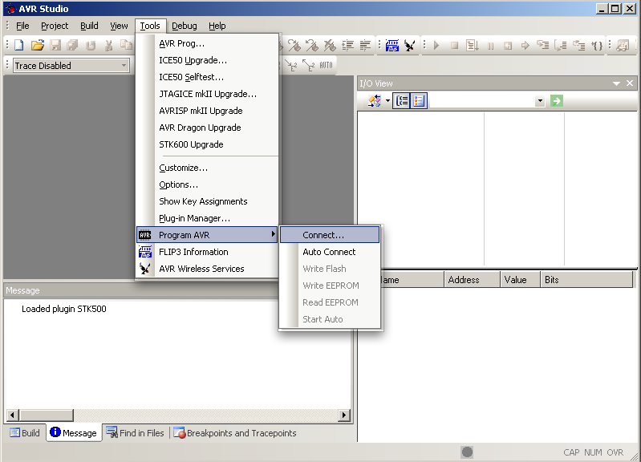
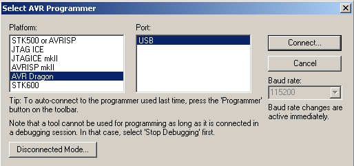
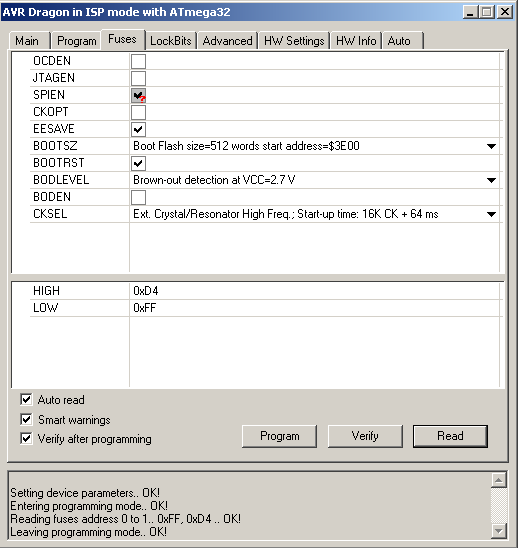
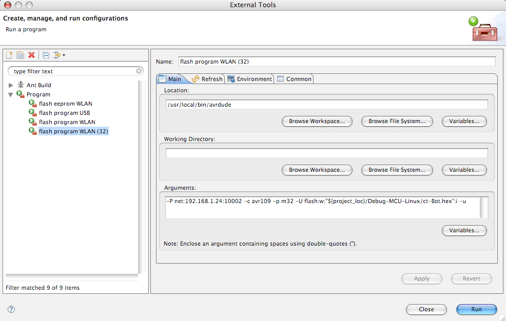
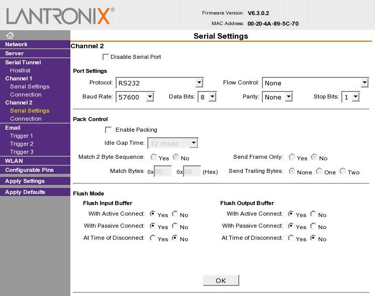

# Übertragen von Firmware in den AVR-Mikrocontroller

>> **Trac-2-Markdown Konvertierung:** *unchecked*

Diese Seite dient der Sammlung von Tipps rund um verschiedene Programmieradapter. Vorneweg sei aber erst einmal auf die schon im Rahmen des c't-Bot-Projektes gesammelten Infos verwiesen:

* [FAQ-](https://www.heise.de/ct/artikel/FAQ-fuer-c-t-Bot-und-c-t-SIM-291940.html)Einträge zum Thema Firmware
* [c't-Artikel](https://www.heise.de/ct/artikel/Hallo-Welt-290314.html) mit der Einführung in die Bot-Hardware und den Programmieradapter
* [BlueMP3-ISP-Adapter](https://www.heise.de/ct/Redaktion/cm/klangcomputer/index1.htm), der auch beim c't-Bot-Projekt empfohlen wird
* [Erklärung](../AVRToolchainInterna/AVRToolchainInterna.md#Der-Build-Prozess) der beim Build entstandenen Dateien `ct-Bot.hex` und `ct-Bot.eep`

Wie Sie eigenen Code in eine Firmware verwandeln, die Sie im Folgenden übertragen (alias flashen) können, finden Sie im Abschnitt [AVRToolchain](../AVRToolchainInterna/AVRToolchainInterna.md).

## Programmiersoftware

Damit ein fertig compiliertes .hex-File vom PC über den Programmieradapter auf den Mikrocontroller kommt, braucht man eine Programmiersoftware. Die Software *avrdude* wird im Rahmen der Toolchain mit installiert, siehe [Installation der AVR-Toolchain](../AVRToolchain/AVRToolchain.md).

* [Ponyprog2000](http://www.lancos.com/prog.html): Nettes Programm mit GUI, das insbesondere mit dem BlueMP3-ISP-Adapter gut harmoniert, jedoch mit USB-Adaptern nicht so richtig klarkommt. Mit dem Bootloader weiß Ponyprog2000 ebenfalls nichts anzufangen.
* [avrdude](http://savannah.nongnu.org/projects/avrdude): Kommandozeilen-Tool, das es für Linux, Windows und macOS gibt. Kann mit (fast) allen Programmieradaptern umgehen und lässt sich auch gut in Eclipse einbinden oder per Skript aufrufen. Kann auch per TCP/IP (LAN/WLAN) einem Bot mit Bootloader neue Firmware verpassen. Avrdude ist unsere Empfehlung! Zur Installation siehe [Installation der AVR-Toolchain](../AVRToolchain/AVRToolchain.md).
* [avrfuses](http://www.vonnieda.org/software/avrfuses): Ein GUI-Frontend zu `avrdude` unter macOS, für alle, die lieber klicken als tippen (avrdude muss installiert sein). Eine ältere Version des Tools gibt es auch für Linux und Windows.

Unter Windows lässt sich aber alternativ auch das von WinAVR mitgelieferte Programm als GUI für avrdude nutzen.

## Programmieradapter für den c't-Bot

Ein Programmieradapter verbindet den ISP-Port des Roboters mit dem PC. Über ihn kann man die Fuse-Bits setzen und die Firmware übertragen, auch wenn der Chip noch völlig leer ist.

Die nachfolgend aufgeführten Kommandozeilen-Argumente (`-p m32`) gelten jeweils für den ursprünglich im c't-Bot Projekt eingesetzten Mikrocontroller *ATmega32*. Wer einen neueren Controller einsetzt (*ATmega644(P)* oder *ATmega1284P*), findet im Abschnitt [unten](#Hinweise-für-Besitzer-eines-ATmega644P-oder-ATmega1284P) die dafür nötigen Parameter.

### [BlueMP3](http://www.heise.de/ct/Redaktion/cm/klangcomputer/index1.htm)

* **Anschluß an den PC**: Parallel-Port
* **Software**:
  * [Ponyprog2000](http://www.lancos.com/prog.html)
  * [avrdude](http://savannah.nongnu.org/projects/avrdude/) `-c stk200 -P lpt1 -p m32 -U flash:w:"ct-Bot.hex":i` (Unter Linux: `-c stk200 -P /dev/parport0`)
* **Hinweis**: Preiswert und zuverlässig, sofern man einen Parallel-Port (LPT) am PC hat.

### [Atmel mkII](https://www.microchip.com/developmenttools/ProductDetails/atavrisp2)

* **Anschluß an den PC**: USB ([libusb](https://libusb.info) muss installiert sein, siehe [Installation der AVR-Toolchain](../AVRToolchain/AVRToolchain.md))
* **Software**:
  * [avrdude](http://savannah.nongnu.org/projects/avrdude/) `-c avrispv2 -P usb -p m32 -U flash:w:"ct-Bot.hex":i` (oder auch `-c avrispmkII -P usb`)
* **Hinweise**:
  * Relativ teuer
  * Unter Linux hilft es einmalig
    `sudo chown :plugdev /<your_path_to>/avrdude`
    auszuführen, um auch ohne root-Rechte programmieren zu können
* **Achtung**: Ist das Erweiterungsmodul installiert, muss man den Stecker des Programmierkabels dort um 180 Grad gedreht einstecken ([Layoutfehler](https://www.heise.de/forum/c-t/Kommentare-zu-c-t-Artikeln/c-t-Bot-und-c-t-Sim/Gedrehte-Programmierbuche-im-Erweiterungsmodul/thread-73808/#posting_331887)).

### [mySmartUSB](http://shop.myavr.de/Systemboards%20und%20Programmer/mySmartUSB%20MK2%20(Programmer%20und%20Bridge).htm?sp=article.sp.php&artID=42)

* **Anschluß an den PC**: USB
* **Software**:
  * Windows: [avrdude](http://savannah.nongnu.org/projects/avrdude/) `-c avr911 -P com3 -p m32 -U flash:w:"ct-Bot.hex":i` (Treiber liegt dem Programmer bei)
  * Linux: [avrdude](http://savannah.nongnu.org/projects/avrdude/) `-c avr911 -P /dev/ttyUSB0 -p m32 -U flash:w:"ct-Bot.hex":i`
  * macOS: [avrdude](http://savannah.nongnu.org/projects/avrdude/) `-c avr911 -P /dev/tty.SLAB_USBtoUART -p m32 -U flash:w:"ct-Bot.hex":i` (VCP-Treiber für CP2102 von www.silabs.com installieren)
* **Hinweise**:
  * avrdude Version 5.3.1 funktioniert nicht korrekt => ältere oder neuere Version verwenden
  * Zum Setzen der Fuse Bits den Programmertyp avr910 benutzen (`-c avr910`)

### [AVR Dragon](http://www.atmel.com/dyn/Products/tools_card.asp?tool_id=3891)

* **Anschluß an den PC**: USB ([libusb](https://libusb.info) muss installiert sein, siehe [Installation der AVR-Toolchain](../AVRToolchain/AVRToolchain.md))
* **Software**: [avrdude](http://savannah.nongnu.org/projects/avrdude/) `-c dragon_isp -P usb -p m32 -U flash:w:"ct-Bot.hex":i`
* **Hinweis**: avrdude Version 5.8 enthält einen [Bug](http://savannah.nongnu.org/bugs/?27507), daher 5.7 oder mindestens 5.9 verwenden!

### Bootloader

* **Anschluß an den PC**: USB-2-Bot, WLAN, LAN, ...
* **Software**:
  * [avrdude](http://savannah.nongnu.org/projects/avrdude/)
* **Hinweis**: Kann nur eingesetzt werden, wenn bereits eine Firmware mit Bootloader installiert ist.

Alles weitere finden Sie im Abschnitt [Bootloader des c't-Bot](#Bootloader-des-ct-Bot).

### Raspberry Pi via SPI

* Ein Raspberry Pi kann als vollwertiger Programmer verwendet werden, wenn der ATmega über SPI angebunden ist und ein GPIO-Pin des RPi mit Reset vom ATmega verbunden ist. (Levelshifter für 3.3V <-> 5V Pegelanpassung nötig! Siehe auch [RaspberryPi](../RaspberryPi/RaspberryPi.md)).
* **Anschluß**: SPI / GPIO
* **Software**:
  * Installation: siehe [http://kevincuzner.com/2013/05/27/raspberry-pi-as-an-avr-programmer/](http://kevincuzner.com/2013/05/27/raspberry-pi-as-an-avr-programmer/)
  * Kommando: `/usr/local/bin/avrdude -c linuxspi -P /dev/spidev0.1 -p m32 -U flash:w:"ct-Bot.hex":i -b 4000000`
* **Hinweise**:
  * Ermöglicht eine sehr schnelle Programmierung; bei einer Baudrate von 4 MBit ca. 1.7 s für ein 20 KB großes Firmware-Abbild. Die Baudrate kann über den Parameter -b eingestellt werden. Zum erstmaligen Setzen der Fuse Bits muss eine geringere Baudrate gewählt werden: `-b 200000`
  * Im Gegensatz zur Bootloader-Variante lassen sich auch die Fuse Bits beschreiben und es ist keine Installation des Bootloaders erforderlich.

## Übertragen des EEPROM-Abbildes mit [avrdude](http://savannah.nongnu.org/projects/avrdude/)

1. Das vom Compiler erstelle EEPROM-Abbild auf den Bot übertragen: `avrdude -P <siehe oben> -c <siehe oben> -p m32 -U eeprom:w:"ct-Bot.eep":i`
1. Das EEPROM des Bots auslesen und in die Datei *ct-Bot.eep* schreiben: `avrdude -P <siehe oben> -c <siehe oben> -p m32 -U eeprom:r:"ct-Bot.eep":i`

Beim Flashen per Programmieradapter wird standardmäßig das EEPROM gelöscht und man muss die eep-Datei jedes Mal erneut übertragen, außerdem gehen die Einstellungen im EEPROM verloren. Um das zu verhindern, setzt man bei den Fuse Bits das **High-Byte (hfuse)** auf `0xD1` (EESAVE=0) (siehe auch nächsten Abschnitt).

Hat sich im Code etwas verändert, das das EEPROM benutzt (wurden z.B. neue EEPROM-Variablen hinzugefügt), muss man das EEPROM-Abbild auf jeden Fall neu übertragen, um die korrekte Zuordnung der Variablen zu gewährleisten.

## Setzen der Fuse-Bits

Hinweis: Die Verwendung eines Bootloaders ist optional. Wer seinen Bot nicht über den Bootloader programmieren möchte oder nicht weiß, was das ist, schaut jeweils einfach nur unter *ohne Bootloader*.

Um neue Mikrocontroller erstmals zu programmieren, muss man eventuell die Taktgeschwindigkeit des Programmieradapters heruntersetzen, weil der Mikrocontroller im Auslieferungszustand mit einem sehr niedrigen Takt läuft. Dazu hängt man beim Setzen der Fuse-Bits *-B 1000* an die Befehlszeile an. Anschließend setzt man beim Übertragen des Programm mit *-B 1* die Taktgeschwindigkeit wieder hoch.

### mit [avrdude](http://savannah.nongnu.org/projects/avrdude/)

* **ohne Bootloader**, ATmega**32**:
 `avrdude -P <siehe oben> -c <siehe oben> -p m32 -U lfuse:w:0xFF:m -U hfuse:w:0xD1:m -v`
* **mit Bootloader**, ATmega**32**:
 `avrdude -P <siehe oben> -c <siehe oben> -p m32 -U lfuse:w:0xFF:m -U hfuse:w:0xD4:m -v`
* **ohne Bootloader**, ATmega**644**:
 `avrdude -P <siehe oben> -c <siehe oben> -p m644 -U lfuse:w:0xFF:m -U hfuse:w:0xD1:m -U efuse:w:0xFF:m -v`
* **mit Bootloader**, ATmega**644**:
 `avrdude -P <siehe oben> -c <siehe oben> -p m644 -U lfuse:w:0xFF:m -U hfuse:w:0xD4:m -U efuse:w:0xFF:m -v`
* **ohne Bootloader**, ATmega**644P**:
 `avrdude -P <siehe oben> -c <siehe oben> -p m644p -U lfuse:w:0xFF:m -U hfuse:w:0xD1:m -U efuse:w:0xFF:m -v`
* **mit Bootloader**, ATmega**644P**:
 `avrdude -P <siehe oben> -c <siehe oben> -p m644p -U lfuse:w:0xFF:m -U hfuse:w:0xD4:m -U efuse:w:0xFF:m -v`
* **ohne Bootloader**, ATmega**1284P**:
 `avrdude -P <siehe oben> -c <siehe oben> -p m1284p -U lfuse:w:0xF7:m -U hfuse:w:0xD1:m -U efuse:w:0xFF:m -v`
* **mit Bootloader**, ATmega**1284P**:
 `avrdude -P <siehe oben> -c <siehe oben> -p m1284p -U lfuse:w:0xF7:m -U hfuse:w:0xD4:m -U efuse:w:0xFF:m -v`

**Achtung:** Nach dem Setzen der Fuse-Bits den Bot einmal **aus- und wieder einschalten**! Durch den Power-On-Reset wird sichergestellt, dass der Mikrocontroller die geänderten Fuse-Bits auch berücksichtigt.

### mit AVR Studio

Verwendete Version: 4.14 Build 589

1. Programmiermenü aufrufen:

    

1. Programmer auswählen und *connect*:

    

   Hier muss man natürlich den Programmertyp auswählen, den man selbst benutzt.
1. FuseBits wie folg auswählen und *Program*: Zur Kontrolle: Die unter *HIGH* und *LOW* angezeigten Werte müssen exakt denen im Screenshot entsprechen! Alternativ kann man die Werte auch dort eintragen. Nach dem Klick auf *Program* müssen die ganz unten aufgeführten Werte ebenfalls den o.a. entsprechen.

    * **ohne Bootloader**, **ATmega32**:

      

    * **mit Bootloader**, **ATmega32**:

      

## avrdude in Eclipse einbinden

Der Aufruf von avrdude lässt sich in Eclipse als "External Tool" einbinden, dann wird per Mausklick das hex-File des aktiven Projekts geflasht.
Die Argumente für den avrdude-Aufruf muss man natürlich entsprechend anpassen (s.o.), ebenso den Ort, wo avrdude installiert ist.

Hier ein Beispiel-Bild einer des Einstell-Dialogs einer älteren Eclipse-Version:

  

Unter Eclipse 4.5.2 ist der Einstell-Dialog für External Tools über *Run* -> *External Tools* -> *External Tools Configuration...* gefolgt von einem Doppelklick auf "Program" zu erreichen.

Beispiel-Einstellung für einen Bot mit ATmega1284P, Eclipse unter Debian 8 und einen [USB-2-TTL-Adapter](../USB2Bot/USB2Bot.md):

Name: `flash_m1284p_usb-to-ttl` (kann beliebig vergeben werden)
Location: `/usr/bin/avrdude` (Pfad lässt sich mittels `find avrdude` ausfindig machen)
Arguments: `avrdude -p m1284p -c avr109 -P /dev/ttyUSB0 -u -b 115200 -U flash:w:ct-Bot.hex:i`

"Apply" schließt die Konfiguration ab.

Aufgerufen werden kann sie über die Menü-Leiste, in der sich ein grüner Button mit weißem Pfeil und kleinem roten Werkeugkasten ("External Tools") befinden sollte.
Beim ersten Start des External Tools über den Button muss man abermals das Konfigurationsfenster über den Button öffnen, worauf sich das konfigurierte Tool links unter "Programs" selektieren und mit "Run" starten lässt.
Unten rechts in Eclipse sollte dann "Launching flash_m1284p_usb-to-ttl" mit einer Prozentanzeige erscheinen. Die Eclipse-Konsole gibt ggf. auftretende Fehler aus.

Zukünftige Aufrufe der Konfiguration ("flash_m1284p_usb-to-ttl" in diesem Beispiel) lassen sich über den kleinen "Pfeil-nach-unten" rechts neben dem "External Tools"-Button starten. Ein Klick auf den Button selbst startet die zuletzt gewählte Konfiguration.

## Hinweise für Besitzer eines ATmega644(P) oder ATmega1284P

Der ATmega644(P) / ATmega1284P ist pinkompatibel zum ATmega32, hat aber mehr Speicher und braucht andere Fuse-Bits.

* Für den ATmega644 muss man jeweils `-p m32` durch `-p m644` ersetzen.
* Für den ATmega644P muss man jeweils `-p m32` durch `-p m644p` ersetzen.
* Für den ATmega1284P muss man jeweils `-p m32` durch `-p m1284p` ersetzen.

## Bootloader des c't-Bot

Wir haben den Bootloader von Martin Thomas mit in das c't-Bot-Projekt aufgenommen. Damit dauert das Übertragen und Überprüfen der Hex-Files gerade noch 14 Sekunden.

Damit das klappt, muss bereits eine Firmware mit Bootloader im Controller sein. Dann kann dieser Bootloader eine neue Firmware in das Flash spielen, ohne dass man wieder einen der obigen Programmieradapter braucht. Um den Bootloader zu transferieren, kommt man aber nicht an einem echten Programmieradapter vorbei. Der Vorteil der Bootloader-Methode ist einerseits die hohe Geschwindigkeit und andererseits klappt das sogar per WLAN. Siehe auch [FAQ](https://www.heise.de/ct/artikel/FAQ-fuer-c-t-Bot-und-c-t-SIM-291940.html).

Sobald alles eingerichtet ist, lädt der c't-Bot nach einem Reset nicht gleich die (selbsprogrammierte) Firmware sondern erst einmal den Bootloader. Dieser wartet 5 Sekunden lang, ob der PC ihm eine neue Firmware senden will. Ist das der Fall, speichert er sie im Flash des Controllers, wenn nicht geht es weiter zum ganz normalen Code.

### Installation des Bootloaders

Bevor man den Bootloader nutzen kann, muss er erst einmal selbst in den Flash. Dafür müssen Sie zunächst einmal eine Firmware erzeugen in der der Bootloader auch aktiv ist. Sowohl für den ATmega32, ATmega644, ATmega644P und ATmega1284P ist der Bootloader bereits in den Code integriert aber eben erst einmal deaktiviert.

  1. Aktivieren Sie in der Datei [ct-Bot.h](https://github.com/tsandmann/ct-bot/blob/master/ct-Bot.h) den Schalter `BOOTLOADER_AVAILABLE`
  1. Übersetzen Sie den Code neu
  1. Übertragen Sie das entstandene Hex-File *ct-Bot.hex* einmalig mit dem Programmierer der Wahl in den Bot - genauso wie vorher ohne Bootloader. (siehe oben)
  1. Deaktivieren Sie den Schalter `BOOTLOADER_AVAILABLE` wieder. Der Bootloader soll sich nicht als Endlosschleife selbst übertragen.
  1. Setzen Sie die Fuse-Bits wie oben jeweils unter *mit Bootloader* beschrieben. **Achtung:** Der Bootloader braucht andere Fuse-Bit-Einstellungen als Firmware ohne Bootloader.

### Firmware übertragen mit Bootloader und ...

Ab jetzt wartet der Bot nach einem Reset 5 Sekunden auf eine eingehende Programmierverbindung. Nun kann man über eine RS-232- oder eine USB-2-Bot- oder eine LAN-/WLAN- (WiPort)-Verbindung den Mikrocontroller mit Daten befüllen.

**Hinweise:**

1. Um über (W)LAN flashen zu können, braucht man mindestens [avrdude](http://savannah.nongnu.org/projects/avrdude/) Version 5.3. Die Version 5.3.1 hat aber ein Problem bei den Fuse Bits im Zusammenhang mit einem Programmer vom Typ avr910, bei diesem Programmer sollte man auf jeden Fall avrdude Version 5.4 oder neuer benutzen.
1. Der Parameter `-c avr109` ändert sich beim Flashen mit installiertem Bootloader nicht (anders als ohne Bootloader, s. o.).

**Vorgehen:**

1. Verbindung zwischen Bot und PC herstellen (per USB-2-Bot, WLAN, LAN oder wie auch immer)
1. Am Bot Reset drücken
1. Am PC *avrdude* anwerfen, um die Firmware zu übertragen

### ... USB-2-Bot-Adapter

Zuerst muss der [USB-2-Bot-Adapter](../USB2Bot/USB2Bot.md) per USB mit dem PC verbunden werden.

* **Linux / macOS:** `avrdude -p m32 -c avr109 -P /dev/ttyUSB0 -u -b 115200 -U flash:w:ct-Bot.hex:i`
* **Windows**: `avrdude -p m32 -c avr109 -P com3 -u -b 115200 -U flash:w:"ct-Bot.hex":i`

**Hinweise:**

* Die Option `-p m32` ist nur ein Beispiel (für den ATmega32). Sie müssen Sie wie oben beschrieben an Ihren Controller anpassen.
* Wenn Sie Windows benutzen, stellen sicher, dass der virtuelle COM-Port-Treiber installiert ist und die Option für den verwendeten COM-Port passt.
* Unter Linux / macOS `/dev/ttyUSB0` entsprechend anpassen, falls der USB-2-Bot-Adapter einen anderen Devicenamen hat.

### ... (W)LAN

Zuerst muss die [(W)LAN-Erweiterung](https://www.heise.de/ct/artikel/Aussendienstler-290830.html) des c't-Bot funktionieren und ins eigene Netz eingebunden sein. Außerdem sollten sie die [Einstellungen des WiPort](#Einstellungen-des-WiPort) prüfen.

* Linux und macOS: `avrdude -p m32 -c avr109 -P net:192.168.x.y:10002 -u -U flash:w:"ct-Bot.hex":i`
* Windows: Die Option *-P net* ist in avrdude für Windows derzeit nicht implementiert. Hier bleibt deshalb nur die Möglichkeit, den Wiport mit dem Lantronix-Tool auf einen virtuellen Com-Port zu mappen und dann wie über USB den Bootloader anzusprechen - *Bisher nicht getestet*.

#### Einstellungen des WiPort

* Wenn man den WiPort verwendet, muss man den Channel 2 (Serial Settings) auf 115200 Baud (muss zu `UART_BAUD` in **[source:devel/ct-Bot/include/bot-local.h#L90 include/bot-local.h]** passen) (8N1) stellen. Außerdem sollte man sowohl  für den Input als auch den Output Buffer jeweils die beiden Optionen "Flush .. With active connect"  und "Flush .. With passive connect" aktivieren.
* Achtung auch der WiPort braucht ein wenig Zeit zum Booten, es kannn also sein, dass er nicht gleich nach dem Power-on reagiert.
* Wenn man RS-232- oder USB-2-Bot-Verbindungen nutzt, sollte man unter Windows den COM-Port auf 115200 Baud (muss zu `UART_BAUD` in **[source:devel/ct-Bot/include/bot-local.h#L90 include/bot-local.h]** passen) (8N1) einstellen
* WiPort Einstellungen für Bootloader Support. Achtung, die Baudrate ist im Bild noch auf 57600 Baud eingestellt, inzwischen liegt der Standwert bei 115200 Baud (siehe oben):

  

### Probleme mit dem Bootloader

(Tipps stammen ursprünglich aus dem Forum und von Timo Sandmann)

#### Problem

Wenn ich versuche Firmware mit avrdude und Bootloader zu übertragen, meldet avrdude nur:

```shell
avrdude: error: buffered memory access not supported.  Maybe it isn't a butterfly/AVR109 but a AVR910 device?
```

#### Erklärung

avrdude schickt dem Bootloader zuerst ein Start-Kommando und erwartet daraufhin vom Bootloader eine Antwort, mit der sich dieser identifiziert. Antwortet der Bootloader jedoch nicht, weil er gar nicht aktiv ist oder weil er das Start-Kommando nicht empfangen hat, wird nach 5 Sekunden der ct-Bot-Steuercode aktiv und der sendet in der Default-Einstellung regelmäßig alle Sensordaten über die serielle Schnittstelle raus. Das erste dieser Datenpakete empfängt dann avrdude statt der Antwort vom Bootloader und interpretiert es falsch - das Paket stimmt natürlich nicht mit der Bootloader-Identifizierung überein. avrdude rechnet aber nicht mit c't-Bot-Kommandos und unterbreitet daher den wenig hilfreichen Tipp, es könnte sich womöglich um einen Tippfehler beim Kommandozeilenparameter für den Programmer-Typ handeln.

#### Mögliche Ursachen

1. Vergessen, den Reset-Knopf am Bot zu drücken
2. Nach dem Setzen der Fuse-Bits keinen Power-On-Reset ausgeführt: in diesem Fall den Bot einmal aus- und wieder einschalten.
3. Der Bootloader startet nicht beim Reboot des Bots: In diesem Fall überprüfen, ob das Display erst 5 Sekunden nach dem Einschalten des Bots die Sensorwerte anzeigt. Ist dies der Fall, ist der Bootloader wirklich installiert. Die Startverzögerung ist die Zeit, in der der Bootloader auf ein Programmier-Kommando wartet, danach startet dann die Bot-Software.
4. Falsche Reihenfolge beim Flashversuch: zuerst den Reset-Knopf des Bots drücken und dann innerhalb von 5 Sekunden den avrdude-Aufruf durchführen. Best practice:
    * Reset-Knopf am Bot drücken und halten.
    * Das Flash-Kommando starten und daraufhin den Reset-Knopf loslassen.
5. Serielle Verbindung in Empfangsrichtung (vom Bot aus gesehen) gestört: wenn der Bot keine Daten vom PC empfangen kann, funktioniert der Bootloader nicht, die Verbindung zum ct-Sim jedoch grundsätzlich trotzdem. Ob die Empfangsrichtung gestört ist lässt sich leicht überprüfen, indem man vom Sim aus die Fernbedienung benutzt oder einen RemoteCall startet - reagiert der Bot entsprechend, ist auch die serielle Verbindung in beiden Richtungen in Ordnung.
