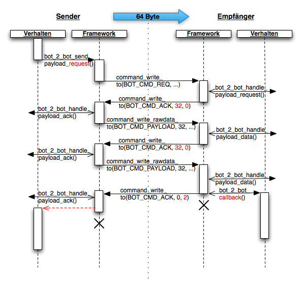
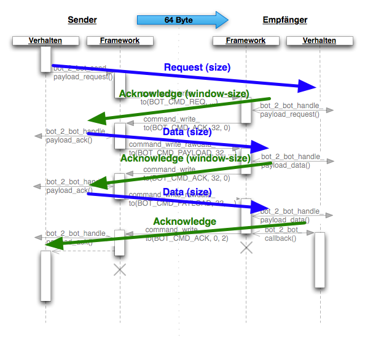

# Dokumentation zur Bot-2-Bot-Kommunikation

>> **Trac-2-Markdown Konvertierung:** *unchecked*

Hier gibt es eine kleine Zusammenfassung, was die Bot-2-Bot-Kommunikation ist und wie man sie benutzen kann. Details zur Implementierung sind (bisher) nur zur Payload-Übertragung vorhanden.

## Einführung

Aktiviert man die Option `BOT_2_BOT_AVAILABLE` in [ct-Bot.h](https://github.com/tsandmann/ct-bot/blob/master/ct-Bot.h) erhält man die Möglichkeit, dass sich ct-Bots untereinander Nachrichten / Kommandos schicken können. Die Koordination erfolgt immer über einen PC, auf dem der ct-Sim läuft, dieser agiert als Proxyserver. Somit können auch echte und simulierte Bots untereinander kommunizieren.

## Bot-Adressierung

Damit die einzelnen Bots adressiert werden können, brauchen sie eine eindeutige Adresse. Hier gibt es zwei Möglichkeiten: Entweder holt sich ein Bot beim Bootvorgang eine Adresse vom Sim, die er anschließend bis zum nächsten Reboot verwenden kann, oder er benutzt eine fest eingestelle Adresse, die er im EEPROM ablegt. Steht die Bot-Adresse auf dem Wert *CMD_BROADCAST* (0xff), ist die dynamische Adressvergabe durch den Sim eingeschaltet, und er bekommt eine Adresse >= 128. Ändert man die Bot-Adresse auf einen anderen Wert, behält der Bot diese Adresse. Dabei sollten fest vergebene Adressen zwischen 0 und 127 liegen. Der Sim verwendet immer die Adresse *CMD_SIM_ADDR* (0xfe).
Einstellen lässt sich die Bot-Adresse mit der Fernbedienung auf dem Display-Screen *MISC_DISPLAY_AVAILABLE*, wenn die Option `KEYPAD_AVAILABLE` aktiviert ist.
Bei simulierten Bots lässt sich die Adresse alternativ auch mit der Kommandozeilenoption `-a ADRESSE` angeben.

## Protokoll

Damit sich die Bots verständigen können, müssen sie sich an ein einheitliches Protokoll halten. Da die Auswertung der Nachrichten ausschließlich von den Bots selbst erfolgt (der ct-Sim leitet die Nachrichten unverändert weiter), wird das Protokoll implizit durch die implementierten Auswertungsfunktionen festgelegt.
Dazu gibt es im RAM des Bots eine Tabelle mit Funktionen, die eine Nachricht auswerten können. Der Index der Auswertungsfunktion in der Tabelle ist gleich dem Kommando im Feld `uint8_t subcommand:7` in `command_t`. Dadurch wird eine sehr effiziente Auswertung ermöglicht und es ist keine weitere Spezifikation nötig, welches Kommando wofür verwendet wird.

Die Funktion `uint8_t get_command_of_function(void (* func)(command_t * cmd))` liefert den Index einer Kommando-Funktion, wenn man auf eine statische Zuordnung zwischen Funktion und Index verzichten möchte.

## Beispiel

Im Code des ct-Bot-Frameworks gibt es bereits eine simple Beispielimplementierung für eine Liste aller angemeldeten Bots. In dieser Liste wird für jeden Bot neben seiner Adresse auch ein Status gespeichert (*BOT_STATE_AVAILABLE*, *BOT_STATE_BUSY* oder *BOT_STATE_GONE*). Seinen Status kann jeder Bot mit der Funktion `void publish_bot_state(int16_t state)` setzen, wodurch dieser automatisch allen anderen Bots mitgeteilt wird. Anhand dieses Beispiels, folgt eine kurze Erklärung, was dazu nötig ist:

```C
command_write_to(CMD_BOT_2_BOT, BOT_CMD_STATE, CMD_BROADCAST, state, 0, 0);
```

* Sendeseitig: `command_write_to()` verschickt eine Nachricht an einen anderen Bot und verwendet die folgenden Parameter:
  * `CMD_BOT_2_BOT`: Kommando-Typ für Bot-2-Bot Kommunikation, ist für alle Bot-2-Bot Kommandos nötig
  * `BOT_CMD_STATE`: Der Index der Auswertungsfunktion, die für diese Nachricht auf dem Zielbot zuständig sein soll. In diesem Fall der Index der Funktion *set_received_bot_state* (s.u).
  * `CMD_BROADCAST`: Die Adresse des Bots, an den die Nachricht gerichtet ist. Hier wird *CMD_BROADCAST* verwendet, um die Nachricht an alle verfügbaren Bots zu versenden.
  * `state`: 16 Bit große Daten, die direkt mit der Nachricht verschickt werden sollen. In diesem Beispiel ist das der Bot-Status.
  * `0`: Weitere Daten, die ebenfalls 16 Bit groß sind. Somit lassen sich insgesamt 32 Bit (4 Byte) an Daten direkt innerhalb der Nachricht versenden. Hier wird *0* angegeben, weil keine weiteren Daten nötig sind.
  * `0`: Anzahl der Bytes, die als Payload folgen. Hierbei sind ein paar Dinge zu beachten, s.u. Im Beispiel sind keine weiteren Daten nötig, daher 0.

* Empfangsseitig: `set_received_bot_state` wird vom Kommandomanagement aufgerufen, sobald die verschickte Nachricht den Bot erreicht hat. Hier passiert nun folgendes:

```C
void set_received_bot_state(command_t* cmd) {
    bot_list_entry_t* ptr = NULL;
    while (1) {
        ptr = get_next_bot(ptr);
        if (ptr == NULL) break;
        if (ptr->address == cmd->from) {
            ptr->state = cmd->data_l;
            return;
        }
    }
    add_bot_to_list(cmd);
}
```

Als Parameter bekommt die Funktion einen Zeiger auf das empfangene Kommando, in dem alle nötigen Daten stehen. Die Funktion iteriert nun durch die lokale Botliste und setzt den Status des Bots mit der Absenderadresse des Kommandos auf den übermittelten Status. Ist der Bot noch gar nicht in der Liste vorhanden, wird er mit `add_bot_to_list()` neu hinzugefügt.

Die Botliste wird derzeit nicht weiter verwendet, ebenso werden keine Statusupdates verschickt. Beides lässt sich aber leicht ergänzen und sollte für eine Anwendung der Bot-2-Bot-Kommunikation hilfreich sein. Außerdem kann der Code als Vorlage für den Versand und die Auswertung eigener Nachrichten verwendet werden.

## Übertragen weiterer Daten als Payload

Bei der Übertragung weiterer Daten von einem Bot zum anderen als Payload sind einige Dinge zu beachten, damit die Daten in einem Stück empfangen werden können und der zur Verfügung stehende Pufferplatz nicht überschritten wird, weil sonst Daten verloren gehen.

### Anwendung

Zu diesem Zweck gibt es die Funktion

```C
int8_t bot_2_bot_send_payload_request(uint8_t to, uint8_t type, void* data, int16_t size)
```

wenn `BOT_2_BOT_PAYLOAD_AVAILABLE` eingeschaltet ist.

* Sendeseitig haben die Parameter folgende Bedeutung:
  * `to`: Die Empfängeradresse.
  * `type`: Der Typ der Payload Daten - durch diesen wird bestimmt, wie der Empfänger die Daten nach dem Abschluss der Übertragung auswertet bzw. weiterverwendet.
  * `*data`: Zeigt auf die zu sendenden Daten.
  * `size`: Gibt die Größe der zu sendenden Daten in Bytes an.

* Empfangsseitig spielen folgende Angaben eine Rolle:
  * `type`: Der angegebene Typ bestimmt, welche Funktion nach Abschluss einer erfolgreichen Übertragung aufgerufen wird. Die Zuordnung von Typ und Callback-Funktion geschieht über die Einträge in `bot_2_bot_payload_mappings[]`.
  * `size`: Die Anzahl an Bytes, die der Empfänger erwartet. Ist die Anzahl größer als empfängerseitig in `bot_2_bot_payload_mappings[]` als zulässig eingetragen, akzeptiert der Bot die Anfrage **nicht**.

Zu beachten ist, dass mit einer Payload-Übertragung die von normalen Kommandos bekannten Kanäle `data_l` und `data_r` nicht zur Verfügung stehen, diese werden intern verwendet. Möchte man dem Empfänger außer dem Typ noch weitere Details der Daten mitteilen, sollte dies als eigenes Kommando vor der Payload-Übertragung erfolgen. Ein typisches Vorgehen ist, dass der Sender zunächst mit dem Empfänger abstimmt, welche Datenstrukturen im Folgenden übermittelt werden (sollen). Dies kann über die normale Bot-2-Bot-Kommunikation erfolgen, wie oben beschrieben.

Um dem Framework einen neuen Typ von Payload-Daten für die Bot-2-Bot-Kommunikation bekannt zu machen, trägt man ihn in das Array `bot_2_bot_payload_mappings[]` vom Typ

```C
/*! Datentyp der Bot-2-Bot-Payload-Zuordnungen */
typedef struct {
    void (* function)(void); /*!< Callback-Funktion, die nach Abschluss ausgefuehrt wird */
    void* data; /*!< Zeiger auf Datenpuffer */
    int16_t size; /*!< Maximale Groesse des Datenpuffers in Byte */
} bot_2_bot_payload_mappings_t;
```

ein. Solch ein Eintrag sieht dann beispielsweise wie folgt aus:

```C
#ifdef BOT_2_BOT_PAYLOAD_TEST_AVAILABLE
    { bot_2_bot_payload_test_verify, payload_test_buffer, sizeof(payload_test_buffer) },
#else
    BOT_2_BOT_PAYLOAD_DUMMY,
#endif
```

Für den Fall, dass der Auswertungscode abschaltbar ist (z.B. weil das Verhalten nicht immer aktiv ist), muss ein `#ifdef-#else`-Block dafür sorgen, dass im inaktiven Fall `BOT_2_BOT_PAYLOAD_DUMMY` eingetragen wird, um die Wohldefiniertheit der Zuordnungen zu gewährleisten.

### Implementierung

Intern läuft die Payloadübertragung von Bot zu Bot nach folgendem Handshake-Verfahren ab:

1. Der Sender übermittelt durch Aufruf von `bot_2_bot_send_payload_request(uint8_t to, uint8_t type, void * data, int16_t size)` eine **Anfrage** für *X* zu sendende Bytes an den Empfänger (Kommando `BOT_CMD_REQ`) und wartet auf dessen Antwort.
1. Der Empfänger wertet diese Anfrage aus und prüft, ob er sie annehmen oder ablehnen möchte. Seine Antwort ist vom Typ `BOT_CMD_ACK`, `data_r` == 0 bedeutet *Annahme*, `data_r` == 1 bedeutet *Ablehnung*. Über das Feld `data_l` teilt der Empfänger dem Sender seine gewünschte Fenstergröße (*window_size*) der Datenpakete mit. Die *X* Bytes werden also in *X / window_size* Paketen übertragen. Jedes Paket beginnt mit einem Kommando vom Typ `BOT_CMD_PAYLOAD`, dem *windows_size* Bytes als Payload folgen. So ist sichergestellt, dass der Empfangspuffer des Empfängers für die Payload-Daten ausreicht. Für die Anfrageauswertung ist die Funktion `bot_2_bot_handle_payload_request(command_t * cmd)` zuständig.
1. Der Sender wertet die Antwort des Empfängers aus und überträgt mit Hilfe des Kommandos `BOT_CMD_PAYLOAD` die nächsten *window_size* Bytes der zu sendenden Payload, falls der Empfänger die Anfrage akzeptiert hat. Dies erfolgt in der Funktion `bot_2_bot_handle_payload_ack(command_t * cmd)`. Handelt es sich bereits um das letzte Datenpaket, setzt der Sender das Feld `data_l` = 1.
1. Der Empfänger speichert nun die Daten des Pakets und bestätigt dem Sender den Empfang über ein Kommando vom Typ `BOT_CMD_ACK`. `data_r` == 0 bedeutet wiederum OK, `data_r` == 1 Fehler und `data_r` == 2 signalisiert den erfolgreichen Abschluss der Übertragung. Die Behandlung der empfangenen Daten erfolgt in der Funktion `bot_2_bot_handle_payload_data(command_t * cmd)`. War das empfangene Paket das Letzte (`data_l == 1`), führt der Empfänger nun die in `bot_2_bot_payload_mappings[]` für diesen Typ eingetragene Callback-Funktion aus, ansonsten wartet er auf die nächsten *window_size* Bytes in einem weiteren Paket (--> Punkt 3.).
1. Der Sender hat nun ein Kommando `BOT_CMD_ACK` mit `data_r` == 2 bekommen und kehrt aus der Funktion `bot_2_bot_send_payload_request(uint8_t to, uint8_t type, void * data, int16_t size)` mit Rückgabewert *0* zurück. Die Payload-Übertragung ist hiermit abgeschlossen.

Das folgenden Bild stellt den Ablauf des Verfahrens am Beispiel von 64 zu übertragenden Bytes grafisch dar, wobei die Fenstergröße auf 32 Bytes gesetzt wird:

  

Etwas abstrakter gesehen läuft die Payload-Übertragung also nach folgendem Schema ab (erneut am Beispiel einer Payloadgröße von 64 Bytes und einer Fenstergröße von 32 Bytes):

  

Für den Anwender sind letztlich nur die Aktivitäten auf der Verhaltensebene (*sendeseitig* `bot_2_bot_send_payload_request()` und *empfangsseitig* der Aufruf der in `bot_2_bot_payload_mappings[]` eingetragenen *Callback-Funktion*) wichtig. Alle weiteren Schritte erledigt das Framework automatisch.
