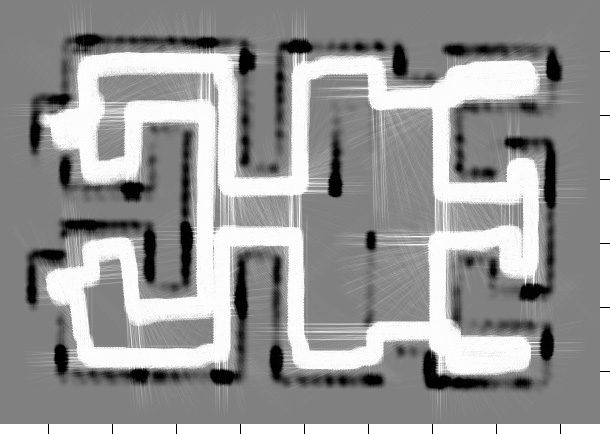
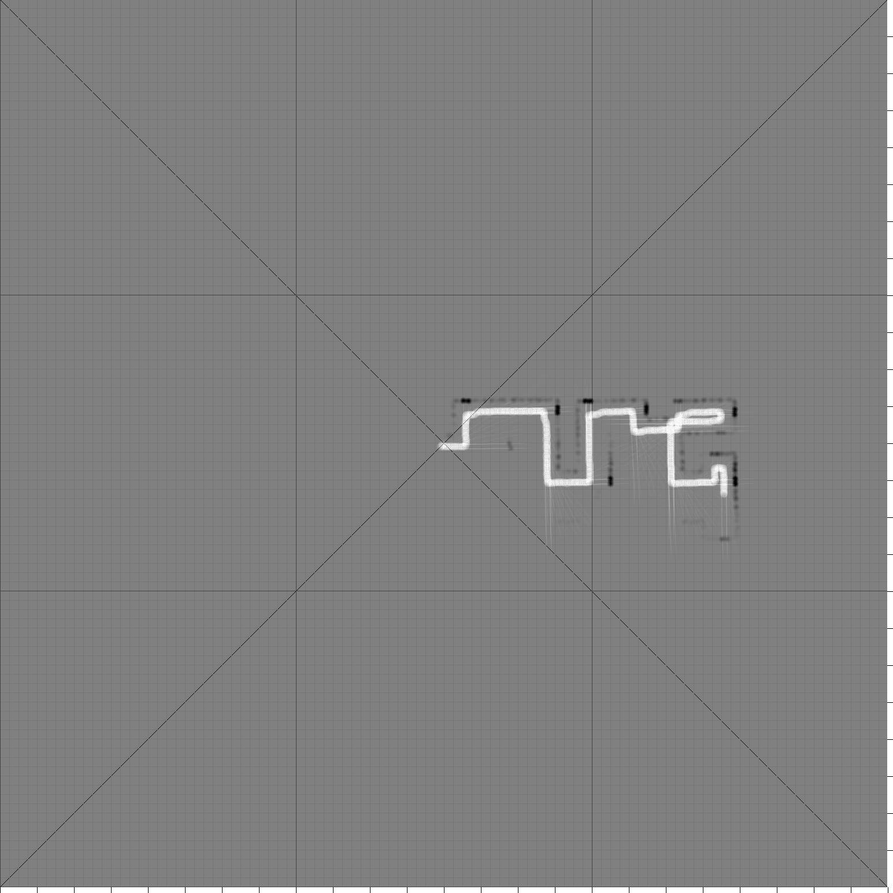
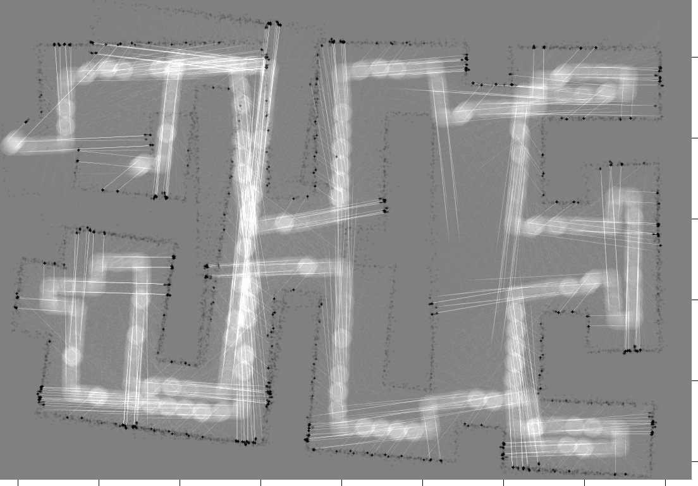
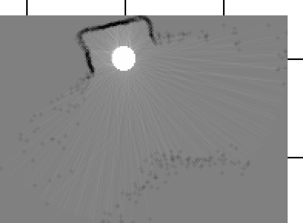
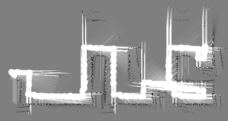
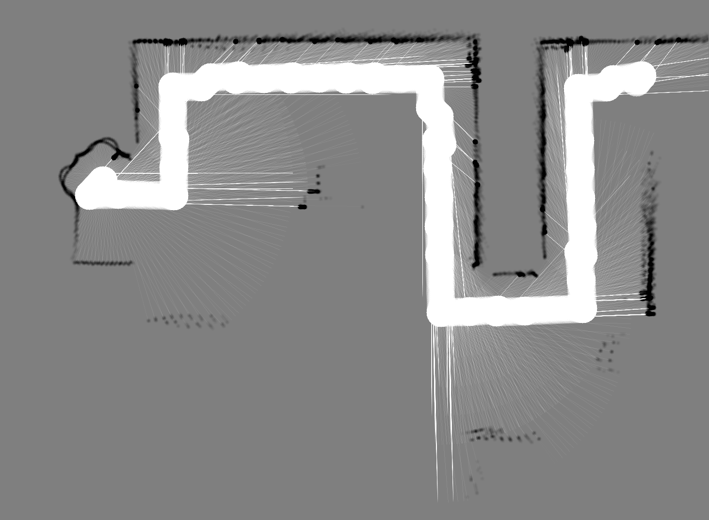

# c't-Bot in Aktion

>>> **Trac-2-Markdown Konvertierung:** *incomplete*

> **Hinweis:** Diese Dokumentationsseite wurde aus dem ehemaligen Trac des Projekts exportiert und nach Markdown konvertiert, einige Videos die ursprünglich im SVN abgelegt waren, sind aktuell nicht verfügbar.

## Videos

* [Video](http://www.youtube.com/watch?v=GX4phyGY-Z4) über c't-Bots an der Uni Tübingen. Stand 26.05.2009
* [Video](https://www.cety.de/ctbot/pfadplanung_real.html), welches die Verwendung der Pfadplanung auf dem echten Bot demonstriert. Der Kern der Sache in diesem Szenario liegt darin, dass der Rückweg zum Startpunkt nicht entlang der Wand erfolgt, also der Bereich zwischen den beiden Hindernisse gar nicht erst angefahren wird. Stand 19.04.2009.
* [Video](https://www.cety.de/ctbot/maptest_real.html) der Map-Anzeige (Map-2-Sim) des echten Bots. Die Anzeige der Map erfolgt in diesem Video noch mit relativ großer Verzögerung. Inzwischen ist der Code deutlich verbessert worden, wodurch die Verzögerung minimiert wurde. Stand 02.03.2009.
* [Video](https://www.cety.de/ctbot/follow_line_enh.html) des Verhaltens bot_follow_line_enh() auf dem echten Bot. Die Map dazu nach [einer](follow_line_enh.png) "Runde" und nach [zwei](follow_line_enh_2.png) "Runden". Stand 26.02.2009.
* [Video](https://www.cety.de/ctbot/drive_area_way_free.mov) zur Veranschaulichung von map_way_free(). Stand 15.02.2009
* [Video](https://www.cety.de/ctbot/map-2-sim.html) der ersten Map-2-Sim-Version in Aktion. Stand 27.11.2008
* [Video](https://www.cety.de/ctbot/follow_stack.html) des Verhaltens `bot_follow_object_behaviour()` im Zusammenspiel mit `bot_drive_stack()`. Stand 06.04.2008.
* [Video](https://www.cety.de/ctbot/solve_maze_real.html), das den echten Bot beim Lösen eines Labyrinths (folgen der Außenwand) zeigt. Der Lösungsalgorithmus ist mit Hilfe einer Skriptsprache umgesetzt (bot_abl_behaviour()). Stand 07.01.2008.
* [Video](https://www.cety.de/ctbot/wall.html) des Verhaltens `bot_follow_wall_behaviour()`. Stand 09.09.2007.
* [Video](https://www.cety.de/ctbot/follow.html) des Verhaltens `bot_follow_object_behaviour()`. Stand 03.08.2007.
* [Video](https://www.cety.de/ctbot/tevers_follow_line_wo_speedcontrol_cc-by-sa.avi) des Bots beim Linienverfolgen (`bot_follow_line_behaviour()`) ohne Motorregelung von Torsten Evers.
* [Video](https://www.cety.de/ctbot/tevers_follow_line_w_speedcontrol_cc-by-sa.avi) des Bots beim Linienverfolgen (`bot_follow_line_behaviour()`) mit Motorregelung von Torsten Evers.
* [Video](https://www.cety.de/ctbot/tevers_solve_maze_cc-by-sa.mpg) des c't-Bot beim Lösen eines kleinen Labyrinths mit `bot_solve_maze_behaviour()` von Torsten Evers.
* c't-Bots beim [Sumoringen](http://youtube.com/watch?v=-AMo10Cc9L0). Stand 28.07.2006.
* YouTube Videos von [x29a](http://www.youtube.com/watch?v=RFdkuTtFTQ0&NR=1)
  1. c't-Bot im [Labyrinth](http://youtube.com/watch?v=-P_feEbQgfk). Stand 13.03.2008.
  1. [Test](http://www.youtube.com/watch?v=RFdkuTtFTQ0&NR=1) eines c't-Bots. Stand 15.11.2007.
  1. [Snake](http://www.youtube.com/watch?v=59hXwtWTXmU&amp;feature=user) auf dem Display des c't-Bot. Stand 24.06.2008.
  1. Verzweifelte [Suche nach Licht](http://www.youtube.com/watch?v=WqAMM9UqwPo&amp;feature=user). Stand 06.01.2008.
  1. Erste [Schritte](http://www.youtube.com/watch?v=QjDkaCr4d3I&amp;feature=user). Stand 19.11.2007.
* c't-Bot [folgt](http://www.youtube.com/watch?v=fvxcSFx9Csk) einer Linie. Stand 27.05.2008.
* Ein weiterer [Linienfolger](http://www.youtube.com/watch?v=7sK5jE8LnNU&amp;feature=related). Stand 11.03.2008.
* Ein eher [simples Programm](http://www.youtube.com/watch?v=xBJkC_R0Odc). Stand 29.11.2006.

## Bilder

* Karte zur Messung der Genauigkeit im ct-Sim. Dargestellt ist eine fünfmalige Fahrt durch den Testparcours, im Vergleich zur älteren Karte ist der Fehler hier sehr gering und nicht wachsend, Stand 17.08.2007:

  

* Eine Karte, mit Testmuster und fahrt durchs Labyrinth. Sie zeigt dank der Hilfslinien sehr gut den internen Aufbau der Karte in kleine quadratische Sections und riesige Macroblöcke, Stand 16.08.2007:

  

* Noch eine Karte, die zeigt, wo die Grenzen der Genauigkeit der Positionierung des Bots liegen. Aufgenommen mit einem leicht modizierten (regelmäßige 360 Drehungen) Wandfolger im testparcours2.xml, dem die Lampen und das Zielfeld entfernt wurden, Stand 06.04.2007:

  

* Eine Karte, die mit dem echten Bot auf MMC aufgezeichnet wurde (Bot dreht sich zwischen aufgestellten Büchern, Bot-Besitzer sitzt gegenüber ;-)), Stand 23.03.2007:

  

* Zwei Karten, die zeigen, was ein simulierter Bot beim Wandfolger so sieht, Stand 23.03.2007:

  

  

## Sonstige Robotik-Videos

* [Mission Impossible](https://www.newscientist.com/article/dn20791-robot-mission-impossible-wins-video-prize/) mit Roboter

