# Lokalisierung des c't-Bots

>> **Trac-2-Markdown Konvertierung:** *unchecked*

## Einleitung

Grundsätzlich ermöglicht das hier vorgestellte Verfahren zur Lokalisierung, die globale Position und Ausrichtung des Bots in der Welt zu bestimmen, wenn der Bot mindestens drei Landmarken "sieht". Er dreht sich dann einmal und weiß anschließend, er steht an (X | Y) mit Ausrichtung Z Grad. Das Ganze ist dabei völlig unabhängig von der vorherigen bekannten Position,  es spielt also keine Rolle, ob er in der Vergangenheit mal irgendwo hängen geblieben war und dadurch von falschen Positionsdaten ausgeht.
Einen kleinen Überblick über das Verfahren bietet z.B. [Terrestrische Navigation](https://de.wikipedia.org/wiki/Terrestrische_Navigation#Horizontalwinkelmessung)

ToDo: *Weitere Hintergrundinformationen wären nicht schlecht.*

In der folgenden Grafik steht der Bot am Punkt **N** und an den Punkten **A**, **M**, **B** befindet sich jeweils eine Landmarke (Bake).

* bekannt: Position von *A*, *M* und *B*
* gemessen: Winkel *alpha* und *beta*
* gesucht: Position von *N*

Die übrigen Elemente der Grafik sind nur für die Berechnung wichtig und können erstmal ignoriert werden.
  
 ToDo: *Übersichtsgrafik ohne das unnötige Zeug erstellen.*

Für Fragen und weitere Informationen zu dieser Bot-Erweiterung stehen die gewohnten [Support-Kanäle](../FirstSteps/FirstSteps.md#Support) zur Verfügung.

## Hardware

### Sensor-Aufbau

Der verwendete Sensor besteht aus einem **IR-Empfänger** (*TSOP34836*; wie IC 9 auf der Bot-Hauptplatine), einem dünnen **Plastikröhrchen mit 45 mm Länge** und **Absorptionsmaterial** (z.B. Schrumpfschlauch), um Probleme mit Streulicht zu vermeiden:
 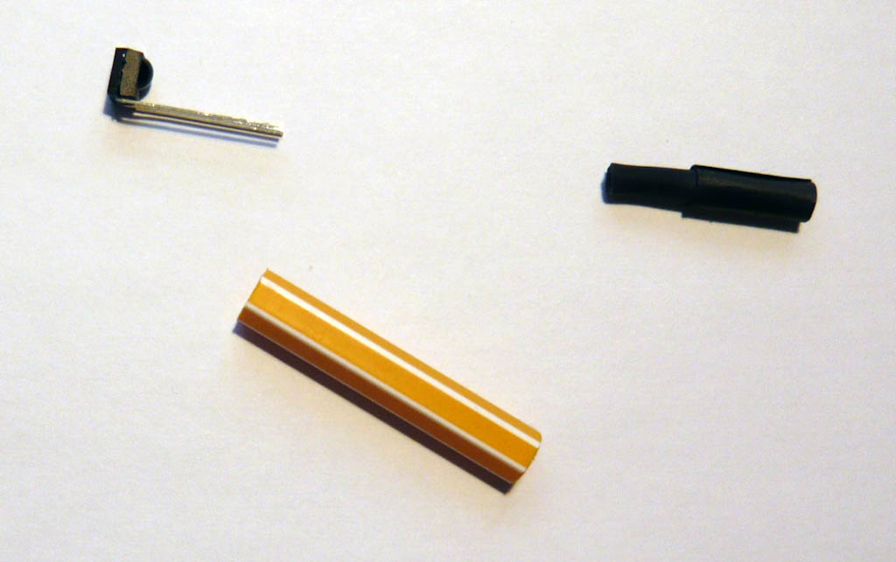
Das Röhrchen sollte einen ähnlichen Durchmesser wie die Kugelfläche des IR-Empfängers haben. Es wird direkt auf den Empfänger geklebt:
 
Anschließend werden drei Kabel an den Sensor gelötet (im Bild verwendete Farbkodierung: rot: Vcc; schwarz: Gnd; grün: Ausgang):
 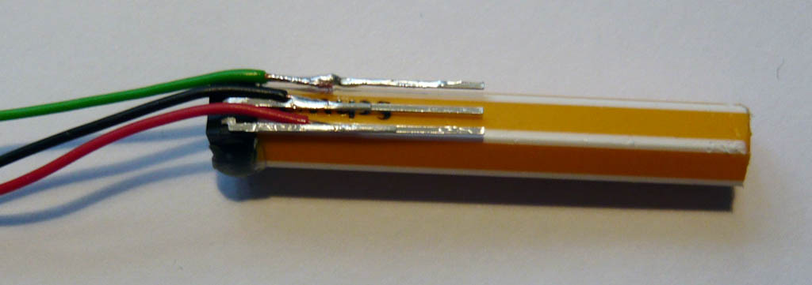
und die Kontakte isoliert:
 
Um den Einfall von Streulicht auf den Sensor zu verhindern, wird dieser komplett in einen Schrumpfschlauch oder ähnliches, wirklich lichtdichtes Material (schwarzes Isolierband genügte im Test nicht) eingepackt:
 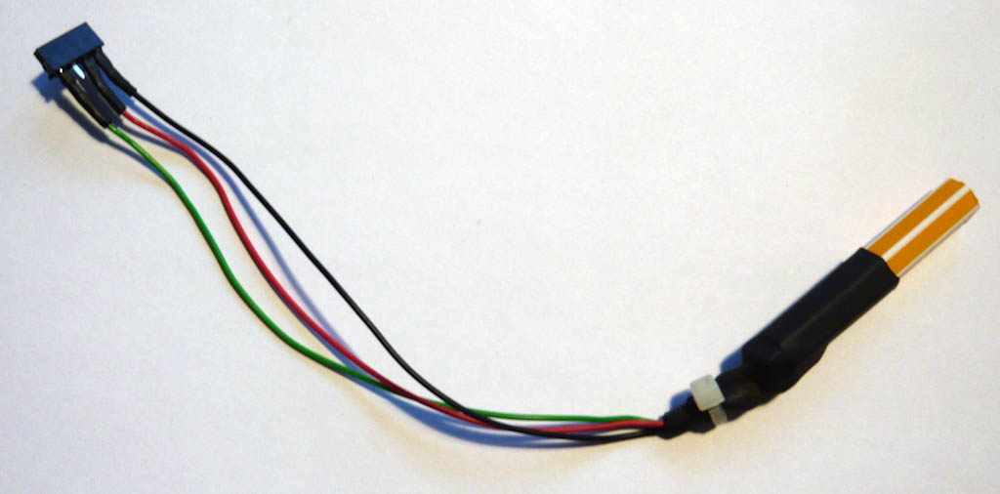
Wichtig ist, dass der Sensor ausschließlich auf IR-Licht, das durch die Röhre einfällt, reagiert. Am hinteren Ende des Sensors wird eine kleine Auflage angeklebt, damit er nachher waagerecht im Bot sitzt:
 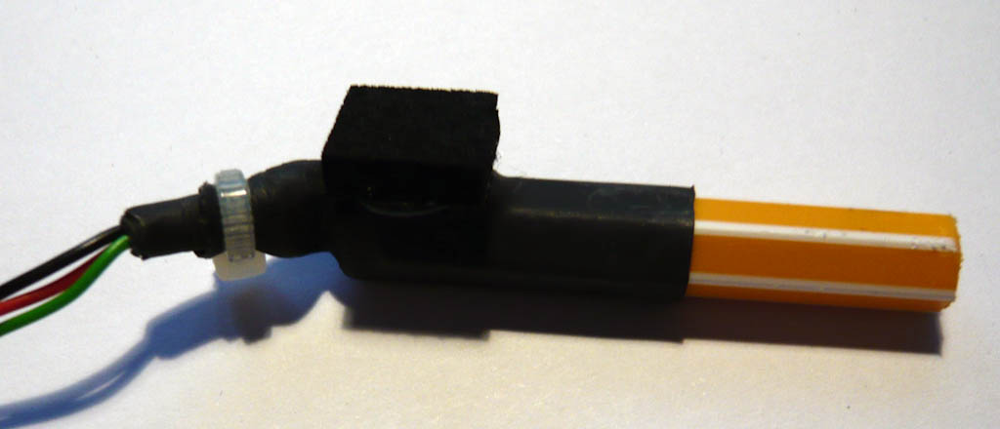
Die Stärke der Auflage muss so gewählt werden, dass der Sensor / die Röhre nach dem Einbau an der im folgenden Bild gezeigten Position exakt waagerecht ausgerichtet ist:
 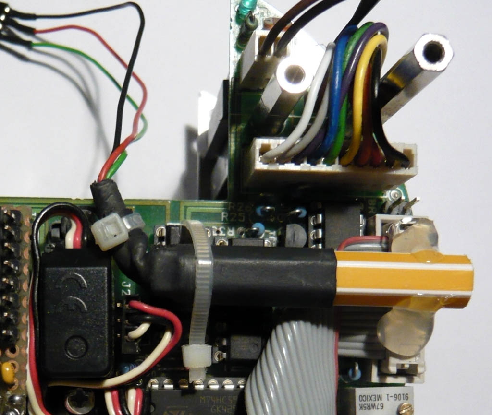
Außerdem ist beim Einbau zu beachten, dass die Längsachse des Sensors genau über der Radachse des Bots liegt und zu ihr parallel ausgerichtet ist.

Um den Durchmesser der Röhre auf *2 mm* zu verringern, muss IR-Licht absorbierendes Material in die Röhre gesteckt werden. Hier wurden dafür Schrumpfschläuche verschiedener Größe ineinander gesteckt:
 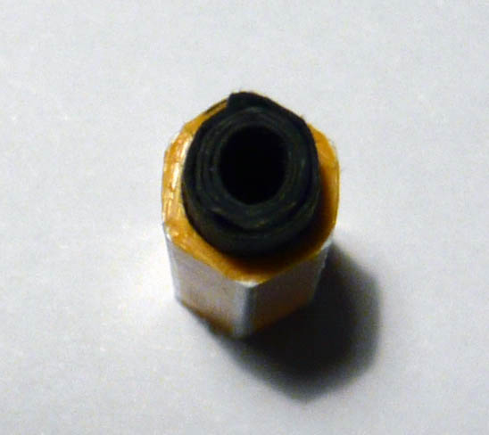
Alternativ sind evtl. auch aufgerollte Pappstreifen oder ähnliches möglich, wichtig ist jedoch, dass das Material kein Licht reflektiert, sonst vergrößert sich die Ungenauigkeit des Sensors.

Der fertige Einbau des Sensors ist hier zu sehen:
 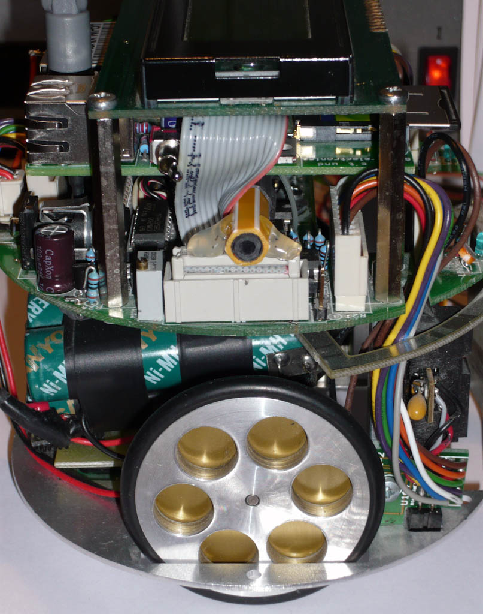

### Sensor-Anschluss

Angeschlossen werden Vcc und Gnd des Sensors natürlich an Vcc bzw. Gnd des Bots. Der Datenausgang des IR-Empfängers wird an **Pin 36** des ATmegas (*LDRL* im Schaltplan) angeschlossen, z.B. über **J7 Pin 5**. Die bisherige Verbindung zum linken Lichtsensor (LDRL) muss getrennt werden, der linke Lichtsensor kann dann nicht mehr ausgewertet werden.

### Bake

Für die Bot-Lokalisierung werden mindestens *drei* Baken benötigt. Pro Bake sind folgende Bauteile erforderlich:

|Anzahl|Name im Schaltplan|Bezeichnung|Hinweis|
|---|---|---|---|
|1|IC1|ATtiny25 MCU|auch pin-kompatible Controller möglich|
|1|-|DIP8-Sockel für IC1||
|1|IC2|L4940V5 Spannungsregler|wird nicht benötigt, falls eine geregelte 5V-Spannungsquelle benutzt wird; andere Typen ebenfalls möglich|
|2|T1, T2|BS170 MOSFet||
|1|C1|22 µF Kondensator||
|1|C2|100 µF Elko||
|6|LED*x*|TSAL6400 IR-LED|vermutlich auch andere Typen möglich (ungetestet)|
|1|S1|Schalter||
|1|Bat|Batterie-Clip für 9V Block|andere Stromversorgung ebenfalls möglich|
|1|P1|Potentiometer zur Regulierung der Leuchtstärke|kann auch durch Drahtbrücke oder Jumper ersetzt werden|
|1|-|LED zu Debug-Zwecken|optional, bringt keinen Vorteil im Normalgebrauch|
|1|-|Vorwiderstand für Debug-LED|s.o.|
|2|-|4-Pin Buchsenleiste|parallel zum ATtiny25 für Erweiterungen oder zum ISP-Anschluss|

Da nur wenige Bauteile erforderlich sind, wurden die bisherigen Prototypen auf Lochrasterplatinen aufgebaut:
 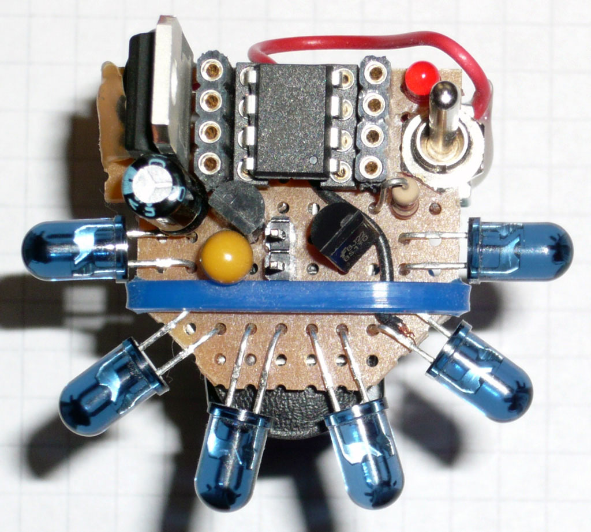
Ein PCB-Layout ist (bisher) leider nicht vorhanden.

Ohne die optionalen Elemente ergibt sich der [Schaltplan](Schaltplan-Bake.pdf) zu:
 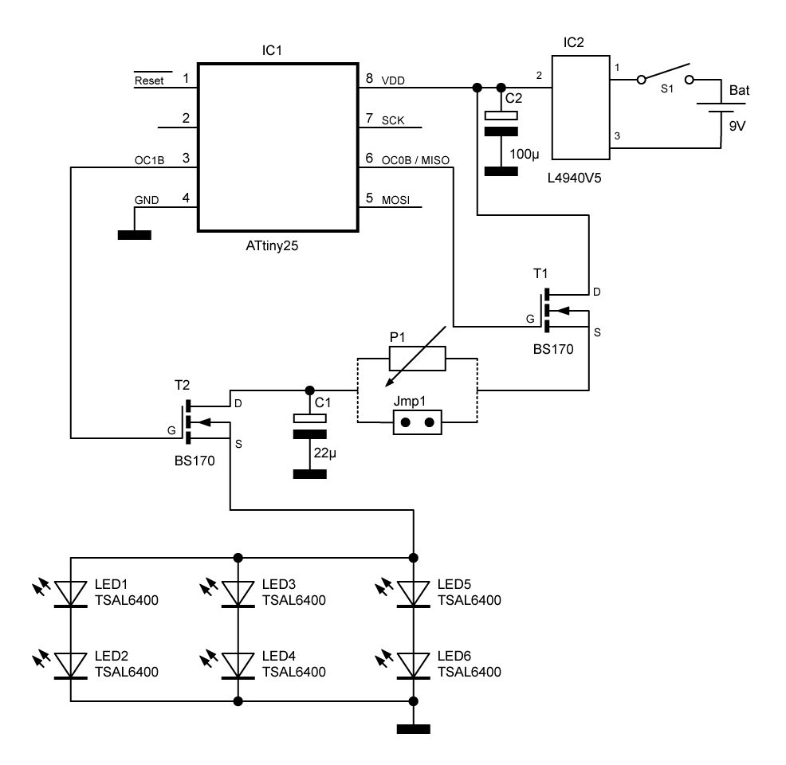
 *P1* kann dabei durch einen Jumper (*Jmp1*) oder eine Drahtbrücke ersetzt werden, wenn die Leuchtstärke der LEDs nicht manuell (nach-) reguliert werden muss. Eine Grobeinstellung der Leuchtstärke ist bereits softwareseitig möglich. Daher empfiehlt es sich, zunächst nur einen Jumper vorzusehen, der dann überbrückt wird. Besteht später wirklich die Notwendigkeit einer Nachregulierung, lässt sich dort ein Poti anschließen.

Es bietet sich an, die Platine direkt auf einem 9V-Block (Akku) zu befestigen, wenn sie mobil sein soll:
 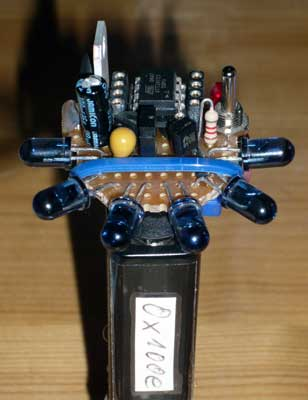
 Wichtig ist, dass die Höhe der IR-LEDs exakt der Höhe des Sensors im Bot entspricht. Entweder legt man etwas entsprechender Höhe unter den 9V-Block oder baut eine Art Standfuß direkt an die Bake (*Bauvorschläge willkommen*).
Alternativ ist natürlich auch eine kabelgebundene Stromversorgung möglich, dann braucht nicht jede Bake einen eigenen Spannungsregler.

Als Erweiterung ist eine aufsteckbare Zusatzplatine denkbar, die eine Eingabe der Bakenposition ermöglicht, z.B. über einen Fernbedienungsempfänger und außerdem einen Programmieranschluss bietet. Solch eine Aufsteckplatine könnte dann für mehrere Baken verwendet werden.

## Software

### Sensor Software

Damit der Landmarken-Sensor softwareseitig ausgewertet wird, muss mindestens Code-Version *1652* auf dem Bot verwendet und in [ct-Bot.h](https://github.com/tsandmann/ct-bot/blob/master/ct-Bot.h) die [Option](../ctBotH/ctBotH.md) `BPS_AVAILABLE` aktiviert werden.

Der aktuelle Sensor-Messwert wird auf dem Display-Screen *Odometrie* in Zeile 4 angezeigt.

Mit dem Verhalten [bot_scan_beacons()](https://github.com/tsandmann/ct-bot/blob/master/bot-logic/behaviour_scan_beacons.c) lässt sich eine Lokalisierung des Bots durchführen, wenn dieser mindestens drei Baken detektieren kann.
Der erste Parameter `position_update` steuert, ob die Bot-Position mit den neuen Daten (`x_pos`, `y_pos`, `heading`) aktualisiert wird (Wert *1*) oder nicht ((Wert *0*). Der zweite Parameter `mode` legt den Modus des Verhaltens fest: *0* - Bot dreht sich auf der Stelle, *1* - Bot fährt einen Kreis um das linke Rad zum Scannen der Baken.
Die tatsächliche Position der vorhandenen Baken muss in der Funktion `get_position_from_id()` der jeweiligen Baken-ID zugeordnet werden (siehe Beispieldaten im [Quellcode](https://github.com/tsandmann/ct-bot/blob/master/bot-logic/behaviour_scan_beacons.c#L62)).

### Baken Software

Der Source-Code für die Baken ist bei [github](https://github.com/tsandmann/ct-bot-irbeacon) zu finden.
Um das Projekt mit Eclipse compilieren zu können, muss das [AVR Eclipse Plugin](http://avr-eclipse.sourceforge.net) installiert sein, es ist über die Eclipse-Update-Site `http://avr-eclipse.sourceforge.net/updatesite` leicht zu installieren (siehe [Eclipse-Installation](../EclipseInstallation/EclipseInstallation.md) für das prinzipielle Vorgehen).

## Simulation

Die IR-Baken und der BPS-Sensor lassen sich auch im c't-Sim simulieren. Hierzu muss in der globalen Konfigurationsdatei [config/ct-sim.xml](https://github.com/tsandmann/ct-sim/blob/master/config/ct-sim.xml) der Paramter `BPSSensor` auf den Wert `true` gesetzt werden.
Weiterhin benötigt man eine Welt, in der mindestens drei Baken vorhanden sind, wie z.B. [test_localization.xml](https://github.com/tsandmann/ct-sim/blob/master/parcours/test_localization.xml). Die Barken lassen sich über den Typ `l` (kleines *L* für **L**andmarke) einfügen, der Sim errechnet dabei automatisch eine ID, aus der die Position der Landmarke bestimmt werden kann. Die Reichweite einer Bake beträgt (in der Standardeinstellung) 2 m.
Auf Grund der unterschiedlichen Ausrichtung der Koordinatensysteme von Bot und Sim ergeben sich im Sim folgende globale Koordinaten:

  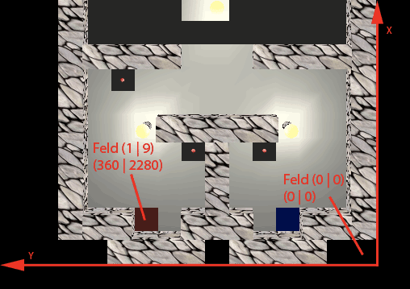

Ein Sim-Feld ist 240 mm x 240 mm groß, die Position einer Bake ist der Mittelpunkt ihres Feldes.

Hinweis: Die simulierten Baken "leuchten" durch die Wände der Welt hindurch. Eine Absorption des Bakenlichts an den Wänden würde einen umfangreichen Umbau am Welt-Code und einen deutlich höheren Rechenaufwand für die Simulation bedeuten.

