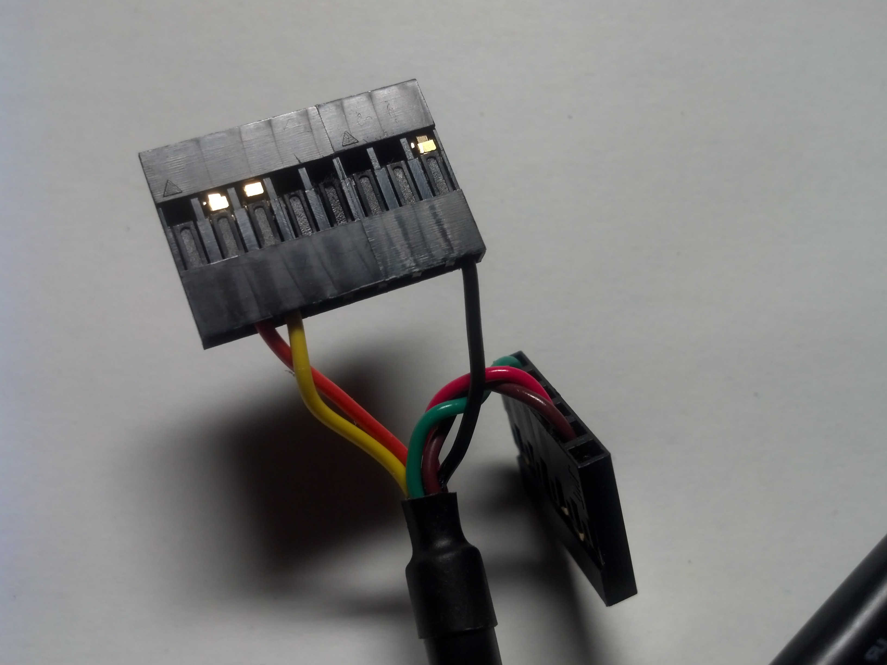
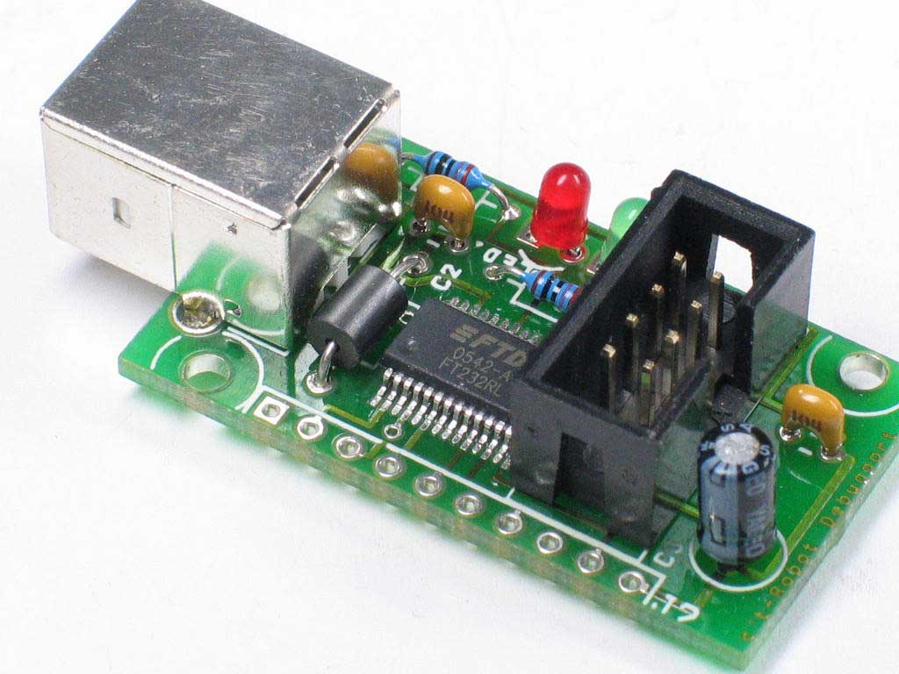
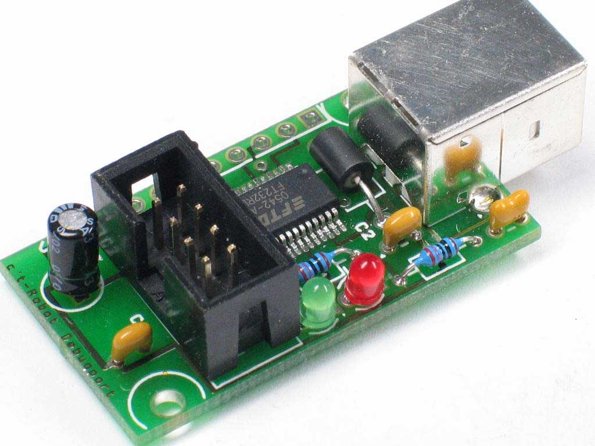
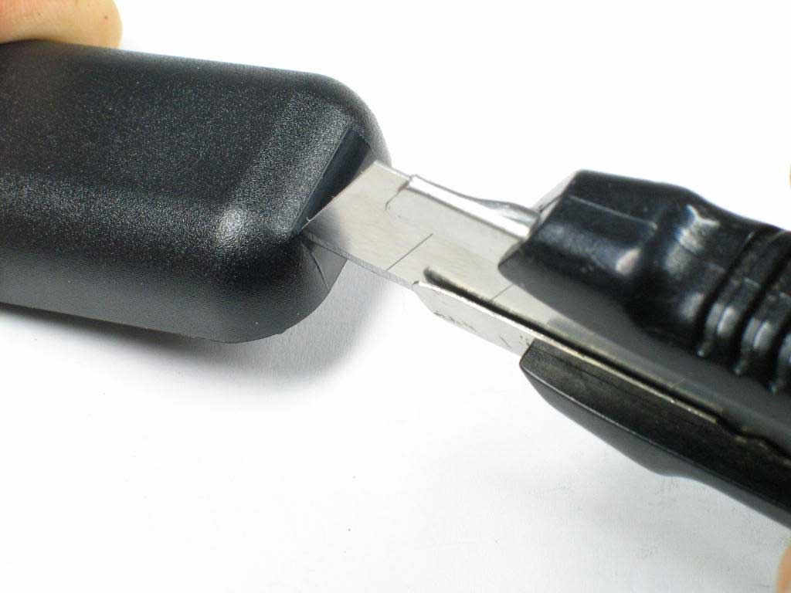
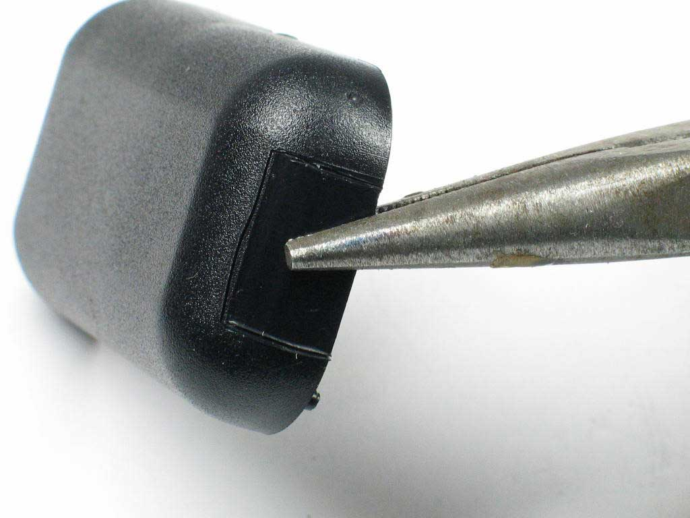
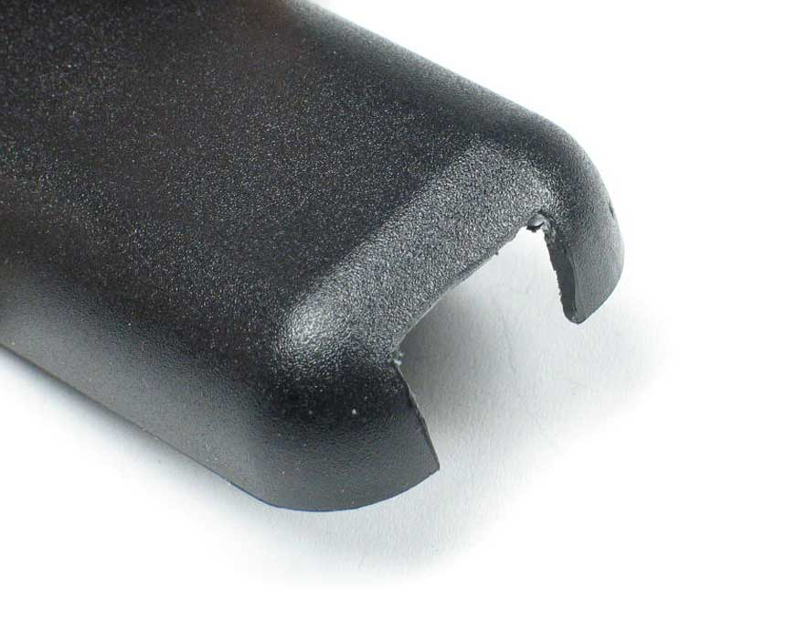
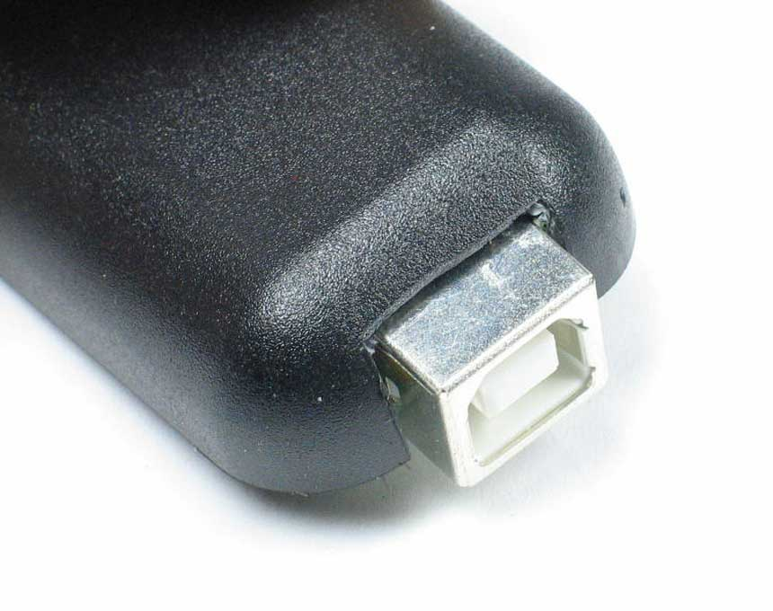
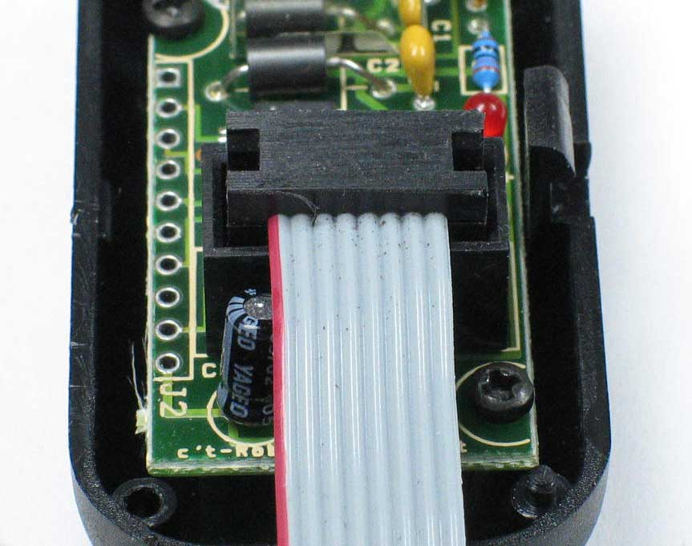
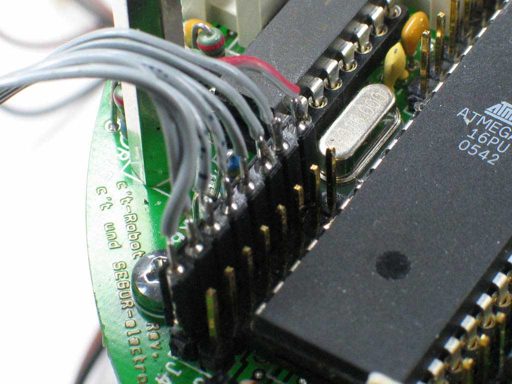

# USB-2-Bot

>> **Trac-2-Markdown Konvertierung:** *unchecked*

## Beschreibung

siehe auch:

* [c't 7/2006, S. 223](https://www.heise.de/ct/artikel/An-der-Leine-290394.html): An der Leine, Debuggen des c't-Bot über USB
* [Schaltplan](https://www.heise.de/ct/projekte/ct-bot/pdf/schaltplan-usb-2-bot.pdf)
* [Bestückungsplan](https://www.heise.de/ct/projekte/ct-bot/pdf/bestueckung-usb-2-bot.pdf)
* [Stückliste](../ct-Bot-Hardware/ct-Bot-Hardware.md#USB-2-Bot-Adapter)

## Nachfolger

Die USB-2-Bot-Platinen sind mittlerweile ausverkauft. Als Alternative dazu kann man das "USB to TTL Serial Cable (5.0V)" von FTDI verwenden ([TTL-232R-5V](http://www.segor.de/#Q=TTL-232R-5V&M=1)). In puncto Software und Treiber bleibt alles beim Alten. Allerdings passt das Pinout nicht und man muss die 6-polige durch eine 8-polige Buchse ersetzen. Folgende Beschaltung ist zu verwenden:

* schwarzes Kabel (GND) herausnehmen und an Pin 8 beim c't-Bot (J4) oder Erweiterungsmodul (J12)
* oranges Kabel (Sendeleitung zum Bot) in Pin 2 beim c't-Bot (J4) oder Erweiterungsmodul (J12)
* gelbes Kabel (Sendeleitung zum PC) in Pin 3 beim c't-Bot (J4) oder Erweiterungsmodul (J12)

Die anderen Leitungen werden nicht gebraucht und bleiben am besten im (alten) 6-poligen Gehaeuse (im Bild zur Seite gebogen), damit es keine Kurzschlüsse gibt:

## Treiber / Installation

[VCP-Treiber von FTDI](https://www.ftdichip.com/Drivers/VCP.htm)

## Aufbauhinweise zum USB-2-Bot-Adapter

Bei den Bauteilen LED1, LED2, C3 bitte die Polung (siehe Hinweise in der [Stückliste](../ct-Bot-Hardware/ct-Bot-Hardware.md#USB-2-Bot-Adapter)) beachten. Die Stiftleiste J2 ist für Erweiterungen gedacht und bleibt unbestückt.

|||
|---|---|---|

Für die USB-Buchse und das Verbindungskabel zum Bot muss man das mitgelieferte Gehäuse bearbeiten. Wer nicht feilen will, kann ein Teppichmesser nehmen. Dieses aber bitte immer vom Körper weg zeigend verwenden, sonst ist die Verletzungsgefahr zu gross. Mit dem Teppichmesser ritzt man das Gehäuse kräftig ein und bricht dann die überflüssigen Teile mit einer Zange aus.

|||
|---|---|
|||

Die beiden LED sind für eine erste Funktionskontrolle des Adapters und müssen im Betrieb nicht sichtbar sein. Bohrungen dafür sind nicht erforderlich. Je nach Toleranzen kann es erforderlich sein, nach dem Aufstecken des Flachkabels von dessen Stecker ein wenig Material abzufeilen, damit das Gehäuse sauber schließt.

An das freie Ende des Kabels die 8-polige Buchsenleiste in der Reihenfolge der Kabeladern anlöten, bei Bedarf mit ein wenig Schrumpfschlauch oder Heisskleber isolieren. Die Leiste wird auf J4 der Robot-Hauptplatine aufgesteckt, Pin 1 zeigt zum danebenliegenden Quarz. Verdrehtes Aufstecken ist bei einem Akku-versorgten Robot in der Regel unschädlich, es kommen dann aber keine Daten an.

Informationen zur Treiberinstallation finden sich in unserer allgemeinen [Installationsanleitung](../InstallationsanleitungR23/InstallationsanleitungR23.md). Wie der USB-2-Bot-Adapter mit dem Erweiterungsmodul harmoniert findet sich in der [Beschreibung zu Letzterem](../ct-Bot-Erweiterung/ct-Bot-Erweiterung.md).

