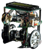

# c't-Bot

This repository contains the documentation belonging to the robotic project **c't-Bot** initiated in 2006 by the German c't magazine. The official c't project website can be found [here](http://www.heise.de/ct/projekte/c-t-Bot-und-c-t-Sim-284119.html).

# Willkommen beim c't-Bot- und c't-Sim-Projekt

## Anlaufstellen

Zum Projekt gibt es viel (auch nicht aufbereitete) Doku, hier ein paar generelle Anlaufadressen:

1. Das **[neue Wiki](../doc/wiki_main.md)** (**Hauptanlaufstelle**)
1. Das **[Nutzerforum zum c't-Bot](https://www.ctbot.de)**
1. Die **[Projektseite](http://www.ct-bot.de)**
1. Die **[FAQ](http://www.heise.de/ct/artikel/FAQ-fuer-c-t-Bot-und-c-t-SIM-291940.html)**  (*deprecated*)
1. Das **[Heise Forum](https://www.heise.de/forum/c-t/Kommentare-zu-c-t-Artikeln/c-t-Bot-und-c-t-Sim/forum-23074/)** (dient nur als Archiv) (*deprecated*)
1. Das **[Mailingliste](https://www.heise.de/ct/newsletter/archiv/ct-bot-entwickler/)** (dient nur als Archiv)  (*deprecated*)
1. Ältere **[Erweiterungen](../Patches/Patches.md)** von Lesern

------------------------------------------

## Markdown Dokumentation

> **Hinweis:** Diese Dokumentationsseiten wurde aus dem ehemaligen Trac des Projekts exportiert und nach Markdown konvertiert, aber noch nicht auf Korrektheit überprüft! Daher können Fehler enthalten sein, außerdem sind einige Teile stark veraltet und nicht mehr aktuell, ihre Überarbeitung steht derzeit noch aus. Entsprechende Marker finden sich auf den jeweiligen Seiten:
>>>> **Trac-2-Markdown Konvertierung:** *incomplete*
>
>>> **Trac-2-Markdown Konvertierung:** *unchecked*
>
>> **Trac-2-Markdown Konvertierung:** *deprecated*

c't-Bot und c't-Sim gehören zusammen und sind ein Roboterprojekt der Zeitschrift c't. Dies hier ist die im Laufe des Projekts entstandene Dokumentation, die ursprünglich im Trac zum Projekt entstanden war. Auf diese Weise soll sichergestellt werden, dass das Projekt auch nach dem Erscheinen des letzten c't-Artikels in der Community weiterleben kann. Daher ergänzen diese Seiten die offizielle **[c't-Projektseite](http://www.heise.de/ct/projekte/ct-bot)**. Sämtliche Inhalte sind unter [CC BY-SA 4.0](https://creativecommons.org/licenses/by-sa/4.0/) lizenziert.

## Hardware

* Überblick über die **[ct-Bot-Hardware](../xx_HW/ct-Bot-Hardware.md)**
  * **[Schaltpläne](../xx_HW/ct-Bot-Hardware.md#Schaltplaene)**
  * **[Stücklisten](../xx_HW/ct-Bot-Hardware.md#Stuecklisten)**
  * **[Aufbauanleitung](../ct-Bot-Hardware/ct-Bot-Hardware.md#Aufbau-und-Montage)**
  * **[Erweiterungen](../ct-Bot-Hardware/ct-Bot-Hardware.md#Erweiterungen)**
  * **[Firmware flashen](../Flash/Flash.md)**
* c't-Bot **[testen](../ct-Bot-Hardware/ct-Bot-Hardware.md#Test-eines-frisch-aufgebauten-ct-Bots)**
* Herzstück des Funkmoduls [WiPort](http://www.lantronix.com/pdf/WiPort_UG.pdf)

## Software

### c't-Bot

Dieses Teilprojekt umfasst den C-Code für reale und simulierte c't-Bots

* Überblick über die **[ct-Bot-Software](../ct-Bot-Software/ct-Bot-Software.md)**
* Demo-Firmware **[ausprobieren](../ct-Bot-Software/ct-Bot-Software.md#Und-los-geht-es)**
* **[Eigenen Code](../ct-Bot-Software/ct-Bot-Software.md#Eigene-Schritte)** schreiben
* **[Dokumentation](../ct-Bot-Software/ct-Bot-Software.md#Dokumentation)** zum bestehenden Code
* **[Howto](../ct-Bot-Software/ct-Bot-Software.md#Howto)** zum Bot
* **[Ideen & mehr](../ct-Bot-Software/ct-Bot-Software.md#Ideen-und-mehr)**
* Die Firmware für die eigene Hardware **[kalibrieren](../ct-Bot-Software/ct-Bot-Software.md#Kalibrierung)**

### c't-Sim

Dieses Teilprojekt umfasst den Java-Code für den Simulator c't-Sim

* Überblick über die **[ct-Sim Software](https://www.heise.de/ct/artikel/c-t-Bot-und-c-t-Sim-284119.html?seite=3)**
* **[Konfiguration](../ct-Sim/ct-Sim.md#Konfiguration)** der ct-Sim Optionen
* **[Howto](../ct-Sim/ct-Sim.md#Howto)** zum ct-Sim

### Entwicklungsumgebung

* Allgemeine **[Installationsanleitung](../Installationsanleitung/InstallationsanleitungR23.md)** für c't-Bot und c't-Sim
* Entwicklungsumgebung
  * **[Eclipse-Installation](../Eclipse/EclipseInstallation.md)** inkl. der nötigen Plugins
  * **[Code aus dem Repository](../Eclipse/GITundEclipse.md)** in Eclipse einbinden
  * **[Tipps, Tricks und Hotkeys](../Eclipse/EclipseTipps.md)** rund um Eclipse
* AVR-Toolchain
  * **[Installation der AVR-Toolchain](../AVRToolchain/AVRToolchain.md)** zur Entwicklung des Steuercodes eines *realen* c't-Bots
  * **[Hintergründe](../AVRToolchain/AVRToolchainInterna.md)** zur AVR-Toolchain
  * **[AVR-Tools und Tricks](../AVRToolchain/AVRToolchain.md#Nützliche Tools für AVR)** für die (Bot-)Softwareentwicklung
  1. c't-Bot compilieren [Bot compilieren, Simulator starten und c't-Bot starten](../Installationsanleitung/InstallationsanleitungR23.md#ct-Sim-und-virtuelle-Bots-starten)
  1. Fernbedienung öffnen und Wandfolger (Taste 5) starten

