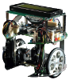

# c't-Bot

This repository contains the documentation belonging to the robotic project **c't-Bot** initiated in 2006 by the German c't magazine (www.heise.de/ct).

The official c't project website can be found [here](http://www.heise.de/ct/projekte/c-t-Bot-und-c-t-Sim-284119.html).

## Markdown [Documentation](WikiStart/WikiStart.md)

This documentation was exported from the former Trac, but keep in mind, that the converted markdown version available here is currently work in progress and still **incomplete, unchecked and partly deprecated!** Therefore the not yet revised files contain a marker at the beginning of the document.

