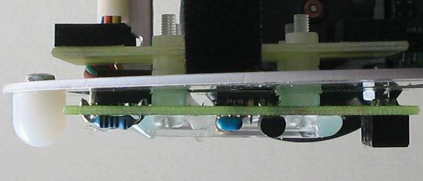
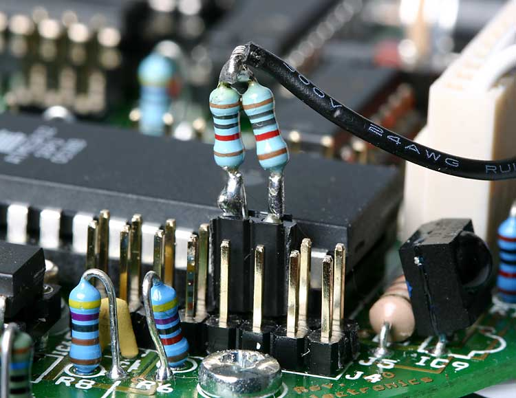
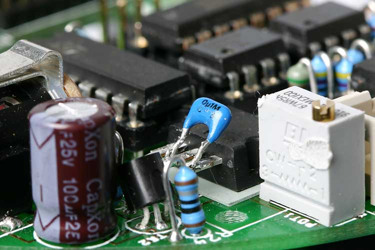
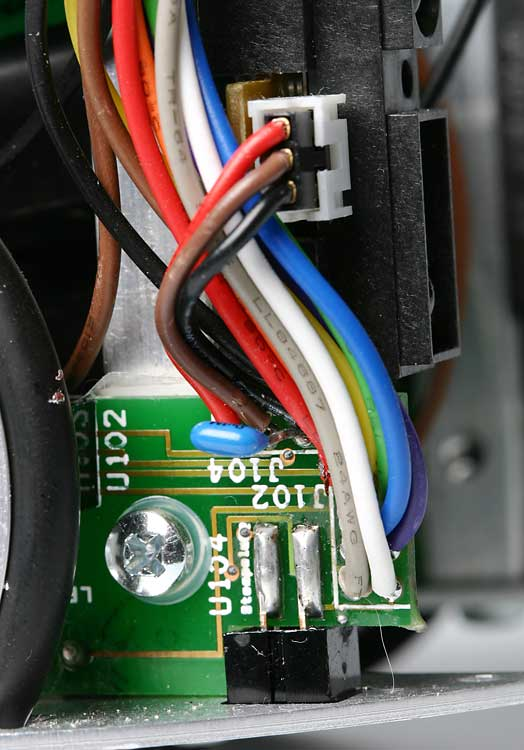
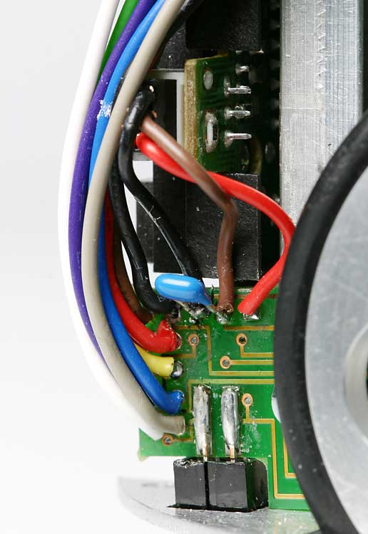
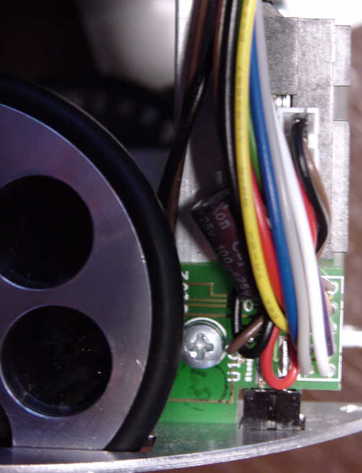
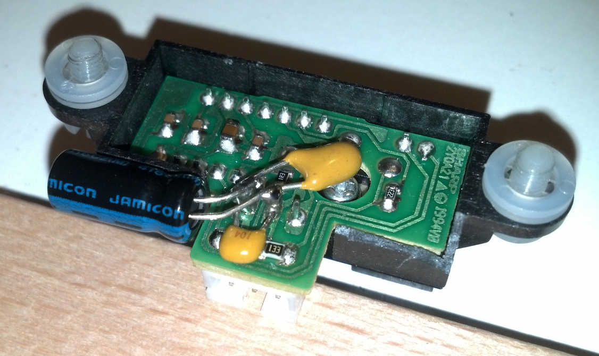
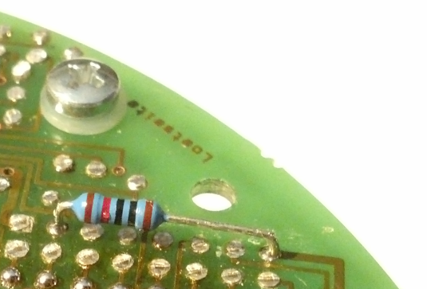

# Hardware-Modifikationen

>> **Trac-2-Markdown Konvertierung:** *unchecked*

Auf dieser Seite haben wir einige Hardware-Modifikationen für den c't-Bot gesammelt. Bitte lesen Sie die Beschreibung der Modifikationen aufmerksam durch, bevor Sie diese nachbauen. Nicht jede ist für alle Einsatzgebiete sinnvoll. Alle Erweiterungen hier sind Anregungen für Modifikationen. Sie sind nicht in den regulären Schaltplänen enthalten. Diese beziehen sich auf den Auslieferungszustand der Bots.

Wenn Sie selbst eine Hardware-Erweiterung oder -Modifikation haben, dann schicken Sie diese mit einem ausführlichen Kommentar an die Mailingliste.

## 1. Maussensor tiefer legen

|Datum: | 7.03.2006 / 10.06.2006 |
|---|---|
|Betrifft:| Maussensor|
|c't-Bot-Version:| Basisversion 1.0|
|Beschreibung:|Montiert man den Maussensor, wie in der Anleitung beschrieben, so hat der Bot zwar relativ viel Bodenfreiheit, die Genauigkeit des Sensors lässt jedoch zu wünschen übrig. Diese lässt sich durch Tieferlegen erhöhen.|
|Contra:| reduziert die Bodenfreiheit des c't-Bot|
|Durchführung:|Man zerlegt das Maus-Sandwich und entfernt die beiden kleinen Platinenstreifen. Die Linsenplatte klebt man mit vier winzigen (Heiß-)Klebepunkten an den Ecken direkt auf die Platine. Dabei unter keinen Umständen Kleber auf Sensor oder Linse bringen. Beim Wiederzusammenbau kommen zwischen Platine und Aluplatte vorne je eine Mutter sowie zwei Kunststoffunterlegscheiben und hinten nur je eine Mutter. Der Maussensor schwebt dann knapp über dem Boden und ist dazu parallel – jedoch nicht mehr zur Aluplatte. |
|Beispielfotos:| |

## 2. Motoren beim Reset anhalten

|Datum: | 7.03.2006 |
|---|---|
|Betrifft:|Motoren|
|c't-Bot-Version:|Basisversion 1.0|
|Beschreibung:|Nach und vor allem bei einem Reset schaltet der Prozessor alle Pins als Eingänge. Er treibt sie also nicht mehr gegen Masse oder Vcc. Im Falle der beiden PWM-Ausgänge interpretiert der Motortreiber das als logische 1 und lässt die Motoren drehen. Da sie um 180 Grad gedreht montiert sind, rotiert der Roboter. Zwei Pull-Down-Widerstände korrigieren dies.|
|Pro:|Roboter steht beim Programmieren still|
|Contra:|nichts bekannt|
|Durchführung:|Hinweis: die [Erweiterungsplatine](../ct-Bot-Erweiterung/ct-Bot-Erweiterung.md) enthält diesen Mod bereits. Falls keine Erweiterungsplatine verwendet wird besorgt man sich eine Buchsenleiste, die auf J5 passt, ein kurzes Stück Kabel und zwei Widerstände (z.B. 10 kOhm). Dann bastelt man sich einen "Stecker", der jeweils Pin 5 und Pin 6 von J5 mit Masse verbindet, z.B. zu finden auf J3 Pin3. Diese Pull-Downs halten dann während einem Reset die PWM-Pins PWM1A und PWM1B auf Low. Im Betrieb stören sie nicht nennenswert.|
|Beispielfotos:||

## 3. Spannungsversorgung stabilisieren

|Datum: | 7.03.2006 |
|---|---|
|Betrifft:|Stromversorgung|
|c't-Bot-Version:|Basisversion 1.0|
|Beschreibung:|Manche Leser haben von spontanen Resets berichtet. Sollten diese von Schwankungen auf der Versorgungsspannung kommen, so hilft ein zusätzlicher Pufferkondensator. |
|Pro:|Stabilisiert die Versorgungsspannung|
|Contra:|nichts bekannt|
|Durchführung:|Parallel zum Kondensator C5 lötet man einen weiteren mit 100 nF ein. Am einfachsten geht dies, wenn man ihn auf die Beinchen von IC10 lötet.|
|Beispielfotos:| |

## 4. Spannungsversorgung der Abstandssensoren stabilisieren

|Datum: | 10.05.2006 |
|---|---|
|Betrifft:|Abstandssensoren|
|c't-Bot-Version:|Basisversion 1.0|
|Beschreibung:|Die GP2D12-Sensoren schicken gepulstes IR-Licht aus. Jeder Puls beeinflusst die Versorgungsspannung ein wenig. Pufferkondensatoren fangen die Schwankungen ab. |
|Pro:|Stabilisiert die Sensorversorgungsspannung|
|Contra:|nichts bekannt|
|Durchführung:|Auf die rechte und linke Sensorplatine lötet man jeweils einen Kondensator mit 100 nF. Er kommt jeweils zwischen Pin 2 und Pin 3 von J103 und J104. Lötet man parallel zu den 100-nF-Kondensatoren jeweils noch einen Elektrolytkondensator mit 100 µF und einen Tantalelko mit 10 µF (Achtung Polung beachten, Minus liegt am mittleren Kabel) so  reduziert das die Störungen noch weiter. Außerdem sollten die Sensoren gegenüber dem Aluträger isoliert werden, z.B. mit Isolierband und Kunststoffschrauben.|
|Beispielfotos mit nur einem Kondensator:||
|Beispielfoto mit allen drei Kondensatoren direkt am linken Sensor:||

## 5. serielle Schnittstelle gegen Störungen sichern

|Datum: | 19.05.2006 |
|---|---|
|Betrifft:|serielle Schnittstelle|
|c't-Bot-Version:|Basisversion 1.0|
|Beschreibung:|Durch externe Störungen fängt sich die serielle Schnittstelle manchmal Zeichen ein, obwohl kein USB-2-Bot-Adapter angesteckt ist. Ein Pulldown Widerstand verhindert das.|
|Pro:|Es werden keine Zeichen empfangen, wenn die serielle Schnittstelle unbeschaltet ist.|
|Contra:|nichts bekannt|
|Durchführung:|Über einen großen Widerstand (mindestens 10 kOhm) verbindet man Pin2 von J4 mit Masse (z.B. Pin8 von J4). Wer diesen Widerstand nicht direkt auf der Platine einlöten will, kann ihn genauso wie Modifikation 2 einbauen.|
|Beispielfotos:||

