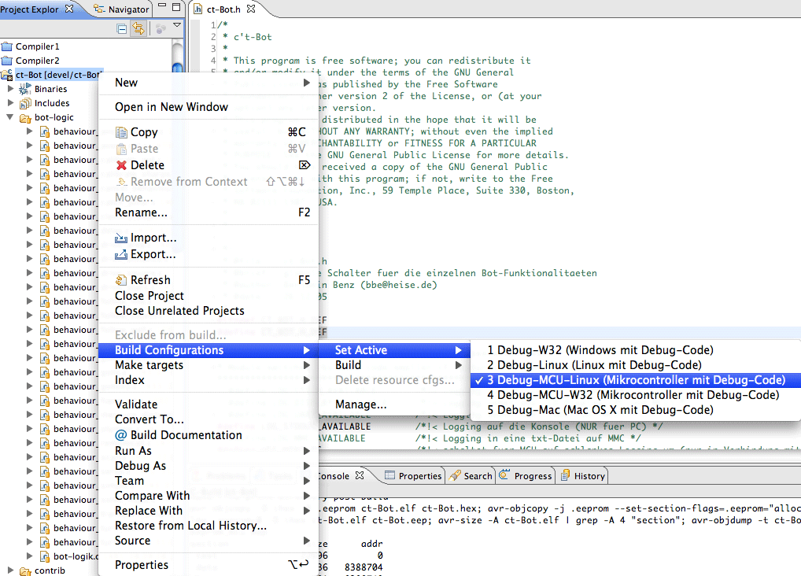

**Da der Maintainer nicht der Autor folgender Inhalte ist, welche bereits zuvor als freie Inhalte veröffentlicht worden sind, übernimmt er für diese keine Haftung und handelt gemäß der vorhandenen Lizenzbestimmungen (CC-BY-SA 4.0) für diese Inhalte nach bestem Wissen und Gewissen. Bei rechtlich bedenklichen Inhalten, die trotz Sichtung noch unentdeckt geblieben sind, bittet der Maintainer um eine kurze Benachrichtigung, damit diese umgehend entfernt werden können.**

# Toolchain und Build-System

>> **Trac-2-Markdown Konvertierung:** *unchecked*

## Firmware für den AVR-Mikrocontroller erzeugen

Damit die im Folgenden benötigten Dateien im Verzeichnis des Bot-Codes erstellt werden, stellt man in Eclipse die Zielplattform *MCU* ein:

Aktueller Code (ab Release 24):

* **Debug-MCU-m**[___1284p___|___644___|___644p___] (je nach Prozessortyp, der im Bot installiert ist, also ATmega*1284p*, ATmega*644*, oder ATmega*644p*).
  * Hinweis: Der Prozessor ATmega*32* wird seit Release 24 nicht mehr direkt unterstützt, hier bitte Release 23 benutzen.
* Die benötigten Dateien *ct-Bot.hex* und *ct-Bot.eep* befinden sich anschließend im Unterverzeichnis **Debug-MCU-m**X.

Älterer Code (bis einschließlich Release 20):

* Unter Windows ist **Debug-MCU-m**[___32___|___644___|___644p___|___1284p___]**-W32** die richtige Wahl, sonst (Linux und Mac OS X) wählt man **Debug-MCU-m**[___32___|___644___|___644p___|___1284p___]**-Linux** (je nach Prozessortyp, der im Bot installiert ist, also ATmega*32*, ATmega*644*, ATmega*644p* oder ATmega*1284p*).
* Die benötigten Dateien *ct-Bot.hex* und *ct-Bot.eep* befinden sich anschließend im Unterverzeichnis **Debug-MCU-m**X**-W32** bzw. **Debug-MCU-m**X**-Linux**.

Um schneller zwischen den Zielplattformen umschalten zu können, bietet es sich an, die Toolbar *Build Configuration* einzublenden (*Window* -> *Customize Perspective* -> *Commands* -> Haken bei *Build Configuration*), dann kann die Auswahl auch bequem über das Hammer-Symbol erfolgen.

## Interna der AVR-Toolchain

Hier gibt es ein paar weitergehende Informationen und Links zur Toolchain für die AVR-Softwareentwicklung. Diese sind für das Erstellen und Anpassen von Verhalten nicht unbedingt erforderlich, aber eventuell hilfreich zum tieferen Verständnis oder für Code-Optimierungen.

### Der Build-Prozess

*Welche der erstellten Dateien im c't-Bot-Verzeichnis ist eigentlich wofür und was ist damit zu tun?*

Compiler, Assembler und Linker (avr-gcc, avr-as, avr-ld) erstellen aus dem Quellcode zunächst eine `.elf-Datei`. Diese enthält erstens das Programm für den AVR-µController (*text* genannt) und zweitens alle Daten des Programms, also den Inhalt aller Variableninitialisierungen.

Die Daten unterteilen sich beim c't-Bot-Framework in drei Teile:

1. alle globalen und statischen Variablen, die mit Null initialisiert sind und nicht extra gespeichert werden - der entsprechende Inhalt wird vor dem Aufruf von main() einfach mit Nullen beschrieben - (*bss* genannt).
1. alle globalen und statischen Variablen, die mit anderen Werten initialisiert werden, hier steht in der elf-Datei für jede Variable der Anfangswert (dieser Abschnitt wird *data* genannt).
1. die Anfangswerte aller Variablen, die als EEPROM deklariert sind (hier *eeprom* genannt).

* *text* und *data* müssen in den **Flash-Speicher** des µControllers, daher kommen sie nach dem Build in die Datei `ct-Bot.hex`.
* *data* wird vor dem Programmstart vom Flash ins **RAM** kopiert, *bss* wird anschließend einfach mit Nullen beschrieben, liegt also zur Laufzeit genau wie *data* im **RAM**.
* *eeprom* beinhaltet die Anfangswerte für das **EEPROM** des µControllers. Dieses muss extra beschrieben werden, z.B. möchte man die dort gespeicherten Daten auch nach einem Programm-Update (im Flash-Speicher) noch erhalten haben. Um aber einmal die Anfangswerte für das EEPROM auf den µController bekommen zu können, wird nach dem Build-Prozess die Datei `ct-Bot.eep` erstellt, die eben diese Anfangswerte der Daten, die im EEPROM gespeichert werden, enthält. Diese überträgt man (einmalig) ebenfalls mit dem Programmer auf den Bot, siehe auch [Flash-Anleitung](../Flash/Flash.md).

Ein (vereinfachtes) Beispiel bezogen auf "normale" PC-Anwendungen:

In der .hex-Datei befindet sich das, was bei einer normalen Anwendung in der auszuführenden Datei steht also die Anwendung selbst ist. Gibt es beispielsweise ein Programm "Kalender", dann entspricht das der Datei "Calendar(.exe)", die aufgerufen wird, wenn das Programm gestartet wird.
Nun möchte man aber vielleicht alle Feiertage gleich mitgeliefert bekommen. Das sind Daten, die bei der Installation einmal geschrieben werden sollen, aber später bei einem Update nicht mehr (die bereits eingetragenen Termine sollen ja nicht überschrieben werden). Die Datei mit den Anfangsdaten (Feiertagen) entspricht dann der .eep-Datei beim c't-Bot.

*Anmerkung: Das Format der genannten Dateien ist unterschiedlich und passt im Beispiel nicht ganz, für den Zusammenhang und die Erklärung spielt das hier aber keine Rolle.*

### Der Compiler

    ToDo: Das Wichtigste aus den Links selbst zusammenfassen?

* [Übersicht](http://www.roboternetz.de/wissen/index.php/Avr-gcc) zum avr-gcc inkl. Kommandozeilen-Optionen
* [Interna](http://www.roboternetz.de/wissen/index.php/Avr-gcc/Interna) des avr-gcc inkl. ABI
* [Inline-Assembler](http://www.roboternetz.de/wissen/index.php/Inline-Assembler_in_avr-gcc) für avr-gcc

### Die avr-libc

    ToDo: Kurze Erklärung zur avr-libc

* [avr-libc-Handbuch](http://www.nongnu.org/avr-libc/user-manual/index.html)
