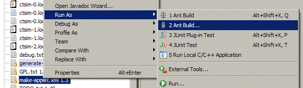
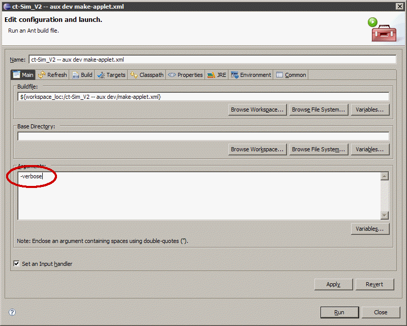

**Da der Maintainer nicht der Autor folgender Inhalte ist, welche bereits zuvor als freie Inhalte veröffentlicht worden sind, übernimmt er für diese keine Haftung und handelt gemäß der vorhandenen Lizenzbestimmungen (CC-BY-SA 4.0) für diese Inhalte nach bestem Wissen und Gewissen. Bei rechtlich bedenklichen Inhalten, die trotz Sichtung noch unentdeckt geblieben sind, bittet der Maintainer um eine kurze Benachrichtigung, damit diese umgehend entfernt werden können.**

# Ant Mini-Howto

*Ant* ist für Java, was *make* für C ist. Ants *Makefiles* sind XML-Dateien. Es ist im Lieferumfang von Eclipse enthalten und wird beim c't-Sim z.B. fürs Erzeugen der API-Doku genutzt. Man könnte sich auch in Eclipse durch die Dialoge klicken, aber das müsste man dann bei jedem Erzeugen machen (umbequem) und immer wieder drauf achten, dass die Parameter stimmen (fehleranfällig).

Näheres: [Ant-Handbuch: Tasks](http://ant.apache.org/manual/tasksoverview.html) (jeder Tag im XML ist ein Task, z.B. `<javac ...>` für Kram kompilieren)

Wenn Ant nicht so tut wie man sich's vorstellt (was ziemlich oft vorkommt), hilft der verbose-Schalter, das Problem einzukreisen. In Eclipse dazu die entsprechende Ant-Datei (z.B. make-applet.xml) rechts anklicken und "Run As / Ant Build..." wählen (wichtig: "Ant Build...", nicht "Ant Build"). Dann den Schalter reinschreiben.

