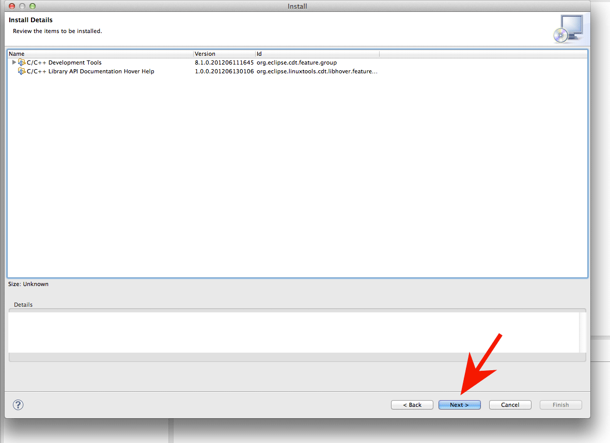
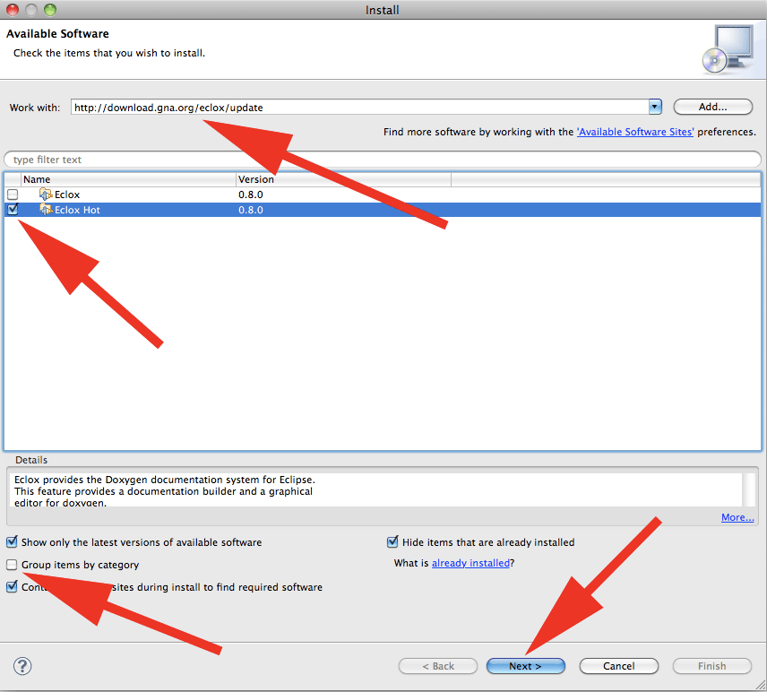

**Da der Maintainer nicht der Autor folgender Inhalte ist, welche bereits zuvor als freie Inhalte veröffentlicht worden sind, übernimmt er für diese keine Haftung und handelt gemäß der vorhandenen Lizenzbestimmungen (CC-BY-SA 4.0) für diese Inhalte nach bestem Wissen und Gewissen. Bei rechtlich bedenklichen Inhalten, die trotz Sichtung noch unentdeckt geblieben sind, bittet der Maintainer um eine kurze Benachrichtigung, damit diese umgehend entfernt werden können.**

# Eclipse-Installation

>> **Trac-2-Markdown Konvertierung:** *unchecked*

Die folgende Anleitung beschreibt die Installation von **Eclipse Neon (4.6)** inkl. aller nötigen **Plugins**.

**Bitte beachten**: Eclipse Neon (4.6) ist die aktuell empfohlene Version, andere Versionen wie z.B. Mars (4.5) oder Luna (4.4) funktionieren auch, 3.7 (Indigo), 3.6 (Helios) und 3.5 (Galileo) wurden ebenfalls getestet - eine noch ältere Version funktioniert hingegen nicht mehr einwandfrei.
Insbesondere zum Entwickeln des Bot-Steuercodes in C sollte man die neueste Eclipse Version verwenden, weil gerade das CDT Plugin erhebliche Verbesserungen erfahren hat mit den letzten Updates.

Auf die Schritte für *CDT* und *Eclox* kann man verzichten, falls man keinen Bot-Code in C entwickeln oder übersetzen möchte.

## Eclipse

**Was ist Eclipse?**
Für Experimente am Code des Simulators und des Bots bietet sich die Entwicklungsumgebung Eclipse an, da sie einerseits Java unterstützt für die Weiterentwicklung des c't-Sim und andererseits C für die Entwicklung des c't-Bot-Steuercodes. Eclipse selbst ist in Java geschrieben und ist für alle gängigen Rechnerplattformen verfügbar.
[Warum Eclipse und keine andere IDE?](https://www.heise.de/ct/artikel/FAQ-fuer-c-t-Bot-und-c-t-SIM-291940.html?seite=3)

**Zur Installation** lädt man __*Eclipse IDE for Java Developers*__ von [Eclipse Downloads](https://www.eclipse.org/downloads/) für seine Plattform herunter (diese Anleitung benutzt das __Java-Paket__ als Basis, CDT für den C-Support wird im Folgenden nachinstalliert) und entpackt das Archiv.
Eine weitere Installation entfällt, die ausführbare Datei eclipse(.exe) startet direkt die Entwicklungsumgebung auf Java-Basis. Eclipse legt ein Arbeitsverzeichnis namens *workspace* an, dessen Ort der Nutzer selbst bestimmen kann.

*Hinweis für Windows-Nutzer:* Beim Entpacken mit dem Windows-Explorer kann es Probleme geben, deshalb ist es sinnvoll, einen alternativen Entpacker wie z.B. 7-Zip zu verwenden.

## CDT

**Was ist das CDT?** Das Plugin CDT (C Development Toolkit) rüstet Eclipse um Unterstützung für Entwicklung in C auf, da Eclipse von Haus aus kein C spricht.
Die Installation nimmt man am besten über den in Eclipse integrierten Update-Mechanismus wie folgt vor:

**1.)**

**2.)** *--All Available Sites--* aus der List auswählen:

**3.)**

**4.)**

## GIT-Zugriff

Um den Code aus dem [GIT-Repository](https://github.com/tsandmann/ct-bot) direkt in Eclipse verwenden zu können, siehe [Import des Codes mit GIT](../GITUndEclipse/GITUndEclipse.md).

## Eclox (optional)

Als Frontend für Doxygen dient das Eclipse-Plugin Eclox, das ebenfalls über den o.a. Update-Mechanismus installiert wird:
**Update-Site: `http://download.gna.org/eclox/update`** (siehe Screenshots).

**1.)**

**2.)** Update-Site in das Eingabefeld kopieren und Enter, Option für Gruppierung ausschalten:

**3.)** und **4.)** wie oben.

Nach der Installation von Eclox muss man in Eclipse unter *Preferences* für *Doxygen/Compiler Path* den Pfad zum Programm *doxygen(.exe)* eintragen.
