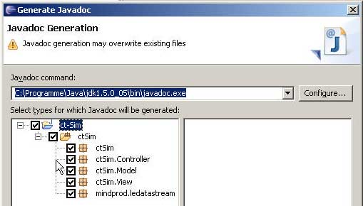
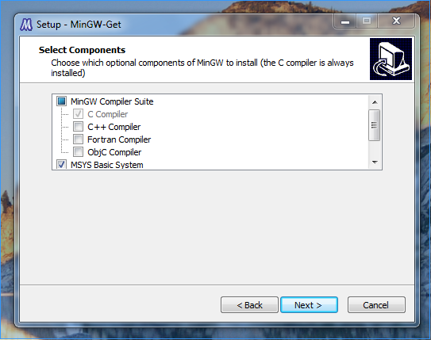

**Da der Maintainer nicht der Autor folgender Inhalte ist, welche bereits zuvor als freie Inhalte veröffentlicht worden sind, übernimmt er für diese keine Haftung und handelt gemäß der vorhandenen Lizenzbestimmungen (CC-BY-SA 4.0) für diese Inhalte nach bestem Wissen und Gewissen. Bei rechtlich bedenklichen Inhalten, die trotz Sichtung noch unentdeckt geblieben sind, bittet der Maintainer um eine kurze Benachrichtigung, damit diese umgehend entfernt werden können.**

# Installationsanleitung für den c't-Bot und den c't-Sim

>> **Trac-2-Markdown Konvertierung:** *unchecked*

> **Trac-2-Markdown Konvertierung:** *deprecated*

Diese Anleitung gilt nur für ältere Code-Versionen *vor* Release 23, für die aktuellen Versionen bitte die [neue Anleitung](../InstallationsanleitungR23/InstallationsanleitungR23.md) verwenden.

## Tipps und Fehlersuche

### Falsche Pfade (unter Windows)

Meckert der C-Compiler beim Übersetzen des Codes, so liegt das meist an fehlenden oder falschen PATH-Einträgen. Öffnen Sie unter Eclipse:

Window->Preferences->C/C++->Build->Environment

und bearbeiten Sie dort den Eintrag für `PATH`. Am besten enthält er nur Einträge für folgende Verzeichnisse (absolute Pfade (vor dem ersten Backslash) bitte selbst ergänzen):

```shell
\MinGW\bin
\MinGW\msys\1.0\bin
\Winavr\bin
```

## Vorgefertigte Entwicklungsumgebung (für Windows)

Windows-Anwender finden auf der Heft-DVD des c't Sonderhefts [c't Hardware Hacks](https://shop.heise.de/katalog/ct-hardware-hacks-1-2012) eine bereits **komplett eingerichtete Entwicklungsumgebung**, die nur noch in ein beliebiges Verzeichnis der Festplatte kopiert werden muss und anschließend durch Aufrufen der Datei *eclipse.bat* gestartet wird.
Eine manuelle Installation von Eclipse, MinGW, WinAVR usw. ist in diesem Fall nicht mehr erforderlich.

Tipp: Über den Menüpunkt *Help*->*Check for Updates* lässt sich die Eclipse-Installation inkl. aller Plugins aktuell halten.

### Ergänzende Hinweise: USB-Adapter

Bei der Verwendung des USB-Adapters in Zusammenhang mit der vorgefertigte Entwicklungsumgebung sind die folgenden Hinweise zu beachten.

#### Treiber

Steckt man den USB-2-Bot-Adapter zum ersten Mal an einen Windows-PC, so fragt Windows nach einem Treiber. Hier gibt man den [VCP-Treiber](http://ftdichip.com/Drivers/VCP.htm) an, der einen virtuellen COM-Port einrichtet.

#### Fehlerbehebung

Wer mit der Entwicklungsumgebung von der Sonderheft-DVD den USB-2-Bot-Adapter oder einen anderen seriellen Anschluss nutzen will, um c't-Bot und c't-Sim zu verbinden sollte folgendes beachten:

Leider liegt eine Datei nicht im richtigen Ordnern, sodass der Sim beim Start immer meldet: "serielle Schnittstelle konnte nicht geladen werden". Das lässt sich leicht korrigieren. Dazu kopiert man die Datei `rxtxSerial.dll` aus dem Ordner `ct-Bot\workspace\ct-Sim\contrib\rxtx\Windows\i368-mingw32` in den Ordner `ct-Bot\JavaSDK\jdk1.6.0_26\jre\bin`.

#### Konfiguration

Dann sollte der Sim automatisch eine Verbindung zu Bots aufbauen, die sich an COM3 anmelden und auf 115200 Baud eingestellt sind.

Wer seinen Bot an einem anderen Port oder mit einer anderen Geschwindigkeit betreibt, muss das in der Konfigurationsdatei ct-Sim.xml ändern.

**Achtung:**

Die Batch-Datei `startSim.bat` verwendet ein komprimiertes Archiv namens `D:\ct-Bot\Precompiled\ct-sim.jar`. In diesem Archiv steckt auch die Konfigurationsdatei. Diese kann man anpassen, indem man das Archiv von ct-sim.jar in ct-sim.zip umbenennt, dann mit dem Windows-Explorer öffnet und darin die Datei config\ct-sim.xml bearbeitet. Danach gibt man dem Archiv wieder die Endung .jar

Startet man den c't-Sim aus Eclipse heraus, dann kommt indes `ct-Bot\workspace\ct-Sim\config\ct-sim.xml` zum Zuge.

## Manuelle Installation der Toolchain (für Linux, Mac OS X und Windows)

### Überblick / Architektur <a name="ueberblick"></a>

Auf Software-Seite besteht der c't-Bot in erster Linie aus *Steuercode*, der von c't-Bot-Bastlern in C geschrieben wird. Dieser bekommt mittels des c't-Bot-Frameworks Daten von den Licht-, Abstands- und sonstigen Sensoren des Bot, und kann Befehle an die Motoren (oder andere
Aktuatoren) geben. Der Steuercode reprsentiert also das gesamte Verhalten eines Bots. Er lässt sich auf zwei Arten kompilieren:

* zur Ausführung auf der *realen* c't-Bot-Hardware
* oder zur Ausführung auf einem PC (Linux oder Windows) als *virtuellen c't-Bot*

Das letztere ist deshalb interessant, weil man den Steuercode dann an den *c't-Sim* anbinden kann. Dabei handelt es sich um ein in Java geschriebenes Open-Source-Programm, das unter Federführung der c't-Redaktion entwickelt wird. Es simuliert verschiedene Parcours und die Bots in ihnen, d.h. der c't-Sim berechnet, wie weit die Abstandssensoren des virtuellen Bots von den Parcourswänden entfernt sind, wie viel Licht auf seine Lichtsensoren fällt usw. Der an den c't-Sim angebundene virtuelle Bot bekommt diese Daten ständig per TCP/IP übermittelt und reagiert auf sie, als ob er auf realer Bot-Hardware liefe und Werte von tatsächlichen Sensoren erhielte. Wenn der virtuelle Bot z.B. Befehle an seine Motoren gibt, werden diese an den c't-Sim übermittelt und der virtuelle Bot im Parcours um die entsprechende Strecke weiterbewegt.

Außerdem besteht die Möglichkeit, mehrere virtuelle Bots gleichzeitig mit dem c't-Sim zu verbinden und im Parcours umherziehen zu lassen.

1. **In jedem Fall** umfasst die vorgeschlagene Entwicklungsumgebung für das Projekt:
    * **[#java JRE 5]** (oder neuer). **Hinweise:**
      * Wer den c't-Sim selbst als .jar-Datei exportieren will, installiert besser gleich das JDK und nicht das JRE.
    * **[EclipseInstallation Eclipse]** (detaillierte Anleitung zur Installation von Eclipse inkl. aller Plugins)
1. Je nach dem, was man tun möchte, ist **zusätzliche Software** nötig - siehe die folgende Übersicht.
1. Schließlich wird **der Quelltext** benötigt, der in dem in der Übersicht angegebenen SVN-Modul bereitsteht.

#### Bot-Steuercode entwickeln und auf *realer Bot-Hardware* ausführen

* Werkzeuge: siehe Anleitung [Installation der AVR-Toolchain](../AVRToolchain/AVRToolchain.md)
* SVN-Modul: **[source:devel/ct-Bot ct-Bot]**
* Eventuell relevant: [Einrichten des USB-2-Bot-Adapters](#USB-Adapter)

#### Bot-Steuercode entwickeln und als *virtueller Bot* im c't-Sim ausführen

[Wie startet man c't-Sim?](#sim-bot-starten)

* Werkzeuge unter Linux / Mac:
  1. [Java 3D](#java3d)
  1. [gcc (Linux)](#gcc-linux) / [gcc (Mac)](#gcc-mac)
* Werkzeuge unter Windows:
  1. [Java 3D](#java3d)
  1. [gcc (MinGW)](#gcc-win)

#### c't-Sim weiterentwickeln

* Werkzeuge:
  1. [JDK 5](#java) oder neuer
  1. Die 64-Bit-Version von Eclipse kommt Standardmäßig ohne ANT-Support (hilft beim Erstellen von ct-Sim.jar). Dieser versteckt sich im Paket *Eclipse Plug-in Development Environment*

#### c't-Sim-HTML-Dokumentation generieren

[Näheres dazu](#javadoc)

* Werkzeuge: javadoc aus dem [JDK](#java)

#### c't-Bot-HTML-Dokumentation generieren

* Werkzeuge: [Doxygen](#doxygen)

#### AVR-spezifischen C-Code debuggen

[Was heißt das?](../AVRToolchain/AVRToolchain.md#avr-gdb-optional)

* Werkzeuge unter Linux / Mac:
  1. [AVR-gdb](/AVRToolchain.md#avr-gdboptional)
  1. [Simulavr](/AVRToolchain.md#simulavroptional)
* Werkzeuge unter Windows: *Nicht von uns getestet, Hinweise willkommen*

Dem Programmiertool [Ponyprog](http://www.lancos.com/prog.html) zum Übertragen der .hex-Dateien in den Roboter haben wir hier keine eigene Sektion gewidmet, da die Installation keine Probleme bereiten sollte. Weitere Informationen finden sich auf der zugehörigen [Wikiseite](../Flash/Flash.md).

Manche Linux-Distributionen bringen von Haus aus bereits das eine oder andere Werkzeug mit; Windows-Nutzer müssen mit Downloads im Gesamtumfang von rund 200 MB rechnen oder können auf die Sonderheft-DVD zurückgreifen.

### Installation des JRE/JDK#java

Zur Ausführung der fürs c't-Bot-Projekt empfohlenen Entwicklungsumgebung Eclipse und des c't-Sim ist eine Java-Laufzeitumgebung (Java Runtime Environment, JRE) in der Version 5.0 oder höher erforderlich. Falls der Sim darüber hinaus auch weiterentwickelt werden soll, ist das Java Development Kit (JDK) 5.0 oder höher nötig. Das JDK enthält das JRE, sodass in jedem Fall nur eine Installation zu erledigen ist.

**Achtung:** Befinden sich mehrere Java-Umgebungen auf dem System (etwa weil man JDK und JRE installiert hat oder dem JDK erlaubt hat auch noch das "Public JRE" zu installieren) so kann es sein, dass Eclipse das "falsche" erwischt. Welches JRE zum Zuge kommt verrät Eclipse unter Windows/Preferences/Java/Installed JRE.

Bei Oracle sind sowohl [JRE als auch JDK erhältlich](http://www.oracle.com/technetwork/java/javase/downloads/index.html). Einige Linux-Distributionen zählen aus lizenzrechtlichen Gründen andere Java-Implementierungen zu ihrem Standard-Repertoire.

### Installation von Java3D

Für die Anzeige der virtuellen Welt benötigt der c't-Sim das Paket **[https://java3d.java.net/binary-builds.html Java3D]** ab Version *1.5.2*.

Java3D steht als Installer oder als Archiv verpackt im Netz. Im letzteren Fall extrahiert man den Inhalt in das Unterverzeichnis "jre" des Java-JDK-Verzeichnisses. Eventuell warnt hierbei der Rechner, im Zielverzeichnis seien die Verzeichnisse "bin" und "lib" bereits vorhanden - es besteht hierbei allerdings keine Gefahr, dass wichtige Dateien überschrieben werden.

Damit Elemente aus Java3D richtig angezeigt werden können, muss der Treiber der Grafikkarte den Standard **OpenGL 1.3** oder höher unterstützen.

**Evtl. erwischt der Installer die falsche JRE-Version oder findet deren Unterverzeichnisse nicht.** Dann muss man das Verzeichnis **Java3D** suchen und dessen Unterverzeichnisse "bin" und "lib" in das Verzeichnis der verwendeten JRE schieben.

#### Java3D unter Windows

Wer Probleme mit OpenGL hat (z.B. unter Windows Vista), kann unter Windows alternativ auch DirectX benutzen. Dazu stellt man in Eclipse folgendes ein:

1. Im Menü *!Window/Preferences* den Eintrag *!Java/Installed JREs* wählen.
1. Den angehakten Eintrag auswählen und mit *Edit* bearbeiten.
1. In die Zeile hinter *Default VM Arguments* den Parameter **-Dj3d.rend=d3d** eintragen.

#### Java3D unter Linux

Eine Anleitung zur Installation von Java3D unter Linux gibt es [hier](http://wiki.ubuntuusers.de/Java3D) für Ubuntu und [hier](https://gist.github.com/felipeborges/6207896#file-install-java3d-fedora-md) für Fedora.

#### Java3D unter Mac OS X

Für aktuelle Mac OS X Versionen braucht man Java 8, JOGL (getestet 2.3.2) und Java3D 1.6 (derzeit als Preview 12 verfügbar).

1. Java 8 JDK für Mac von [Oracle](http://www.oracle.com/technetwork/java/javase/downloads/index.html) herunterladen und installieren
1. JOGL 2.3.2 von [http://jogamp.org/deployment/v2.3.2/archive/jogamp-all-platforms.7z](http://jogamp.org/deployment/v2.3.2/archive/jogamp-all-platforms.7z) herunterladen
1. Aus dem JOGL-Archiv die Dateien *gluegen-rt-natives-macosx-universal.jar*, *gluegen-rt.jar*, *gluegen.jar*, *jogl-all-natives-macosx-universal.jar*, *jogl-all.jar* entpacken und nach `/Library/Java/Extensions/` kopieren
1. Java3D 1.6.0-pre12 von [https://jogamp.org/deployment/java3d/1.6.0-pre12/jogamp-java3d.7z](https://jogamp.org/deployment/java3d/1.6.0-pre12/jogamp-java3d.7z) herunterladen
1. Aus dem Java3D-Archiv alle .jar-Dateien entpacken und nach `/Library/Java/Extensions/` kopieren
1. In Eclipse Java 8 als JVM einstellen

Hinweis: Dalls der Sim nach dem Start anstatt der Welt nur einen schwarzen Bereich anzeigt, hilft ein wenig Ein- oder Auszoomen (--> Mausrad).

### Erzeugen der Dokumentation mit Javadoc

Der Quelltext des c't-Sim ist ausführlich dokumentiert. Aus den Kommentaren im Source kann man bequem durchsuchbare HTML-Seiten generieren. Für den Java-Code benutzt man dazu das Tool Javadoc, das zum Lieferumfang des JDK gehört. Unter dem Eclipse-Menüpunkt "Project/Generate Javadoc" trägt man bei "Javadoc command" den Pfad zum Programm javadoc(.exe) ein, das sich im Unterverzeichnis bin des JDK befindet. Die fertigen HTML-Seiten könenn in einen beliebigen Ordner geschrieben werden, voreingestellt ist das Unterverzeichnis "doc" des Java-Projekts ct-Sim.



[Zurück zum Überblick](#ueberblick)

### c't-Sim inkl. virtueller Bots starten

1. Gemäß [Überblick](#ueberblick) die nötige Software installieren und den betreffenden Quelltext auschecken
1. c't-Sim starten. Hierzu gibt es drei gleichwertige Möglichkeiten:
    * In Eclipse klickt man die Datei `ctSim/controller/Main.java` rechts an und wählt "Run As/Application". (Tipp: Nach dem ersten "Run" startet Strg-F11 die zuletzt ausgeführte Datei.)
    * Von der Kommandozeile aus wechselt man in das Verzeichnis, in dem Eclipse das ctSim-Projekt aufhebt (ein Unterverzeichnis des Eclipse-Workspace, den man bei der Eclipse-Installation angegeben hat). Dort: `java ctSim.controller.Main`
    * Zum möglichst bequemen Start in Zukunft kann man ein Jar-Archiv erzeugen ([Details siehe FAQ](http://www.heise.de/ct/artikel/Programmierung-c-t-Sim-406529.html#ps05)).
1. Falls nicht schon geschehen, c't-Bot compilieren *(ct-Bot-Projekt markieren und "!Project/Clean" wählen)*
1. c't-Bot starten:
    * In Eclipse: im ct-Bot-Projekt die Datei Debug-Linux/ct-Bot (Linux) bzw. Debug-W32\ct-Bot.exe doppelt anklicken
    * Auf der Kommandozeile: Wechsel in das Verzeichnis, in dem Eclipse das ct-Bot-Projekt aufhebt, und die genannte Datei ausführen

Hinweis: Die Datei ct-Bot.exe bzw. ct-Bot beendet sich zügig wieder, wenn sie keinen Simulator findet, der auf ihren Versuch einer TCP/IP-Verbindung antwortet. Daher ist die Reihenfolge "zuerst Sim, dann Bot" wichtig.

[Zurück zum Überblick](#ueberblick)

### Installation des gcc (Linux)

Der gcc gehört zur Grundausstattung jeder Linux-Distribution, wird aber nicht unbedingt bei jeder Installation auf dem System eingerichtet - gegebenenfalls muss über den Paketmanager der jeweiligen Distribution nachinstalliert werden. Außerdem müssen die glibc-Header installiert sein (Paket libc-dev).

[Zurück zum Überblick](#ueberblick)

### Installation des Compilers (Mac)

Der clang Compiler (statt gcc unter Linux) ist in den Developer Tools (XCode) enthalten, die man bei Apple herunterladen und dann installieren kann.

Alternativ ist es ab Mac OS X Version 10.7.3 auch möglich, nur die *Command Line Tools for Xcode* zu installieren, wenn man nicht das komplette Xcode-Paket installieren möchte.

[Downloads für Xcode bzw. Command Line Tools for Xcode](http://developer.apple.com/downloads)

[Zurück zum Überblick](#ueberblick)

### Installation des gcc inkl. Unix-Umgebung (Windows)

#### Einführung

Eine Windows-Version des C-Compilers gcc wird von dem kostenlosen Paket MinGW zur Verfügung gestellt. Erforderliche Zusatzwerkzeuge kommen im MinGW-Zusatzpaket MSYS. Unix-kompatibles Threading nach dem Posix-Standard wird von der Bibliothek Pthreads zur Verfügung gestellt. In der Summe kann mit dieser Umgebung derselbe in C geschriebene Bot-Steuercode, der unter Linux funktioniert, auch unter Windows kompiliert und ausgefürt werden.

#### Installation

1. [MinGW Installer](http://sourceforge.net/projects/mingw/files/Installer) (mingw-get-inst-[/Version.md](/Version.md).exe) herunterladen (getestete Version mingw-get-inst-20110530) und als Administrator ausführen. Bei der Paketauswahl einen Haken bei MSYS Basic System ergänzen:
  

2. Das "bin"-Verzeichnis von MinGW und MSYS zur Path-Variablen des Systems hinzuzufügen: Im Dialog "Systemsteuerung/System" (erreichbar über Windowstaste + Pause) unter "Erweitert" den Knopf "Umgebungsvariablen" drücken. Zur Variablen "Path" ist der Pfad zu MinGWs und MSYSs "bin"-Verzeichnis hinzufügen - standardmäßig also *;C:\MinGW\bin;C:\MinGW\msys\1.0\bin* (*;* wird als Trennzeichen benutzt).
3. Weitere Informationen zur MinGW-Installation findet man bei Bedarf [hier](http://www.mingw.org/wiki/Getting_Started).

[Zurück zum Überblick](#ueberblick)

### Installation von Doxygen#doxygen

Ähnlich wie es Javadoc für Java-Code tut, extrahiert das Programm [Doxygen](http://www.stack.nl/%7Edimitri/doxygen/download.html#latestsrc) Kommentare aus C-Quelltext. Unter Linux gehört dieses Tool zur Standardinstallation oder ist per Paketmanager installierbar; Windows-Nutzer können es per Installationsprogramm nachrüsten.

Ein ebenfalls nettes und nützliches Tool ist Graphviz (bei Linux ebenfalls meist installiert). Doxygen benutzt es, um Zusammenhänge im Code grafisch darzustellen. Unter Windows muss man es selbst [installieren](http://www.graphviz.org/Download..php).

[Zurück zum Überblick](#ueberblick)


#### USB und Java

Damit Java auf den Port zugreifen kann, haben wir die RXTX-Bibliothek in den c't-Sim-Quelltext aufgenommen:

Die Binaries für Windows, Linux und Mac OS X und Solaris stehen im Code-Archiv im Verzeichnis **[source:devel/ct-Sim/contrib/rxtx contrib/rxtx]** bereit. Sie müssen nur noch an den richtigen Ort:

##### Windows

Die Datei contrib\rxtx\Windows\i386-mingw32\rxtxSerial.dll kommt in das Verzeichnis JAVA_HOME\jre\bin.

##### Linux

Die Datei contrib\rxtx\Linux\i686-unknown-linux-gnu\librxtxSerial.so kommt in das Verzeichnis JAVA_HOME/jre/lib/i386. Des Weiteren muss der Benutzer, der später den Sim startet Mitglied in einer Gruppe sein (einstellbar über /etc/group), die Lockfiles schreiben darf (z.B. lock oder uucp).

##### Sonstige

Anleitungen für weitere Betriebssysteme finden sich in der Datei **[source:devel/ct-Sim/contrib/rxtx/INSTALL contrib/rxtx/INSTALL]**.

#### Port-Konfiguration

über welchen COM-Port und mit welcher Geschwindigkeit der Bot erreichbar ist, teilt man dem c't-Sim in der Datei config/ct-sim.xml mit. Für Windows (welchen Port man eintragen muss, verrät der Gerätemanager) sieht das wie folgt aus:

```xml
   parameter name="serialport" value="COM1"
   parameter name="serialportBaudrate" value="57600"
```

Für Linux sieht die Config-Datei ungefähr so aus:

```xml
   parameter name="serialport" value="/dev/ttyUSB0"
   parameter name="serialportBaudrate" value="57600"
```

[Zurück zum Überblick](#ueberblick)

### Download des Codes aus dem Repository

Diese Sektion der Installationsumleitung ist bereits in das [Howto umgezogen](../GITUndEclipse/GITUndEclipse.md).

[Zurück zum Überblick](#ueberblick)

### Alternative: Import des Codes aus Zip-Archiven

Wir empfehlen, den Code für c't-Bot und c't-Sim aus dem SVN zu benutzen -- dieser befindet sich stets auf dem neuesten Stand. Falls Sie nicht auf das SVN zugreifen können (etwa weil Ihr Rechner durch eine Firewall vom Internet abgeschottet ist, welche die notwendigen Ports geschlossen hält), können Sie auf den Code aus Zip-Archiven zurückgreifen. Solche Archive bringen wir allerdings nur bei umfangreicheren Änderungen auf den neuesten Stand, nicht für jedes kleine Bugfix, deshalb ist der Code im Zip-Archiv eventuell älter als jener im SVN.

Wenn Sie trotzdem auf das Zip-Archiv zugreifen wollen oder müssen, laden Sie es sich auf den eigenen Rechner und packen es aus. Nach dem Start von Eclipse kann unter dem Menüpunkt *File / Import* die Option *Existing Project into Workspace* ausgewählt werden. Als *root directory* muss dann der Ordner ct-Sim oder ct-Bot angeben werden.

[Zurück zum Überblick](#ueberblick)
