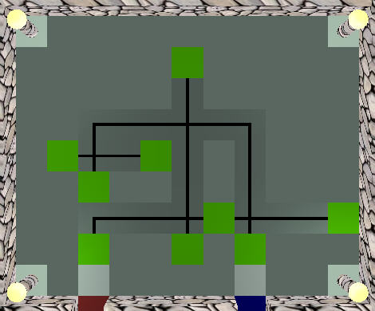
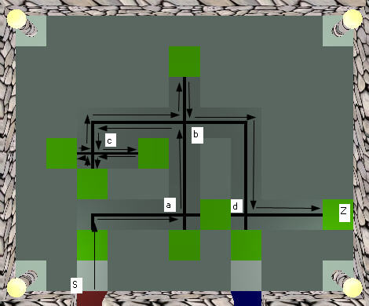
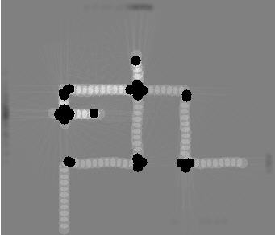
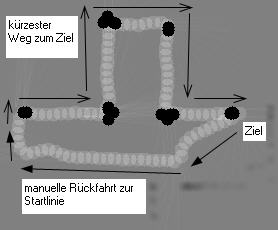
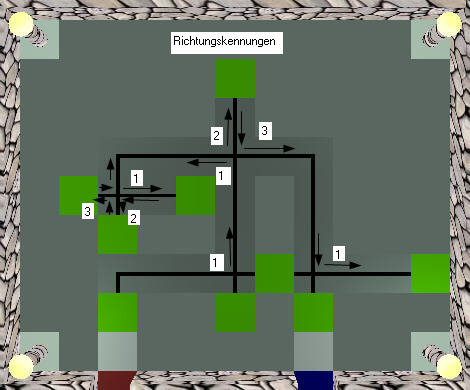

**Da der Maintainer nicht der Autor folgender Inhalte ist, welche bereits zuvor als freie Inhalte veröffentlicht worden sind, übernimmt er für diese keine Haftung und handelt gemäß der vorhandenen Lizenzbestimmungen (CC-BY-SA 4.0) für diese Inhalte nach bestem Wissen und Gewissen. Bei rechtlich bedenklichen Inhalten, die trotz Sichtung noch unentdeckt geblieben sind, bittet der Maintainer um eine kurze Benachrichtigung, damit diese umgehend entfernt werden können.**

# Verhalten bot_line_shortest_way

Autor: F. Menzel (Stand: 03.01.2009)

## Idee

Da der Bot schon relativ gut Linien abfahren kann, kam die Idee auf, den Bot auf seiner Linienfahrt auch Kreuzungen erkennen zu lassen. Mit Nutzung der Abgrundsensoren sollte dies doch möglich sein. Er sollte dann die Kreuzungen wieder erkennen können, um so an einer Kreuzung einen noch nicht befahrenen Abzweig zu nehmen. Irgendwann müßte er an einem Ziel ankommen und der vom Start zurückgelegte Weg sollte nun gespeichert sein. Aus diesen nun vorliegenden Kreuzungs-Wegeinformationen sollte es dem Bot möglich sein, direkt den kürzesten Weg vom Startpunkt zum Ziel zu nehmen.

## Voraussetzungen

Der Bot fährt immer mittels Linienfolger auf einer schwarzen Linie entlang. Eine Kreuzung ist immer als X-Kreuzung ausgeführt, d.h. die  Kreuzung hat genau vier mögliche Richtungen. Wie es sich gezeigt hat, ist die Erkennung einer T-Kreuzung nur mit erhöhtem Aufwand zu realisieren und evtl. später angedacht. Wenn eine Linie zu Ende ist, muss sich dort ein Umkehr-Feld mit festgelegter Farbe grün befinden. Als Ziel wird ein ebensolches Feld festgelegt, das sich aber direkt vor einer Wand befindet. An Hand des geringen Wandabstandes und der Farbe grün erfolgt die Zielerkennung. Diese Farbe ist im Simulator gut darstellbar, im Programm selbst kann diese für den echten Bot angepasst werden.  Weiterhin darf ein Abzweig einer Kreuzung nicht wieder auf einen bereits befahrenen Weg zurückführen, d.h. das Labyrinth muss zyklenfrei sein. Ebenfalls wird vorausgesetzt, dass sich kein Abgrund auf seinem Weg befindet, weil mit den Abgrundsensoren eine Kreuzung überhaupt erst erkannt wird. Weiterhin wird die Vorzugsrichtung an einer Kreuzung mit Links festgelegt, d.h. der Bot biegt immer nach links ab. Im Quelltext ist dieser Wert ebenfalls leicht auf rechts änderbar.

## Parcours (crossings_shortest_way.xml)

Der Linienparcours dient als Testlabyrinth zur Demonstration des Verhaltens. Vom Startpunkt des Bots muss das Ziel (rechtes grünes Feld) gefunden und sich der kürzeste Weg dorthin gemerkt werden.

  

## Erforschen des Labyrinths

Mittels der Pfeile wird der Fahrweg vom Startpunkt S zum Ziel Z gekennzeichnet:

  

Die folgende Karte zeigt genau den oben gekennzeichneten Fahrweg. Wenn der Bot mit den Abgrundsensoren über einen Abgrund - in diesem Fall die schwarze Linie - fährt, wird der Abgrund schwarz markiert, daher die schwarzen Stellen an den Wendepunkten und Kreuzungen:

  

## Abfahren des kürzesten Weges

Wenn der Bot an seinem Ziel angekommen ist, hat er sich den Weg dorthin gemerkt. Alle nicht relevanten Kreuzungen sind entfernt und zu den zielrelevanten Kreuzungen hat er sich die zu nehmenden Abzweigungen gemerkt. Wenn er wieder an den Ausgangspunkt gesetzt wird (manuelles Hinfahren oder Hinstellen), fährt er auf direktem Weg sein Ziel an. Folgende Karte zeigt genau diesen Weg des Bots auf kürzestem Weg zum Ziel:

  

## Display

  

```rst
========   ===========   ==========================================================================
  Taste     Funktion      Beschreibung
========   ===========   ==========================================================================
      5       GoLine      Start des Verhaltens: Der Bot fährt eine gewisse Strecke vorwärts über
                          das grüne Startwendefeld (Bedeutung für GoWayBack), bis er auf die Linie
                          kommt, ab dann übernimmt der integrierte Linienfolger.
      6     Continue      Falls der Bot mal von der Linie abkommt oder eine Kreuzung nicht erkennt,
                          kann der Bot richtig hingestellt/gedreht/gefahren und das Verhalten
                          weitergeführt werden.
      8     GoWayForw     Ist der Bot am Ziel angekommen und der Weg dorthin also im Stack
                          gespeichert, so kann der Bot an den Ausgangspunkt gestellt/gefahren und das
                          Ziel direkt angefahren werden. Der Stack ist danach leer.
      9     GoWayBack     Ist der Bot am Ziel angekommen und der Weg dorthin also im Stack
                          gespeichert, so kann der Weg rückwärts auf direktem Weg zum Ausgangspunkt
                          abgefahren werden, d.h. vom Start-Wendefeld zur ersten Kreuzung.
                          Der Stack ist danach leer.
========   ===========   ==========================================================================
```

## Kreuzungserkennung

Erkannt wird eine X-Kreuzung daran, dass sich beide Abgrundsensoren über der schwarzen Linie befinden und der Bot eigentlich einen Abgrund detektiert (Abgrundverhalten wurde beim Start aber ja ausgeschaltet). Durch die Richtungs-Ausgleichskorrekturen des integrierten Linienfolgers ist es aber nicht gegeben, das sich immer beide Abgrundsensoren gleichzeitig auf der Kreuzungslinie befinden. Durch Schräglage kann der Eine auch wieder darüber hinweg sein, ehe der andere die Linie erkennt. Programmintern werden deswegen zwei Variablen gesetzt, sobald der jeweilige Abgrundsensor eine Linie („Abgrund“) erkennt und wenn beide gesetzt sind, wird die Kreuzung erkannt.

## Umkehr- und Zielfelderkennung

Am Ende einer Linie muss sich ein Umkehrfeld befinden, damit programmintern eine Variable zur Erkennung des Linienendes und der Richtungsumkehr gesetzt werden kann. Das Umkehrfeld ist per default auf grün gesetzt, weil diese Farbe gut im Simulator verwendet und dargestellt werden kann. Gibt es direkt hinter einem solchen Feld eine Wand, so erkennt der Bot daran das Zielfeld und das Verhalten wird beendet. Der gefahrene Weg entlang der Linie und die richtigen Abzweigungen stehen gespeichert im Stack zur Verfügung.

## Linienfolger

Der Bot fährt solange auf der schwarzen Linie entlang, bis eine Kreuzung oder ein Umkehr- bzw. Zielfeld erkannt wurde. Er befindet sich auf der Linie und fährt geradeaus, wenn entweder der linke oder beide Liniensensoren sich darauf befinden. Erkennen weder der linke noch der rechte Liniensensor die Linie, dann wird gewisse Zeit nach links gedreht, im anderen Fall nach rechts.

## Datenspeicherung

Auf dem Weg zum Ziel vermerkt der Bot die jeweiligen Kreuzungen und die eingeschlagenen Richtungen auf dem Stack. Es wird hierfür der Positionsstack zur Speicherung von XY-Koordinaten mit denselben Routinen verwendet. Jedoch werden keine absoluten Koordinaten verwendet, sondern jedes im Stack stehende Element stellt hier eine Kreuzung dar. Die eigentliche X-Koordinate speichert den erkannten Kreuzungstyp für mögliche spätere Erweiterungen zur Erkennung der T-Kreuzung und die Y-Koordinate den Wert der zuletzt eingeschlagenen Richtung. Da die Vorzugsrichtung mit links definiert ist, wird der Wert hochgezählt um die Richtung eindeutig zu erkennen (1: links, 2: geradeaus, 3: rechts). Bei Änderung der Vorzugsrichtung ändern sich auch die Bedeutungen, was programmintern auch berücksichtigt wird.
Die angetroffenen Kreuzungen werden also zuerst im Stack eingefügt mit dem Wert 1 und die linke Richtung weiterverfolgt. Nach einem erkannten Umkehrfeld kann die nächstliegende Kreuzung nur die zuletzt gespeicherte Kreuzung sein und es wird diese vom Stack genommen. Die Richtungsinfo wird um 1 erhöht, wieder in den Stack gespeichert und diese Richtung verfolgt. Hat der Bot alle drei möglichen Richtungen verfolgt ohne das Ziel gefunden zu haben, so wird die Kreuzung nicht wieder auf dem Stack gespeichert, da sie zur Zielfindung irrelevant ist. Am Ziel angekommen, befindet sich somit im Stack der kürzeste Weg zum Ziel. Das folgende Bild verdeutlicht diesen Zusammenhang noch einmal grafisch:

  

## Ideen für Erweiterungen

Leider ist zum momentanen Zeitpunkt die [Bot-2-Bot-Kommunikation](../DokuBot2Bot/DokuBot2Bot.md) noch nicht zum Aufruf von Verhalten oder zur Datenübertragung zu anderen Bots verwendbar. Denkbar wäre nämlich die Übertragung des kürzesten Weges, also des Stacks, zu einem anderen Bot. Dieser steht am Ausgangspunkt des ersten Bots und fährt nun direkt auf dem Linienlabyrinth zum Ziel.
Im Moment ist nur die Erkennung einer X-Kreuzung implementiert, da dann aus jeder Richtung kommend immer beide Abgrundsensoren zuschlagen. Bei einer T-Kreuzung ist dies nicht gegeben und zur sicheren Erkennung einer solchen Kreuzung daher Einiges mehr zu berücksichtigen. Vielleicht wird dies ja später Beachtung finden… ;-)
