**Da der Maintainer nicht der Autor folgender Inhalte ist, welche dem Projekt ohne Lizenzbestimmungen zur Nutzung überlassen wurden, übernimmt er für diese keine Haftung und handelt nach bestem Wissen und Gewissen. Dieser Artikel ist bis auf Weiteres explizit von den CC-BY-SA Lizenzbestimmungen ausgenommen. Bei rechtlich bedenklichen Inhalten, die trotz Sichtung noch unentdeckt geblieben sind, bittet der Maintainer um eine kurze Benachrichtigung, damit diese umgehend entfernt werden können.**

# Pfadplanungs-Verhalten behaviour_pathplaning

## Algorithmus

Das Verhalten wurde realisiert nach dem Prinzip der Wellenausbreitung (wave-front):

* Man legt ein Grid *GW* über die Karte. Jede Zelle aus *GW* hat vier *Nachbarn*. *GW* wird komplett mit Nullen initialisiert.
* Alle *Zellen* aus *GW*, die eine Position schneiden in der eine Kollision mit einem bekannten Hindernis auftritt, werden mit *1* markiert. Jetzt bleibt noch eine Untermenge *GW_empty* aller Null-Zellen von *GW* übrig.
* Die Zelle aus *GW_empty*, in der das Ziel liegt, wird mit *2* markiert.
* Ausgehend von der Zielzelle werde alle Nachbarn in *GW_empty* mit *3* markiert. Alle Nachbarn dieser *3*-Zellen, die noch *0* enthalten, werden mit *4* markiert usw. bis die Zelle, in der der Startpunkt liegt, markiert wurde. *GW_empty* beschreibt nun ein Potentialfeld und in jeder Zelle von *GW_empty* steht die minimale Distanz zum Ziel.
* Ausgehend vom Startpunkt sucht der Planer nun jeweils die Zelle mit der nächst kleineren Entfernung, bis er am Ziel angekommen ist (--> Gradientenabstieg).

  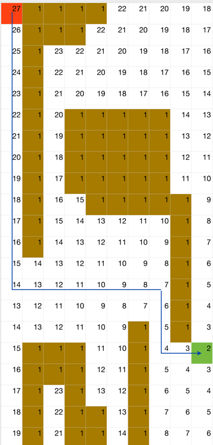

**Pro:**

* Das Verfahren kann nicht in lokalen Minima hängenbleiben, das einzige lokale Minimum ist das Ziel.
* Sehr einfache Berechnung.
* Wenn es zur gegebenen Grid-Auflösung eine Lösung (einen Pfad zum Ziel) gibt, wird diese auch gefunden.

**Contra:**

* Aufwand (Zeit und Speicher) abhängig von der Grid-Auflösung. Denkbar wäre aber auch, zunächst eine gröbere Auflösung zu probieren. Wird hierbei keine Lösung gefunden, lässt sich die Auflösung schrittweise verfeinern (verbunden mit höherem Aufwand). Der Speicherbedarf ist relativ egal, wenn man eine MMC hat (die für die Karte sowieso gebraucht wird).
* Der Konfigurationsraum muss soweit bekannt sein, dass er auch den Pfad zum Ziel umfasst. Alternativ könnte man noch unbekannte Kartenregionen als Hindernisse markieren. Der Algorithmus findet dann nur Wege, die der Bot schon einmal benutzt hat.
* In der o.a. simplen Form fährt der Bot u.U. sehr dicht an Hindernissen vorbei - hier gibt es aber noch Erweiterungen für den Algorithmus.

Wer sich für die Details interessiert, dieser Algorithmus (und auch noch einige Erweiterungen) ist in *J. Barraquand, B. Langlois and J. C. Latombe, "Numerical potential field techniques for robot path planning"* beschrieben.

## Implementierung

Es wurde eine niedrigauflösende Karte im RAM des Bots implementiert mit je 8 Rastern pro Meter, also ca. 12 cm Kantenbreite.

Das Verhalten führt nun mehrere Schritte aus:

Step 1: Vorbereitende Maßnahmen, wie Löschen der Lowres-Planungskarte und des Positionsspeichers.

Step 2: Übertragen der Hindernisse aus der hochauflösenden Karte in die Rasterfelder der Planungskarte; rasterfeldweise wird in der hochauflösenden Karte der Durchschnittswert ermittelt und bei Hinderniswahrscheinlichkeit < 0 das Rasterfeld mit 1 (Hindernis) gekennzeichnet; weiterhin wird die zu erreichende Zielposition (Zielraster) mit dem Wert 2 belegt.

Step 3: Ausgehend von der Zielposition wird nun eine Welle losgeschickt, um die jeweiligen (noch initialen)  Nachbar-Rasterfelder mit dem jeweils höheren Wellenwert zu kennzeichnen, d.h. die 4 Nachbarfelder vom Zielpunkt 2 erhalten den Wert 3, alle Nachbarn der 3 die 4 usw. Dies geschieht solange, bis das Rasterfeld der Botposition erreicht wurde.

Step 4: Wenn die Welle die Botposition erreicht hat, wird diese zurückverfolgt bis zum Wellen-Ursprungspunkt (Zielraster 2) und sich hierbei die einzelnen Rasterkoordinaten auf dem Positionsspeicher gemerkt. D.h. ausgehend vom Raster der Botposition wird der Nachbar mit dem kleinsten Wert (und ungleich Hindernis  1) bestimmt und dann wieder von diesem ausgehend usw.

Die Planungskarte hat dann folgendes Aussehen:

  

## Screen der Pfadplanung

  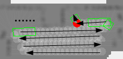

Taste 4: Löschen der Planungskarte (macht das Verhalten aber auch selbst).

Taste 5: Start der Pfadplanung mit Abfahren des Pfadweges zum Zielpunkt.

Taste 8: Festlegen der aktuellen Botposition als später anzufahrenden Zielpunkt.

## Pfadplanung in verschiedenen Parcours

In den folgenden Beispielparcous sind die einzelnen Pfadpunkte des geplanten Weges als weiße Punkte gekennzeichnet.

### Ausschnitt aus testparcours2.xml

Der Bot wurde manuell hochgefahren bis zum Zielpunkt, dort gedreht zum Eintragen der Hindernisse, dann die Botposition als anzufahrendes Ziel markiert mittels Taste 6 und weiter den linken Weg hochgefahren bis zur Position laut 1. Bild. Nach Start der Pfadplanung fährt der Bot zum Endziel und plant seinen Weg um die Lampe herum (markierter Weg). Am Ende steht er an seinem festgelegten Zielpunkt.

  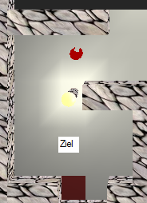 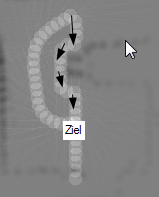 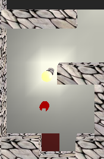

### testbots_home.xml

  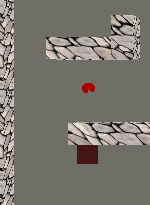 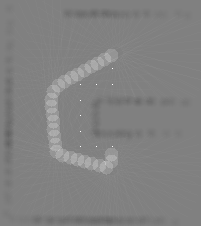

### selbst erstellter Testparcours

  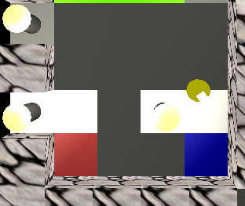 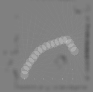

### Testparcours mit Abgrund

  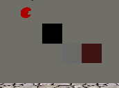 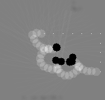
