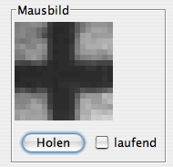
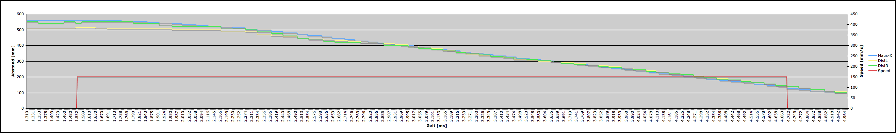

**Da der Maintainer nicht der Autor folgender Inhalte ist, welche bereits zuvor als freie Inhalte veröffentlicht worden sind, übernimmt er für diese keine Haftung und handelt gemäß der vorhandenen Lizenzbestimmungen (CC-BY-SA 4.0) für diese Inhalte nach bestem Wissen und Gewissen. Bei rechtlich bedenklichen Inhalten, die trotz Sichtung noch unentdeckt geblieben sind, bittet der Maintainer um eine kurze Benachrichtigung, damit diese umgehend entfernt werden können.**

# Sensoren

>> **Trac-2-Markdown Konvertierung:** *unchecked*

Die Sensoren des Bots werden in [mcu/sensor-low.c](https://github.com/tsandmann/ct-bot/blob/master/mcu/sensor-low.c) ausgewertet und ihre Daten in globalen Variablen gespeichert. Für einige Sensoren gibt es eine Weiterverarbeitung der Daten auf höherer Ebene, sie erfolgt in [sensor.c](https://github.com/tsandmann/ct-bot/blob/master/sensor.c). Im Falle eines simulierten Bots bekommt dieser die Sensordaten vom ct-Sim und der sensol-low-Part entfällt. Zu den Linien-, Helligkeits- und Abgrundsensoren gibt es noch nicht viel Dokumentation.

## Distanzsensoren

Die Distanzsensoren werden alle 50 ms (denn öfter liefern sie keine neuen Messwerte) per ADC ausgewertet. Aus den letzten Messwerten berechnet [sensor.c](https://github.com/tsandmann/ct-bot/blob/master/sensor.c#L165) (`sensor_dist_lookup()`) dann die aktuelle Entfernung in mm, nachdem die Sensor-Rohwerte mit einem Tiefpassfilter geglättet wurden. Die Umrechnung in die Entfernung erfolgt mit Hilfe von 15 Stützwerten aus dem EEPROM. Die in [sensor.c](https://github.com/tsandmann/ct-bot/blob/master/sensor.c#L149) zu findende Funktion `lin_interpolate()` ermittelt dabei aus zwei Stützwerten und dem aktuellen Sensor-Rohwert die exakte Entfernung durch lineare Interpolation.

### Kalibrierung der Distanzsensoren

Kalibrieren lassen sich die Sensoren halbautomatisch mit dem Verhalten [include/bot-logic/behaviour_calibrate_sharps.h](https://github.com/tsandmann/ct-bot/blob/master/include/bot-logic/behaviour_calibrate_sharps.h), das die erforderlichen Stützwerte dann anschließend auch ins EEPROM schreibt (vgl. die [Übersicht aller verfügbaren Verhalten für den ct-Bot](../Verhalten/Verhalten.md)). Zwecks Kalibrierung bspw. den Bot auf eine ebenen braunen Karton mit der angezeigten Entfernung schauen lassen, Taste zur Kalibrierung drücken, Bot auf die nächste Entfernung einstellen, Kaliberiungstaste erneut drücken usw. (wichtiger Hinweis: Lampen, die IR-Licht abstrahlen (bspw. Ernergiespar- und Halogen-Lampen) können die Ergebnisse störend beeinflussen - bevor also ein Hardware-Defekt vermutet wird unbedingt unter verschiedenen Lichtverhältnissen (Tages- statt Kunstlicht) ausprobieren).
Die Stützwerte und die minimale sowie maximale Entfernung lassen sich bei Bedarf in [include/sensor_correction.h](https://github.com/tsandmann/ct-bot/blob/master/include/sensor_correction.h) einstellen.

Vorgehensweise Schritt für Schritt:

1. Unter [include/bot-logic/available_behaviours.h](https://github.com/tsandmann/ct-bot/blob/master/include/bot-logic/available_behaviours.h) `BEHAVIOUR_CALIBRATE_SHARPS_AVAILABLE` einschalten.
2. Code neu übersetzen lassen und auf den Bot übertragen (für manche Fernbedienungen, die die Taste `RC5_CODE_MUTE` nicht haben, muss man stattdessen jeweils die Taste `RC5_CODE_OK` verwenden, vgl. [include/rc5-codes.h](https://github.com/tsandmann/ct-bot/blob/master/include/rc5-codes.h).
3. Fernbedienungstaste **6** drücken.
4. Den Anweisungen auf dem Display folgen (Fernbedienungstaste **Mute**).

Nachdem die Kalibierung abgeschlossen wurde, befinden sich die Werte im EEPROM und bleiben dort erhalten, solange das EEPROM nicht neu geflasht wird.

Für den Fall, dass das EEPROM einmal neu auf den ATMEGA geflasht werden muss, lässt man sich das Ergebnis der vorgenommenen Kalibrierung per LOG über den USB-2-Bot-Adapter (mittels Terminal-Programm oder ct-Sim Debug-Ausgabe) ausgeben und trägt es in [include/sensor_correction.h](https://github.com/tsandmann/ct-bot/blob/master/include/sensor_correction.h) ein. Dann erzeugt der Build-Vorgang neben der Datei `ct-Bot.hex` auch eine Datei `ct-Bot.eep`, die die Sensorkalibrierung bereits enthält. Diese lässt sich per Programmer ins EEPROM schreiben. Letzteres ist nötig, wenn eine der im EEPROM liegenden Variablen geändert wurde oder weitere solcher Variablen hinzugekommen sind (siehe auch [Übertragen von Firmware in den AVR-Mikrocontroller](../Flash/Flash.md)).
Die Datenablage im EEPROM wird nicht nur für die Distanzsensoren, sondern z.B. auch für das Verhalten [include/bot-logic/behaviour_turn.h](https://github.com/tsandmann/ct-bot/blob/master/include/bot-logic/behaviour_turn.h) und die Motorregelung genutzt.

## Liniensensoren

Die Liniensensoren werden bei jedem Aufruf von [mcu/sensor-low.c](https://github.com/tsandmann/ct-bot/blob/master/mcu/sensor-low.c#L198) (`bot_sens()`) ausgewertet und ihre Werte direkt in `sensLineL` und `sensLineR` gespeichert (Wertebereich von 0 bis 1023). Je dunkler die Linie ist, desto größer ist der gelieferte Sensorwert.

### Kalibrierung der Liniensensoren

1. Zur Kalibrierung der Liniensensoren stellt man den Bot zunächst auf die Fläche, auf der er normalerweise fahren soll (also keine Linie) und notiert sich die Werte der Liniensensoren aus dem Sensor-Display (L=...).
2. Nun stellt man den Bot auf eine Linie und notiert sich ebenfalls die angezeigten Werte der Liniensensoren.
3. Aus den beiden Messungen für Linie und keine Linie ermittelt man nun einen Wert, der größer als der für normale Flächen und kleiner als der für eine Linie ist, und benutzt diesen als Schwellwert zur Linienerkennung.
4. Dazu passt man unter [include/bot-local.h](https://github.com/tsandmann/ct-bot/blob/master/include/bot-local.h) den unter 3. ermittelten Wert für `LINE_SENSE` an.

## Abgrundsensoren

Die Abgrundsensoren werden bei jedem Aufruf von [`bot_sens()`](https://github.com/tsandmann/ct-bot/blob/master/mcu/sensor-low.c#L198) ausgewertet und ihre Werte direkt in sensBorderL und sensBorderR gespeichert (Wertebereich von 0 bis 1023). Je dunkler die Fläche ist, desto größer ist der gelieferte Sensorwert.

### Kalibrierung der Abgrundsensoren

1. Zur Kalibrierung der Abgrundsensoren stellt man den Bot zunächst auf die Fläche, auf der er normalerweise fahren soll (also kein Abgrund) und notiert sich die Werte der Abgrundsensoren aus dem Sensor-Display (B=...).
1. Nun hält man den Bot über einen Abgrund oder stellt ihn auf eine Fläche, die als Abgrund erkannt werden soll und notiert sich ebenfalls die angezeigten Werte der Abgrundsensoren.
1. Aus den beiden Messungen für Abgrund und kein Abgrund ermittelt man nun einen Wert, der größer als der für normale Flächen und kleiner als der für einen Abgrund ist, und benutzt diesen als Schwellwert zur Abgrunderkennung.
1. Dazu passt man `BORDER_DANGEROUS` in [include/bot-local.h](https://github.com/tsandmann/ct-bot/blob/master/include/bot-local.h) an.

## Helligkeitssensoren

Die Helligkeitssensoren werden bei jedem Aufruf von [`bot_sens()`](https://github.com/tsandmann/ct-bot/blob/master/mcu/sensor-low.c#L198) ausgewertet und ihre Werte direkt in sensLDRL und sensLDRR gespeichert (Wertebereich von 0 bis 1023).

## Maussensor

Der Maussensor wird bei jedem Aufruf von [`bot_sens()`](https://github.com/tsandmann/ct-bot/blob/master/mcu/sensor-low.c#L198) ausgewertet und dX und dY in sensMouseDX und sensMouseDY gespeichert.
Die Daten werden in [`sensor_update()`](https://github.com/tsandmann/ct-bot/blob/master/sensor.c) weiter verarbeitet, siehe Odometrie-Auswertung.

Für die maximale Genauigkeit des Maussensors, sollte man ihn [tiefer legen](../ct-Bot-Modifikationen/ct-Bot-Modifikationen.md).

Zum optimalen Justieren des Maussensors hilft das "Mausbild" aus dem Sim oder Sim-Applet sehr, bei mir sieht das dort so aus:
  

Am besten druckt man dazu ein Kreuz mit möglichst feinen Linien aus, als Vorlage kann man z.B. diese Grafik verwenden:
  

## Digitale Sensoren

Die digitalen Sensoren werden bei jedem Aufruf von [`bot_sens()`](https://github.com/tsandmann/ct-bot/blob/master/mcu/sensor-low.c#L198) ausgewertet. Die Werte von Transportfachklappe, Transportfach belegt und Stromversorgung okay werden direk in sensDoor, sensTrans und sensError gespeichert. sensError == 1 bedeutet kein Fehler.

## Radencoder

Die Radencoder werden in [`bot_encoder_isr()`](https://github.com/tsandmann/ct-bot/blob/master/mcu/sensor-low.c#L416) ausgewertet, der Aufruf erfolgt im Gegensatz zu allen anderen Sensoren timergesteuert, damit die Encoderflanken rechtzeitig registriert werden können. Neben dem Zählen der Encoderstände werden für die Motorregelung Zeitstempel der Flanken gespeichert, die eine genauere Berechnung der Ist-Geschwindigkeit ermöglichen (siehe **[Motorregelung](../ct-Bot-Software-Aktuatoren/ct-Bot-Software-Aktuatoren.md#MotorenMotorregelung)**). Das Kapitel **[Kalibrieren der Radencoder](../ct-Bot-Software-Aktuatoren/ct-Bot-Software-Aktuatoren.md#Kalibrieren-der-Radencoder)** findet man bei der Beschreibung der **[Motorregelung](../ct-Bot-Software-Aktuatoren/ct-Bot-Software-Aktuatoren.md#MotorenMotorregelung)**.

### Odometrie-Auswertung

Die Daten von Radencodern und Maussensor werden in einer Reihe von Berechnungen für Position, Richtung und Geschwindigkeit des Bots verwendet ([`sensor_update()`](https://github.com/tsandmann/ct-bot/blob/master/sensor.c)). Näheres dazu ist im c't-Artikel ausführlich beschrieben.

## Analog-Digital-Wandlung

Die Umwandlung der Spannungswerte der analogen Sensoren in digitale Werte erfolgt mit dem ADC des ATMegas. In [`bot_sens()`](https://github.com/tsandmann/ct-bot/blob/master/mcu/sensor-low.c#L198) werden gleich zu Beginn die ADC-Umwandlungen angestoßen, während diese ablaufen, werden die digitalen Sensoren ausgewertet, anschließend erst der linke und dann der rechte Distanzsensor, so dass möglichst viel Zeit nicht mit Warten auf den ADC sondern mit sinnvollen Berechnungen verbracht wird.

## Analyse des Maussensors und der Distanzsensoren

Der folgende Test zeigt, wie es aussieht, wenn alle Kalibrierungen gut geklappt haben. Er dient eher der Information, man muss ihn nicht selbst machen.

Ein kleiner Test, der zeigen soll, ob die Auswertung von Maus- und Distanzsensor übereinstimmt. Der Bot ist einfach eine kurze Strecke auf eine Wand zugefahren, dabei wurde x_pos vom Maussensor und die von den Sharps gemessenen Entfernungen aufgezeichnet. Damit man es besser vergleichen kann, wurde x_pos anschließen von der Startdistanz zur Wand abgezogen. (Hinweis: Die Zeitachse ist nicht ganz linear und die Distanzsensoren sind in zwei Bereichen nicht optimal kalibriert)

  

Zur Auswertung wurde bot_base_behaviour() wie folgt erweitert:

```C
void bot_base_behaviour(Behaviour_t* data) {
  speedWishLeft = target_speed_l;
  speedWishRight = target_speed_r;
  LOG_DEBUG("\tMaus:\t%d\tSpeed:\t%d", (int16_t) x_pos, target_speed_r);
  LOG_DEBUG("\tDistL:\t%u\tDistR:\t%u", sensDistL, sensDistR);
  LOG_DEBUG("\tTime:\t%lu", TIMER_GET_TICKCOUNT_32);
}
```

Der Maussensor ist [tiefer gelegt](../ct-Bot-Modifikationen/ct-Bot-Modifikationen.md), der linke Distanzsensor um 180° gedreht eingebaut (Stecker umgelötet) und beide Sharps sind wie [hier](../ct-Bot-Modifikationen/ct-Bot-Modifikationen.md) beschrieben stabilisiert. Die Distanzsensor-Linearisierung erfolgt per Lookup-Table. Zur Berechnung von `x_pos` war `MEASURE_MOUSE_AVAILABLE` an und `MEASURE_COUPLED_AVAILABLE` aus.
