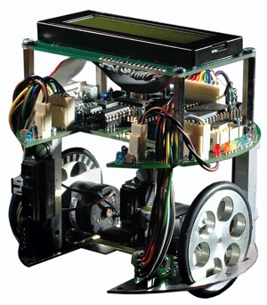

**Da der Maintainer nicht der Autor folgender Inhalte ist, welche bereits zuvor als freie Inhalte veröffentlicht worden sind, übernimmt er für diese keine Haftung und handelt gemäß der vorhandenen Lizenzbestimmungen (CC-BY-SA 4.0) für diese Inhalte nach bestem Wissen und Gewissen. Bei rechtlich bedenklichen Inhalten, die trotz Sichtung noch unentdeckt geblieben sind, bittet der Maintainer um eine kurze Benachrichtigung, damit diese umgehend entfernt werden können.**

# Willkommen beim c't-Bot- und c't-Sim-Projekt

Dies ist das Portal für die Reste der **alten, noch nicht aufbereitete Dokumentation**.
Da es sich hierbei um zusammengetragene Inhalte aus unterschiedlichen Quellen und von verschiedenen Autoren innerhalb des Projekts handelt, sind noch nicht alle Inhalte gründlich gesichtet und überprüft. Das bedeutet auch, dass einige Verlinkungen nicht oder nicht mehr funktionieren.

Die neue, überarbeitete und geprüfte Dokumentation findet sich **[hier](../doc/wiki_main.md)** (**Hauptanlaufstelle**) und ist unter den [CC BY-SA 4.0](https://creativecommons.org/licenses/by-sa/4.0/) Lizenzbestimmungen veröffentlicht.

## Anlaufstellen (*deprecated*)

1. Die **[FAQ](http://www.heise.de/ct/artikel/FAQ-fuer-c-t-Bot-und-c-t-SIM-291940.html)**
1. Das **[Heise Forum](https://www.heise.de/forum/c-t/Kommentare-zu-c-t-Artikeln/c-t-Bot-und-c-t-Sim/forum-23074/)** (dient nur als Archiv)
1. Das **[Mailingliste](https://www.heise.de/ct/newsletter/archiv/ct-bot-entwickler/)** (dient nur als Archiv)
1. Ältere **[Erweiterungen](./Patches/Patches.md)** von Lesern

=====

## Markdown Dokumentation

> **Hinweis:** Diese Dokumentationsseiten wurde aus dem ehemaligen Trac des Projekts exportiert und nach Markdown konvertiert, aber noch nicht auf Korrektheit überprüft! Daher können Fehler enthalten sein, außerdem sind einige Teile stark veraltet und nicht mehr aktuell, ihre Überarbeitung steht derzeit noch aus. Entsprechende Marker finden sich auf den jeweiligen Seiten:
>>>> **Trac-2-Markdown Konvertierung:** *incomplete* *unchecked* *deprecated*

c't-Bot und c't-Sim gehören zusammen und sind ein Roboterprojekt der Zeitschrift c't, das 2006 entstanden ist. Dies hier ist die im Laufe des Projekts entstandene Dokumentation, die ursprünglich im Trac zum Projekt entstanden war. Auf diese Weise soll sichergestellt werden, dass das Projekt auch nach dem Erscheinen des letzten c't-Artikels in der Community weiterleben kann. Daher ergänzen diese Seiten die offizielle **[c't-Projektseite](http://www.heise.de/ct/projekte/ct-bot)**.

## Hardware

### Aufbau, Montage & Test eines frisch aufgebauten ct-Bots

* Empfehlenswerte **[Hardware-Modifikationen](../xx_HW/ct-Bot-Modifikationen.md)**
* Ist die Hardware soweit fertig, muss die Firmware auf den Bot: **[Programmieradapter](http://www.heise.de/ct/Redaktion/cm/klangcomputer/index1.htm)** (Achtung, diese Beschreibung des Adapters entstammt dem Klangcomputer-Projekt, das andere Einstellungen für die Fuse-Bits verwendet als der c't-Bot!)
* **[Test-Programm](ziped-releases/test-binaries.zip)** herunterladen
* Das Testprogramm **[flashen](../Flash/Flash.md)**
* Die Fernbedienung (falls das Modell *HQ RC Univers 29* verwendet wird) auf den Gerätecode **TV 334** (siehe beiliegende Anleitung) programmieren. Wer diese Fernbedienung mit vierstelligen Gerätecodes siehe Anleitung) besitzt: der Gerätecode 334 funktioniert hier nicht.
* Die Hardware des Bots **[testen](https://www.heise.de/ct/artikel/Hallo-Welt-290314.html)**. Wenn etwas nicht wie im Artikel beschrieben funktioniert, geht es weiter mit der **[Hardware-Fehlersuche](https://www.heise.de/ct/artikel/Kammerjaeger-290506.html)**. Wenn alle Tests erfolgreich abgeschlossen sind: Herzlichen Glückwunsch! Nun geht es an die eigene Roboter-Software oder die Erkundung der bereits vorhandenen. Bitte lesen Sie auf der **[Software-Seite](../ct-Bot-Software/ct-Bot-Software.md)** weiter.

### Hardware-Erweiterungen für den c't-Bot

Unter [Raspberry Pi](../xx_HW/RaspberryPi.md) finden sich Informationen über eine leistungsfähige CPU-Erweiterung des c't-Bots mit Hilfe eines Raspberry Pi.

Sammlung von Ideen oder Leservorschlägen:

* Sprachmodul SP03: siehe [PDF-Dokumentation](sp03.pdf) von Harald W. Leschner.
* CMPS03-Kompass: Anschluss an den I^2^C-Bus des ATmegas wie unter [Sprachmodul SP03](sp03.pdf) beschrieben. Softwareseitiger Konfigurationsschalter `CMPS03_AVAILABLE` (siehe [Konfigurationsschalter](../../doc/wiki_pages/ct-bot_h.md)).
* Ultraschallsensor SRF10: Anschluss an den I^2^C-Bus des ATmegas wie unter [Sprachmodul SP03](sp03.pdf) beschrieben. Softwareseitiger Konfigurationsschalter `SRF10_AVAILABLE` (siehe [Konfigurationsschalter](../../doc/wiki_pages/ct-bot_h.md)).

### MMC per Hardware-SPI

Die MMC / SD-Karte kann auf zwei Weisen angesprochen werden:

1. Per Software-Steuerung (das ist die Standard-Einstellung), dafür muss `SPI_AVAILABLE` in [include/bot-local.h](https://github.com/tsandmann/ct-bot/blob/master/include/bot-local.h) **aus** sein.
1. Per Hardware-SPI-Steuerung, dafür ist ein kleiner Hardware-Umbau nötig: Es muss die Verbindung zwischen Prozessor-Pin *PC5* (*IC1 Pin 27*) und dem Display-Anschluss (*ST4 Pin 7*) getrennt werden (die Busy-Leitung wird vom Display-Treiber nicht genutzt, darum hat das keine Nachteile) und an *PC5* (*IC1 Pin 27*) der linke Radencoder (*RADL* / *IC3C Pin 6*) angeschlossen werden. Die Verbindung von *IC4 Pin 15* darf dabei jedoch **nicht** vom Display-Anschluss (*ST4 Pin 7*) getrennt werden! Ausserdem ist Prozessor-Pin *PB4* (*IC1 Pin 5*) von *IC3C Pin 6* zu trennen (der *PB4*-Pin kann für andere Zwecke genutzt werden, er muss jedoch immer als *Output* konfiguriert sein).

Nun schaltet man in [include/bot-local.h](https://github.com/tsandmann/ct-bot/blob/master/include/bot-local.h) die Option `SPI_AVAILABLE` **an**, dadurch wird die Kommunikation mit der SD-Karte über das Hardware-SPI Modul des Prozessors gesteuert. Der Vorteil ist eine höhere Transfer-Geschwindigkeit zur SD-Karte (Faktor 2) und es sind ca. 430 Byte weniger im Flash-Speicher des Prozessors belegt. Zu beachten ist, dass `SPI_AVAILABLE` von jetzt an immer eingeschaltet sein muss, auch wenn man keine MMC-Unterstützung benötigt, weil die Radencoder-Auswertung die veränderte Pin-Belegung immer berücksichtigen muss.

*Hinweis*: Es handelt sich hierbei um eine **reine Optimierungsmaßnahme**, durch die *keine* weiteren Features ermöglicht werden! Von der schnelleren Anbindung der SD-Karte profitiert z.B. die Kartographie, weil die Map-Updates so weniger Prozessorzeit beanspruchen und daher häufiger ausgeführt werden können, ohne die Bot-Verhalten zu stören.

### Lokalisierung

Siehe [Lokalisierung des c't-Bots](../Localization/Localization.md) mit Zusatzhardware.

## Software

### c't-Bot

Dieses Teilprojekt umfasst den C-Code für reale und simulierte c't-Bots

* Überblick über die **[ct-Bot-Software](./ct-Bot-Software/ct-Bot-Software.md)**
* Demo-Firmware **[ausprobieren](./ct-Bot-Software/ct-Bot-Software.md#Und-los-geht-es)**
* **[Eigenen Code](./ct-Bot-Software/ct-Bot-Software.md#Eigene-Schritte)** schreiben
* **[Dokumentation](./ct-Bot-Software/ct-Bot-Software.md#Dokumentation)** zum bestehenden Code
* **[Howto](./ct-Bot-Software/ct-Bot-Software.md#Howto)** zum Bot
* **[Ideen & mehr](./ct-Bot-Software/ct-Bot-Software.md#Ideen-und-mehr)**
* Die Firmware für die eigene Hardware **[kalibrieren](./ct-Bot-Software/ct-Bot-Software.md#Kalibrierung)**

### c't-Sim

Dieses Teilprojekt umfasst den Java-Code für den Simulator c't-Sim

* Überblick über die **[ct-Sim Software](https://www.heise.de/ct/artikel/c-t-Bot-und-c-t-Sim-284119.html?seite=3)**
* **[Konfiguration](./ct-Sim/SimConfig.md)** der ct-Sim Optionen
* **[Howto](./ct-Sim/DokuSimulationsArchitektur)** zum ct-Sim

### Entwicklungsumgebung

* Allgemeine **[Installationsanleitung](./Installationsanleitung/InstallationsanleitungR23.md)** für c't-Bot und c't-Sim
* Entwicklungsumgebung
  * **[Eclipse-Installation](./Eclipse/EclipseInstallation.md)** inkl. der nötigen Plugins
  * **[Code aus dem Repository](./Eclipse/GITundEclipse.md)** in Eclipse einbinden
  * **[Tipps, Tricks und Hotkeys](./Eclipse/EclipseTipps.md)** rund um Eclipse
* AVR-Toolchain
  * **[Installation der AVR-Toolchain](./AVRToolchain/AVRToolchain.md)** zur Entwicklung des Steuercodes eines *realen* c't-Bots
  * **[Hintergründe](./AVRToolchain/AVRToolchainInterna.md)** zur AVR-Toolchain
  * **[AVR-Tools und Tricks](./AVRToolchain/AVRToolchain.md)** Nützliche Tools für AVR für die (Bot-)Softwareentwicklung
  1. c't-Bot compilieren [Bot compilieren, Simulator starten und c't-Bot starten](../Installationsanleitung/InstallationsanleitungR23.md#ct-Sim-und-virtuelle-Bots-starten)
  1. Fernbedienung öffnen und Wandfolger (Taste 5) starten

Autoren: Benjamin Benz (Heise), Timo Sandmann, Michael Frey, anonybot
