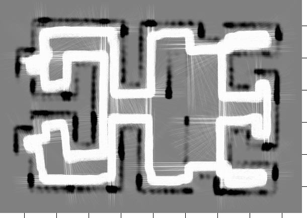
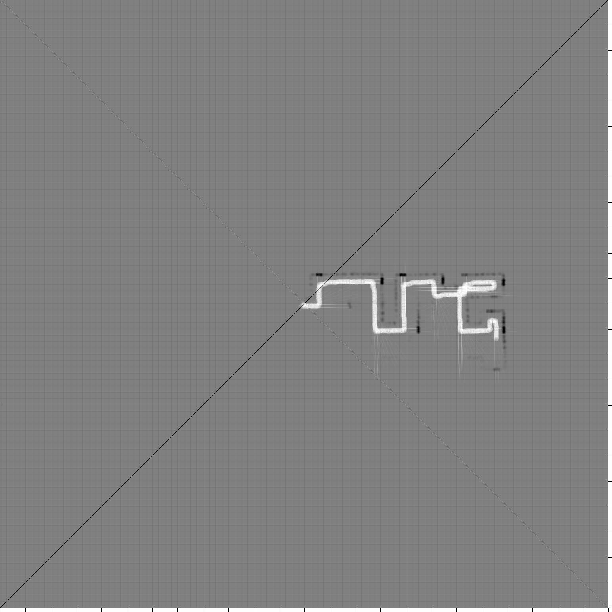
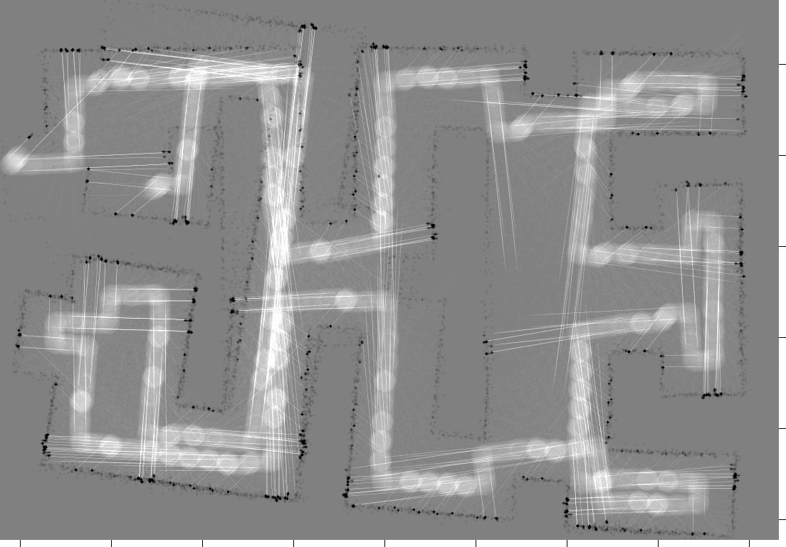
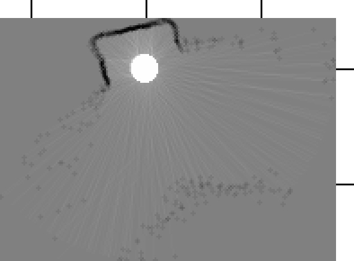
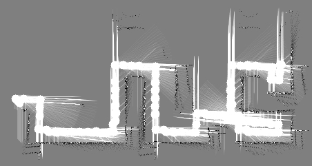
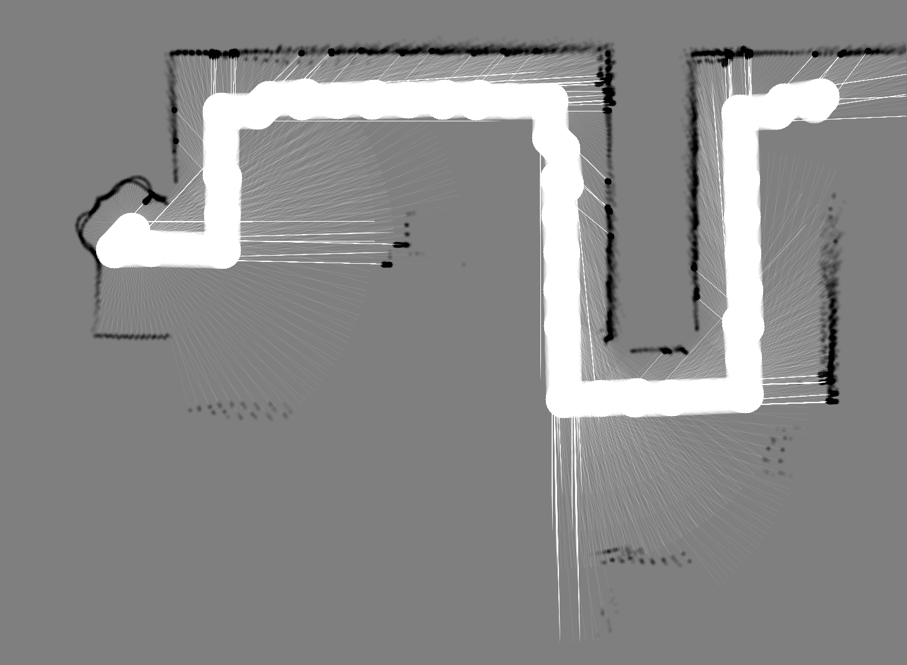
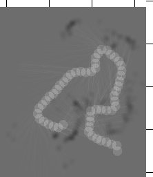
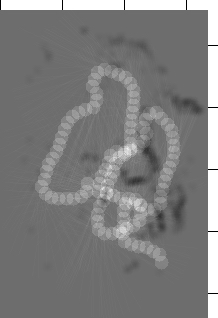

# Bild- und Video-Gallerie: Der c't-Bot in Aktion

## Videos (externe Inhalte)

**Hinweis: Die folgenden verlinkten externen Inhalte unterliegen den Rechten, welche durch die jeweiligen Autoren eingeräumt worden sind. Für externe Inhalte wird keine Haftung übernommen.**

Youtube-Videos:

* Bots beim [Sumoringen](https://www.youtube.com/watch?v=-AMo10Cc9L0) (Datum: 28.07.2006)
* Bot mit einem (eher) [simplen Verhalten](http://www.youtube.com/watch?v=xBJkC_R0Odc) (Datum: 29.11.2006)
* Bot beim Folgen einer Linie - [Video 1](https://www.youtube.com/watch?v=7sK5jE8LnNU) (Datum: 11.03.2008)
* Bot beim Folgen einer Linie - [Video 2](https://www.youtube.com/watch?v=fvxcSFx9Csk) (Datum: 27.05.2008)
* [Videopräsentation](https://www.youtube.com/watch?v=GX4phyGY-Z4) über c't-Bots am Lehrstuhl für Rechnerarchitektur an der Uni Tübingen (Datum: 26.05.2009)
* Bot bei [Sensortest](https://www.youtube.com/watch?v=RFdkuTtFTQ0) [von x29a] (Stand 15.11.2007)
* Bot mit ersten [autonomen Bewegungen](https://www.youtube.com/watch?v=QjDkaCr4d3I) [von x29a] (Datum: 19.11.2007)
* Bot bei der [Suche nach Licht](https://www.youtube.com/watch?v=WqAMM9UqwPo) [von x29a] (Stand 06.01.2008)
* Bot im [Labyrinth](https://www.youtube.com/watch?v=-P_feEbQgfk) [von x29a] (Datum: 13.03.2008)
* Das Spiel [Snake](https://www.youtube.com/watch?v=59hXwtWTXmU) auf dem Display des c't-Bot [von x29a] (Datum: 24.06.2008)

## Videos

Videos von anonybot:

* [Test-FW ct-bot-analog_hex malfunction](../videos/anonybot/2015-11-18_test-fw_ct-bot-analog_hex_malfunction.mp4) (Datum: 18.11.2015)
* [Test-FW ct-bot-digital_hex malfunction](../videos/anonybot/2015-11-18_test-fw_ct-bot-digital_hex_malfunction.mp4) (Datum: 18.11.2015)
* [Test-FW ct-bot-motor_hex malfunction](../videos/anonybot/2015-11-18_test-fw_ct-bot-motor_hex_malfunction.mp4) (Datum: 18.11.2015)
* [Fehlerdiagnose via Display](../videos/anonybot/2015-11-27_err-diag_disp_01.mp4) (Datum: 27.11.2015)
* [Fehlerdiagnose via Display: Motor L/R](../videos/anonybot/2015-11-27_err-diag_disp_02_motor-L-R.mp4) (Datum: 27.11.2015)
* [Fehlerdiagnose via Display: Motor L/R, Maus](../videos/anonybot/2015-11-27_err-diag_disp_03_motor-L-R_mouse.mp4) (Datum: 27.11.2015)
* [Fehlerdiagnose via Display: Motor L/R, Maus, Sensorboard L](../videos/anonybot/2015-11-27_err-diag_disp_04_motor-L-R_mouse_sensb-L.mp4) (Datum: 27.11.2015)
* [Fehlerdiagnose via Display: Motor L/R, Maus, Sensorboard R](../videos/anonybot/2015-11-27_err-diag_disp_05_motor-L-R_mouse_sensb-R.mp4) (Datum: 27.11.2015)
* [Fehlerdiagnose via Display: Motor L/R, Maus, Sensorboard R, Distanzsensor R aus](../videos/anonybot/2015-11-27_err-diag_disp_06_motor-L-R_mouse_sensb-R_dist-R-off.mp4) (Datum: 27.11.2015)
* [Fehlerdiagnose via Display: Motor L/R, Maus, Sensorboard R, Distanzsensor R Check](../videos/anonybot/2015-11-27_err-diag_disp_07_motor-L-R_mouse_sensb-R_dist-R-check.mp4) (Datum: 27.11.2015)
* [Fehlerdiagnose via Display: Motor L/R, Maus, Sensorboard L/R, Distanzsensor R aus](../videos/anonybot/2015-11-27_err-diag_disp_08_motor-L-R_mouse_sensb-L-R_dist-R-off.mp4) (Datum: 27.11.2015)
* [Fehlerdiagnose Hauptplatine](../videos/anonybot/2015-12-04_err-diag_mainboard-only.mp4) (Datum: 04.12.2015)
* [Fehlerdiagnose: Leistungsmessung Motoren](../videos/anonybot/2015-12-04_err-diag_motor-power-measurement.mp4) (Datum: 04.12.2015)
* [Test der Fernbedienung](../videos/anonybot/2016-01-20_test_remote_control.mp4) (Datum: 20.01.2016)
* [Transportfach in Aktion](../videos/anonybot/2016-01-20_transport_box_flap_in_action.mp4) (Datum: 20.01.2016)
* [Test Motor 01](../videos/anonybot/2016-04-29_test_motor_01_cable-orig_rotating.mp4) (Datum: 29.04.2016)
* [Test Motor 02](../videos/anonybot/2016-04-29_test_motor_02_cable-orig_motor-view.mp4) (Datum: 29.04.2016)
* [Test Motor 03](../videos/anonybot/2016-04-29_test_motor_03_cable-orig_motor-view.mp4) (Datum: 29.04.2016)
* [Test Motor 04](../videos/anonybot/2016-04-29_test_motor_04_cable-crossed_rotating.mp4) (Datum: 29.04.2016)
* [Test Motor 05](../videos/anonybot/2016-04-29_test_motor_05_motor-view_1.mp4) (Datum: 29.04.2016)
* [Test Motor 06](../videos/anonybot/2016-04-29_test_motor_06_motor-view_2.mp4) (Datum: 29.04.2016)
* [Test SD-Card Fehlerausgabe Display 01](../videos/anonybot/2016-11-21_test_sd-card_display-error.mp4) (Datum: 21.11.2016)
* [Test SD-Card Fehlerausgabe Display 02](../videos/anonybot/2016-11-21_test_sd-card_display-error.mp4) (Datum: 21.11.2016)
* [Test Verhalten goto_pos-goto_dist](../videos/anonybot/2017-04-14_test_behaviour_goto_pos-goto_dist.mp4) (Datum: 14.04.2017)
* [Test Verhalten catch-pillar](../videos/anonybot/2017-12-29_test_behaviour_catch-pillar_start-rc.mp4) (Datum: 29.12.2017)
* [Test Verhalten catch-pillar Start ct-Sim](../videos/anonybot/2017-12-29_test_behaviour_catch-pillar_start-ct-sim.mp4) (Datum: 29.12.2017)
* [Test Verhalten catch-pillar Start Fernbedienung](../videos/anonybot/2017-12-29_test_behaviour_catch-pillar_start-rc.mp4) (Datum: 29.12.2017)

Videos von eax:

* [Video](https://www.cety.de/ctbot/pfadplanung_real.html), welches die Verwendung der Pfadplanung auf dem echten Bot demonstriert. Der Kern der Sache in diesem Szenario liegt darin, dass der Rückweg zum Startpunkt nicht entlang der Wand erfolgt, also der Bereich zwischen den beiden Hindernisse gar nicht erst angefahren wird. Stand 19.04.2009.
* [Video](https://www.cety.de/ctbot/maptest_real.html) der Map-Anzeige (Map-2-Sim) des echten Bots. Die Anzeige der Map erfolgt in diesem Video noch mit relativ großer Verzögerung. Inzwischen ist der Code deutlich verbessert worden, wodurch die Verzögerung minimiert wurde. Stand 02.03.2009.
* [Video](https://www.cety.de/ctbot/follow_line_enh.html) des Verhaltens bot_follow_line_enh() auf dem echten Bot. Die Map dazu nach [einer](follow_line_enh.png) "Runde" und nach [zwei](follow_line_enh_2.png) "Runden". Stand 26.02.2009.
* [Video](https://www.cety.de/ctbot/drive_area_way_free.mov) zur Veranschaulichung von map_way_free(). Stand 15.02.2009
* [Video](https://www.cety.de/ctbot/map-2-sim.html) der ersten Map-2-Sim-Version in Aktion. Stand 27.11.2008
* [Video](https://www.cety.de/ctbot/follow_stack.html) des Verhaltens `bot_follow_object_behaviour()` im Zusammenspiel mit `bot_drive_stack()`. Stand 06.04.2008.
* [Video](https://www.cety.de/ctbot/solve_maze_real.html), das den echten Bot beim Lösen eines Labyrinths (folgen der Außenwand) zeigt. Der Lösungsalgorithmus ist mit Hilfe einer Skriptsprache umgesetzt (bot_abl_behaviour()). Stand 07.01.2008.
* [Video](https://www.cety.de/ctbot/wall.html) des Verhaltens `bot_follow_wall_behaviour()`. Stand 09.09.2007.
* [Video](https://www.cety.de/ctbot/follow.html) des Verhaltens `bot_follow_object_behaviour()`. Stand 03.08.2007.
* [Video](https://www.cety.de/ctbot/tevers_follow_line_wo_speedcontrol_cc-by-sa.avi) des Bots beim Linienverfolgen (`bot_follow_line_behaviour()`) ohne Motorregelung von Torsten Evers.
* [Video](https://www.cety.de/ctbot/tevers_follow_line_w_speedcontrol_cc-by-sa.avi) des Bots beim Linienverfolgen (`bot_follow_line_behaviour()`) mit Motorregelung von Torsten Evers.
* [Video](https://www.cety.de/ctbot/tevers_solve_maze_cc-by-sa.mpg) des c't-Bot beim Lösen eines kleinen Labyrinths mit `bot_solve_maze_behaviour()` von Torsten Evers.

## Bilder

* Karte zur Messung der Genauigkeit im ct-Sim.
Dargestellt ist eine fünfmalige Fahrt durch den Testparcours. Im Vergleich zur älteren Karte ist der Fehler hier sehr gering und nicht wachsend. (Datum: 17.08.2007):

* Eine Karte mit Testmuster bei der Fahrt durch ein Labyrinth.
Sie zeigt dank der Hilfslinien sehr gut den internen Aufbau der Karte in kleine quadratische Sections und riesige Macroblöcke. (Datum: 16.08.2007):

* Eine Karte, die zeigt, wo die Grenzen der Genauigkeit bei der Positionierung des Bots liegen.
Aufgenommen mit einem leicht modizierten Wandfolger (regelmäßige 360 Drehungen) im testparcours2.xml, in dem die Lampen und das Zielfeld entfernt wurden. (Datum: 06.04.2007):

* Eine Karte, die mit einem echten Bot auf einer MMC aufgezeichnet wurde.
Hier dreht sich ein Bot zwischen aufgestellten Büchern. (Datum: 23.03.2007):

* Zwei Karten die ein Bot beim Wandfolger-Verhalten aufgezeichnet hat (Datum: 23.03.2007):

|  |  |
| ---                                                                          | ---                                                                          |

* Zwei Karten die ein Bot beim Linienfolger-Verhalten aufgezeichnet hat:

|  |  |
| ---                                                                                  | ---                                                                                  |

