# CPU-Erweiterung für den c't-Bot mit einem BeagleBoard

**Hinweis: Diese Hardware-Erweiterung wurde im Bot-Code durch die Raspberry Pi CPU-Erweiterung abgelöst.**

## Einleitung

Die Standard-Hardware des c't-Bots lässt sich mit dem umfangreichen Software-Framework inzwischen nahezu vollständig ausreizen.
Um weitere Features implementieren zu können, entstand daher die Idee, den c't-Bot um eine CPU-Erweiterung zu ergänzen, die auch im c't Sonderheft [c't Hacks/Make 01/2012, S.108](https://shop.heise.de/katalog/c-t-bot-roboter-selbst-bauen) vorgestellt wird.

Diese Wiki-Seite soll darüber informieren wie sich ein c't-Bot mit einem BeagleBoard erweitern lässt und welche Anpassungen an Hard- und Software dafür nötig sind.
Hierbei sei angemerkt, dass eine CPU-Erweiterung den "Bastel-Aspekt" des c't-Bot Projekts in den Vordergrund stellt, sodass keine abgeschlossene Baugruppe oder ausgereifte Software zur Verfügung steht.
Daher enthält dieser Artikel im Allgemeinen auch keine einsteigerfreundlichen und vollständigen Schritt-für-Schritt-Anleitungen.
Vielmehr geht es darum, Ideen und Lösungsansätze zusammenzutragen um das Konzept einer solchen Erweiterung auszubauen und zu optimieren.


## Idee

* Anstelle des offiziellen Erweiterungs-Boards mit WLAN- und MMC-Funktion zusätzlich zur Hauptplatine des c't-Bots ein BeagleBoard montieren.
* Der ATmega Mikrocontroller des Bots führt einen sogenannten Low-Level Code aus und kommuniziert mit dem BeagleBoard über eine serielle Schnittstelle (UART, SPI).
* Das BeagleBoard führt eine Linux-Distribution (z.B. Ubuntu für die ARM-Prozessorarchitektur) aus und ermöglicht die folgenden Features:
    * SSH Login
    * Filetransfer zwischen Bot und PC
    * NFS-Mounts
    * Ausführung fast jeder Linux-Software
* Das BeagleBoard bietet weitere Schnittstellen (USB, LAN, I2C, Audio, GPIOs) welche sich für zusätzliche Hardware (WLAN-USB-Dongle, weitere Sensoren, Kamera, etc.) nutzen lassen.
* Die Funktionalität des WiPorts wird mit einem einfachen WLAN-USB-Stick und socat bereitgestellt (Voraussetzung: Der Treiber ist im Linux-Kernel enthalten).
* Die GPIO-Pins des BeagleBoards steuern die Reset-Leitung des ATmega Mikrocontrollers und fragen Fehler- und Batteriestatus ab.
* Mit den Audio-Ports des BeagleBoards lassen sich die folgenden Funktionen realisieren:
    * Sound- und Sprachausgabe (Verstärkerschaltung nötig)
    * Mikrofon (Verstärkerschaltung nötig)
    * Line-In Anschluss
* Erweiterung des c't-Bots um eine Kamera, die über den Kamera-Port des BeagleBoards xM oder per USB angeschlossen wird


## Konzept

### Low-level Bot-Code für den ATmega Mikrocontroller

Der ATmega1284P auf dem Interface-Board führt den Low-level Code aus und stellt somit die Schnittstelle zur c't-Bot-Hardware bereit.
Der Vorteil durch die Verwendung eines zusätzlichen Mikrocontrollers neben dem BeagleBoard besteht in der Kompatibilität zum originalen c't-Bot und der Wiederverwendbarkeit sämtlicher Treiber für die Bot-Hardware.
Der Low-level Code besteht aus einer leicht modifizierten Untermenge des originalen c't-Bot-Codes.
Verzichtet wird dabei auf sämtlichen Verhaltenscode und weitere Features wie Kartographie oder Positionsspeicher - all das übernimmt der High-level Code, den die BeagleBoard-CPU ausführt.
Zusätzlich implementiert ist eine CRC16-Prüfsumme, welche die Kommunikation mit dem BeagleBoard gegen Übertragungsfehler absichert.
Um den Low-level Code zu aktivieren, muss in _ct-Bot.h_ der Schalter `BOT_2_RPI_AVAILABLE` aktiviert werden.


### High-level Bot-Code für den ARM-Prozessor

Das BeagleBoard führt den für die ARM-Linux Architektur compilierten High-level Code aus und übernimmt somit die Ausführung von Verhalten, Kartographie usw.

Um den c't-Bot Code für einen Bot mit BeagleBoard-Erweiterung zu übersetzen als Build-Konfiguration in Eclipse _Debug-ARM-Linux_ wählen und den Schalter `ARM_LINUX_BOARD` in _ct-Bot.h_ aktivieren.

Die wesentlichen Unterschiede zum originalen ct-Bot-Code:

* CRC16-Prüfsumme für Kommunikation
* Anpassungen für Kommunikation (Synchronisation, Anmeldung als realer Bot)
* Anpassungen für Auswertung der Distanzsensoren (Umrechnung gemäß Kennlinie erfolgt bereits im Low-level Code)
* Anpassungen für Motorsteuerung (1:1 Weitergabe der Geschwindigkeit)
* Anpassungen für RC5-Code (Toggle-Bit Auswertung)


## Voraussetzungen

* Bastelinteresse an Hard- und Software
* c't-Bot (oder kompatibler Roboter bzw. ähnliche Hardware)
* PC oder virtuelle Maschine mit installiertem Linux (Linux-VM)
* Eingebundene Cross-Toolchain für die Übersetzung des Bot-Codes nach ARM-Linux (Archtektur: ARMv7-A, hardfloat), verfügbar für Linux und Windows in Form der Linaro Toolchain
* Installierte c't-Bot [Toolchain](../../_tmp_trac_wiki_export/Installationsanleitung/Installationsanleitung.md)

Als Betriebssystem wurde Ubuntu 12.04 verwendet - die Nutzung verwandter Distributionen ist vermutlich ebenfalls möglich.


## Hardware

Die CPU-Erweiterung für den c't-Bot umfasst nicht nur das CPU-Board selbst, sondern auch ein dafür notwendiges Interface-Board.
Dieses verbindet die c't-Bot Hardware mit dem BeagleBoard und nimmt die notwendige Konvertierung der Signal-Spannungspegel von 1,8 V (BeagleBoard) auf 5,0 V TTL (c't-Bot Hauptplatine) vor.


### BeagleBoard

Bei dem Vorhaben den c't-Bot mit einer leistungsfähigeren CPU auszustatten, fiel die Wahl auf das BeagleBoard von Texas Instruments.
Diese Seite umfasst keine detaillierte Anleitung zur Einrichtung eines BeagleBoards, sondern verweist im Folgenden auf die entsprechenden (zumeist englischsprachigen) Informationen der BeagleBoard-Community.


#### Technische Daten / Versionen

Zum Zeitpunkt der Erstellung dieser Seite gibt es zwei für das Vorhaben geeignete Versionen des BeagleBoards _(Stand: Januar 2012)_ :

1. **BeagleBoard Rev. C4**

    Hierbei handelt es sich um das ursprüngliche BeagleBoard; im Folgenden als _BeagleBoard_ bezeichnet wird.

    Spezifikationen:
    * Super-scalar ARM Cortex-A8 ([OMAP3530](https://www.ti.com/lit/ds/symlink/omap3530.pdf)), CPU 720 MHz, DSP 520 MHz _(externer Link)_
    * 256 MB LPDDR RAM
    * 256 MB NAND Flash
    * High-speed USB 2.0 OTG port
    * High-speed (only) USB 2.0 host port
    * Stereo audio out / in
    * DVI-D video out
    * S-video out
    * SD/MMC slot
    * Preis: 119 € (in Deutschland)

2. **BeagleBoard-xM Rev. C**

    Diese Version unterscheidet sich vom obigen Board im Wesentlichen durch einen schnelleren Prozessor, mehr Speicher und einen integrierten USB-Hub; im Folgenden als _BeagleBoard-xM_ bezeichnet

    Spezifikationen:
    * Super-scalar ARM Cortex-A8 ([DM3730](https://www.ti.com/lit/ds/symlink/dm3730.pdf)), CPU 1 GHz, DSP 800 MHz _(externer Link)_
    * 512 MB LPDDR RAM
    * High-speed USB 2.0 OTG port
    * On-board four-port high-speed USB 2.0 hub with 10/100 MBit Ethernet
    * Stereo audio out / in
    * DVI-D video out
    * S-video out
    * microSD slot and 4 GB microSD card
    * Camera port
    * Overvoltage Protection
    * Preis: 143 € (in Deutschland)

Ein technischer Vergleich von _BeagleBoard-xM_ und _BeagleBone_ findet sich [hier](https://beagleboard.org/static/flyer_latest.pdf) _(externer Link)_.


#### Reference Manuals

* [BeagleBoard Reference Manual](https://beagleboard.org/static/BBSRM_latest.pdf) _(externer Link)_
* [BeagleBoard-xM Reference Manual](https://beagleboard.org/static/BBxMSRM_latest.pdf) _(externer Link)_


#### Weblinks

* BeagleBoard Projekt:
    * Offizielle [BeagleBoard Projektseite](https://beagleboard.org)
    * Offizielle [BeagleBoard FAQ](https://beagleboard.org/support/faq)
    * [Google Groups Forum](https://groups.google.com/forum/#!forum/beagleboard) zum BeagleBoard

* eLinux-Wiki:
    * [BeagleBoard Varianten](https://elinux.org/Beagleboard:Main_Page)
    * [Einsteiger-Infos](https://elinux.org/BeagleBoardBeginners)
    * [Ubuntu auf dem Beagle Board](https://elinux.org/BeagleBoardUbuntu)
    * [SPI-Interface des BeagleBoards](http://elinux.org/BeagleBoard/SPI)
    * [BeagleBoard FAQ](http://elinux.org/BeagleBoardFAQ)

* Sonstiges:
    * Anleitung für die Installation von [Ubuntu auf ARM Server developer boards](https://wiki.ubuntu.com/ARM/Server/Install) _(externer Link)_ _(Support für TI OMAP3-based platform eingestellt)_
    * Wissenschaftlich/technisches Paper welches ein älteres (600 MHz) BeagleBoard mit einem System auf Basis von Intels Atom CPU (N330) vergleicht und ein paar Hintergründe zur ARM Cortex-A8 Architektur erläutert:
        * [K. Roberts-Hoffman, P. Hegde (2009): "ARMCortex-A8 vs. Intel Atom: Architecturaland Benchmark Comparisons", University of Texas](http://caxapa.ru/thumbs/229665/armcortexa8vsintelatomarchitecturalandbe.pdf)


### WLAN

Für die kabellose Verbindung zur Außenwelt wird ein handelsüblicher USB-WLAN-Dongles verwendet, wobei zu berücksichtigen ist, dass der Linux-Kernel einen Treiber für den verwendeten Chipsatz mitbringt.

Getestete USB-WLAN-Dongles:
* D-Link Wireless N Nano USB Adapter (DWA-131):
    * \+ kompakte Abmessungen (18 mm x 34 mm x 7 mm inkl. USB-Stecker)
    * \- eher geringe WLAN-Reichweite aufgrund der (Antennen-) Abmessungen

* D-Link Wireless N 150 Pico USB Adapter (DWA-121)
    * \+ sehr kompakte Abmessungen (14 mm x 20 mm x 6 mm inkl. USB-Stecker)
    * \+ ragt eingesteckt nicht über den Bot-Geometrie hinaus
    * \- eher geringe WLAN-Reichweite aufgrund der (Antennen-) Abmessungen

* FRITZWLAN USB Stick N
    * \+ unterstützt das 5 GHz Band
    * \+ sehr gute Übertragungsleistung (ca. 5 MB/s auf BeagleBoard xM)
    * \- relativ große Gehäuse-Abmessungen (73 mm x 24,5 mm x 10,5 mm)
    * \- Anschluss über eine USB-Verlängerung sinnvoll


### Interface-Board

Das Interface-Board bindet das BeagleBoard (BeagleBoard und BeagleBoard-xM) an die Hardware des c't-Bots an und bietet die folgenden Features:
* Pegelanpassung 1,8 V <-> 5,0 V (TTL) der **UART2-Signale**
* Pegelanpassung 1,8 V <-> 5,0 V (TTL) für **GPIO-Pins** (Reset-Leitung zum ATmega & Fehler-Signal)
* Pegelanpassung 1,8 V <-> 5,0 V (TTL) der **McSPI4.0-Signale**
* Steckplatz für den **ATmega1284P** Mikrocontroller, welcher den originalen Microcontroller auf dem Mainboard des c't-Bots ersetzt.
* SPI-Anschluss für ISP oder externen MMC- / SD-Slot
* Stereo **Audio-Out Verstärker** für zwei Lautsprecher (8 Ω, 0,5 W)

Hinweise zum Interface-Board:
* Das Interface-Board verwendet belegt den SPI-Port des ATmega Mikrocontrollers, weshalb der Maus-Sensor nicht mehr verwendet werden kann.
* Auf dem Interface-Board befinden sich zwei SMD-Bauteile: _IC3_ im SOIC-14 Package und _IC2_ im TSSOP-16 Package.
Allgemein sind für die Bestückung von SMD-Bauteilen per Hand fortgeschrittene Lötkenntnisse und eine feine Motorik erforderlich.
Sofern keine Verbindung per SPI-Bus zwischen BeagleBoard und ATmega1284P benötigt wird, kann auf die Bestückung von _IC2_ auch verzichtet werden.
* Das Interface-Board lässt sich alternativ auch auf einer Lochraster-Platine aufbauen, welche jedoch sehr kompakt bestückt werden sollte, sodass sie die Abmessungen des BeagleBoards möglichst nicht überschreitet und auf den Bot passt.


#### Schaltplan & Stückliste

[Schaltplan des Interface-Boards](../documents/bb_interface_schematic.pdf)

| Bauteil                         | Bezeichnung                                       |
| :---                            | :---                                              |
| C1 - C6, C9, C14, C15, C18, C19 | Kondensator 100 nF                                |
| C7, C8                          | Kondensator 22 pF                                 |
| C10                             | Elektrolyt-Kondensator 22 µF                      |
| C12, C13                        | Elektrolyt-Kondensator 100 µF                     |
| C16, C17                        | Elektrolyt-Kondensator 220 µF                     |
| D1 - D4                         | Schalt-Diode 1N4148                               |
| IC1                             | Mikrocontroller ATmega1284P                       |
| IC2                             | 4-bit dual-supply bus transceiver SN74AVC4T774    |
| IC3                             | 4-Bit Bidirectional Voltage-Level Shifter TXB0104 |
| IC4                             | Dual Power Amplifier TDA2822M                     |
| J4 - J8                         | Stiftleiste 1x8                                   |
| JP1                             | Stecker für BeagleBoard-Erweiterung               |
| JP2                             | Stecker für Audio-In 1x3                          |
| JP3                             | Stecker für Lautsprecher 1x4                      |
| JP4                             | Stecker für ISP-Programmer 2x5                    |
| JP5                             | Stecker für LDDR/BPS 1x3                          |
| L1, L2                          | Drossel 100 µH                                    |
| Q1                              | n-Channel Feldeffekttransistor (MOSFET) BS170     |
| Q2                              | Quarz 20 MHz                                      |
| R1 - R3, R6, R13                | Widerstand 10 kΩ                                  |
| R4, R5                          | Widerstand 4,7 Ω                                  |
| R7, R8                          | Widerstand 220 Ω                                  |
| R9, R11                         | Widerstand 2,7 kΩ                                 |
| R10, R12                        | Widerstand 4,7 kΩ                                 |


### Montage

Zunächst ist das [originale Erweiterungsmoduls](../../_tmp_trac_wiki_export/ct-Bot-Erweiterung/ct-Bot-Erweiterung.md) von der c't-Bot Hauptplatine, sowie auch der ATmega Mikrocontroller vom Mainboard zu entfernen.
Anschließend wird das Interface-Board anstelle des c't-Bot Erweiterungsboards montiert wofür längere Abstandsbolzen erforderlich sind.
Danach sind die Kabel auf J4 bis J8 zu verbinden.
Das BeagleBoard selbst wird auf Interface-Board gesteckt.
Die elektrische Verbindung erfolgt dabei über den BeagleBoard-Extension-Header.
Mit Hilfe von zusätzlichen Abstandsbolzen lässt sich zum Schluss noch das Display oberhalb des BeagleBoards anbringen.


## Toolchain

Um den c't-Bot Code (oder andere Programme) für die ARM-Architektur des BeagleBoards zu übersetzen, wird ein Cross-Compiler benötigt.
Alternativ lässt sich der entsprechende Code auch direkt auf dem BeagleBoard übersetzen, wenn dort die architekturspezifische gcc-Toolchain installiert ist, was allerdings deutlich umständlicher und langsamer ist.


### Cross-Compiler Linux

Unter Ubuntu 12.04 LTS oder neuer wird die nötige Cross-Toolchain für die BeagleBoard-Plattform _arm-linux-gnueabihf_ (ABI hardfloat) durch das Paket **g++-arm-linux-gnueabihf** installiert: `sudo apt-get install g++-arm-linux-gnueabihf`.
Andere Linux-Distributionen bieten entsprechend ähnliche Pakete an, wobei jedoch stets zu beachten ist, dass die _ABI hardfloat_ verwendet wird.
Zum Kompilieren des Bot-Codes mit dem Cross-Compiler der Distribution ist als Target _Debug-ARM-Linux-BB_ auszuwählen sowie in den Projekteinstellungen für Compiler, Assembler und Linker jeweils `arm-linux-gnueabihf-gcc` einzutragen.


### Cross-Compiler Windows

Die [Linaro Toolchain](https://launchpad.net/linaro-toolchain-binaries) ist eine kostenlose Cross-Compiler-Toolchain für ARM-Linux (ABI hardfloat) die auch für Windows verfügbar ist.
Der Installer kann [hier](https://launchpad.net/linaro-toolchain-binaries/+download) heruntergeladen werden. Getestete Version: _2012.05-20120523_win32.exe_.
Zum Kompilieren des Bot-Codes unter Windows ist als Target _Debug-ARM-Linux-BB_ auszuwählen sowie in den Projekteinstellungen für Compiler, Assembler und Linker jeweils `arm-linux-gnueabihf-gcc` einzutragen.
Der Installationspfad sollte in der Systemvariable $PATH eingetragen sein, da ansonsten in umständlicher Art und Weise stets der absolute Pfad anzugeben wäre.


### Libraries

Derzeit werden die folgenden Libraries sowohl auf der Linux-Distribution des BeagleBoards, als auch auf dem Rechner zum Cross-Compilieren benötigt:


#### Flite, Alsa

Die Sprachsynthese-Bibliothek _Flite_ kann optional zur Sprachausgabe benutzt werden.
Dazu muss auf dem BeagleBoard die Bibliothek _Alsa_ installiert sein (`sudo apt-get install alsa-base libasound2-dev`).

* Vorgehensweise zum Cross-Kompilieren aus dem Quelltext:

1. Die Datei `/usr/lib/arm-linux-gnueabihf/libasound.so.2.0.0` nach `/usr/local/arm-linux/arm-cortex_a8-linux-gnueabi/sysroot/usr/lib` kopieren
2. Das Verzeichnis `/usr/include/alsa` der _Alsa-Bibliothek_ vom BeagleBoard nach `/usr/local/arm-linux/arm-cortex_a8-linux-gnueabi/sysroot/include/` kopieren
3. Verzeichnis wechseln: `cd /usr/local/arm-linux/arm-cortex_a8-linux-gnueabi/sysroot/usr/lib`
4. Link anlegen: `sudo ln -s libasound.so.2.0.0 libasound.so`

 Unter Linux oder Mac OS X sind dann diese Schritte nötig:

1. Archiv herunterladen und entpacken:
2. `./configure --with-audio=alsa --host=arm-linux --enable-shared`
3. `make`
4. Dateien aus _lib_ nach `ct-Bot/contrib/flite/lib/arm-linux-gnueabihf/` kopieren


## Software

Auf dem BeagleBoard wird eine Linux-Distribution ausgeführt, welche auf der SD-Karte installiert ist.
Verwendet und getestet wurde hier mit Ubuntu **12.04 LTS** (_Precise Pangolin_).


### Installation (Ubuntu 12.04 LTS für ARM)

#### Vorbereitungen

1. Herunterladen des Disk-Images _Texas Instruments OMAP3 (Hard-Float) preinstalled server image_
    * (_Support für TI OMAP3-based platform eingestellt; Disk-Image nicht mehr verfügbar_)_
2. Entpacken und kopieren des Images auf eine Mikro-SD Karte: [Installing pre-installed OMAP4 Precise (12.04) Server Images](https://wiki.ubuntu.com/ARM/Server/Install#Copy_the_image_to_SD_card) _(externer Link)_ _(Support für TI OMAP3-based platform eingestellt)_
3. Serielle Schnittstelle des BeagleBoards mit dem PC verbinden.
4. Ethernet-Port des BeagleBoards an ein LAN mit Internetzugang anschließen.
5. Ein Terminal-Programm starten und die serielle Schnittstelle öffnen, an der das BeagleBoard angeschlossen ist.
6. Mikro-SD-Karte in das BeagleBoard stecken und letzteres mit Strom versorgen (vorzugsweise ein **5V-Netzteil** benutzen, sodass das Board von der SD-Karte bootet.
7. Die Ausgabe in der Terminal-Konsole sollte während des Bootens ungefähr so aussehen:


#### Installation von Ubuntu

Der Installationsassistent startet nach dem Booten automatisch. Dort sind die folgenden Einstellungen vorzunehmen:

* Sprache: `English`
* Region:
   * Country, territory or area: `other`
   * Continent or region: `Europe`
   * Country, territory or area: `Germany`
* Zeichenkodierung:
   * Country to base the default locale settings on: `United States - en_US.UTF-8`
* Zeitzone:
   * Zeitzone einstellen: `Europe/Berlin`
   * System clock set to UTC? `<Yes>`
* Anlegen eines Benutzers, mit dem man sich später am System anmelden kann:
   * Full name for the new user
   * Username for your account
   * Choose a password for the new user
   * Re-enter password to verify
* Hostname für System vergeben
* Software selection: Installation eines SSH-Servers: `OpenSSH server`

* Nach Abschluss der Installation kann sich am System anmelden:

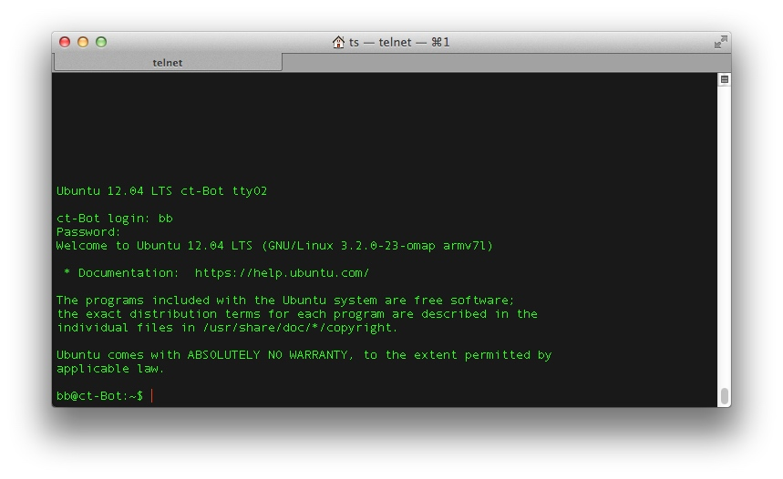

* Dann überprüft man am Besten zunächst die Netzwerkkonfiguration mit `ifconfig`:


#### System aktualisieren

* Systemaktualisierung mit `sudo aptitude update`:

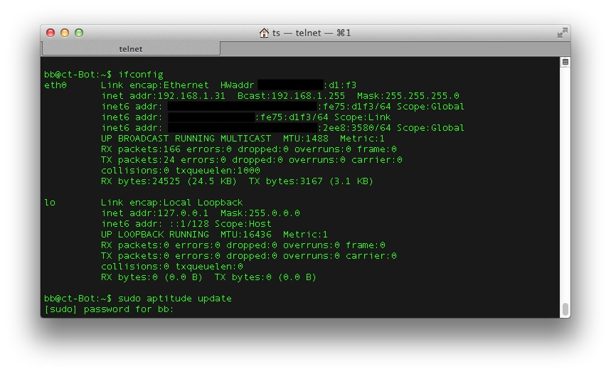

* Nach Eingabe des zuvor gewählten Passworts für den Benutzer werden die Paketquellen aktualisiert und der Status angezeigt.

* Mit `sudo aptitude full-upgrade` startet man nun die Aktualisierung und beantwortet die nachfolgende Sicherheitsabfrage mit `y`:

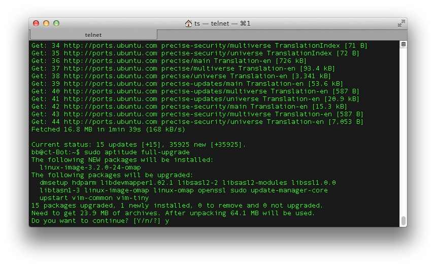

* Die Ausgabe sollte ähnlich der Folgenden aussehen und es sollten keine Fehler angezeigt werden:


* Neustart des Systems mit `sudo reboot`

* Anschließend erhält man erneut die Bootausgabe und kann sich wieder mit dem angelegten Benutzer anmelden:

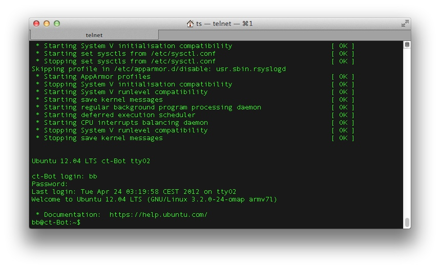

* Von jetzt an kann man sich per SSH über die Ethernet Verbindung einloggen, was deutlich komfortabler ist als über die serielle Verbindung.
Dazu startet man von einer Shell aus ssh unter Angabe des Benutzernamens und der zugehörigen IP-Adresse, also z.B. `ssh bb@192.168.1.32`.
Da das System bisher noch unbekannt ist, stimmt man der Sicherheitsabfrage zu, gibt anschließend das Passwort des Benutzers ein und erhält eine Login-Shell auf dem BeagleBoard:


#### Angepassten Kernel installieren

Damit das BeagleBoard mit mit der Hardware des c't-Bots kommunizieren kann, sind ein spezielle Anpassungen am Linux-Kernel erforderlich.
Dadurch werden die nötigen Schnittstellen auf die Erweiterungspins geroutet und die Schnittstellen entsprechend konfiguriert und im Userspace zugänglich gemacht.

Die folgenden Versionsnummern sind jeweils der verwendeten Kernelversion anzupassen! Diese jeweilige Kernelversion lässt sich wie folgt installieren:

1. Verbindung zum BeagleBoard; z.B. über einen sftp-Client:


2. Die heruntergeladenen Pakete für den Kernel auf das BeagleBoard (oder alternativ auf die FAT-Partition der SD-Karte) kopieren:

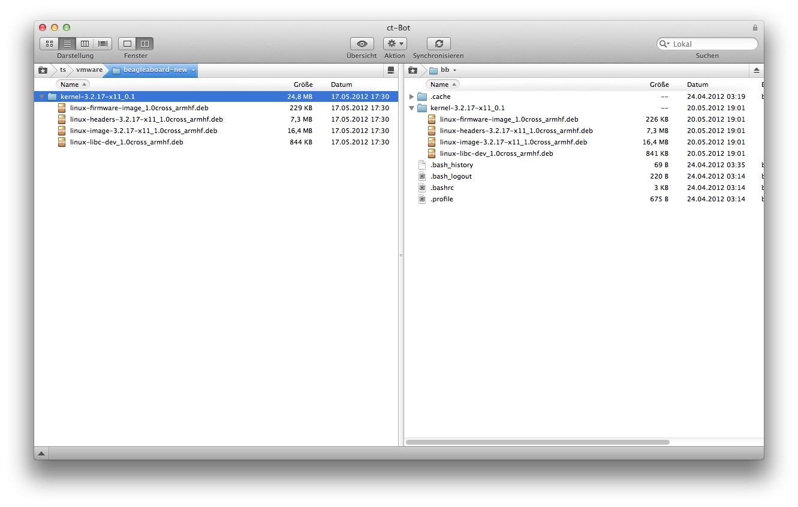

3. In das Verzeichnis mit den kopierten Paketen wechseln (im Beispiel mit `cd kernel-3.2.17-x11_0.1`) und Firmware-Image mit `sudo dpkg --force-all -i ./linux-firmware-image_1.0cross_armhf.deb` installieren:

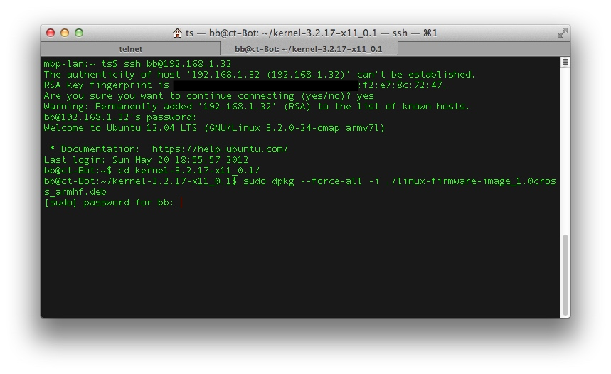

4. Installation von:
   * Kernel-Header mit `sudo dpkg -i ./linux-headers-3.2.17-x11_1.0cross_armhf.deb` (_Version entsprechend anpassen_)
   * libc-Header mit `sudo dpkg -i ./linux-libc-dev_1.0cross_armhf.deb`
   * Kernel-Image mit `sudo dpkg --force-all -i ./linux-image-3.2.17-x11_1.0cross_armhf.deb` (_Version entsprechend anpassen_)

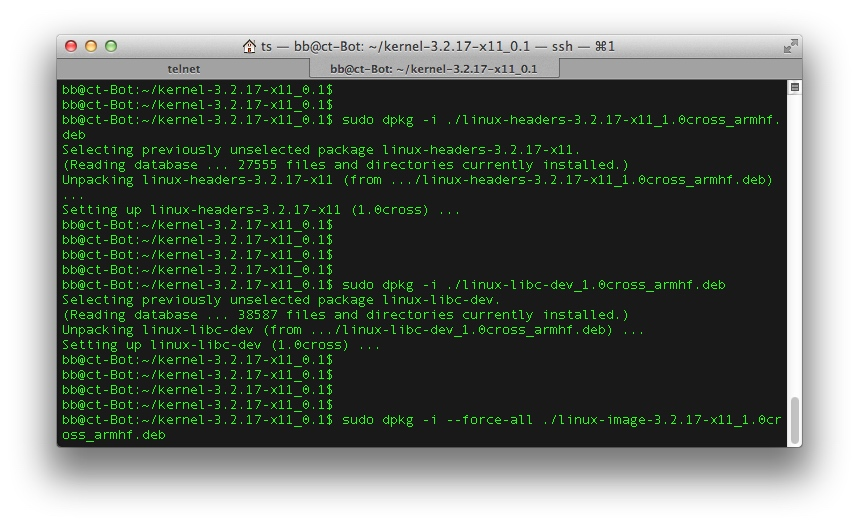

5. Da die bereitgestellten Pakete hier eine abweichende Architekturbezeichnung tragen, sind nun noch ein paar Dateien umzubenennen.
Dazu mit `cd /boot` das Verzeichnis wechseln und die folgenden Befehle ausführen (_Versionen entsprechend anpassen_):
   * `sudo mv vmlinux-3.2.17-x11 vmlinux-3.2.17-x11-omap`,
   * `sudo mv initrd.img-3.2.17-x11 initrd.img-3.2.17-x11-omap`,
   * `sudo mv config-3.2.17-x11 config-3.2.17-x11-omap` und
   * `sudo mv System.map-3.2.17-x11 System.map-3.2.17-x11-omap`

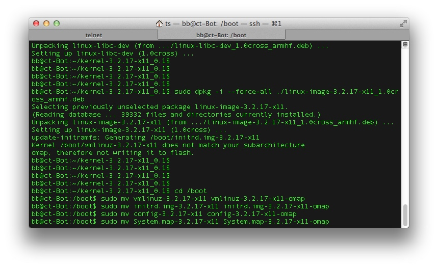

6. Mit `sudo flash-kernel 3.2.17-x11-omap` wird dann der neue Kernel auf der Boot-Partition installiert (_Version entsprechend anpassen_). Ein anschließender Neustart mit `sudo reboot` sorgt dafür, dass der Kernel geladen wird:

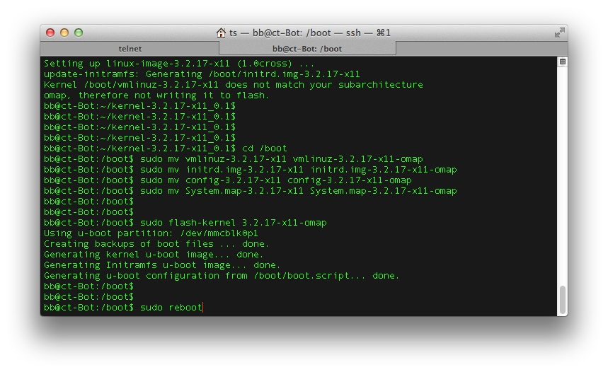

7. Nach dem Reboot und einem erneuten Login (s.o.) ist der Paketmanager so zu konfigurieren, dass die installierte Kernel-Version nicht durch Distributionsupdates überschrieben wird.
Dazu dient die folgenden, mehrzeilige Eingabe (_Versionen entsprechend anpassen_):

    ```
    sudo dpkg --set-selections << EOF
    linux-firmware-image hold
    linux-headers-3.2.17-x11 hold
    linux-image-3.2.17.x11 hold
    linux-libc-dev hold
    EOF
    ```

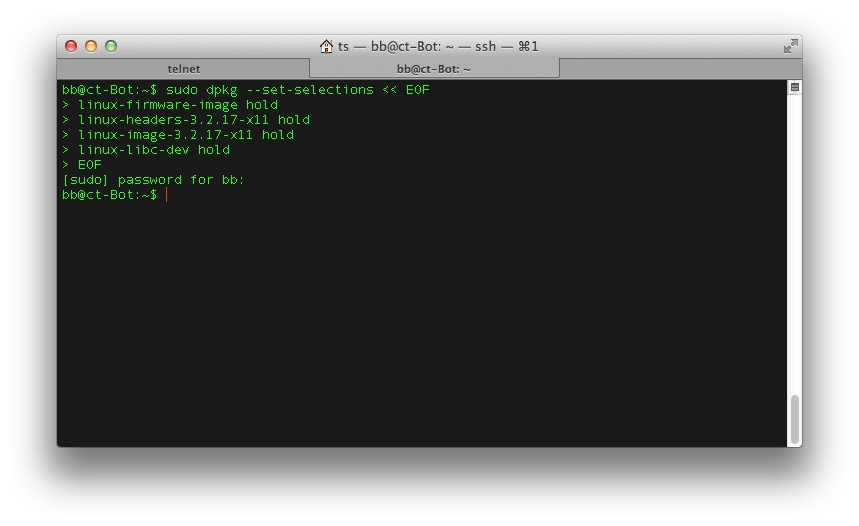

8. Anschließend kann man mit den folgenden Eingaben die alten Kernel-Versionen vollständig entfernen:
`sudo aptitude purge linux-image-3.2.0-23-omap`,
`sudo aptitude purge linux-image-omap` und
`sudo dpkg -P linux-image-3.2.0-24-omap`

Wichtig ist hierbei, dass die letzte Kernel-Version mit dpkg entfernt wird, damit der Paketmanager die zugehörigen Hilfspakete nicht ebenfalls entfernt:

| 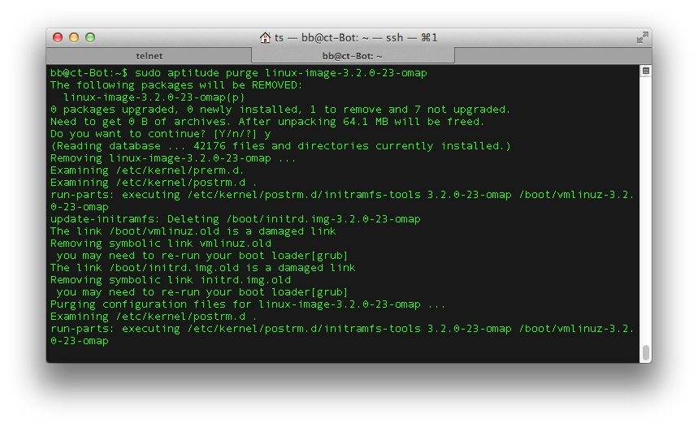 | 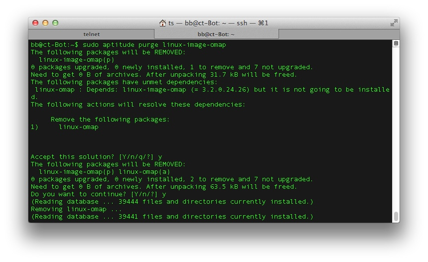 | 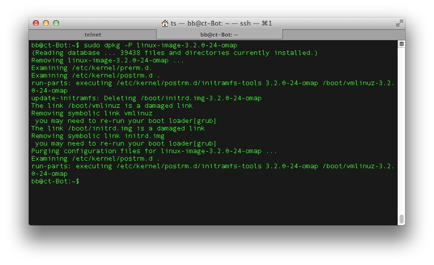 |
| ---                                                                | ---                                                                | ---                                                                |


#### WLAN konfigurieren

* Bevor ein USB-WLAN-Adapter angeschlossen wird, sollte man sich mit `lsusb`zuerst einen Überblick über die derzeit angeschlossenen USB-Geräte verschaffen.
Wird nach dem Einstecken des WLAN-Adapters erneut `lsusb` ausgeführt, so sollte das Device nun mit aufgelistet werden:


* Nun kann man die Pakete _wpasupplicant_ mit Hilfe von `sudo aptitude install wpasupplicant` und _wireless-tools_ via `sudo aptitude wireless-tools` installieren:


* Ein Aufruf von `iwconfig` sollte nun das Interface _wlan0_ anzeigen.
Danach wird mit `wpa_passphrase <SSID>` der pre-shared Key für die WPA2-Verschlüsselung erzeugt, sobald das WPA2-Passwort eingegeben wurde:

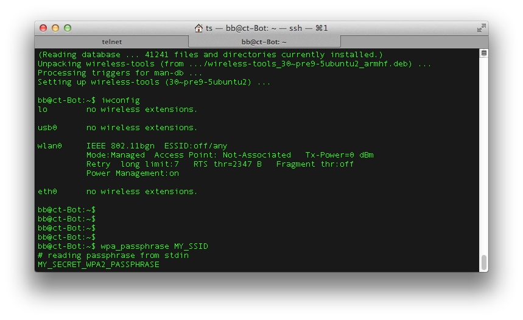

* Anschließend ist die Ausgabe des Programms in die Zwischenablage zu kopieren und `sudo nano /etc/wpa_supplicant.conf` aufzurufen:


* Hier ist die kopierte Ausgabe dann wieder einzufügen:

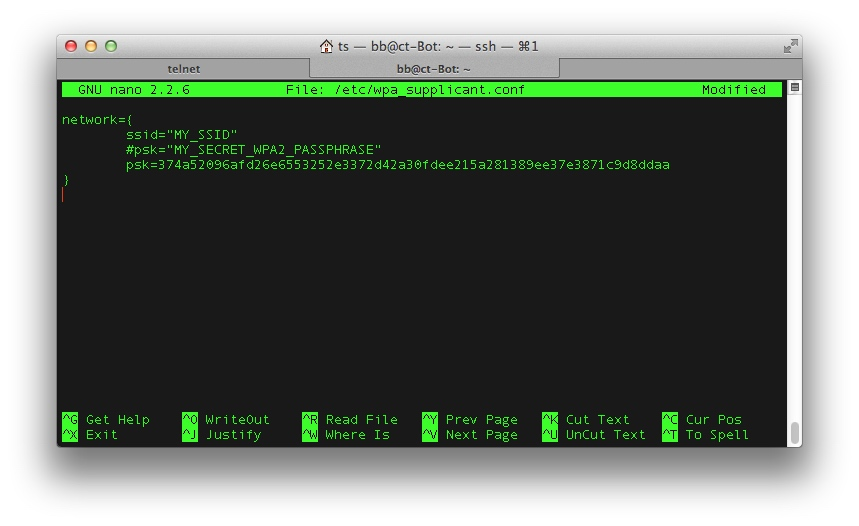

* Die Speicherung der Datei erfolgt mit _CTRL + o_ und _Enter_. Mit _CTRL + x_ wird der Editor wieder geschlossen:


* Jetzt lässt sich die WLAN-Verbindung durch die Ausführung von `sudo wpa_supplicant -iwlan0 -c/etc/wpa_supplicant.conf -Dwext` testen.
Im Erfolgsfall bekommt man hier mit _CTRL-EVENT-CONNECTED_ die Bestätigung für einen korrekten Verbindungsaufbau.
Mit _CTRL + c_ kann der Test wieder beendet werden.
* Nun ist das Interface _wlan0_ in `/etc/network/interfaces` einzutragen. Hierzu öffnet man mit `sudo nano /etc/network/interfaces` einen Editor:

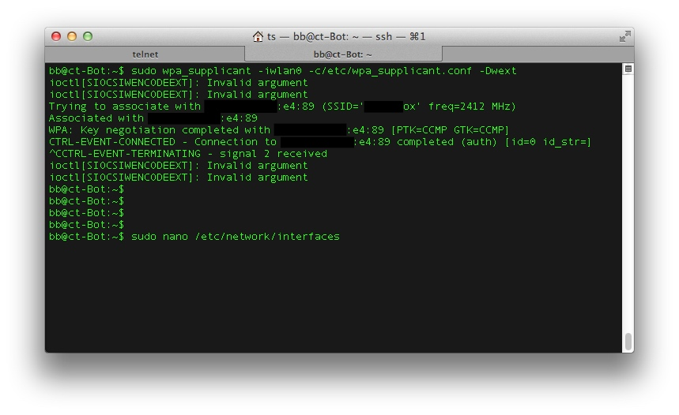

und ergänzt

  ```
  # The wifi interface
  auto wlan0
  iface wlan0 inet dhcp
  wpa-driver wext
  wpa-conf /etc/wpa_supplicant.conf
  ```

sodass die Datei wie folgt aussieht:

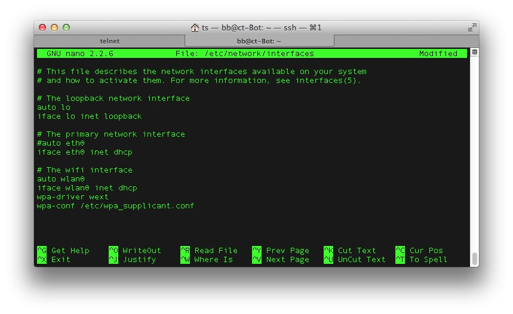

* _CTRL + o_ speichert die Datei und _CTRL + x_ schließt den Editor wieder:

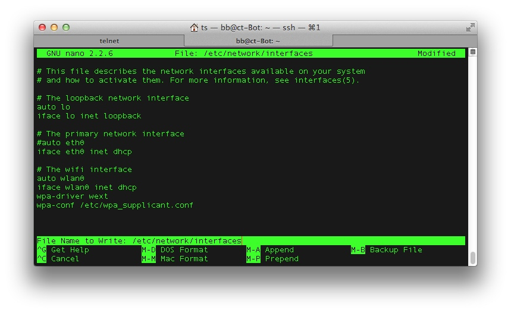

* Das neu eingerichtete Interface wird mit `sudo ifup -v wlan0` aktiviert und getestet:


* Die Ausgabe sollte ähnlich der Folgenden aussehen:

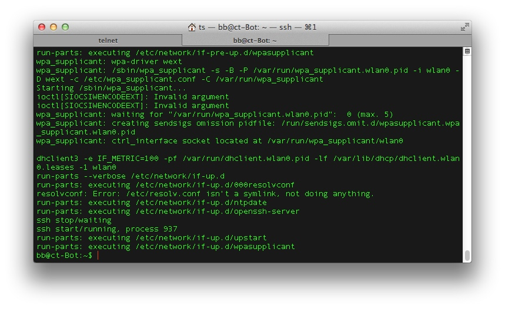

* Mit `ifconfig` lässt sich die Konfiguration des Interfaces überprüfen:

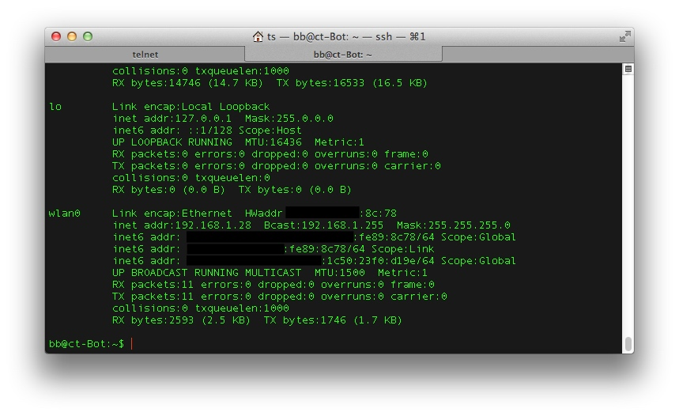

* Nach einem Neustart mit `sudo reboot` kann man das Ethernet-Kabel entfernen und über ssh auf die IP-Adresse der WLAN-Schnittstelle wie gewohnt eine Verbindung zum Board aufbauen:

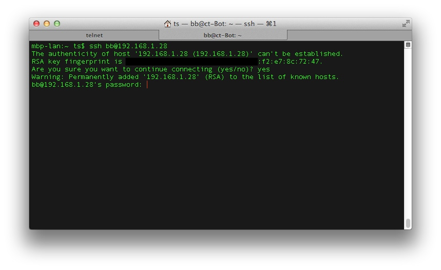

* Abschließend empfiehlt es sich, noch die Pakete _alsa-base_ und _libasound2-dev_ mit `sudo aptitude install alsa-base libasound2-dev` zu installieren:

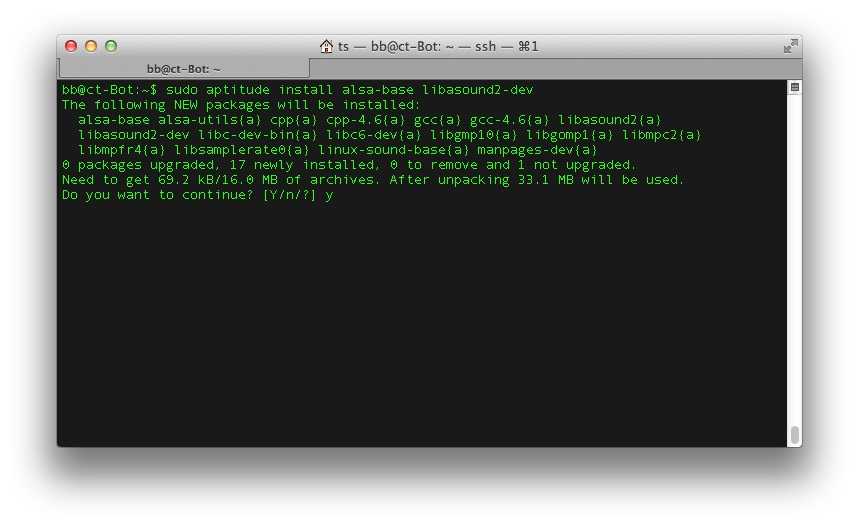


### System-Backup erstellen

* Nach der Installation und Konfiguration wird empfohlen ein Backup des gesamten Systems durchzuführen, um später im Bedarfsfall leicht wieder zu diesem Stand zurückkehren zu können.
Da das komplette System auf der (Micro-)SD-Karte installiert ist, bietet es sich an als Backup einfach ein Image der gesamten SD-Karte zu erstellen.
Unter Linux bzw. macOS lässt sich das mit `dd if=/dev/sdb bs=8M | pbzip2 -c > beagle-sd-backup.iso.bz2` bzw. `dd if=/dev/rdisk4 bs=8m | pbzip2 -c > beagle-sd-backup.iso.bz2` erledigen:


 `/dev/sdb` bzw. `/dev/rdisk4` ist entsprechend dem Gerät der SD-Karte anzupassen.


### Anwendungsbeispiel: Ausführung des c't-Bot-Codes auf dem BeagleBoard


### BeagleBoard-Emulation

Ein BeagleBoard mit einem installierten Linux-System lässt sich auch mit Qemu emulieren, wie dieser [Installationsanleitung für Ubuntu Hosts](https://www.cnx-software.com/2011/09/26/beagleboard-emulator-in-ubuntu-with-qemu) _(externer Link)_ entnommen werden kann.

[](https://creativecommons.org/licenses/by-sa/4.0/)

Autoren: Timo Sandmann, Nightwalker-87
