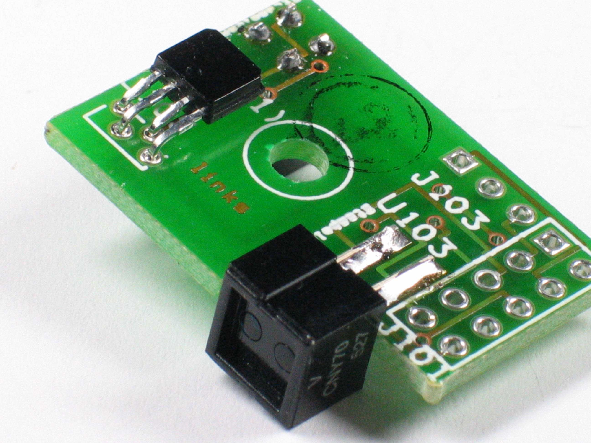
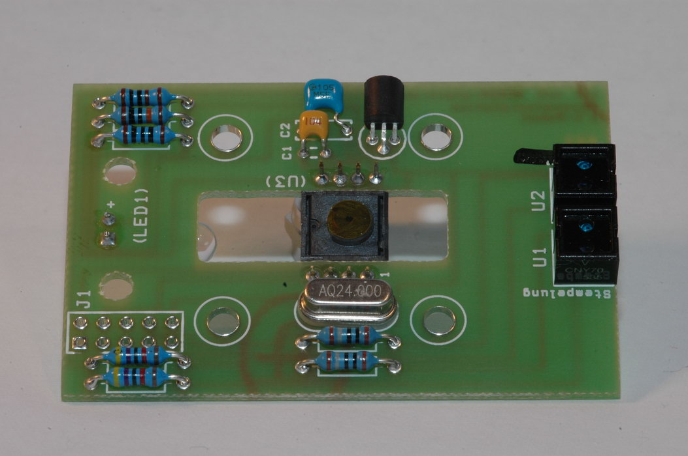
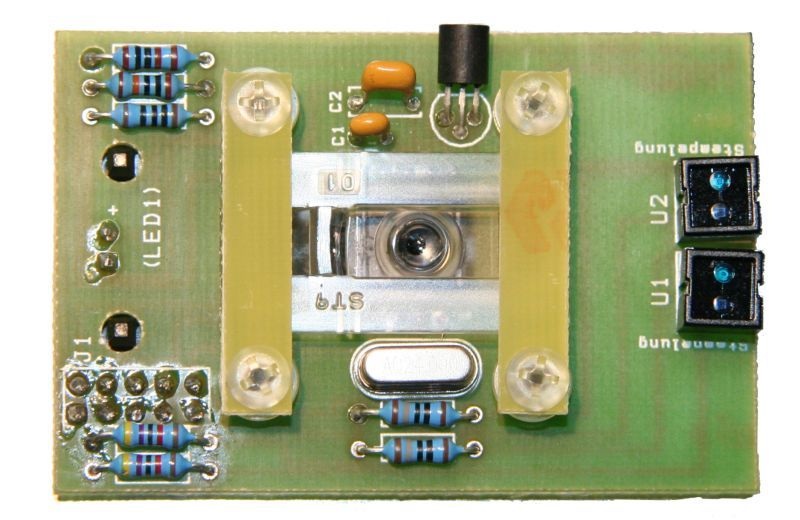
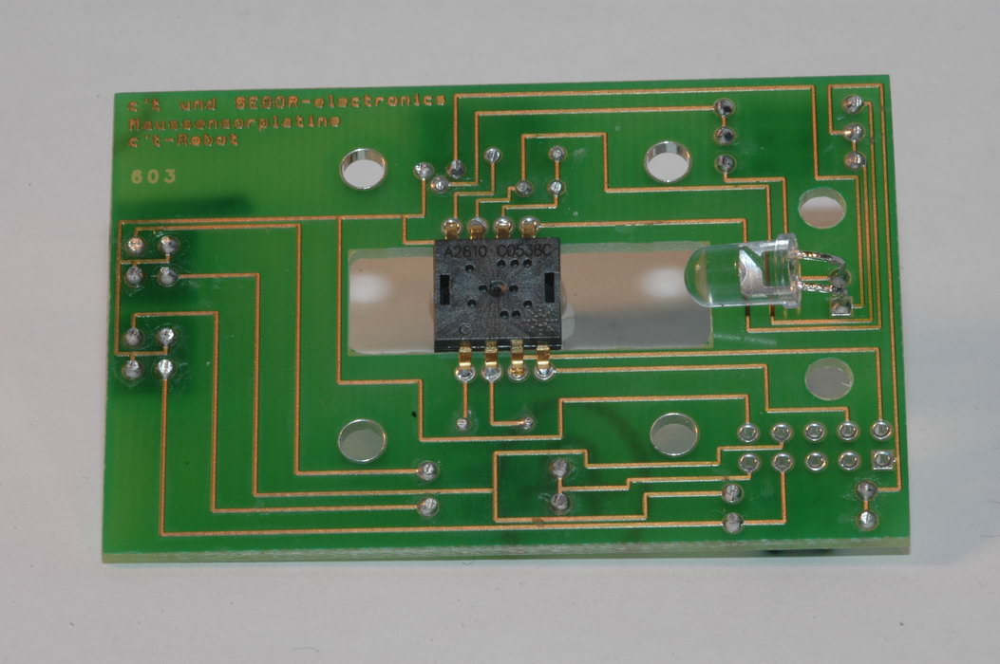

# Aufbauanleitung für den c't-Bot

Diese offizielle Aufbauanleitung entspricht inhaltlich jener in der c't 04/06. Ergänzt wurden unter anderem zwei kleine Tipps sowie eine ganze Reihe von Fotos.
Alle aktuellen Schalt- und Bestückungspläne finden sich im [Hardware-Repository](https://github.com/tsandmann/ct-bot-hw/tree/master/v1).

## Schritt für Schritt

Der Reflexkoppler U1 auf der Hauptplatine soll später den Schwenkarm zur Verriegelung des Transportfachs detektieren und wird als einziges Bauteil von unten mit der Platine verlötet.
Die Bauteil-Stempelung muss hierbei in Richtung von IC10 zeigen.
Alle anderen Bauteile kommen auf die Oberseite (Bestückungsdruck).
Die Kabelbäume werden durch die Schlitze in der Platine nach unten geführt, was die Montage vereinfacht.
Es folgen die Dioden (D1 bis D3), deren Kennring in die vom Bestückungsdruck angegebene Richtung zeigen muss.
Die IC-Sockel besitzen eine Kerbe, die später die korrekte Positionierung der ICs anzeigt.
Mit dem Einsetzen der ICs wartet man jedoch bis ganz zum Schluss.

Die Polung spielt für die Keramikkondensatoren C1 bis C4, die Spule (L1) und für den Quarz (Q1) keine Rolle.
Letzterer erhält eine Isolierscheibe als Unterlage.

Nun bietet es sich an die Widerstände zu bestücken:

Bei den acht Leuchtdioden kennzeichnet das längere Beinchen jeweils die Anode (Pluspol).
Den Spannungswandler (IC10) knickt man am Besten so ab, dass die Kühlfahne rund 1 mm über der Platine steht.
Dadurch bekommt der Wandler auch von unten ein wenig Luft und berührt keine Durchkontaktierungen.

Die lichtempfindliche, abgerundete Seite des IR-Empfängers (IC9) erfordert eine freie Sicht nach hinten.
Anschließend lötet man die Stiftleisten J1 bis J8, SW1, SW2 und BR1 sowie die Transistoren (TR1 bis TR6) ein.
Ein Jumper auf BR1 aktiviert später die Hintergrundbeleuchtung des Displays.

Den Platz des Widerstandes R29 nimmt eine Zenerdiode mit 2,4 Volt ein, deren Kennring in Richtung IC10 zeigt.
Bei den restlichen Widerständen spielt die Orientierung keine Rolle, sie lassen sich von der Geometrie her allerdings nur stehend platzieren.
In welche Richtung die zwei Fotowiderstände (LDR1, LDR2) Licht messen sollen, sei jedem selbst überlassen.
Bei den Steckverbindern ST1 bis ST9 und dem Elektrolytkondensator C5 muss man wieder die Polung beachten.
Nun fehlen nur noch das Potentiometer POT1 für den Display-Kontrast und die Hohlstecker-Buchse P1.

## Erster Test

Bevor man die empfindlichen ICs einsteckt, empfiehlt sich ein Funktionstest der Spannungsversorgung.
Dazu hängt man entweder einen Akkupack bestehend aus fünf AA-Zellen (Mignon) an Stecker ST1 oder ein Netzteil mit 6 Volt Gleichspannung an die Hohlstecker-Buchse P1.
Zeigt ein Voltmeter zwischen Pin 1 und Pin 3 der Leiste J3 +5,0 Volt an, arbeitet der Spannungsregler korrekt.
Zwischen Pin 2 und Pin 3 liegt hingegen direkt die Eingangsspannung.

**Achtung:** Die Belegung des Hohlsteckers und der zugehörigen Buchse hat sich gegenüber dem in c't 2/2006 abgedruckten Schaltplan geändert:
Masse (GND) muss nun außen und nicht mehr innen liegen.
Im [Schaltplan](https://github.com/tsandmann/ct-bot-hw/blob/master/v1/schematics/01_mainboard.pdf) ist dies bereits korrigiert.

Zur Sicherheit bewahrt eine Schutzdiode (D3) die Schaltung im Fehlerfall vor Schäden durch Verpolung.
Nach erfolgreichem Spannungstest und Abklemmen der Stromversorgung kann man nun die verbleibenden ICs einsetzen.

## Test der Hauptplatine

Nachdem die Hauptplatine fertig bestückt und der erste Test bestanden wurde, empfiehlt es sich, die Spannungsversorgung an den Bauteilen der Hauptplatine zu überprüfen, bevor der Bot weiter aufgebaut wird.
Kaum ein Bot wird wohl auf Anhieb fehlerfrei funktionieren.
Die Fehlersuche bei späteren Problemen gestaltet sich jedoch sehr viel einfacher, wenn davon ausgegangen werden kann, dass die Hauptplatine weitestgehend fehlerfrei funktioniert.
(Frustrierend dagegen ist, den Bot bei Problemen dann wieder komplett zerlegen zu müssen.)

Eine Hilfe zum Testen der korrekten Spannungsversorgung der Hauptplatine ist dieses [Messprotokoll (pdf)](../documents/measurement_protocol.pdf),
welches als [Messprotokoll (odt)](../documents/measurement_protocol.odt) auch leicht an eigene Bedürfnisse angepasst werden kann.

Eine Orientierungshilfe für die Bauteile der Hauptplatine bietet diese Kombination aus Bestückungs- und Schaltplan:
[Schaltplan-Bestückung (pdf)](../documents/schematic_assembly.pdf) oder [Schaltplan-Bestückung (odt)](../documents/schematic_assembly.odt)

## Sensor-Platinen

**Hinweis:** Die IR-LED für die Lichtschranke hat ein leicht bläulich-gefärbtes Gehäuse.

Auf den beiden kleinen Sensorplatinen zeigen Bauteile in drei verschiedene Richtungen.
Je eine Reflexlichtschranke (U103, U104) beobachtet den Boden und bekommt die Platine zwischen ihre Beinchen gesteckt.
Die Stempelung zeigt bei U104 zur Platine hin, bei U103 weg.

**Achtung:** In der ursprünglichen Version stimmt der Bestückungsdruck auf der Platine nicht, der hier dargestellte Ansicht ist die korrigierte Version.

Die anderen beiden Reflexlichtschranke (U101, U102) beobachten die Innenseite der Räder mit den Encoder-Scheiben.
Die Leuchtdiode (LED101) auf der rechte Platine) kommt auf die Unterseite, während die Lichtschranke (U105) auf der linken Platine sitzt (auf der Seite mit dem Bestückungsdruck).
Die Lichtschranke muss dazu so abgewinkelt werden, dass ihre flache Seite später zur Leuchtdiode blickt.

Das Verlöten aller Kabel hebt man sich bis zur Endmontage auf.

## Mausbau

**Hinweis:** Die transparente LED für den Maussensor strahlt rotes Licht aus.

Damit der Roboter seine Position verfolgen kann, bekommt er seine eigene optische Maus.
Dieser Sensor meldet Daten über Bewegungen in X- und Y-Richtung direkt an den Mikrocontroller.

Die Kondensatoren (C1, C2) und Widerstände (R1-R7) platziert man wie fast alle Bauteile auf der Seite der Platine, die keine Leiterbahnen enthält.
Der Quarz Q1 erhält wieder eine Isolierscheibe und der Transistor Q2 wird um 90° abgewinkelt, damit seine flache Seite auf der Platine aufliegt.
Anders als auf der Platine aufgedruckt, müssen die Stempelungen der beiden Liniensensoren (U1, U2) beide zu der Seite zeigen, an der auch der Quarz sitzt.

|  |  |
| ---                                                                                         | ---                                                                                       |

Der Sensor-Chip (U3) wird von der Leiterbahnseite aus auf die Platine aufgesteckt.
Das für die Detektion benötigte Licht liefert nachher die Leuchtdiode (LED1), welche in einen zum Chip gehörenden Kunststoffträger eingesetzt wird.
Nach dem Abwinkeln der LED-Kontakte um 90° wird der Träger auf der gleichen Seite der Platine gesteckt auf der auch der Sensor-IC sitzt.
Für die beiden Kunststoffnoppen des Trägers wurden auf der Platine zwei Löcher vorgesehen.

Bestandteil des Chip-Zubehörs ist auch eine Linsenplatte aus transparentem Kunststoff.
Diese fokussiert das Licht der LED und reflektiert den Lichtstrahl über ein enthaltenens Prisma um 90°.
Anschließend wird das Lichtbündel auf die Detektionsebene unter der Sensoröffnung des Chips projiziert.

Nach dem Entfernen der Schutzfolie auf der Unterseite des Sensor-ICs wird die Linsenplatte von unten auf den IC aufgesetzt.

Zwei kleine mit jeweils zwei PVC-Schrauben versehene Platinenstreifen fixieren deren Position und werden anschließend mit der Platine und einer Abschlussplatte zu einem Sandwich verschraubt.
Je eine PVCMutter und eine Unterlegscheibe sorgen dabei für den richtigen Abstand und verhindern zu hohen Druck auf die Kunststoffteile.

Technische Zeichnungen zum beschriebenen Strahlverlauf und zum Zusammenbau des Maussensors finden sich im zugehörigen [Datenblatt](https://github.com/tsandmann/ct-bot-hw/blob/master/v1/datasheets/_obsolete/ADNS-2610%20Agilent%202004-10.pdf) auf den Seiten 3 und 4.

## Sensorplatinen

Die beiden vorderen Aluminium-Trägerpfosten, welche später links und rechts neben dem Transportfach montiert werden, halten auch die Sensorplatinen und die Abstandssensoren in Position.
Eine Unterlegscheibe zwischen Schraubenkopf und Sensorplatine verhindert hier Kurzschlüsse.
Die dreipoligen Stecker der Distanzsensoren zeigen nach links beziehungsweise rechts außen, sodass die Kabel nicht in das Transportfach hineinragen.
Kurze Kabel verbinden sie mit den Sensorplatinen.

**Achtung:** Die GP2D12-Sensoren verzeihen keine Verpolung. Daher ist beim Anlöten der Kabel unbedingt auf die korrekte Polung zu achten:

Blickt man direkt in den Stecker hinein, während die Sensorlinsen nach oben zeigen, so liegt Pin 1 auf der linken Seite.
Sofern die rote Ader des Anschlusskabels Pin 1 zugeordnet wird, zeigt im montierten Zustand und relativ zur Fahrtrichtung gesehen beim linken Sensor die rote Ader nach oben und beim rechten Sensor nach unten.

Auf der linken Platine muss das rote Kabel auf der linken Sensorplatine dann an Pin 3 des Anschlussfeldes J103 eingelötet werden, welches am weitesten vom Trägerpfosten entfernt ist.
Danach folgen entsprechend die braune und schwarze Ader auf Pin 2 und Pin 1 (eckiges Lötpad) von J103.

Auf der vom Bot aus gesehen rechten Platine sitzt das schwarze Kabel ganz oben und platinenseitig auf Pin 1 (eckiges Lötauge) des Anschlussfeldes J104.
Auf Pin 2 und Pin 3 folgen dann entsprechend die Adern Braun und Rot.
Auch auf dieser Sensorplatine ist Pin 3 am weitesten vom Aluminiumträger entfernt.

**Hinweis:** Wie sich gezeigt hat, ist das _Gehäuse der Distanzsensoren nicht elektrisch isolierend_.
Damit die Distanzsensoren später brauchbare Messwerte liefern, ist ein Kontakt des Gehäuses mit den Trägerpfosten wie auch mit den Lötstellen der Sensorplatinen unbedingt zu vermeiden.
Am Besten gelingt dies bei der Montage mit Unterlegscheiben und Schrauben aus Kunststoff.

_Anmerkung: Für einen besseren Sitz der Stecker können die Kabel bei entsprechender Vertauschung der Anschlussadern Rot und Schwarz auf Wunsch auch spiegelverkehrt in den Sensor-Anschluss eingesteckt werden._

## Mechanik

Vier Platinen sind bestückt und fast alle Teile haben ihren Platz gefunden.
Einer Endmontage des Roboters steht nun also nichts mehr im Wege.
Hier lohnt es sich den ganzen Roboter erst einmal lose zu montieren.
Auf diese Weise kann man die Längen der einzelnen Verbindungskabel bequem ausmessen.
Letztere sollten dabei möglichst dicht an den Trägerpfosten entlang verlaufen, um die Mechanik nicht zu behindern.

Die Grundplatte aus Aluminium besitzt bereits alle nötigen Bohrungen und Schlitze für die Räder, das Maus-Sandwich, die Motorflansche und die Aluminium-Träger.
Die U-förmige Aussparung in Vorausrichtung dient später dem Roboter als Transportfach.
Legt man die Grundplatte so vor sich, dass die Aussparung von einem weg weist, sollte nur links unten eine Bohrung für den Träger sein. Rechts fehlt sie, da die Grundplatte ist nicht symmetrisch ist.

## Endmontage

Zunächst befestigt man den Gleitpin mit einer Kreuzschlitzschraube, dann kommt das vorbereitete Maus-Sandwich von unten in die Aussparung.
Die beiden Lichtschranken zeigen nach vorne, wobei je zwei Unterlegscheiben die Platine auf Abstand zur Aluminiumunterlage halten.
Zwei Kunststoffmuttern pro Schraube fixieren die Konstruktion von oben.
Darauf kommt zum Schutz das letzte noch ungenutzte Stück Platinenmaterial.

Damit der Roboter später seine Räder überwachen kann, werden die beiliegenden Encoder-Scheiben mit abwechselnd hellen und dunklen Feldern auf die Innenseite der Räder geklebt.
Bei jedem Übergang zwischen diesen Feldern liefern später die Lichtschranken U101 und U102 ein Signal.
Nachdem die Motoren mit M2-Schrauben an ihren Flanschen befestigt und die Räder mit sanftem Druck aufgesteckt sind, sichert man diese mit je einer Madenschraube.
M3-Schrauben von oben und Muttern von unten verbinden die Motorblöcke schließlich mit der Grundplatte.

Oben auf die Trägerpfosten wird schließlich die Hauptplatine geschraubt.

## Verkabelung

Beim Verlegen der einseitig vorkonfektionierten Kabel für ST1 bis ST3 und ST7 bis ST9 sollte oberhalb der Hauptplatine genug Spiel gelassen werden, um die Stecker nachher abziehen zu können.
Kabelschellen und -binder halten die Leitungen zusammen.
Dank der Schlitze in der Hauptplatine muss kein Kabel über den Umfang der Grundplatte hinausragen — somit kann sich der Roboter später nicht verheddern.

Als Nächstes betrachten wir die Kabel für Stecker ST7 bis ST9.
Die Pinbelegung der doppelreihigen Lötfelder J1, J101 bzw. J102 auf den Sensorplatinen entspricht der üblichen Zählweise — im Zickzack.
Somit ergibt sich ein Anschluss bei dem in einer Reihe entweder nur "gerade" oder "ungerade" Kabel angelötet sind oder anders ausgedrückt:
Es werden Pärchen von jeweils zwei nebeneinanderliegenden Kabeln am Stecker gebildet, die dann in einer Spalte am entsprechenden J-Anschluss angelötet werden.
Im allgemeinen Fall befinden sich folglich die Farben Schwarz, Rot, Gelb, Blau, Grau in der ersten Reihe und Braun, Orange, Grün, Violett und Weiß in der zweiten Reihe.

Begonnen wird jeweils mit Pin 1, welcher durch ein eckiges Lötauge gekennzeichnet ist.
Hier wird das Ende des schwarzen Kabels (entspricht auf der Steckerseite ebenfalls Pin 1) eingelötet.

**Hinweis:** Die Belegung der farbigen Adern an den vorkonvektionierten Steckern kann bei einzelnen Versionen des Bausatzes abweichen!

|  |  |
| ---                                                                           | ---                                                                           |

### Motoren

Beim Verkabeln der beiden Motoren wird das braune Kabel der zwei-adrigen, vorkonfektionierten Kabel an den Pluspol und die schwarze Ader an den Minuspol der Motoren angelötet.
Somit drehen die Motoren gegenläufig, was die Firmware des Mikrocontrollers jedoch korrigiert.

### Akkupack

Die beiden Batteriehalter verklebt man zu einem Block, der später auf dem Maus-Sandwich ruht und mit Moosgummi-Pads und Klettband in Position gehalten wird.
Elektrisch hängen alle fünf Batterien in Reihe, wozu der Pluspol des einen Päckchens mit dem Minuspol des anderen zu verbinden ist.

## Fotos

Die hochauflösenden Fotos von den fertig bestückten Platinen sollten letztlich alle verbliebenen Unklarheiten bezüglich der Platzierung und Ausrichtung von Bauteilen ausräumen:

* Oberseite Hauptplatine von vorne gesehen:
  

* Oberseite Hauptplatine von hinten gesehen:
  

* Oberseite Hauptplatine von links gesehen:
  

* Oberseite Hauptplatine von rechts gesehen:
  

* Innenseite linke Sensorplatine von schräg vorne bzw. unten gesehen:
  

* Innenseite linke Sensorplatine von hinten gesehen:
  

* Außenseite rechte Sensorplatine von hinten gesehen:
  

* Innenseite rechte Sensorplatine von hinten gesehen:
  

* Unterseite Mausplatine:
  
  
  

* Oberseite Mausplatine:
  
  

Autoren: Benjamin Benz, Peter Recktenwald, Galdo, Philipp, anonybot, Nightwalker-87
