# Teilelisten & Design-Dokumente für den c't-Bot

## Korrekturen und Hinweise

Im Laufe des Projekts haben sich in der Dokumentation und, wie sich im Laufe der Zeit herausgestellt hat, auch im Hardware-Design ein paar kleinere Fehler eingeschlichen.
Die ursprünglichen Urheber und Autoren bitten dadurch entstandene Umstände und Irrtümer zu entschuldigen.

Bei der aktuellen Version der Dokumentation handelt es sich um eine gegenüber der originalen Aufbauanleitung aus dem c't-Artikel
[c't 04/2006 S.208 ff](https://www.heise.de/ct/artikel/Hallo-Welt-290314.html): "Hallo Welt! - Aufbau und Inbetriebnahme des c't-Bots" beinigte Revision,
die an den entsprechenden Stellen auf diese Fehler hinweist und entsprechende Korrekturhinweise liefert.

Korrigiert und überarbeitet wurden die folgenden Design-Files:

* Stückliste (aus c't 04/2006):
    - R6, R32, Pot1 haben falsche Werte.
    - Die LEDs sind in der Liste verrutscht.
* Schaltplan der Maussensorplatine (aus c't 04/2006):
    - U102 ist verpolt.
* Bestückungsplan der Hauptplatine (aus c't 04/2006):
    - R7 und R27 sind vertauscht.
* Schaltplan der Hauptplatine (aus c't 02/2006) [Alle diese Änderungen sind bereits die c't Ausgabe 04/2006 dokumentiert.]:
    - Änderungen diverser Widerstandswerte
    - Schutzschaltung gegen das Verpolen der Spannungsversorgung hinzugefügt
    - Umkehrung der Polung an der DC-Buchse
* Die Montageanleitung der IR-Distanzsensoren im Beipackzettel ist fehlerhaft.

Aufbauanleitungen und Korrekturhinweise, die den Teilesätzen beilagen, welche vor dem 12.02.2006 ausgeliefert wurden, sollten zu Gunsten dieser Dokumentation nicht mehr beachtet werden.

## Schaltpläne

* [Hauptplatine](https://github.com/tsandmann/ct-bot-hw/tree/master/v1/schematics/01_mainboard.pdf)
* [Sensorplatinen](https://github.com/tsandmann/ct-bot-hw/tree/master/v1/schematics/02_sensorboard_L_R.pdf)
* [Maussensorplatine](https://github.com/tsandmann/ct-bot-hw/tree/master/v1/schematics/03_sensorboard_mouse.pdf)

## Bestückungspläne

* [Hauptplatine mit Sensorplatinen](https://github.com/tsandmann/ct-bot-hw/tree/master/v1/pcb-layout/01_pcb_mainboard.pdf)
* [Maussensorplatine](https://github.com/tsandmann/ct-bot-hw/tree/master/v1/pcb-layout/03_pcb_sensorboard_mouse.pdf)

## Mechanische Teile

| 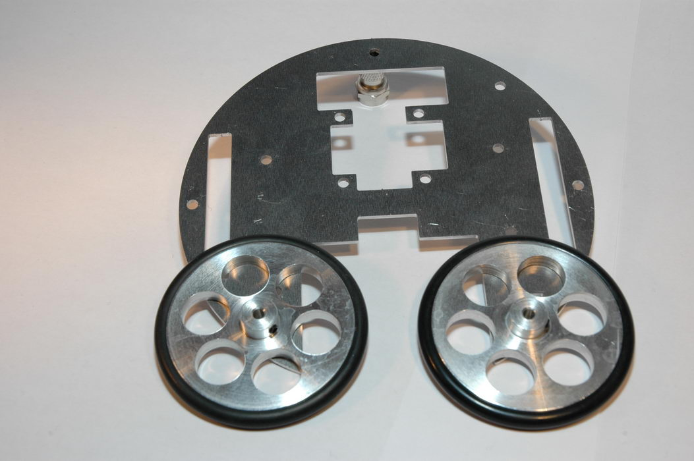 | 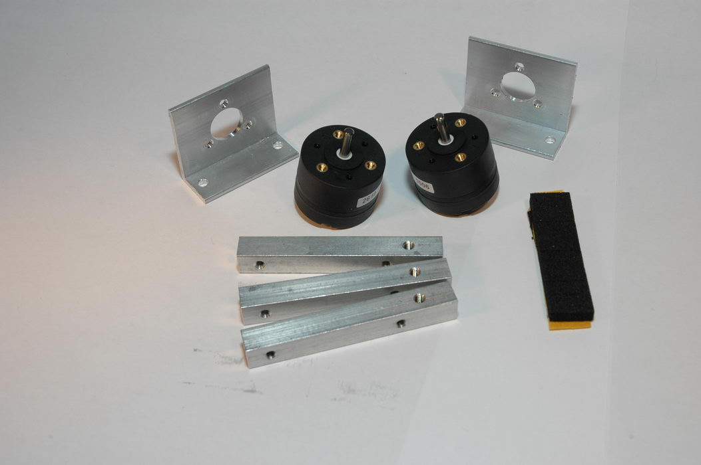 | 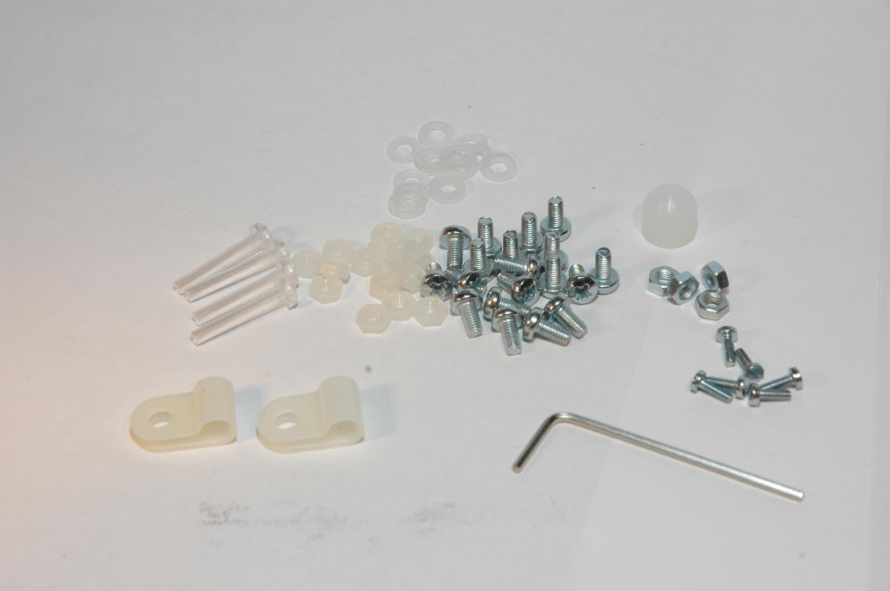 |
| ---                                                                                   | ---                                                                                   | ---                                                               |

| Bauteil                         | Anzahl | Bezeichnung                                                                                                 |
| :---                            | :---   | :---                                                                                                        |
| Grundplatte                     |      1 | gemäß [Technischer Zeichnung](https://github.com/tsandmann/ct-bot-hw/tree/master/v1/drawings/baseplate.pdf) |
| Motorflansch                    |      2 | links / rechts identisch                                                                                    |
| Motor                           |      2 |                                                                                                             |
| Rad                             |      2 | ohne Reifen                                                                                                 |
| Reifen                          |      2 |                                                                                                             |
| Madenschraube M3x4 GWST         |      2 | für die Radfixierung auf der Motorachse                                                                     |
| Imbus-Schlüssel 1,5             |      1 | Werkzeug für die Madenschrauben                                                                             |
| Schraube M2x6                   |      6 | für Motorflansche                                                                                           |
| Teflongleiter                   |      1 | mit Gewinde                                                                                                 |
| Aluminiumträger                 |      3 |                                                                                                             |
| Kreuzschlitzschraube M3x6K      |     19 |                                                                                                             |
| Mutter M3                       |      4 | für die Befestigung der Motorflansche auf der Grundplatte                                                   |
| Kunststoffschrauben M3x18       |      4 | für Maussensor-Sandwich                                                                                     |
| Kunststoff-Unterlegscheiben 3,2 |     14 | 12x für Maussensor-Sandwich, je 1x für Sensorplatinen L/R                                                   |
| Kunststoff-Muttern M3           |     16 | für Maussensor-Sandwich                                                                                     |
| Kabel-Halteschellen             |      2 | für Maussensor-Kabelbaum an hinterem Aluminiumträger                                                        |
| Kabelbinder                     |      2 | für Kabelbäume der Sensorplatinen an vorderen Aluminiumträgern                                              |
| Moosgummifüße                   |      4 | Auflage für Akkupack auf Abdeckplatte des Maussensor-Sandwichs                                              |
| Klettbinder                     |      1 | als Akkupack-Befestigung                                                                                    |
| Batteriehalter 3x Mignon        |      1 |                                                                                                             |
| Batteriehalter 2x Mignon        |      1 |                                                                                                             |
| Encoderscheibe                  |      2 | seit der 5. Auflage enthalten                                                                               |

## Platinensatz

* Hauptplatine; inkl. der beiden seitlichen Sensorplatinen
* Maussensorplatine; inkl. der beiden Trägerstreifen
* Abdeckplatte

| 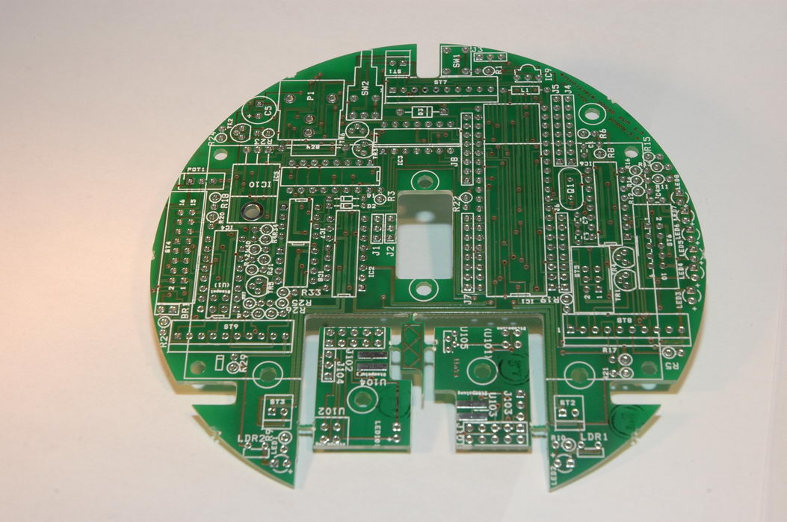 | 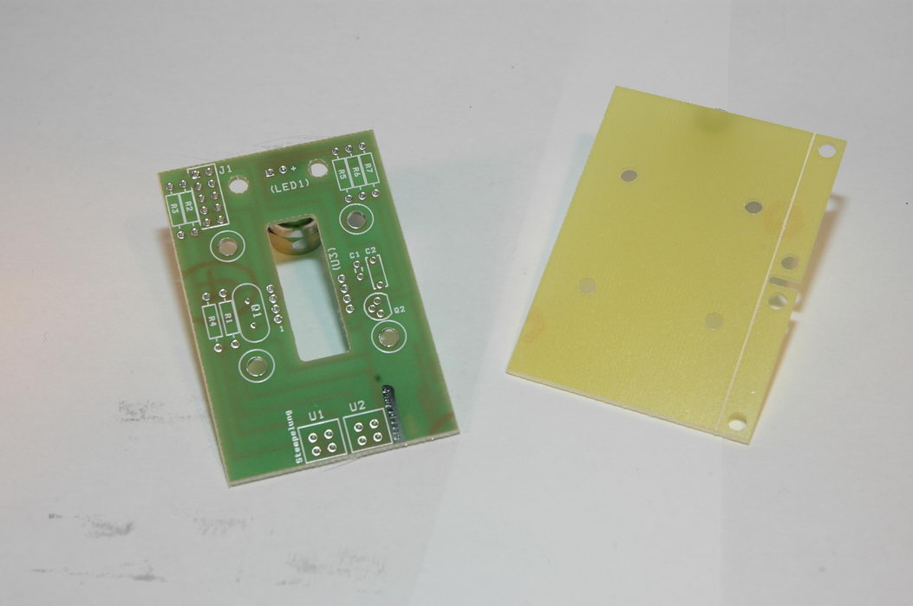 |
| ---                                                                         | ---                                                                     |

## Elektronik-Komponenten & Stücklisten

| 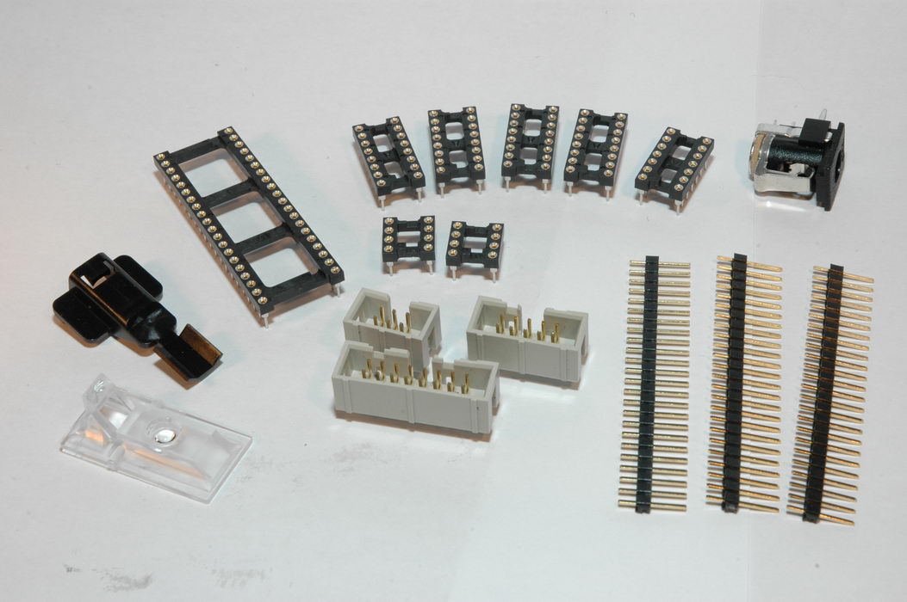 | 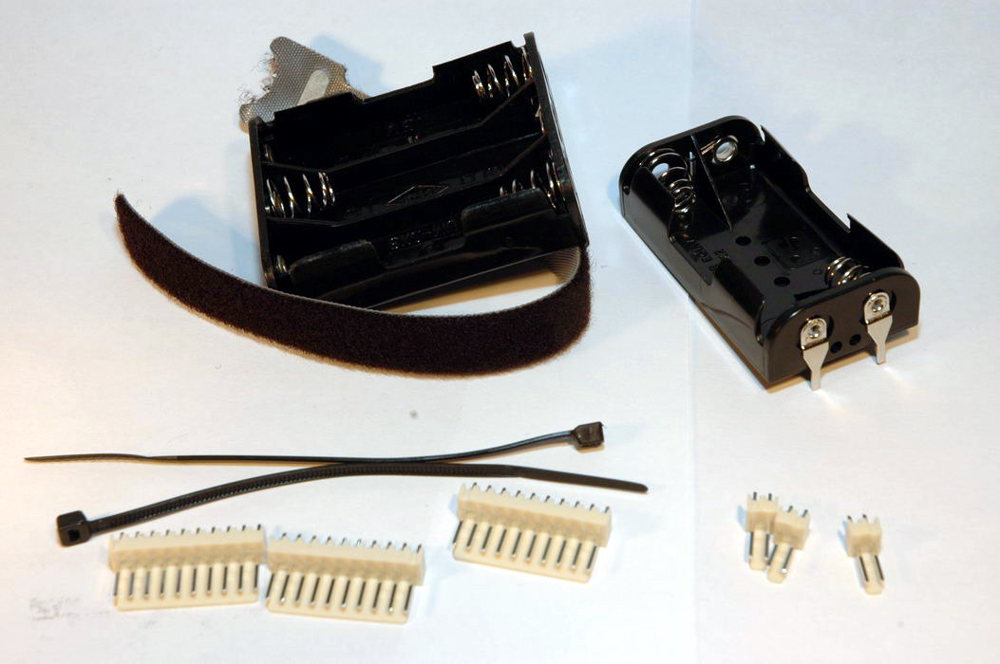 | 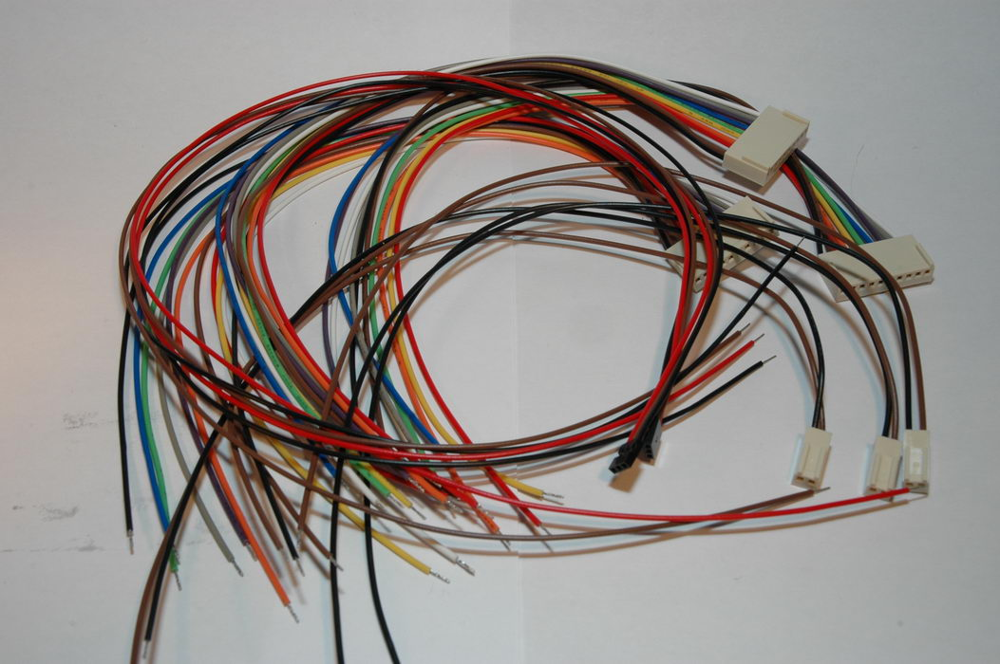 |
| ---                                                                 | ---                                                                                     | ---                                                               |

| 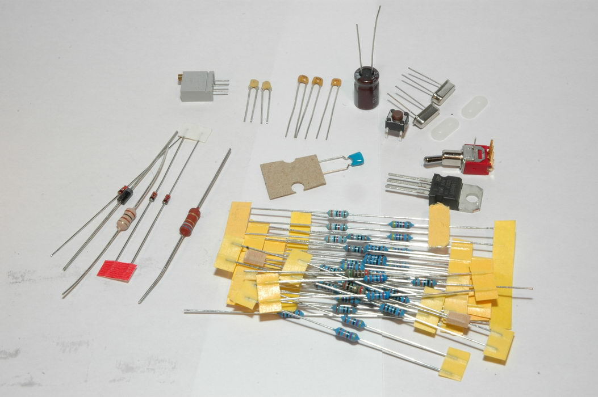 | 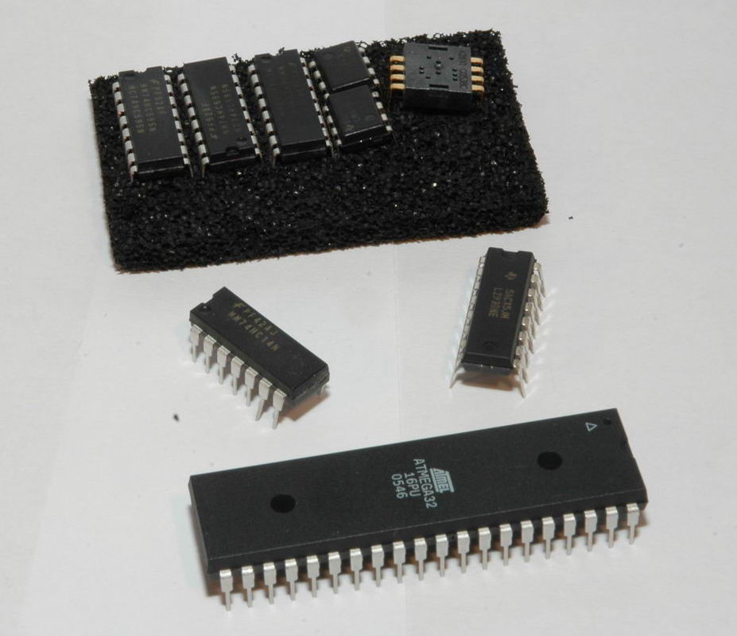 | 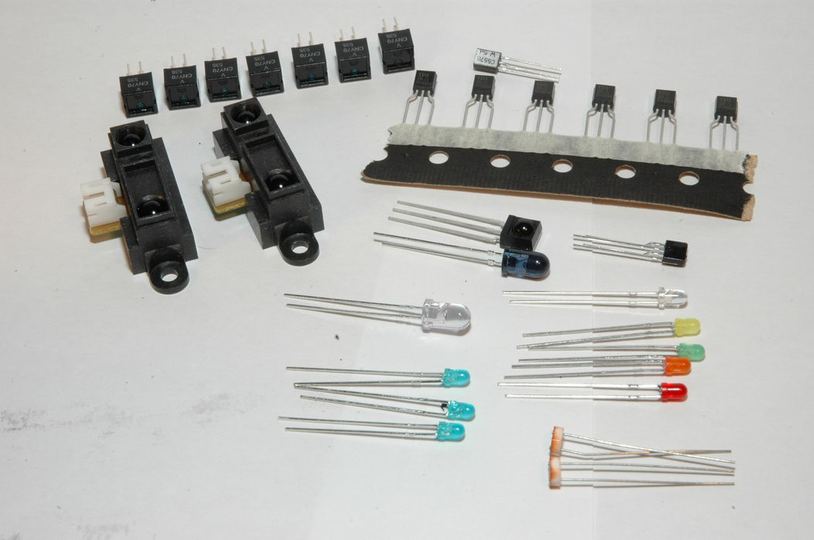 |
| ---                                                                               | ---                                                         | ---                                                                 |

### Hauptplatine

| Bauteil           | Bezeichnung                                                  | Bemerkungen                                                               |
| :---              | :---                                                         | :---                                                                      |
| C1, C2            | Keramik-Kondensator 22 pF                                    |                                                                           |
| C3, C4            | Keramik-Kondensator 100 nF                                   | Stempelung 104                                                            |
| C5                | Elektrolyt-Kondensator 100 µF                                | Polung beachten                                                           |
| D1, D2            | Diode 1N4148                                                 | Polung beachten                                                           |
| D3                | Diode SB140                                                  | Polung beachten                                                           |
| IC1               | ATmega-Mikrocontroller                                       | mit IC-Sockel; kompatible Modelle: ATmega1284P / 644P / 644 / 32          |
| IC2               | Push-Pull 4 Channel Driver with Diodes L293D                 | mit IC-Sockel                                                             |
| IC3               | Hex Schmitt-Trigger Inverter 74HC14N                         | mit IC-Sockel                                                             |
| IC4, IC5, IC6     | 8-Bit Schieberegister mit 3-State Output Registern 74HC595N  | jeweils mit IC-Sockel                                                     |
| IC7, IC8          | Komparator LM311N                                            | jeweils mit IC-Sockel                                                     |
| IC9               | FB-Empfänger TSOP34836                                       |                                                                           |
| IC10              | Spannungsregler L4940V5                                      |                                                                           |
| J1 - J3           | Stiftleiste (3x1)                                            |                                                                           |
| J4 - J8           | Stiftleiste (8x1)                                            |                                                                           |
| LDR1, LDR2        | Helligkeitssensor MPY54C569                                  |                                                                           |
| LED1, LED2, LED7  | Leuchtdiode (blau)                                           | kurzes Bein ist die Kathode (Minus)                                       |
| LED3              | Leuchtdiode (rot)                                            | kurzes Bein ist die Kathode (Minus)                                       |
| LED4              | Leuchtdiode (orange)                                         | kurzes Bein ist die Kathode (Minus)                                       |
| LED5              | Leuchtdiode (gelb)                                           | kurzes Bein ist die Kathode (Minus)                                       |
| LED6              | Leuchtdiode (grün)                                           | kurzes Bein ist die Kathode (Minus)                                       |
| LED8              | Leuchtdiode (weiß)                                           | kurzes Bein ist die Kathode (Minus)                                       |
| L1                | Drossel 100 µH SMCC 5%                                       | Farbring-Kennung: braun-schwarz-braun-gold                                |
| POT1              | Trimmpotentiometer 5 kΩ                                      | für die Einstellung des Displaykontrasts                                  |
| P1                | DC-Hohlstecker-Buchse 2,1-R                                  |                                                                           |
| Q1                | Quarz 16 MHz LP/GW                                           | mit Abstandshalter / Isolierscheibe; alternativ 20 MHz Quarz              |
| R1                | Widerstand 10 kΩ 1%                                          | Farbring-Kennung: braun-schwarz-schwarz-rot-braun                         |
| R2                | Widerstand 20 Ω 1%                                           | Farbring-Kennung: rot-schwarz-schwarz-gold-braun; alternativ: Drahtbrücke |
| R3, R4, R8        | Widerstand 4,7 kΩ 1%                                         | Farbring-Kennung: gelb-violett-schwarz-braun-braun                        |
| R5 - R7, R30, R31 | Widerstand 47 kΩ 1%                                          | Farbring-Kennung: gelb-violett-schwarz-rot-braun                          |
| R9 - R16          | Widerstand 160 Ω 1%                                          | Farbring-Kennung: braun-blau-schwarz-schwarz-braun                        |
| R17, R18, R32     | Widerstand 39 kΩ 1%                                          | Farbring-Kennung: orange-weiß-schwarz-rot-braun                           |
| R19, R20          | Widerstand 6,2 kΩ 1%                                         | Farbring-Kennung: blau-rot-schwarz-braun-braun                            |
| R21, R22          | Widerstand 470 kΩ 1%                                         | Farbring-Kennung: gelb-violett-schwarz-orange-braun                       |
| R23 - R26         | Widerstand 180 Ω 1%                                          | Farbring-Kennung: braun-grau-schwarz-schwarz-braun                        |
| R27               | Widerstand 100 Ω 1%                                          | Farbring-Kennung: braun-schwarz-schwarz-schwarz-braun                     |
| R28               | MOX-Widerstand 6,8 Ω 5%                                      | Farbring-Kennung: blau-grau-gold-gold                                     |
| R29               | Zener-Diode 2,4 V 0,5 W                                      | Polung beachten                                                           |
| R33               | Widerstand 1 kΩ 1%                                           | Farbring-Kennung: braun-schwarz-schwarz-braun-braun                       |
| R34               | Widerstand 5,1 kΩ 1%                                         | Farbring-Kennung: grün-braun-schwarz-braun-braun                          |
| ST1 - ST3         | 2-poliger Stecker                                            | mit passendem vorkonfektioniertem 2-adrigem Kabel                         |
| ST4               | 16-poliger Wannenstecker                                     | Stecker für Displayanschluss                                              |
| ST5               | 6-poliger Wannenstecker                                      | Stecker für ISP-Programmierung; Pinbelegung nach Atmel-Standard)          |
| ST6               | 10-poliger Wannenstecker                                     | Stecker für ISP-Programmierung; für BlueMP3-Programmer)                   |
| ST7 - ST9         | 10-poliger Stecker                                           | mit passendem vorkonfektioniertem 10-adrigem Kabel                        |
| SW1               | Taster                                                       | Reset-Taster                                                              |
| SW2               | Kippschalter                                                 |                                                                           |
| TR1 - TR6         | P-Channel MOSFET BS250                                       |                                                                           |
| U1                | Optischer Reflexionssensor CNY70                             |                                                                           |

### Sensorplatinen links/rechts

| Bauteil           | Bezeichnung                                                  | Bemerkungen                                                               |
| :---              | :---                                                         | :---                                                                      |
| U101 - U104       | Optischer Reflexionssensor CNY70                             |                                                                           |
| U105              | Infrarot-Empfänger IS471F                                    | für Transportfach-Lichtschranke                                           |
| LED101            | Leuchtdiode (Infrarot) LD274-3                               | für Transportfach-Lichtschranke; kurzes Bein ist die Kathode (Minus)      |
| -                 | Infrarot-Abstandssensor GP2D12                               | je ein Sensor für die linke und die rechte Sensorplatine; mit Kabelsatz   |

### Maussensorplatine

| Bauteil           | Bezeichnung                                                  | Bemerkungen                                                               |
| :---              | :---                                                         | :---                                                                      |
| C1                | Keramik-Kondensator 100 nF                                   | Stempelung 104                                                            |
| C2                | Keramik-Kondensator 1 uF                                     | Stempelung 105                                                            |
| R1, R4            | Widerstand 180 Ω 1%                                          | Farbring-Kennung: braun-grau-schwarz-schwarz-braun                        |
| R2, R3            | Widerstand 47 kΩ 1%                                          | Farbring-Kennung: gelb-violett-schwarz-rot-braun                          |
| R5                | Widerstand 100 Ω 1%                                          | Farbring-Kennung: braun-schwarz-schwarz-schwarz-braun                     |
| R6                | Widerstand 100 kΩ 1%                                         | Farbring-Kennung: braun-schwarz-schwarz-orange-braun                      |
| R7                | Widerstand 1 kΩ 1%                                           | Farbring-Kennung: braun-schwarz-schwarz-braun-braun                       |
| Q1                | Quarz 24 MHz LP/GW                                           | mit Abstandshalter / Isolierscheibe                                       |
| Q2                | PNP-Bipolar-Transistor BC557B                                |                                                                           |
| LED1              | Leuchtdiode (rot) HLMP-ED80-K0T00                            | für Maussensor; kurzes Bein ist die Kathode (Minus)                       |
| U1, U2            | Optischer Reflexionssensor CNY70                             |                                                                           |
| U3                | Optischer Navigationssensor ADNS2610                         | inkl. Klammer für LED (HDNS-2200) & Linsenplatte (HDNS-2100)              |

Autoren: Benjamin Benz, Timo Sandmann, Peter Recktenwald, Nightwalker-87
