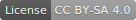

# LCD-Display-Modul für den c't-Bot

## Einführung

Eine Erweiterungsmöglichkeit des c't-Bots ist der Anschluss eines LCD-Displaymoduls, welches als entsprechender Bausatz mit allen benötigten Teilen verfügbar ist.
Hierbei handelt es sich um das LCD Dot-Matrix-Modul "DEM 20485 SYH-LY-CYR22" von Display Elektronik ([Datenblatt](https://github.com/tsandmann/ct-bot-hw/blob/master/v1/datasheets/DEM_20485_SYH-LY-CYR22_Display_Elektronik_2008-08.pdf)).
Dieses Modul mit den Abmessungen von 98 x 60 mm nutzt den Controller KS0076B/KS0063 (HD44780 kompatibel) um maximal 4x20 Zeichen darzustellen.

Andere Baugleiche LCD-Module können aber ebenso verwendet werden, so z.B. das Modul "Displaytech 204A" oder das Modul "EA W204B-NLW" von Electronic Assembly.
Vor dem Kauf eines anderen Displays empfiehlt sich der Blick in das entsprechende Datenblatt.

**Achtung:** Besonders zu beachten ist dabei die Pinbelegung für die Hintergrundbeleuchtung, die sich von Modul zu Modul unterscheiden kann.
Oftmals sind wie beispielsweise beim **Modul "EA W204B-NLW" die Pins 15 und 16 vertauscht**.
Darüber hinaus gibt es LCD-Module für den erweiterten Temperaturbereich -20° ... +70°C.
Diese benötigen eine negative Kontrastspannung und sind daher mit dem Elektronikdesign nicht kompatibel.

## Mechanische Teile

| Bezeichnung                        | Anzahl | Bemerkungen                                 |
| ---                                | ---    | ---                                         |
| LCD-Display DEM 20485 SYH-LY-CYR22 |      1 | 4x20 Zeichen mit LED-Hintergrundbeleuchtung |
| Abstandsbolzen M3x40               |      4 | mit Gewinde                                 |
| Schrauben M3x6K                    |      8 |                                             |
| Flachbandkabel FB16/BELDEN         |      1 | benötigte Kabellänge: ca. 15 cm             |
| Stecker AWP16                      |      1 |                                             |

## Aufbauanleitung

Eine Kennzeichnung von Pin 1 am Displaystecker (ST4) mit einem Pfeil vereinfacht nach der steckerseitigen Konfektionierung die Verkabelung auf der Displayseite:
Die rote Ader des Flachbandkabels entspricht vorzugsweise Pin 1 und wird damit auch einfach an Pin 1 des Displays gelötet.
Alle weiteren Kabel folgen dann einfach der Reihe nach.
Es wird empfohlen am Display die Kabel von unten über die Lötaugen anzulöten, und nicht von von der Oberseite aus, da die Kabel so besser vor Beschädigung durch Abknicken geschützt sind.

|  |  |  |
| ---                                                                                 | ---                                                                                                   | ---                                                                                          |

Ebenfalls sei hier darauf hingewiesen, dass das Display in den meisten Fällen nicht defekt und durch obiges Vorgehen auch eine falsche Verkabelung ausgeschlossen ist.
Um auf dem Display etwas erkennen zu können muss zunächst der Kontrast mit Hilfe des Potentiometers Pot1 eingestellt werden.
Dies sollte bei einer Spannung von ca. einem halben Volt gegeben sein.

**Hinweis:** Bei der Einstellung ist die Drehrichtung des Potentiometers zu beachten und auch, dass die Einstellschraube nicht überdreht wird.

## Pinbelegung

| Pin | Bezeichnung | Beschreibung                                                                              |
| --- | ---         | ---                                                                                       |
|   1 | GND         | Masse                                                                                     |
|   2 | VCC         | Spannungsversorgung +5V                                                                   |
|   3 | VEE         | Kontrast; Potentiometer 0 ... 0,5V                                                        |
|   4 | RS          | Register Select: 0 = Kommando senden; 1 = Daten schreiben                                 |
|   5 | R/W         | Display RAM: 0 = Daten schreiben; 1 = Daten lesen                                         |
|   6 | Enable      | fallende Flanke -> Übertragen des Kommandos oder der Daten; High-Pegel -> Lesen von Daten |
|   7 | DB0         | Datenbus Bit 0 LSB                                                                        |
|   8 | DB1         | Datenbus Bit 1                                                                            |
|   9 | DB2         | Datenbus Bit 2                                                                            |
|  10 | DB3         | Datenbus Bit 3                                                                            |
|  11 | DB4         | Datenbus Bit 4                                                                            |
|  12 | DB5         | Datenbus Bit 5                                                                            |
|  13 | DB6         | Datenbus Bit 6                                                                            |
|  14 | DB7         | Datenbus Bit 7 MSB                                                                        |
|  15 | GND         | Masse Hintergrundbeleuchtung                                                              |
|  16 | VCC         | Spannungsversorgung Hintergrundbeleuchtung, mit Vorwiderstand                             |

Autoren: Peter Recktenwald, Nightwalker-87
