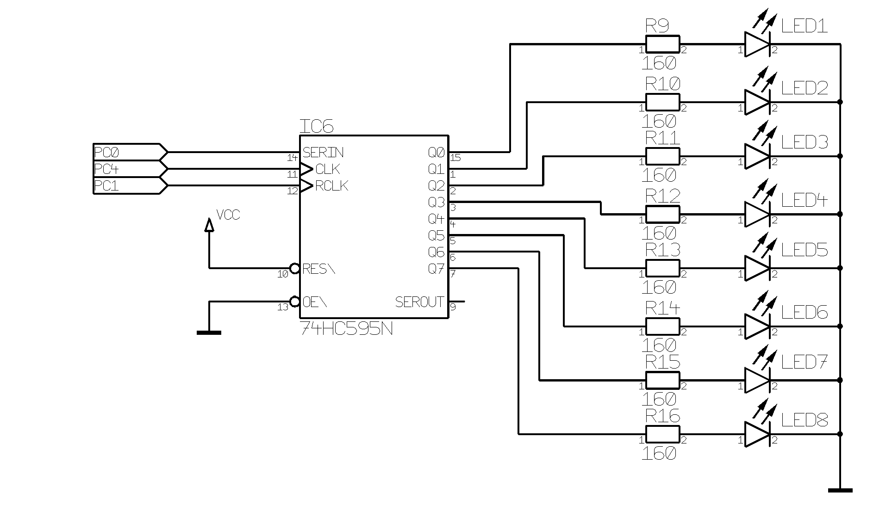
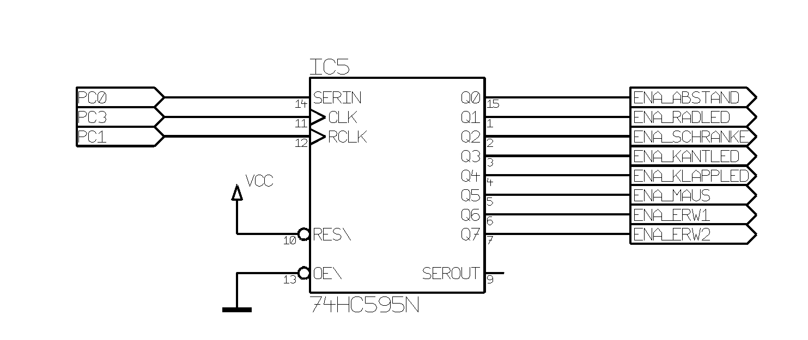
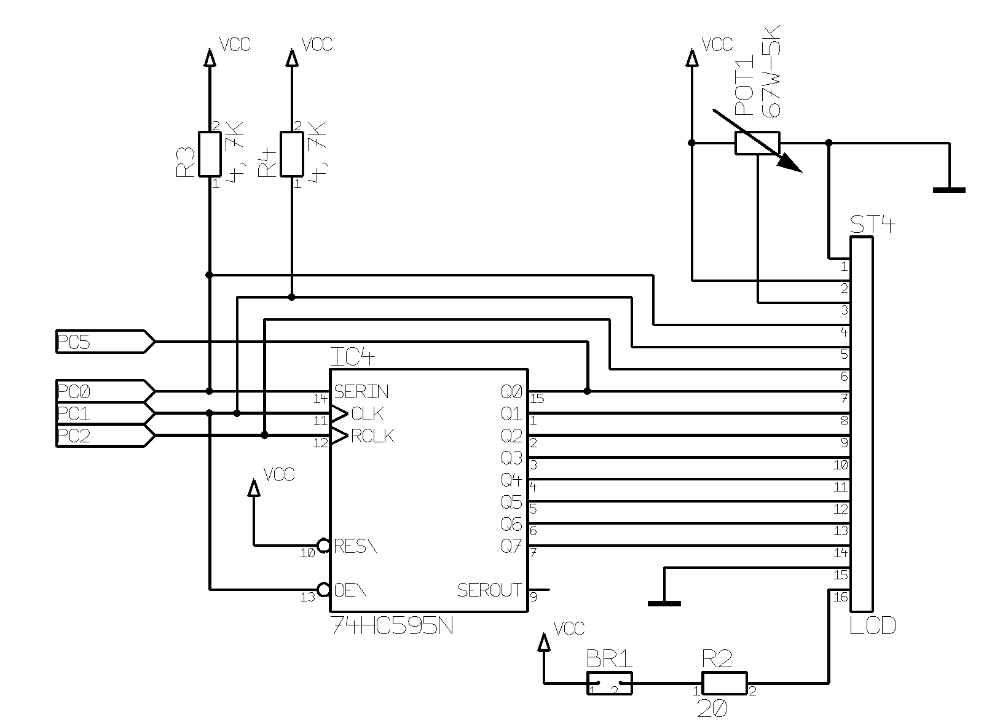
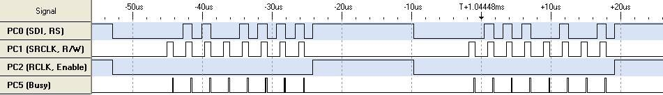
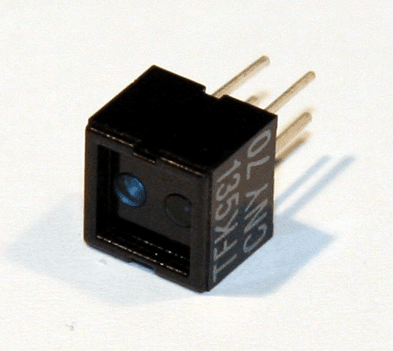
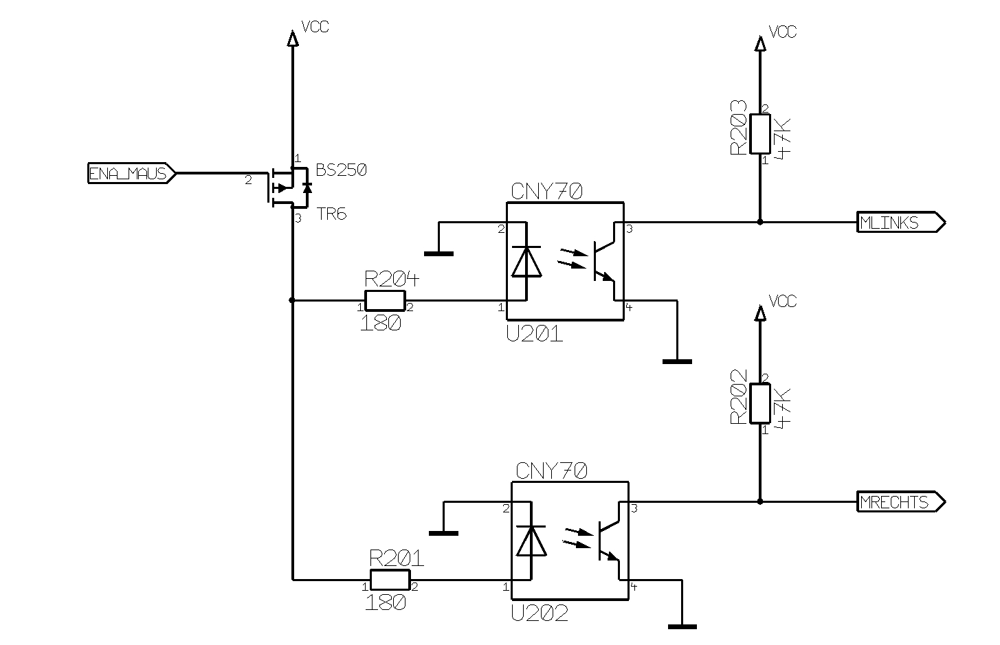

# Die Hardware des c't-Bot

## Elektronische Bauteile

### Feldeffekt-Transistor

FET ist eine Abkürzung für "Field Effect Transistor", also Feldeffekt-Transistor.
Es handelt sich hierbei um einen unipolaren Transistor.
Beim c't-Bot werden mehrere BS250 P-Kanal FETs zum Einschalten (enable) bzw. Ausschalten (disable) von Schaltungsteilen eingesetzt.

## Schnittstellen

### Port-Erweiterung

Die Port-Erweiterung wird beim c't-Bot durch drei Schieberegister vom Typ 74HC595 realisiert.
Ein Schieberegister ist im Prinzip ein Seriell-zu-Parallel-Wandler.
Synchron zu einem Taktsignal werden die Daten seriell über einen Port vom Prozessor in das Schieberegister geschoben.
Nach Übertragung von 8 Bits liegt das Signal dann am 8-Bit Parallel-Ausgangsport an.
Während der Übertragung bleiben die Ausgangssignale durch den Ausgangs-Datenlatch des 74HC595 stabil.
Für die Auswahl (Enable) des entsprechenden Schieberegisters wird jeweils ein Mikrocontroller-Pin benötigt.

Zur Ansteuerung aller drei Schieberegister werden insgesamt 6 Mikrocontroller-Pins benötigt.

| Port | Funktion             |
| ---  | ---                  |
| PC0  | serielle Daten (SDA) |
| PC1  | serieller Takt (SCK) |
| PC2  | Enable LCD Port      |
| PC3  | Enable Enable Port   |
| PC4  | Enable LED Port      |
| PC5  | Busy Flag LCD Port   |

#### LED-Port

Auf dem c't-Bot befinden sich insgesamt 8 LEDs, die als Statusanzeigen dienen können.
Über den Port _PC4_ wird der LED-Port aktiviert (enable) oder deaktiviert (disable).
Die serielle Datenübertragung in das Schieberegister via Port _PC0_ erfolgt synchron zum Takt von _PC1_.

##### Portbelegung

| Port | Bezeichnung | Funktion           |
| ---  | ---         | ---                |
| P0   | LED1        | blau, vorne links  |
| P1   | LED2        | blau, vorne rechts |
| P2   | LED3        | rot                |
| P3   | LED4        | orange             |
| P4   | LED5        | gelb               |
| P5   | LED6        | grün               |
| P6   | LED7        | blau               |
| P7   | LED8        | weiß               |

##### Schaltbild

#### Enable-Port

Über den Enable-Port können einzelne Baugruppen (Sensoren) des c't-Bots ein- oder ausgeschaltet werden.
Durch das selektive Aktivieren von Baugruppen nach Bedarf lässt sich der Energieverbrauch des Roboters optimieren.
Über Port _PC3_ wird der Enable Port aktiviert (enable) oder deaktiviert (disable).
Die serielle Datenübertragung in das Schieberegister via Port _PC0_ erfolgt synchron zum Takt von _PC1_.

##### Portbelegung

| Port | Bezeichnung  | Funktion                                                                                                      |
| ---  | ---          | ---                                                                                                           |
| P0   | ENA_ABSTAND  | Enable Distanzsensoren (GP2D12)                                                                               |
| P1   | ENA_RADLED   | Enable der integrierten IR-LEDs in den Radencodern (CNY70)                                                    |
| P2   | ENA_SCHRANKE | Enable Lichtschranke (IS471F)                                                                                 |
| P3   | ENA_KANTLED  | Enable der integrierten IR-LEDs in den Kantensensoren (CNY70)                                                 |
| P4   | ENA_KLAPPLED | Enable der integrierten IR-LED im Klappensensor (CNY70) und der IR-LED für die Lichtschranke im Transportfach |
| P5   | ENA_MAUS     | Enable der integrierten IR-LEDs in den Liniensensoren (CNY70)                                                 |
| P6   | ENA_ERW1     | Enable Erweiterung 1                                                                                          |
| P7   | ENA_ERW2     | Enable Erweiterung 2                                                                                          |

##### Schaltbild

#### LCD-Port

Der c't-Bot lässt sich mit einem [LCD-Display](ct-bot_display.md) erweitern.
Über Port _PC2_ wird der LCD-Port aktiviert (enable) oder deaktiviert (disable).
Die serielle Datenübertragung in das Schieberegister via Port _PC0_ erfolgt synchron zum Takt von _PC1_.

##### Portbelegung

| Port | Bezeichnung | Funktion       |
| ---  | ---         | ---            |
| P0   | LCD1        | Datenbus Bit 0 |
| P1   | LCD2        | Datenbus Bit 1 |
| P2   | LCD3        | Datenbus Bit 2 |
| P3   | LCD4        | Datenbus Bit 3 |
| P4   | LCD5        | Datenbus Bit 4 |
| P5   | LCD6        | Datenbus Bit 5 |
| P6   | LCD7        | Datenbus Bit 6 |
| P7   | LCD8        | Datenbus Bit 7 |

Das LCD-Modul selbst wird über einen 16-poligen (2x8) Wannenstecker (ST4) angeschlossen.
Die Belegung entspricht dem üblichen Standard der meisten LCD-Module.
Über einen Jumper (BR1) kann man die Hintergrundbeleuchtung ein- bzw. ausschalten.

##### Steckerbelegung ST4

| Pin | Bezeichnung | Beschreibung                                                                              |
| --- | ---         | ---                                                                                       |
|   1 | GND         | Masse                                                                                     |
|   2 | VCC         | Spannungsversorgung +5V                                                                   |
|   3 | VEE         | Kontrast; Potentiometer 0 ... 0,5V                                                        |
|   4 | RS          | Register Select: 0 = Kommando senden; 1 = Daten schreiben                                 |
|   5 | R/W         | Display RAM: 0 = Daten schreiben; 1 = Daten lesen                                         |
|   6 | Enable      | fallende Flanke -> Übertragen des Kommandos oder der Daten; High-Pegel -> Lesen von Daten |
|   7 | DB0         | Datenbus Bit 0 LSB                                                                        |
|   8 | DB1         | Datenbus Bit 1                                                                            |
|   9 | DB2         | Datenbus Bit 2                                                                            |
|  10 | DB3         | Datenbus Bit 3                                                                            |
|  11 | DB4         | Datenbus Bit 4                                                                            |
|  12 | DB5         | Datenbus Bit 5                                                                            |
|  13 | DB6         | Datenbus Bit 6                                                                            |
|  14 | DB7         | Datenbus Bit 7 MSB                                                                        |
|  15 | GND         | Masse Hintergrundbeleuchtung                                                              |
|  16 | VCC         | Spannungsversorgung Hintergrundbeleuchtung, mit Vorwiderstand                             |

##### Schaltbild

#### Signalverlauf

**Achtung:** Im Schaltplan der Hauptplatine befindet sich ein Fehler.
Der Port _PC5_ sollte eigentlich das Busy-Flag des LCD-Moduls abfragen.
Dieses liegt aber LCD-seitig an _DB7_ (MSB) an und nicht an _DB0_ (LSB).
Daher ist die Abfrage des Busy-Flags nicht möglich.
Der c't-Bot Code verzichtet daher auf dieses Signal und arbeitet stattdessen mit Delays.

## Sensoren

### Reflex-Optokoppler (CNY70)

Der CNY70 ist ein sogenannter Reflex-Optokoppler.
Er besteht aus einer Infrarot-LED und einem Foto-Transistor, die sich beide im selben Gehäuse befinden.
Das von der Infrarot-LED emittierte Licht wird von Oberflächen die sich im Strahlengang befinden reflektiert und anschließend vom Fototransistor wieder detektiert.
Je nach der Menge des reflektierten Lichts erhöht oder reduziert sich die elektrische Leitfähigkeit des Fototransistors entsprechend.
Die Reichweite des Sensors beträgt hierbei nur wenige Millimeter.
Da das emittierte Licht der Infrarot-LED nicht gepulst wird, ist das detektierte Signal störanfällig gegenüber Fremdlichteinstrahlung.

Das elektrische Pinout des CNY70-Sensors findet sich im zugehörigen [Datenblatt](https://github.com/tsandmann/ct-bot-hw/blob/master/v1/datasheets/CNY70 Vishay 2012-07.pdf).

**Hinweis:** Der CNY70 Sensor im Bausatz stammt vom Hersteller Vishay.
Daneben existiert noch eine augenscheinlich baugleiche CNY70-Alternative von Temic, bei der jedoch die Pinbelegung des Fototransistors vertauscht ist!

Auf dem c't-Bot werden insgesamt 7 CNY70-Sensoren eingesetzt:

* 2 für den Liniensensor
* 2 für die Radencoder
* 2 für die Kantensensor
* 1 für den Klappensensor des Transportfachs

#### Liniensensor

Der Liniensensor des c't-Bots wird von zwei CNY70-Sensoren gebildet, die vorne auf der Maussensor-Platine positioniert sind.
Mit den beiden Sensoren kann der Bot Linien mit einer Dicke von bis zu ??? mm erkennen, was dem mittleren Abstand der beiden Sensoren entspricht.

Das Ausgangssignal der beiden CNY70 Reflex-Optokoppler ist direkt an die Ports ADC2 (_MLINKS_) und ADC3 (_MRECHTS_) des Analog-Digital-Wandlers angeschlossen.

Durch das [Enable-Signal](#Enable-Port) _ENA_MAUS_ können die Infrarot-LEDs vom Mikrocontroller aus durch den [FET](#Feldeffekt-Transistor) ein- bzw. ausgeschaltet werden.

##### Schaltbild

##### weitere Informationen

* [Aufbau eines Liniensensors mit CNY70 (kreatives-chaos.com)](http://www.kreatives-chaos.com/artikel/liniensensor-mit-cny70)

#### Kantensensoren

--------

Die Kantensensoren des c't-Bots werden von zwei CNY70 gebildet, die vorne auf den beiden Sensorplatinen sitzen und nach unten schauen.
Damit kann der c't-Bot Abgründe erkennen wie Treppen oder Tischkanten und vorher anhalten.

Das Ausgangssignal der beiden CNY70 Reflex-Opto-Koppler sind direkt als Analog Signal an die A/D Ports ADC6 (KANTEL Kante links) und ADC7 (KANTER Kante rechts) des [[Atmel_ATmega32|ATmega32]] angeschlossen.
Durch das [[Erweiterungsport_Belegung#Enable_Port|Enable-Signal]] ENA_KANTLED können die IR-LEDs vom Mikrocontroller aus durch den [[Glossar#FET|FET]] ein- bzw ausgeschaltet werden.

[[Bild:abgrundsensor_schem.png|800px|Schaltbild Absturzsensor]]

Die Abgrunderkennung ist in der Firmware des c't-Bots als Nebenverhalten aktiviert. Das kann bei bestimmten Untergründen dazu führen, das der Bot sein Fluchtverhalten aktiviert und ständig rückwärts fährt, da er denkt, vor einem Abgrund zu stehen.

Bei der Linienverfolgung führt dies ebenfalls dazu, das der Bot stehenbleibt wenn er mit den Absturzsensoren eine Linie als Abgrund erkennt.

== Radencoder ==

== Einführung ==

Mit Hilfe seiner beiden Radencoder kann der c't-Bot die zurückgelegte Wegstrecke bestimmen, eine bestimmte Strecke geradeaus fahren,  sowie sich um einen bestimmten Winkel drehen.

Auf der Innenseite der Räder sind Encoderscheiben aufgeklebt. Diese muß man sich beim Zusammenbau selbst herstellen, indem man die Vorlage in der richtigen Größe mit einem Laserdrucker auf Transparentfolie druckt. Dann schneidet man die Encoderscheiben aus und klebt sie mit durchsichtigem Alleskleber innen auf die Alu-Räder. Auf den Encoderscheiben sind insgesamt 30 schwarze Streifen kreisförmig angeordnet. Die Radencoder, bestehend aus zwei [[CNY70]] Opto-Reflex-Kopplern, sind so am Bot angebracht, das sie diese Streifen "sehen" können. Damit der [[Mikrocontroller]] diese Signale einfacher verarbeiten kann, werden diese durch ein invertierendes Schmitt-Trigger Gatter in Digitalsignale umgesetzt. Dann braucht der [[Mikrocontroller]] nur noch die Flankenwechsel von 'HIGH' nach 'LOW' zu zählen.

=== Wegstrecke messen ===

Mithilfe des Rad Durchmessers kann damit die zurückgelegte Wegstrecke bestimmt werden. Die Wegemessung durch Beobachtung der Räder nennt man Odometrie oder auch Hodometrie. Fehler in der Messung können sich einschleichen, wenn beim Bot auf glattem Untergrung die Räder durchdrehen. Deshalb hat der c't-Bot zusätzlich einen [[Maussensor|optischen Maus-Sensor]] zur Wegemesssung. Damit lassen sich solche Fehler eliminieren.

=== Odometrie Verfahren ===

Die Anzahl der Radumdrehungen zwischen zwei Mess Zeitpunkten wird gezählt.
Zusammen mit dem Radumfang wird daraus die zurückgelegte Wegdifferenz berechnet:

 s = Pi * d * n

Beim c't-Bot befinden sich auf der Encoderscheibe 30 schwarze Streifen, das ergibt 60 Encoderschritte pro Radumdrehung. Der Raddurchmesser beträgt 57 mm. Mit einer Radumdrehung legt der c't-Bot eine Strecke von 179mm (Pi * d) zurück. Der zurückgelegte Weg je Encoderschritt beträgt ca. 3 mm (U / 60).

{|
|Reifendurchmesser:
|57 mm
|--
|Reifenumfang:
|179 mm
|--
|Radabstand:
|97 mm
|--
|Encoder/Weg-Auflösung:
|ca 3 mm
|}

=== bestimmten Winkel drehen ===

Um den c't-Bot einen bestimmten Winkel auf der Stelle drehen zu lassen, genügt es ein Rad vorwärts die gewünschte Schritt-Anzahl drehen zu lassen, während das andere Rad die gleiche Anzahl Schritte rückwärts dreht.

== Schaltbild ==

Bei den Rad Encodern wird das Ausgangssignal des [[CNY70]] durch einen invertierendes Schmitt-Trigger Gatter (HC14) in ein Digital Signal gewandelt und vom Prozessor ausgewertet. Der [[Mikrocontroller]] muß deshalb nur die auftretenden Flanken zu zählen.
Durch das [[Erweiterungsport_Belegung#Enable_Port|Enable-Signal]] ENA_RADLED können die IR-LEDs durch den [[Glossar#FET|FET]] ein- bzw ausgeschaltet werden.

[[Bild:radencoder_schem.png|800px|Schaltbild Radencoder]]

== Platine ==

{|
|[[Bild:Aufbau_SensorplLI1.jpg|thumb|Sensorplatine links]]
|[[Bild:Aufbau_SensorplRE2.jpg|thumb|Sensorplatine rechts]]
|}

== Probleme mit den Radencodern ==

Bei den ersten ausgelieferten Bausätzen, mußte man sich die Radencoderscheiben noch selbst auf Klarsichtfolie ausdrucken, ausschneiden und aufkleben. Mit diesen Radencoderscheiben gab es allerdings zuviele Probleme, wie Fremdlichteinstreunung, unsaubere Signale, keine eindeutige High/Low Erkennung. Mit den neueren Bausätzen werden Radencoderscheiben aus Plastik mitgeliefert (dank an ct-Bot User V2). Damit gibt es keine Probleme mehr. Besitzer der ersten Bausätze können diese neuen Radencoder bei [http://www.segor.de Segor] gegen Rückporto nachbestellen, bzw. bekommen diese bei einer weiteren Bestellung kostenlos mitgeliefert.

Das Bild encoder_ring.jpg bitte so ausdrucken, dass es einen Außendurchmesser von 50mm hat.

--------

Autoren: Marvin, Nightwalker-87
