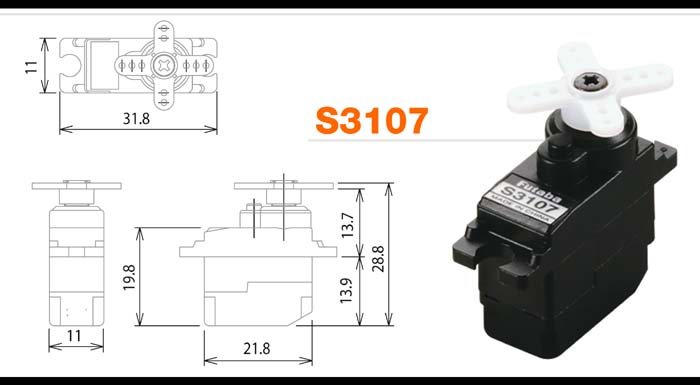
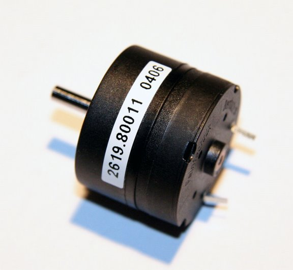

# Die Aktoren des c't-Bot

## Transportfach & Klappe

Mit dem Transportfach kann der c't-Bot Gegenstände einsammeln. Eine optionale Klappe, welche mit einem [Servo](#Servo) geöffnet und geschlossen werden kann, verhindert, dass er die eingesammelten Objekte anschließend wieder verliert.
Ob sich ein Objekt im Transportfach befindet, kann der c't-Bot mit Hilfe einer [Lichtschranke](ct-bot_hw_sensors#Lichtschranke) festgestellen.
Der Zustand der Transportklappe (geöffnet oder geschlossen) lässt sich mit dem [Klappensensor](ct-bot_hw_sensors#Klappensensor) überwachen.

## Servo

Beim c't-Bot kommt ein Servo-Motor (Futaba S3107 Nano-Servo) für das Öffnen und Schliessen der [Transportfachklappe](#Transportfach & Klappe) zum Einsatz.
Ein zweiter Servoanschluß ist für spätere Erweiterungen vorgesehen, wie z.B. das Drehen einer Kamera oder eines Ultraschall-Sensors.

Ein Servo-Motor ist ein Motor der eine bestimmte Winkel-Position anfahren kann und diese dann beibehält.
Er besteht aus einem Gleichstrom-Elektromotor, einem Getriebe und einer Servo-Elektronik.
Alle diese Komponenten sind kompakt in einem Gehäuse integriert.
Im Gegensatz zu Getriebemotoren haben Servos allerdings einen mechanischen Anschlag, der den Stellbereich auf einen Winkelbereich von 120 oder 180° beschränkt.
Die Servo-Elektronik misst die Winkel-Position durch einen Drehgeber (im einfachsten Fall ein Potentiometer) und gleicht diese solange ab, bis die gewünschte Soll-Postion erreicht ist.

Angesteuert wird ein Servo durch ein pulsweitenmoduliertes (PWM) Signal.
Die Pulsbreite beträgt dabei zwischen 1 und 2 ms mit einer Pulspause von 20 ms.
Erstere bestimmt die gewünschte Winkel-Postion.
So entspricht ein Puls von 1,5 ms der 0-Stellung, während ein Puls von 2 ms bzw. 1 ms dem Maximalwinkel von 60° bzw. 90° in die jeweilige Richtung entspricht.

Durch eine Modifikation (Servo-Hack) kann man einen Servo zu einem sehr kompakten Getriebemotor machen.
Hierbei wird der mechanische End-Anschlag entfernt und das Potentiometer durch zwei identische Widerstände ersetzt.

### Technische Daten (Futaba S3107 Nano-Servo)

| Spezifikation           | Wert                  |
| ---                     | ---                   |
| Abmessungen (L x H x B) | 21,8 x 11,0 x 19,8 mm |
| Gewicht                 | 9,5 g                 |
| Stellkraft              | 12 Ncm                |
| Stellzeit (4,8 V)       | 0,12 s (60°)          |

## Motoren

Der c't-Bot wird von zwei Getriebemotoren des Typs Faulhaber 2619 006 SR bewegt.
Hierbei handelt es sich um eisenlose ultrastarke und ultraflache Gleichstrommotoren mit angeflaschtem Getriebe.

### Technische Daten

| Spezifikation                    | Wert                                              |
| ---                              | ---                                               |
| Abmessungen:                     |                                                   |
| Motor u. Getriebe                | L = 19 mm, ø = 26 mm                              |
| Welle                            | L = 10 mm, ø = 3 mm                               |
| Nennspannung                     | 6 V                                               |
| Leerlaufdrehzahl                 | 6600 rpm                                          |
| Antriebsdrehzahl                 | 151 rpm (mit 33 : 1 Untersetzung)                 |
| Stromaufnahme                    | 0,557 A (max.)                                    |
| Abgabeleistung                   | 1,08 W                                            |
| Wirkungsgrad                     | 60 % (mit 33 : 1 Untersetzung)                    |
| Drehmoment M_max                 | 30 mNm (Dauerbetrieb),                            |
|                                  | 100 mNm (Kurzzeitbetrieb mit 33 : 1 Untersetzung) |
| Innenwiderstand                  | 8,2 Ohm                                           |
| Anschlussinduktivität            | 465 µH                                            |
| Rotorträgheitsmoment             | 0,68 gcm²                                         |
| Motorkonstanten-:                |                                                   |
| Drehzahlkonstante k_n            | 1110 rpm/V                                        |
| Generator-Spannungskonstante k_e | 0,9 mv/rpm                                        |
| Drehmomentkonstante k_m          | 8,59 mNm/A                                        |
| Stromkonstante k_i               | 0,116 A/mNm                                       |
| Untersetzung                     | 33 : 1                                            |
| Gewicht                          | 26g (inkl. Getriebe)                              |
| Gehäusewerkstoff                 | Kunststoff                                        |
| Zahnräderwerkstoff               | Metall                                            |
| Abtriebswellenlager              | Messing-/Keramiklager                             |

Weitere Daten des 2619_006_SR-Motors finden sich im zugehörigen [Datenblatt](https://github.com/tsandmann/ct-bot-hw/blob/master/v1/datasheets/2619_006_SR_33-1_Faulhaber_2017-10.pdf).

Autoren: Peter Recktenwald, Nightwalker-87
