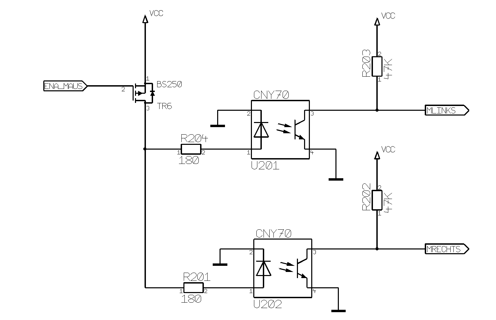
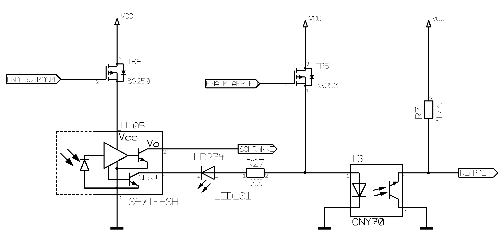

# Die Sensoren des c't-Bot

## Reflex-Optokoppler (CNY70)

Der CNY70 ist ein sogenannter Reflex-Optokoppler.
Er besteht aus einer Infrarot-LED und einem Foto-Transistor, die sich beide im selben Gehäuse befinden.
Das von der Infrarot-LED emittierte Licht wird von Oberflächen die sich im Strahlengang befinden reflektiert und anschließend vom Fototransistor wieder detektiert.
Je nach der Menge des reflektierten Lichts erhöht oder reduziert sich die elektrische Leitfähigkeit des Fototransistors entsprechend.
Die Reichweite des Sensors beträgt hierbei nur wenige Millimeter.
Da das emittierte Licht der Infrarot-LED nicht gepulst wird, ist das detektierte Signal störanfällig gegenüber Fremdlichteinstrahlung.

Die Pinbelegung des CNY70-Sensors findet sich im zugehörigen [Datenblatt](https://github.com/tsandmann/ct-bot-hw/blob/master/v1/datasheets/CNY70_Vishay_2012-07.pdf).

**Hinweis:** Der CNY70 Sensor im Bausatz stammt vom Hersteller Vishay.
Daneben existiert noch eine augenscheinlich baugleiche CNY70-Alternative von Temic, bei der jedoch die Pinbelegung des Fototransistors vertauscht ist!

Auf dem c't-Bot werden insgesamt 7 CNY70-Sensoren eingesetzt:

* 2 für den Liniensensor
* 2 für die Kantensensoren
* 2 für die Radencoder
* 1 für den Klappensensor des Transportfachs

### Liniensensor

Der Liniensensor des c't-Bots wird von zwei CNY70-Sensoren gebildet, die vorne auf der Maussensor-Platine positioniert sind.
Mit den beiden Sensoren kann der Bot Linien einer Dicke erkennen, die mindestens dem mittleren Abstand der beiden Fototransistoren entspricht (ca. eine CNY70-Gehäusebreite).

Die analogen Ausgangssignale der beiden CNY70 Reflex-Optokoppler sind direkt an die Pins ADC2 (_MLINKS_) und ADC3 (_MRECHTS_) des Analog-Digital-Wandlers angeschlossen.
Durch das [Enable-Signal](ct-bot_hw_electronics#Enable-Signale) _ENA_LINE_ können die Infrarot-LEDs der CNY70-Sensoren vom Mikrocontroller aus über den zugehörigen [FET](ct-bot_hw_electronics#Feldeffekt-Transistor) ein- bzw. ausgeschaltet werden.

#### Schaltbild

### Kantensensoren

Die Kantensensoren des c't-Bots befinden sich auf den Sensorplatinen an der Vorderseite des Roboters.
Auf der linken und der rechten Sensorplatine ist jeweils ein CNY70-Reflex-Optokoppler installiert dessen Detektionsfläche senkrecht nach unten ausgerichtet ist.
Beide Detektoren ermöglichen es dem c't-Bot Abgründe wie Treppen oder Tischkanten zu erkennen und vor der Gefahrenstelle anzuhalten.

Die analogen Ausgangssignale _KANTEL_ (Kante links) und _KANTER_ (Kante rechts) der beiden CNY70 Reflex-Optokoppler sind direkt an die ADC-Pins _ADC6_ und _ADC7_ des Mikrocontrollers angeschlossen.
Durch das [Enable-Signal](ct-bot_hw_electronics#Enable-Signale) _ENA_KANTLED_ können die Infrarot-LEDs der CNY70-Sensoren vom Mikrocontroller aus über den zugehörigen [FET](ct-bot_hw_electronics#Feldeffekt-Transistor) ein- bzw. ausgeschaltet werden.

#### Schaltbild

Die Abgrunderkennung ist in der Firmware des c't-Bots als Notfallverhalten aktiviert.
Das kann bei bestimmten Untergründen dazu führen, dass der Roboter fälschlicherweise sein Fluchtverhalten aktiviert und ständig rückwärts fährt, da er die detektierte Fläche als Abgrund interpretiert.

### Radencoder

Mit Hilfe seiner beiden Radencoder kann der c't-Bot die zurückgelegte Wegstrecke bestimmen, eine bestimmte Strecke fahren, sowie sich um einen bestimmten Winkel drehen.
Die Encoderscheiben, auf denen insgesamt 30 schwarze Streifen kreisförmig angeordnet sind, werden auf die Innenseite der Räder aufgeklebt.

Die Radencoder, bestehend aus zwei CNY70 Reflex-Optokopplern, sind so am Bot angebracht, das sie diese Streifen detektieren können.
Damit der Mikrocontroller diese Rohsignale einfacher verarbeiten kann, werden diese durch ein invertierendes Schmitt-Trigger-Gatter (SN74HC14) in digitale Signale umgesetzt.
Dadurch braucht der Mikrocontroller im Prinzip nur noch die Flankenwechsel von _HIGH_ nach _LOW_ zu zählen.

Durch das [Enable-Signal](ct-bot_hw_electronics#Enable-Signale) _ENA_RADLED_ können die Infrarot-LEDs der CNY70-Sensoren vom Mikrocontroller aus über den zugehörigen [FET](ct-bot_hw_electronics#Feldeffekt-Transistor) ein- bzw. ausgeschaltet werden.

In den ersten ausgelieferten Bausätzen waren die Encoderscheiben beim Zusammenbau noch selbst zu erstellen und auf die Räder aufzukleben.
Hierzu musste die folgende Bild-Vorlage in der richtigen Skalierung (Außendurchmesser von 50 mm) ausgedruckt werden.

Anschließend waren diese Ausdrucke dann als Encoderscheiben auszuschneiden und mit Alleskleber auf die Innenseite der Aluminium-Räder aufzukleben.

Mit diesen Radencoderscheiben gab es allerdings viele Probleme, wie z.B. Fremdlichteinstreuung oder unsaubere Signale.

Nachfolgende Versionen des Bausatzes enthielten bereits fertig zugeschnittene Encoderscheiben aus Kunststoff mit denen diese Probleme nicht mehr auftreten.
Ein besonderer Dank gilt hier dem ct-Bot-Nutzer "V2" für seinen konstruktiven Beitrag zur Lösung dieses Problems.

#### Odometrie-Verfahren zur Messung der Wegstrecke

Mithilfe des Rad Durchmessers kann die zurückgelegte Wegstrecke bestimmt werden.
Die Messung der zurückgelegten Wegstrecke durch Beobachtung der Räder nennt man Odometrie oder Hodometrie.

Bei diesem Verfahren wird die Anzahl der Radumdrehungen zwischen zwei Messzeitpunkten gezählt.
Zusammen mit dem Radumfang lässt sich daraus die zurückgelegte Wegdifferenz gemäß der folgenden Formel berechnen:

s = Pi * d * n

Die 30 schwarzen Streifen auf den Encoderscheiben des c't-Bot resultieren in 60 Encoderschritten pro Radumdrehung.
Da der _Raddurchmesser (Reifendurchmesser) d = 57 mm_ beträgt, legt der c't-Bot mit einer Radumdrehung eine Strecke von _U = Pi * d = 179 mm_ zurück, die dem _Reifenumfang_ entspricht.
Der zurückgelegte _Weg je Encoderschritt_ beträgt _s' = U / 60 = 2,98 mm ≈ 3 mm_ und bestimmt die Auflösung der Wegstreckenmesssung.

Der axiale Radabstand des c't-Bots beträgt 97 mm, was für weitergehende Berechnungen relevant ist.

Fehler in der Messung können u.a. dann entstehen, wenn die Räder des c't-Bots auf glattem Untergrund durchdrehen.
Aus diesem Grund hat der Roboter zusätzlich noch einen [optischen Maussensor](#Optical Navigation Sensor (ADNS-2610)) zur Wegstreckenmesssung.
Durch die Kombination beider Messverfahren lassen sich solche Fehler eliminieren.

#### Punktdrehung um einen bestimmten Winkel

Um den c't-Bot einen bestimmten Winkel auf der Stelle drehen zu lassen, genügt es ein Rad die gewünschte Schritt-Anzahl vorwärts drehen zu lassen,
während das andere Rad die gleiche Anzahl Schritte rückwärts dreht.

#### Schaltbild

### Klappensensor

Als Klappensensor des c't-Bots dient ein CNY70 Reflex-Optokoppler, der auf der Unterseite der Grundplatine sitzt.
Mit diesem Sensor kann der Bot erkennen ob die Klappe des [Transportfachs](ct-bot_hw_actuators#Transportfach & Klappe) geöffnet oder geschlossen ist.

Das Ausgangssignal _KLAPPE_ des CNY70 Reflex-Optokopplers ist an Pin _PD6_ des Mikrocontrollers angeschlossen.
Durch das [Enable-Signal](ct-bot_hw_electronics#Enable-Signale) _ENA_KLAPPLED_ kann die Infrarot-LED des CNY70-Sensors vom Mikrocontroller aus über den zugehörigen [FET](ct-bot_hw_electronics#Feldeffekt-Transistor) ein- bzw. ausgeschaltet werden.

## Infrarot-Empfänger (IS471F)

### Lichtschranke

Zur Überwachung des [Transportfachs](ct-bot_hw_actuators#Transportfach & Klappe) beinhaltet dieses eine Lichtschranke.
Diese entsteht durch eine Infrarot-LED (Emitter) und einen gegenüberliegenden Infrarot-Empfänger (Detektor), die sich auf den beiden Sensorplatinen befinden.

Als Infrarot-Empfänger kommt hier der IS471F von Sharp zum Einsatz.
Dieser IC besteht aus einem Infrarot-Fototransistor, einer Auswertelogik und enthält einen Pulserzeuger für eine externe Infrarot-LED.
Durch den gepulsten Betrieb ist die Lichtschranke relativ unempfindlich gegenüber Fremdlichteinstreuung.
Das Licht der gegenüberliegenden LED wird vom Fototransistor registiert, dessen Reichweite ca. 8 cm beträgt.

Befindet sich ein Objekt im Transportfach, wird der Lichtstrahl zwischen der Emitter und dem Detektor abgeschwächt oder ganz unterbrochen.
Der Fototransistor empfängt dann ein abgeschwächtes oder gar kein Signal und die Auswertelogik schaltet in Folge den digitalen Ausgang ab einer bestimmten Schwelle auf _LOW_.

Das digitale Ausgangssignal _SCHRANKE_ des IS471F Infrarot-Empfängers ist an Pin _PB0_ des Mikrocontrollers angeschlossen.
Durch das [Enable-Signal](ct-bot_hw_electronics#Enable-Signale) _ENA_SCHRANKE_ kann der IS471F vom Mikrocontroller aus über den zugehörigen [FET](ct-bot_hw_electronics#Feldeffekt-Transistor) ein- bzw. ausgeschaltet werden.
Das Enable-Signal _ENA_KLAPPLED_ schaltet neben dem Klappensensor auch die Infrarot-LED der Lichtschranke ein bzw. aus.

#### Schaltbild

## LDR-Widerstände (MPY54C569)

Der c't-Bot enthält vorne links und rechts auf der Grundplatine zwei Lichtsensoren für die jeweils ein LDR-Fotowiderstand vom Typ MPY54C569 verwendet wird.
Die Abkürzung LDR steht für "Light Dependent Resistor", also lichtempfindlicher Widerstand.
Ein solcher Widerstand ändert seinen Widerstandswert abhängig von der Intensität des einfallenden Lichts.
Im Elektronikdesign des c't-Bot bildet jeder LDR-Widerstand zusammen mit einem 470 kΩ Widerstand einen Spannungsteiler.
Hierbei ist der LDR der Widerstand unter Teilspannungsabfall, sodass das Ausgangssignal für diese Schaltung antiproportional zur detektierten Helligkeit ist.

Dank der beiden Lichtsensoren kann Roboter Verhaltensmuster prägen, wie z.B. einer Lichtquelle zu folgen (Motte) oder davor zu flüchten (Kakerlake).

Da die Fotowiderstände relativ nahe an den beiden vorderen blauen LEDs platziert sind, kann es zu unerwünschter Lichteinstreuung auf die Sensoren kommen.
Mögliche Lösungen hierfür sind die benachbarten LEDs mit Schrumpfschlauch bzw. einer lichtundurchlässigen Hülse zur Seite hin abzuschirmen oder die LDRs von der Unterseite der Grundplatine einzulöten.

Die analogen Ausgangssignale der beiden LDR-Spannungsteiler _LDRL_ (linker LDR) und _LDRR_ (rechter LDR) sind direkt an die Pins _ADC3_ bzw. _ADC4_ des Analog-Digital-Wandlers angeschlossen.

### Schaltbild

## Optical Navigation Sensor (ADNS-2610)

Der Maussensor des c't-Bots dient zur Erfassung der Richtung und der zurückgelegten Wegstrecke des Roboters.
Zum Einsatz kommt hier der optische Navigationssensor ADNS-2610 des Herstellers Avago (ehem. Agilent), der sich zusammen mit dem [Liniensensor](#Liniensensor) auf einer separaten Platine an der Unterseite des c't-Bots befindet.
Bei einer Sensorgröße von 18x18 Pixeln, 64 Graustufen und einer Auflösung von 400 dpi verarbeitet er 1512 Bilder pro Sekunde.

Insgesamt besteht die Sensoreinheit aus einem Bilderfassungssystem, einem Digital Signal Processor (DSP) zur Bildverarbeitung sowie einem Bus-Interface zur Host-Kommunikation.
Beim DSP handelt es sich um einen Prozessor, der speziell auf die Verarbeitung digital gewandelter Analogsignale ausgelegt ist.
Das Funktionsprinzip eines solchen sogenannten "Optischen Navigationssystems" lässt sich wie folgt beschreiben:
Ein Bildsensor nimmt kontinuierlich mikroskopisch kleine Bilder von der Oberfläche auf, welche fortwährend durch den DSP miteinander verglichen werden.
Aus den unterschiedlichen Bildern lässt sich auf diese Weise die Richtung und die zurück gelegte Strecke errechnen.

Die Anbindung des Sensor-ICs erfolgt über ein auf 2 Leitungen reduziertes SPI-Interface (SISO) in wechselseitiger Datenübermittlung (Halb-Duplex).
Hierfür werden die verfügbaren Signale SDIO und SCK an die beiden Ports MISO und SCLK des ATmega-Mikrocontrollers angeschlossen.

### Schaltbild

## Distanzsensoren (GP2D12)

Um Objekte und Hindernisse rechtzeitig erkennen zu können, befindet sich vorne rechts und links am Roboter jeweils ein Distanzsensor.
Zum Einsatz kommen hier optische Distanzsensoren des Typs GP2D12 von Sharp, die mit dem Triangulations-Prinzip arbeiten.

Eine Sensoreinheit besteht aus einer Infrarot-Diode (Emitter) und einem Infrarot-Detektor (Rezeptor).
Ein emittierter, moduliertes Infrarotsignal wird von einem Objekt zurück reflektiert und anschließend vom Empfänger, auch "Position Sensitive Device" (PSD) genannt, wieder empfangen.

Aus dem so entstandenen Dreieck zwischen Sender, Objekt und Empfänger lässt sich so die Entfernung berechnen.
Somit ist nicht entscheidend wie viel Licht von dem Objekt reflektiert, sondern in welchem Winkel es reflektiert wird.

Dies hat den Vorteil, dass die Sensitivität relativ unabhängig von der Oberfläche des Objekts ist.
Vom Empfänger wird der detektierte Winkel in eine analoge Spannung umgewandelt, die als Ausgangssignal dient.

Die Pinbelegung des GP2D12-Sensors findet sich im zugehörigen [Datenblatt](https://github.com/tsandmann/ct-bot-hw/blob/master/v1/datasheets/_obsolete/GP2D12_Sharp_2005-11.pdf).

### Vor- und Nachteile:

* ( + ) Abstandsmessung relativ unabhängig von der Oberfläche des Objekts
* ( + ) einfache Anbindung an Mikrocontroller: ein A/D-Port genügt, keine Takterzeugung notwendig
* ( - ) Ausgangsspannung nicht linear
* ( - ) relativ hohe Stromaufnahme, da kontinuierlich gemessen wird.
* ( - ) relativ kleiner Messwinkel von ca. 3°.

### Technische Daten

| Spezifikation       | Wert                      |
| ------------------- | ------------------------- |
| Ausgangssignal      | 0 ... 2,5 V (analog)      |
| Detektionsbereich   | 10 ... 80 cm              |
| Messfrequenz        | 25 Hz / 40 ms             |
| Versorgungsspannung | 4,5 ... 5,5 V             |
| Stromaufnahme       | 33 mA (typ.); 50mA (max.) |

Die analogen Ausgangssignale _ABSTL_ (Abstand links) und _ABSTR_ (Abstand rechts) der beiden GP2D12 Distanzsensoren sind direkt an die ADC-Pins _ADC0_ und _ADC1_ des Mikrocontrollers angeschlossen.
Durch das [Enable-Signal](ct-bot_hw_electronics#Enable-Signale) _ENA_ABSTAND_ können die GP2D12-Sensoren vom Mikrocontroller aus über den zugehörigen [FET](ct-bot_hw_electronics#Feldeffekt-Transistor) ein- bzw. ausgeschaltet werden.

### Schaltbild & funktionales Blockdiagramm

#### weitere Informationen

* [Aufbau eines Liniensensors mit CNY70 (kreatives-chaos.com)](http://www.kreatives-chaos.com/artikel/liniensensor-mit-cny70)
* [Roboternetz Wissen: Sensorarten - CNY70 (rn-wissen.de)](https://rn-wissen.de/wiki/index.php/Sensorarten#CNY70)
* [Roboternetz Wissen: Sensorarten - Distanzsensor IS471F (rn-wissen.de)](https://rn-wissen.de/wiki/index.php/Sensorarten#Distanzsensor_IS471F)
* [Roboternetz Wissen: Sensorarten - Sharp GP2D12 (rn-wissen.de)](https://rn-wissen.de/wiki/index.php/Sensorarten#Sharp_GP2D12)
* [Formel zur Linearisierung der Sensor-Kennlinie des GP2D120 (kreatives-chaos.com)](http://www.kreatives-chaos.com/artikel/infrarot-entfernungsmesser)

Autoren: Peter Recktenwald, V2, Nightwalker-87
