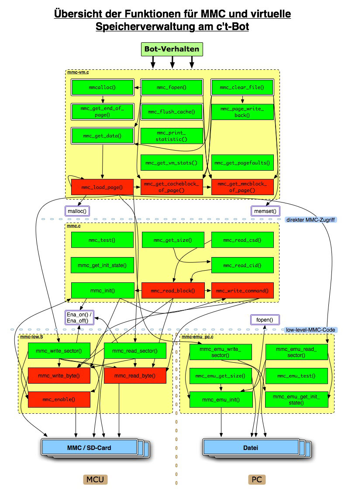

# Dokumentation zur virtuellen Speicherverwaltung für SD-Karten

**Hinweis: Diese virtuelle Speicherverwaltung wurde im Bot-Code durch ein FAT16/32 Dateisystem abgelöst.**


## Allgemeine Übersicht

Das Speichersystem ist wie folgt organisiert:

Man fordert eine beliebige Menge an Speicher an und bekommt eine virtuelle Adresse in 32 Bit zurück.
Diese Adresse entspricht der Adresse auf der MMC/SD-Card, was den Benutzer aber nicht weiter interessieren muss.
Zum Arbeiten mit den Daten wird eine "echte" SRAM-Adresse vergeben, die auf einen 512 Byte großen Speicherbereich zeigt.
Dieser Cacheeintrag wird auf die MMC/SD-Card zurückgeschrieben, sobald der maximal für den **Cache** zugeteilte Speicher komplett belegt ist.
Das Ein- und Auslagern der Seiten auf die MMC/SD-Card macht die Speicherverwaltung also automatisch.

Somit kann ein Verhalten beliebig viel (virtuellen) Speicher benutzen, siehe Abschnitt zum **virtuellen Speicher**.
Außerdem lässt sich derselbe Adressraum und Cache auch für den Zugriff auf FAT16-Dateien benutzen.
Näheres dazu gibt es unter **Zugriff auf ein FAT16-Dateisystem**.
Die Bezeichnung "page" (oder "Seite") stellt durchgängig etwas logisches (virtuelles) dar, während mit "Block" ein physischer Block auf dem verwendeten Datenträger gemeint ist.

Im Folgenden wird ausschließlich auf die Verwendung einer MMC-/SD-Card als Speichermedium eingegangen.
Läuft der Code auf einem PC, so wird die Speicherkarte mit Hilfe einer Datei emuliert, die Verwendung ist aber äquivalent (siehe auch im Source-Code unter `/pc/mmc-emu_pc.c`).


## Der virtuelle Speicher im Detail

### Die Speicherallokierung

Nach der Anforderung einer beliebigen Menge an Speicher per `mmcalloc()`, bekommt man eine virtuelle Adresse des 32 Bit großen Adressraums zurück.
`mmc_get_data(uint32 virtuelle_Adresse)` liefert dann eine "echte" SRAM-Adresse auf einen 512 Byte großen Puffer zurück, dessen Inhalt auf die MMC/SD-Card geschrieben wird, sobald er nicht mehr im SRAM gehalten werden kann.

Die Funktion `mmc_get_end_of_page(uint32 virtuelle_Adresse)` hilft herauszufinden, bis wohin dieser Pointer verwendet werden darf.
Benötigt man mehr Speicher, wird mit `mmc_get_data(uint32 virtuelle_Adresse)` einen neuen Pointer angefordert.

Zu beachten ist, dass nur soviel virtueller Speicher zur Verfügung steht, wie die intuitive Rechnung "letzter Sektor der MMC / SD-Card" minus "**Startadresse für den virtuellen Speicher**" ergibt.
Ansonsten liefert `mmcalloc()` null zurück.


#### Beispiel:

Das folgende Beispiel demonstriert, wie sich der virtuelle Speicher benutzen lässt:

```
uint32 v_addr = mmcalloc(2048, 1); // wir wollen 2 KB Speicher
uint8* p_addr = mmc_get_data(v_addr); // Pointer auf Puffer holen
... // irgendetwas sinnvolles tun
if (i < 512) { // Ziel liegt noch im gleichen Block
    p_addr[i] = my_data; // Daten speichern
    i++;
} else { // Blockende erreicht => zunächst neuen Pointer holen
    v_addr += i;
    i = 0;
    p_addr = mmc_get_data(v_addr);
    p_addr[i] = my_data; // Daten koennen nun gespeichert werden
}
```

Der zweite Parameter von `mmcalloc()` gibt an, ob man den angeforderten Speicher auf möglichst wenige Blöcke verteilt haben möchte (also 512 Byte ausgerichtet), oder ob er einfach am nächsten freien Byte auf der Karte beginnen soll (1: aligned, 0: beliebig).
Passt der angeforderte Speicher noch komplett in einen bereits teilweise belegten Block, so wird er immer dort untergebracht.


## Schnittstelle zur Hardware

Das folgende Diagramm zeigt die Beziehung der Funktionen des MMC-Codes und die entsprechenden Schnittstellen:



Die grün gekennzeichneten Funktionen sind in den jeweiligen Header-Dateien deklariert und bilden zusammen die Schnittstelle des MMC-Codes nach außen.
Die rot Gekennzeichneten hingegen bleiben dem eigentlichen Code für MMC und virtual Memory vorbehalten.

Die Abhängigkeiten untereinander sind durch die Pfeile dargestellt (in Aufrufrichtung).

Den doppelt umrandeten Funktionen gilt eine besondere Aufmerksamkeit: Diese sind vorrangig in eigenen Verhalten zu verwenden.
Die restlichen (internen) Funktionen sind eher zur Dokumentation des Speichersystems an sich aufgeführt und für die Benutzung in Bot-Verhalten nicht sonderlich interessant.


## Erläuterungen zum Cache

Um den Zugriff auf die jeweiligen Daten möglichst performant zu halten, cached das Speichersystem eine vorgegebene Anzahl an 512 Byte großen Blöcken im SRAM.
Der Cache ist vollassoziativ - für das Zurückschreiben kommt das LRU-Verfahren zum Einsatz.
Im Speicher wird er durch ein Array vom Typ _vm_cache_t_ repräsentiert (siehe auch im Source-Code unter `/mmc-vm.c`).
Die maximale Größe lässt sich mit einem **Konfigurationsparameter** festlegen und wird bei Speichermangel automatisch reduziert.
Es wird erst dann Cachespeicher belegt, wenn auch Daten angefordert werden.

Ein Aufruf der Funktion `mmc_flush_cache()` schreibt den kompletten Cache auf die Karte zurück, während `mmc_page_write_back(uint32 virtuelle_Adresse)` nur die Seite zurückschreibt, welche zu der übergebenen Adresse gehört.
Letztere Funktion tut dies unabhängig davon, ob die Seite seit der Einlagerung verändert wurde oder nicht und ermöglicht so einen "tieferen" Eingriff in das ansonsten automatisch arbeitende System.

Ein Verhalten sollte also vor seiner Beendigung dafür sorgen, dass der Cacheinhalt gesichert wird, wenn die gespeicherten Daten erhalten bleiben sollen!


## Der Zugriff auf ein FAT16-Dateisystem

Die Unterstützung für FAT16-Dateien auf einer MMC/SD-Card ist wie folgt aufgebaut:

`mmc_fopen(const char *filename)` öffnet eine Datei im FAT16-Dateisystem der Karte und gibt die virtuelle Startadresse zurück, sodass man mit `mmc_get_data()` Zugriff auf die Daten bekommt.
Der Dateiname muss dabei ganz am Anfang in der Datei stehen.

**Achtung:** Öffnet man eine Datei, die bereits mit `mmc_fopen()` geöffnet wurde, ist das Verhalten bezüglich dieser Datei derzeit undefiniert!

`mmc_clear_file(uint32 file_start)` leert eine Datei im FAT16-Dateisystem, die zuvor mit `mmc_fopen()` geöffnet wurde.
Die Datei wird komplett mit Nullen überschrieben - lediglich der erste Sektor mit dem "Dateinamen" und der Größe bleibt erhalten.

`mmc_get_filesize(uint32 file_start)` gibt die Größe einer geöffneten Datei in Byte zurück.


## Statistik zur Leistungsbewertung

Wenn _VM_STATS_AVAILABLE_ definiert ist, lässt sich mit der Funktion `mmc_get_vm_stats()` eine Statistik über die Leistung des Speichersystems erstellen.
`mmc_print_statistic()` gibt solch eine Statistik in der Konsole aus, wenn der Code auf einem PC läuft:

**VM-Statistik**

| Parameter                | Wert      |
| :---                     | ---:      |
| Größe des Volumes:       |  32 MByte |
| Größe des VM:            |  16 MByte |
| Belegter virt. Speicher: |   0 KByte |
| Größe des Caches:        | 1024 Byte |
| Auslastung des Caches:   |     100 % |
| Seitenzugriffe:          |   1375054 |
| Seiteneinlagerungen:     |     33770 |
| Seitenauslagerungen:     |     33768 |
| Seitenzugriffe / s:      |      5288 |
| Seiteneinlagerungen / s: |       129 |
| Seitenauslagerungen / s: |       129 |
| Cache-Hit-Rate:          | 97.544096 |
| Messdauer:               |     260 s |

Die hier ersichtlichen Daten stellen die Leistung des Speichersystems dar, unmittelbar nachdem ein Bot das Standardlabyrinth im c't-Sim komplett mit dem Wandfolger-Algorithmus durchfahren und dabei eine Umgebungskarte erstellt hat.
Für die MCU gibt es keine entsprechende Ausgabemöglichkeit.


## Übersicht aller Konfigurationsparameter

* _MMC_VM_AVAILABLE_ schaltet den Speichermanager ein oder aus.
* _VM_STATS_AVAILABLE_ ermöglicht, sofern definiert, die Berechnung und Ausgabe einer **Statistik** über das Speichersystem.
* _MMC_START_ADDRESS_ gibt die physische Adresse (in Byte) an, wo der virtuelle Speicher beginnt. Sinnvoll ist z.B. die Hälfte der MMC/SD-Card-Größe. Der Speicherplatz davor kann dann für ein Dateisystem verwendet werden.
* _MAX_SPACE_IN_SRAM_ definiert die Anzahl der 512 Byte großen Blöcke, die maximal gleichzeitig im SRAM gehalten werden.
* _VM_FILENAME_MAX_ ist die maximale Länge eines Dateinamens in Zeichen.

[](https://creativecommons.org/licenses/by-sa/4.0/)

Autoren: Timo Sandmann, Nightwalker-87
