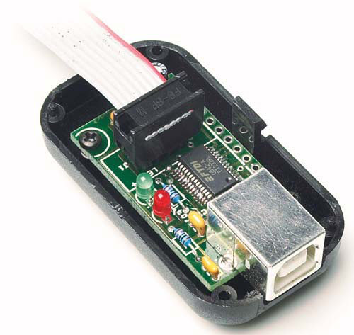
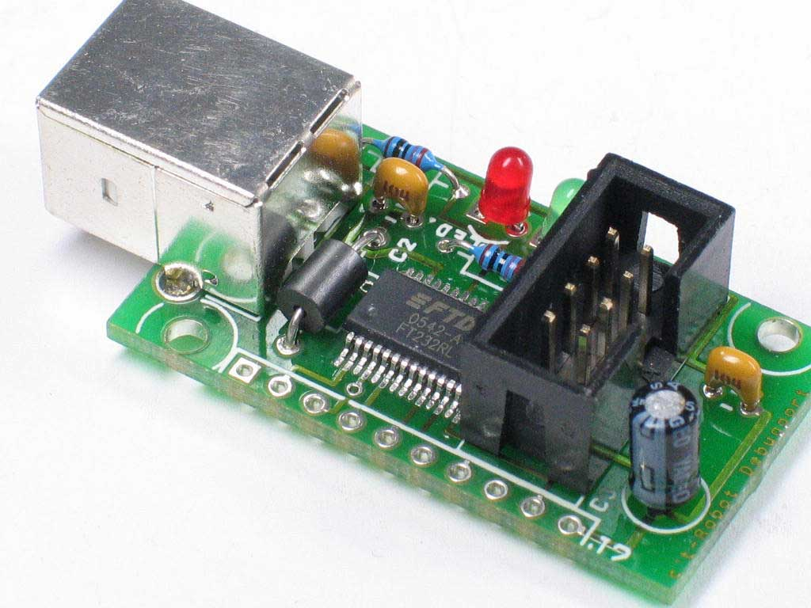
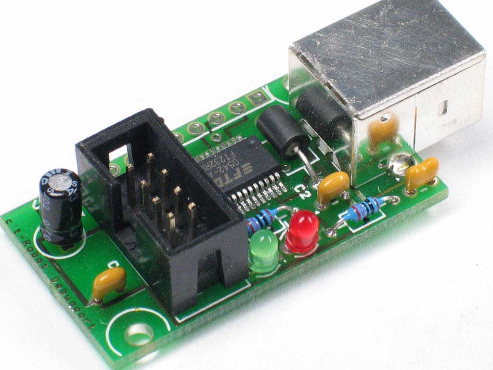
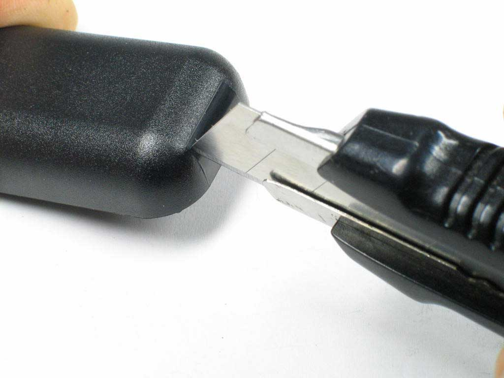
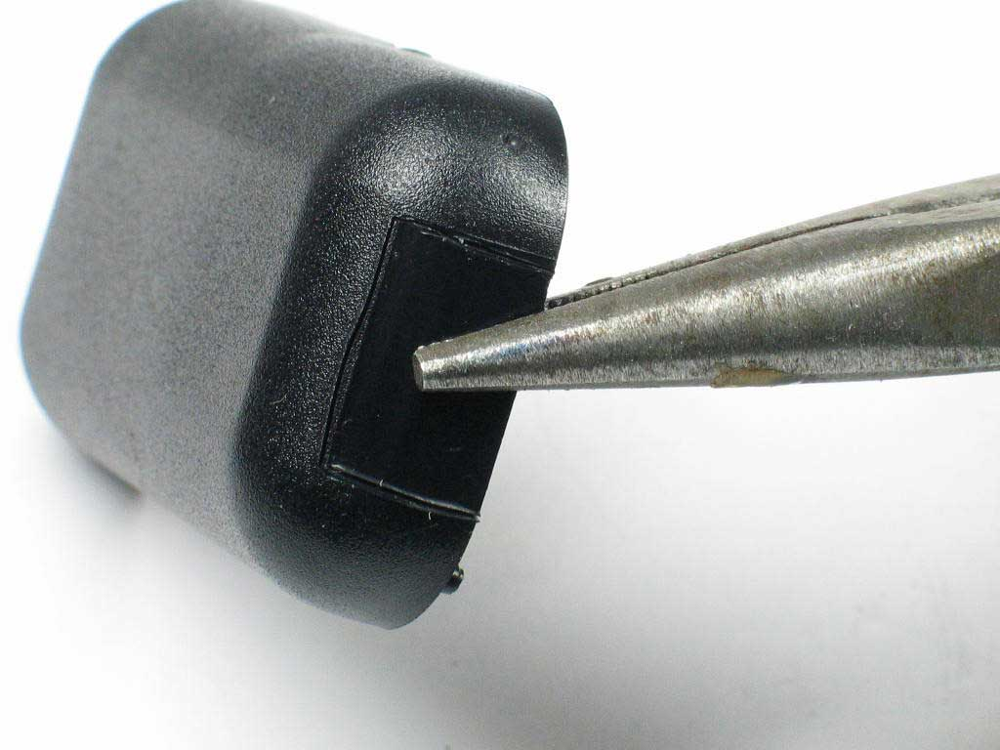
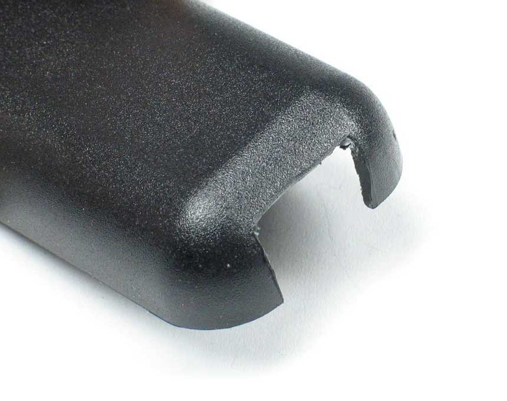
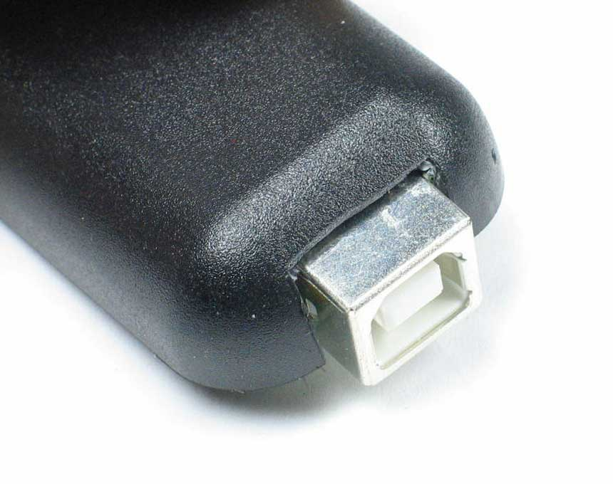
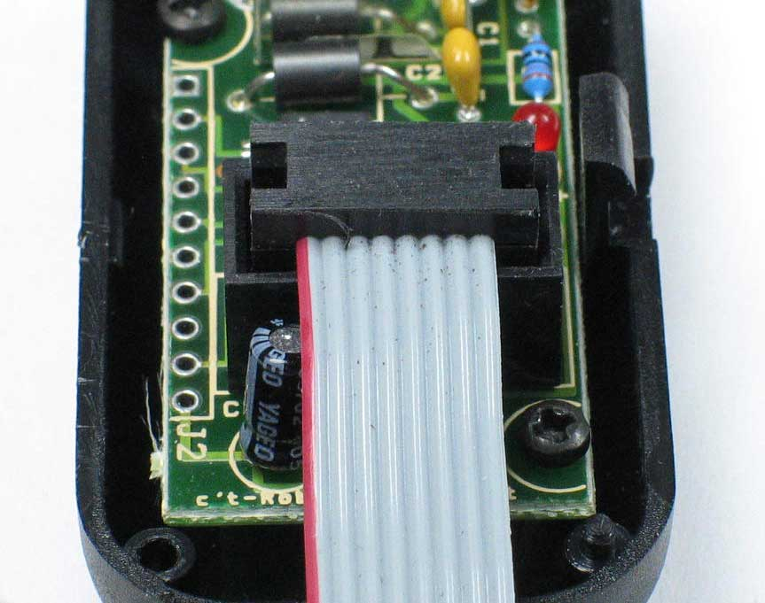
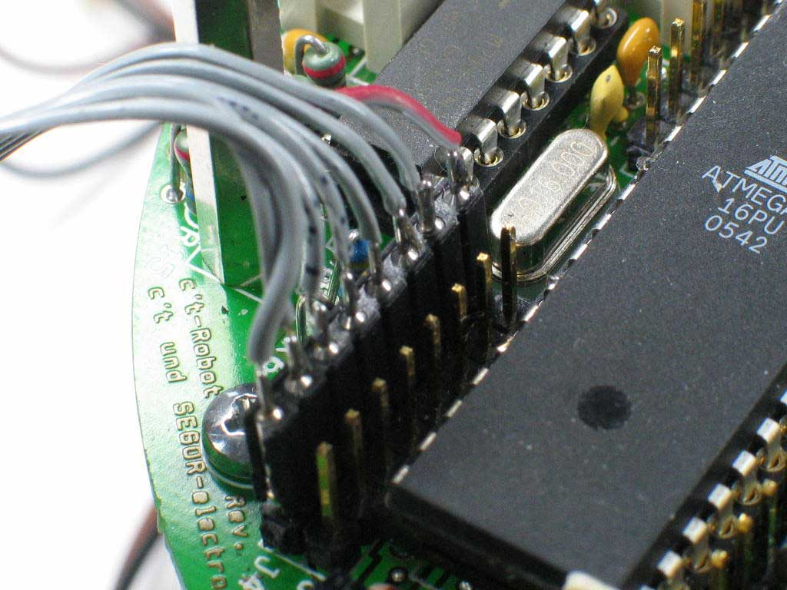

# USB-2-Bot UART-Adapter

## Beschreibung

Mit dem USB-2-Bot Adapter lässt sich ein c't-Bot über eine USB-Schnittstelle an einen PC anschließen.
Es handelt sich hierbei um ein Diagnose-Tool mit dem sich vom PC aus Debug-Informationen vom Bot auslesen und Steuerbefehle zwischen PC und Bot austauschen lassen.
Diese UART-Schnittstelle dient **nicht** zur *erstmaligen* Programmierung eines neuen Bots, kann zu einem späteren Zeitpunkt jedoch auch zur Programmierung verwendet werden (siehe dazu: [Firmware übertragen mit Bootloader und USB-2-Bot-Adapter](../../_tmp_trac_wiki_export/Flash/Flash.md))

Der Adapter wurde als Bausatz und Platine mit vorbestücktem SMD-Chip von Segor Electronics angeboten. _(Bausatz ist nicht mehr verfügbar)_

Als USB-Chip findet hier der Controller FTDI232RL ([Datenblatt](https://github.com/tsandmann/ct-bot-hw/blob/master/v1/datasheets/FT232R%20FTDI%202015-11.pdf)) Verwendung.

## Elektronik

* [Schaltplan](https://github.com/tsandmann/ct-bot-hw/blob/master/v1/schematics/04_usb-2-bot.pdf)
* [Bestückungsplan](https://github.com/tsandmann/ct-bot-hw/blob/master/v1/pcb-layout/04_pcb_usb-2-bot.pdf)

Stückliste:

| Bauteil    | Bezeichnung                   | Bemerkung                                                    |
| :---       | :---                          | :---                                                         |
| C1         | Kondensator 10 nF             | Stempelung 103                                               |
| C2, C4     | Kondensator 100 nF            | Stempelung 104                                               |
| C3         | Elektrolyt-Kondensator 4,7 µF | Polung beachten!                                             |
| L1         | axialer Ferrit BL01RN1        |                                                              |
| R1, R2     | Widerstand 270 Ω              |                                                              |
| LED1, LED2 | Leuchtdiode                   | Polung beachten!                                             |
| P1         | USB 2.0 Buchse Typ B          |                                                              |
| J1, J2     | Stiftleiste                   | J2 ist für Erweiterungen gedacht und kann unbestückt bleiben |
| IC1        | FT232RL Controller            | SMD-IC ist bereits vorbestückt                               |

## Aufbau

Der Aufbau des USB-2-Bot UART-Adapters ist nicht sonderlich anspruchsvoll.
Zunächst ist die Platine zu bestücken, was relativ schnell erledigt sein dürfte.
Bei den Leuchtdioden LED1, LED2, und dem Elektrolyt-Kondensator C3 ist die Polung zu beachten.
Das lange Bein markiert jeweils den Pluspol.
Die Stiftleiste J2 ist für mögliche Erweiterungen gedacht und kann unbestückt bleiben.

In bestücktem Zustand sieht das Board wie folgt aus:

|  |  |
| ---                                                                | ---                                                                |

Für die USB-Buchse und das Verbindungskabel zum Bot muss das mitgelieferte Gehäuse nachbearbeitet werden.
Am praktikabelsten ist hier die Nutzung eines Teppichmessers.

**ACHTUNG:** Bei den folgenen Aktionen sollte unbedingt vorsichtig und behutsam vorgegangen werden um Verletzungen vorzubeugen.
Das Messer sollte stets vom Körper weggerichtet verwendet werden.
Beim Schneiden des Materials empfiehlt es sich mit ruhiger Hand und keinesfalls mit Gewalt vorzugehen.

Am Besten ritzt man, wie in den folgenden Bildern gezeigt, mit dem Teppichmesser das Gehäuse an den vorgesehenen Stellen vorsichtig ein und bricht dann die überflüssigen Teile anschließend mit einer Zange heraus.
Anschließend können die Ränder der Gehäuseaussparung mit der Messerklinge etwas nachprofiliert werden.

|  |  |  |  |
| ---                                                                | ---                                                                | ---                                                                | ---                                                                |

Je nach Toleranzen kann es erforderlich sein, nach dem Aufstecken des Flachkabels von dessen Stecker ein wenig Material abzufeilen, damit das Gehäuse sauber schließt.

Die beiden LEDs sind für eine erste Funktionskontrolle des Adapters mit geöffnetem Gehäuse sinnvoll.
Bei der späteren Verwendung des Adapters müssen sie nicht unbedingt sichtbar sein.
Wer die LED-Zustandsanzeige auch später noch sehen möchte, kann für die Sichtkontrolle jedoch eine kleine Öffnung an der entsprechenden Stelle in den Gehäusedeckel schneiden oder bohren.

Anschließend ist noch das Kabel zu konfektionieren:
Hier muss die 2x4-Buchse an ein Ende des 8-poligen Flachbandkabels gecrimpt und an das andere Ende die einreihige Buchsenleiste angelötet werden.
Am besten gelingt das durch ein Zusammenpressen der Buchse mit einem im Schraubstock oder einer Schraubzange.

An das freie Ende des Kabels ist die 8-polige Buchsenleiste in der Reihenfolge der Kabeladern anzulöten.
Hierbei empfiehlt es sich die einzelnen Adern mit ein wenig Schrumpfschlauch zu überziehen um sie so gegeneinander zu isolieren und den Stecker somit gegen äußere Einwirkungen robuster zu machen.

Die Buchsenleiste wird später auf die Steckerleiste J4 der Bot-Hauptplatine aufgesteckt.
Pin 1 zeigt hier zum benachbarten Quarz. Ein verdrehtes Aufstecken ist bei einem Akku-versorgten Robot in der Regel unschädlich, allerdings kommen dann aufgrund der falschen Signalzuordnung keine Daten an.

## Anschlussbelegung (Pinout)

Die Anschlussbelegung des USB-2-Bot Adapters entspricht der Steckerbelegung J4 des c't-Bots:

| Pin   | Funktion     | Beschreibung                        |
| :---: | :---         | :---                                |
| 1     | _(unbelegt)_ |                                     |
| 2     | RXD          | UART Receive (aus Sicht des ATmega) |
| 3     | TXD          | UART Send (aus Sicht des ATmega)    |
| 4     | _(unbelegt)_ |                                     |
| 5     | _(unbelegt)_ |                                     |
| 6     | _(unbelegt)_ |                                     |
| 7     | _(unbelegt)_ |                                     |
| 8     | GND          |                                     |

Informationen zur Treiberinstallation finden sich in der allgemeinen [Installationsanleitung](../../_tmp_trac_wiki_export/InstallationsanleitungR23/InstallationsanleitungR23.md).
Wie der USB-2-Bot-Adapter mit dem Erweiterungsmodul harmoniert findet sich in der [Beschreibung zu Letzterem](../../_tmp_trac_wiki_export/ct-Bot-Erweiterung/ct-Bot-Erweiterung.md).

## Treiberinstallation

Die Treiber erlauben es das Gerät entweder nativ über [D2XX-Treiber](https://www.ftdichip.com/Drivers/D2XX.htm), oder über einen [VCP-Treiber](https://www.ftdichip.com/Drivers/VCP.htm) (Virtual COM Port) anzusprechen.

Wer noch alte D2XX-Treiber installiert hat, sollte diese zuerst entfernen.
Die ursprünglich vorgeschlagene Kommunikation über die JD2XX-Bibliothek und den D2XX-Treiber für Windows erforderte Klimmzüge unter Linux und harmonierte nicht mit anderen Adaptern zum c't-Bot.
Daher wurde die Kommunikation mit tatkräftiger Unterstützung einiger Leser auf die RXTX-Bibliothek umgestellt.

Schließt man den USB-2-Bot-Adapter zum ersten Mal an einen Windows-PC an, so fragt das Betriebssystem nach einem Treiber.
Hier wählt man den VCP-Treiber aus, der einen virtuellen COM-Port einrichtet.

Aktuelle Linux-Kernel erkennen den FTDI-Chip bereits von Haus aus und machen ihn über /dev/ttyUSB0 zugänglich.

## Weiterführende Informationen:

* [c't 7/2006, S.223](https://www.heise.de/ct/artikel/An-der-Leine-290394.html): An der Leine, Debuggen des c't-Bot über USB

Autoren: Benjamin Benz, Timo Sandmann, Peter Recktenwald, anonybot, starkm, Nightwalker-87
